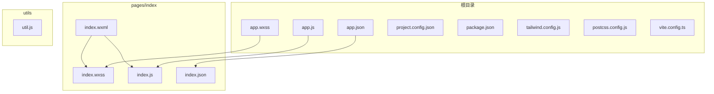
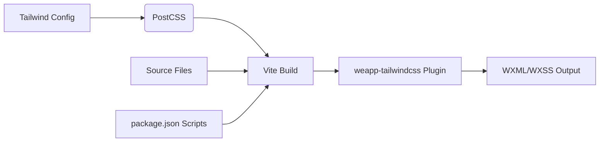
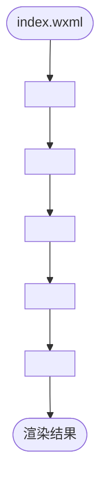

# 原生小程序集成

<cite>
**本文档中引用的文件**  
- [app.js](file://demo/native/app.js)
- [app.json](file://demo/native/app.json)
- [index.wxml](file://demo/native/pages/index/index.wxml)
- [index.wxss](file://demo/native/pages/index/index.wxss)
- [project.config.json](file://demo/native/project.config.json)
- [tailwind.config.js](file://apps/vite-native/tailwind.config.js)
- [postcss.config.js](file://apps/vite-native/postcss.config.js)
- [vite.config.ts](file://apps/vite-native/vite.config.ts)
- [package.json](file://apps/vite-native/package.json)
</cite>

## 目录
1. [介绍](#介绍)
2. [项目结构](#项目结构)
3. [核心组件](#核心组件)
4. [架构概述](#架构概述)
5. [详细组件分析](#详细组件分析)
6. [依赖分析](#依赖分析)
7. [性能考虑](#性能考虑)
8. [故障排除指南](#故障排除指南)
9. [结论](#结论)

## 介绍
本文档旨在为原生微信小程序项目提供集成 `weapp-tailwindcss` 的完整支持文档。文档详细说明了如何在不使用任何框架的情况下，通过 CLI 工具或 API 将 Tailwind CSS 集成到原生小程序开发中。内容涵盖项目初始化、配置文件设置、构建流程、样式作用域协调以及包体积优化等关键方面，并基于 `apps/vite-native/` 和 `demo/native/` 中的实际项目示例进行说明。

## 项目结构
原生小程序项目遵循标准的文件组织结构，同时集成了 Tailwind CSS 所需的构建配置。核心目录包括页面文件（WXML、WXSS、JS、JSON）、全局应用文件（app.js、app.json、app.wxss）以及构建相关的配置文件。



**Diagram sources**
- [app.js](file://demo/native/app.js)
- [app.json](file://demo/native/app.json)
- [index.wxml](file://demo/native/pages/index/index.wxml)
- [index.wxss](file://demo/native/pages/index/index.wxss)

**Section sources**
- [app.js](file://demo/native/app.js)
- [app.json](file://demo/native/app.json)
- [index.wxml](file://demo/native/pages/index/index.wxml)
- [index.wxss](file://demo/native/pages/index/index.wxss)

## 核心组件
本集成方案的核心在于利用 `weapp-tailwindcss` 提供的 Vite 插件和 PostCSS 配置，将 Tailwind 的原子化 CSS 类名转换为小程序可识别的 WXSS 样式。关键组件包括 Vite 构建配置、Tailwind 配置、PostCSS 配置以及小程序原生的页面和应用文件。

**Section sources**
- [vite.config.ts](file://apps/vite-native/vite.config.ts)
- [tailwind.config.js](file://apps/vite-native/tailwind.config.js)
- [postcss.config.js](file://apps/vite-native/postcss.config.js)

## 架构概述
该集成方案采用基于 Vite 的构建流程，通过 `weapp-vite` 和 `weapp-tailwindcss` 插件实现小程序的开发和构建。Tailwind CSS 的配置被注入到构建流程中，动态生成所需的样式，并与小程序的原生组件和样式系统无缝集成。



**Diagram sources**
- [vite.config.ts](file://apps/vite-native/vite.config.ts)
- [tailwind.config.js](file://apps/vite-native/tailwind.config.js)
- [postcss.config.js](file://apps/vite-native/postcss.config.js)
- [package.json](file://apps/vite-native/package.json)

## 详细组件分析

### 应用入口分析
`app.js` 和 `app.json` 文件定义了小程序的全局逻辑和配置。`app.js` 中的 `onLaunch` 方法处理小程序启动时的初始化逻辑，如本地存储和登录。`app.json` 定义了页面路径、窗口样式和小程序的基本设置。

**Section sources**
- [app.js](file://demo/native/app.js)
- [app.json](file://demo/native/app.json)

### 页面结构与样式应用
`index.wxml` 文件展示了如何在 WXML 中直接使用 Tailwind CSS 的类名。这些类名包括基础的布局类（如 `flex`, `space-y-2.5`）、颜色类（如 `bg-[#68c828]`, `text-red-700`）、尺寸类（如 `w-[323px]`, `h-[30px]`）以及高级特性如渐变（`bg-gradient-to-b`）和图标（`i-mdi-home`）。



**Diagram sources**
- [index.wxml](file://apps/vite-native/pages/index/index.wxml)

**Section sources**
- [index.wxml](file://apps/vite-native/pages/index/index.wxml)

### 构建与配置分析
`vite.config.ts` 是构建流程的核心，它使用 `weapp-vite` 的 `defineConfig` 并集成 `weapp-tailwindcss` 的 Vite 插件（`uvwt`）。该插件配置了 `rem2rpx` 转换和 CSS 入口文件。`tailwind.config.js` 配置了内容扫描路径和禁用 H5 特有的核心插件（如 `preflight`）。`postcss.config.js` 则指定了使用 `@tailwindcss/postcss` 插件来处理 CSS。

**Section sources**
- [vite.config.ts](file://apps/vite-native/vite.config.ts)
- [tailwind.config.js](file://apps/vite-native/tailwind.config.js)
- [postcss.config.js](file://apps/vite-native/postcss.config.js)

## 依赖分析
项目依赖清晰地分为运行时依赖和开发依赖。开发依赖中关键的包包括 `tailwindcss`、`@tailwindcss/postcss`、`@tailwindcss/vite` 以及 `weapp-tailwindcss`，它们共同构成了 Tailwind 在小程序环境下的构建链。

```mermaid
graph TD
A[weapp-tailwindcss] --> B[tailwindcss]
A --> C[@tailwindcss/postcss]
A --> D[@tailwindcss/vite]
A --> E[weapp-vite]
B --> F[PostCSS]
C --> F
D --> G[Vite]
E --> G
```

**Diagram sources**
- [package.json](file://apps/vite-native/package.json)

**Section sources**
- [package.json](file://apps/vite-native/package.json)

## 性能考虑
为了优化构建输出以减少包体积，建议在 `tailwind.config.js` 中精确配置 `content` 字段，确保只扫描实际使用了 Tailwind 类名的文件。这可以显著减少生成的 CSS 文件大小。此外，通过 `corePlugins` 禁用不必要的插件（如 `preflight` 和 `container`）也能有效减小最终包的体积。

## 故障排除指南
如果遇到样式未生效的问题，请首先检查 `tailwind.config.js` 中的 `content` 配置路径是否正确包含了所有使用 Tailwind 类名的 WXML 文件。其次，确认 `postcss.config.js` 中已正确配置 `@tailwindcss/postcss` 插件。最后，检查构建命令是否正确执行，确保 `weapp-tailwindcss` 插件已成功运行。

**Section sources**
- [tailwind.config.js](file://apps/vite-native/tailwind.config.js)
- [postcss.config.js](file://apps/vite-native/postcss.config.js)

## 结论
通过本文档提供的配置和实践，开发者可以成功地将 `weapp-tailwindcss` 集成到原生微信小程序项目中。该方案利用 Vite 构建工具和 Tailwind CSS 的强大功能，实现了高效、现代化的样式开发流程，同时保持了小程序原生开发的灵活性和性能优势。协调样式作用域的关键在于理解 Tailwind 的全局生成机制与小程序 WXSS 作用域规则的差异，并通过构建工具进行正确的转换和注入。