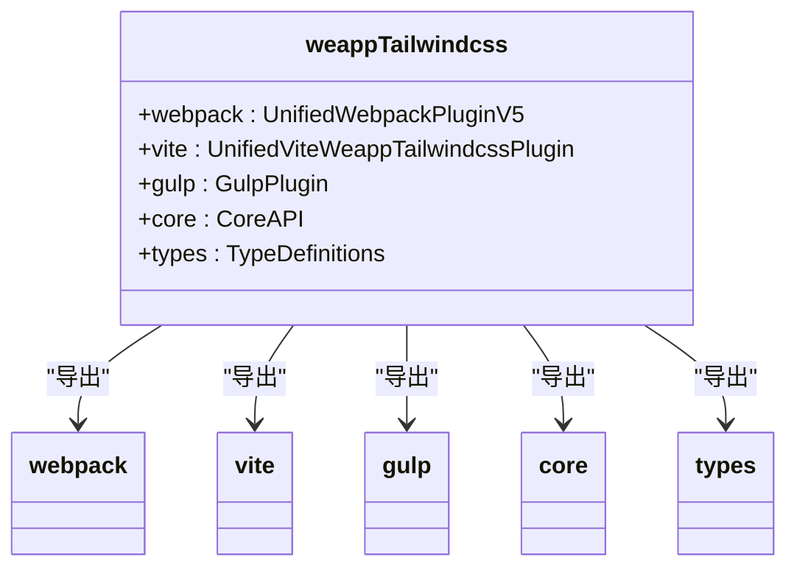
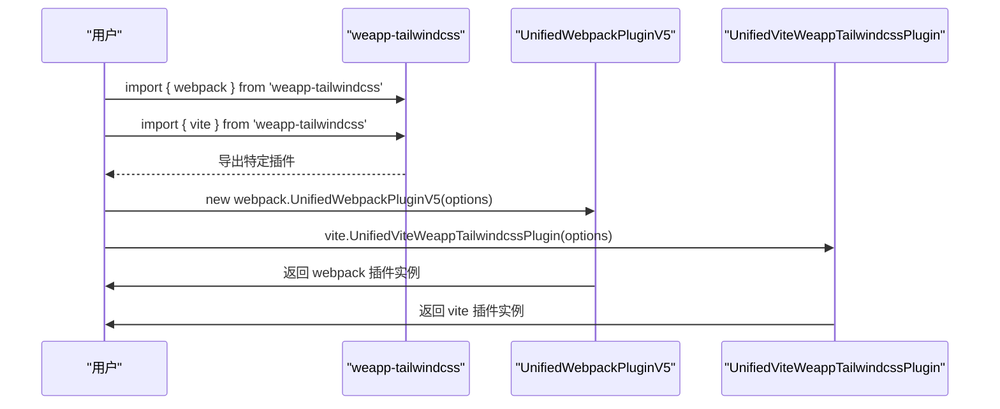
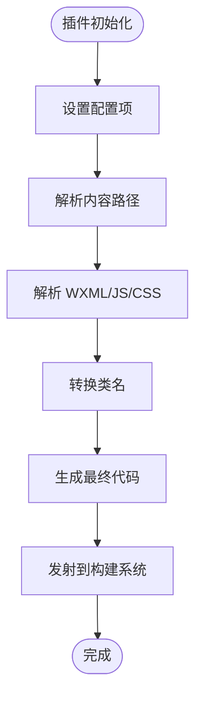

# 从 v1 迁移到 v2/v3

<cite>
**本文档中引用的文件**  
- [README.md](file://README.md)
- [v1.md](file://v1.md)
- [CHANGELOG.md](file://CHANGELOG.md)
- [packages/weapp-tailwindcss/package.json](file://packages/weapp-tailwindcss/package.json)
- [demo/taro-app/tailwind.config.js](file://demo/taro-app/tailwind.config.js)
- [demo/taro-app/postcss.config.js](file://demo/taro-app/postcss.config.js)
- [demo/native-mina/tailwind.config.js](file://demo/native-mina/tailwind.config.js)
- [demo/native-mina/postcss.config.js](file://demo/native-mina/postcss.config.js)
- [packages/weapp-tailwindcss/src/index.ts](file://packages/weapp-tailwindcss/src/index.ts)
</cite>

## 目录
1. [简介](#简介)
2. [破坏性变更概览](#破坏性变更概览)
3. [配置项变更](#配置项变更)
4. [API 调整](#api-调整)
5. [插件架构重构](#插件架构重构)
6. [构建流程变化](#构建流程变化)
7. [迁移步骤](#迁移步骤)
8. [迁移验证方法](#迁移验证方法)
9. [常见问题与解决方案](#常见问题与解决方案)
10. [回滚策略](#回滚策略)
11. [代码迁移示例](#代码迁移示例)

## 简介

`weapp-tailwindcss` 是一个为小程序开发者提供 Tailwind CSS 原子化样式解决方案的工具集。本迁移指南旨在帮助用户从 v1 版本顺利迁移到 v2/v3 版本，详细说明所有破坏性变更、配置调整、API 变化以及构建流程的更新。

根据项目文档，v2 版本是一次重大重构，带来了全新的插件架构和 API 设计。v3 及更高版本在此基础上持续优化，支持最新的 Tailwind CSS v4 和 v3 版本，以及多种构建工具如 webpack、vite、rspack、rollup、rolldown 和 gulp。

**Section sources**
- [README.md](file://README.md#L1-L101)
- [v1.md](file://v1.md#L1-L291)

## 破坏性变更概览

从 v1 到 v2/v3 的迁移涉及多个层面的重大变更，主要包括：

1. **核心架构重构**：v2 版本将项目重构为 monorepo 结构，重新组织了代码和目录。
2. **插件系统重写**：废弃了所有 v1 版本的插件，引入了全新的插件系统。
3. **API 彻底变更**：导出方式和使用方法发生了根本性变化。
4. **构建流程调整**：对 webpack 和 vite 的集成方式进行了优化。
5. **配置项更新**：部分配置项被移除或重命名，同时引入了新的配置选项。

这些变更旨在提高性能、增强可维护性并支持更广泛的开发框架。

**Section sources**
- [CHANGELOG.md](file://CHANGELOG.md#L316-L320)
- [CHANGELOG.md](file://CHANGELOG.md#L82-L83)

## 配置项变更

### 已移除的配置项

v2 版本移除了 v1 中的一些配置项，因为它们已被认为是无用的或已被更好的实现方式取代：

- `mpRulePreflight`：已在 v2 中被废弃并移除。
- `lodash.groupby` 引用：为减少包体积而移除。

### 新增的配置项

v2/v3 版本引入了多个新配置项以增强功能和灵活性：

- `jsAstTool`：可选使用 `@ast-grep/napi` 来解析 JS AST，速度可提升 1.5-2 倍。
- `jsEscapeStrategy`：用于切换 JS 字符串中处理字符串和模板字面量的替换模式。
- `disabledDefaultTemplateHandler`：可以禁用默认的模板标签匹配转化器。
- `injectAdditionalCssVarScope`：用于 Tailwind CSS 变量区域的重新注入。
- `cssRemoveHoverPseudoClass`：默认在小程序平台去除 `:hover` 元素。
- `tailwindcssBasedir`：新增配置项，用于指定 Tailwind CSS 的基础目录。

### 配置项行为变更

部分配置项的行为在新版本中有所调整：

- `customAttributes`：现在支持更精确的匹配，可以使用字符串精确匹配标签或属性，也可以使用正则来匹配多个。
- `mainCssChunkMatcher`：匹配 Tailwind CSS JIT 生成的核心 CSS chunk 的方法。
- `supportCustomLengthUnitsPatch`：默认开启，用于支持 rpx 单位。

**Section sources**
- [CHANGELOG.md](file://CHANGELOG.md#L168-L171)
- [CHANGELOG.md](file://CHANGELOG.md#L180-L182)
- [CHANGELOG.md](file://CHANGELOG.md#L202-L204)
- [CHANGELOG.md](file://CHANGELOG.md#L228-L230)
- [CHANGELOG.md](file://CHANGELOG.md#L72-L73)

## API 调整

### 导出方式变更

v2 版本彻底改变了 API 的导出方式，采用了更清晰的命名空间结构：



**Diagram sources**
- [packages/weapp-tailwindcss/package.json](file://packages/weapp-tailwindcss/package.json#L42-L128)
- [packages/weapp-tailwindcss/src/index.ts](file://packages/weapp-tailwindcss/src/index.ts#L1-L5)

### 插件命名变更

v1 版本中的插件名称在 v2 中被统一和规范化：

- `weapp-tailwindcss-webpack-plugin` → `UnifiedWebpackPluginV5` (通过 `weapp-tailwindcss/webpack` 导出)
- `TaroWeappTailwindcssWebpackPluginV4/V5` → 统一为 `UnifiedWebpackPluginV5` 的配置选项
- `RaxTailwindcssWebpackPluginV5` → 统一为 `UnifiedWebpackPluginV5` 的配置选项

### 使用方式变更

v2 版本的使用方式更加模块化和一致：



**Diagram sources**
- [README.md](file://README.md#L64-L68)
- [README_en.md](file://README_en.md#L66-L69)

## 插件架构重构

### Monorepo 结构

v2 版本将项目重构为 monorepo 结构，这带来了更好的代码组织和维护性：

```mermaid
graph TB
subgraph "Monorepo Root"
PKG1[packages/weapp-tailwindcss]
PKG2[packages/weapp-vite]
PKG3[packages/logger]
PKG4[packages/postcss]
PKG5[packages/shared]
end
PKG1 --> PKG3 : "依赖"
PKG1 --> PKG4 : "依赖"
PKG1 --> PKG5 : "依赖"
PKG2 --> PKG1 : "依赖"
```

**Diagram sources**
- [CHANGELOG.md](file://CHANGELOG.md#L82-L83)
- [package.json](file://package.json#L214)

### 核心处理逻辑重写

v2 版本重写了核心处理逻辑，提高了准确性和性能：

- **WXML 解析器**：从正则匹配替换方式改为使用 `htmlparser2` 的 XML 模式进行解析，更加精确。
- **JS 处理**：引入了 AST 解析，支持更复杂的 JS 场景，如模板字符串和 JSX。
- **缓存机制**：建立了缓存机制，大幅提升了 webpack 和 vite 插件的热更新速度。

### 插件生命周期变更

v2 版本的插件生命周期更加清晰和可控：



**Diagram sources**
- [CHANGELOG.md](file://CHANGELOG.md#L169-L170)
- [CHANGELOG.md](file://CHANGELOG.md#L142-L143)

## 构建流程变化

### Webpack 集成变更

v2 版本改变了 webpack 插件的实现方式，解决了源码映射错误问题：

- **旧方式 (v1)**：在 webpack `emit` 后的产物上进行分析和替换。
- **新方式 (v2)**：动态创建一个新的 `jsx-rename-loader`，在 `babel-loader` 之后运行，对产物进行替换。

这种变更确保了生成的源码映射不会存在指向错误问题。

### Vite 集成变更

v2 版本对 vite 插件的引入方式进行了重大调整：

- **旧方式 (v1)**：需要同时引入 postcss 插件。
- **新方式 (v2)**：vite 插件可以直接注册，不需要再引入 postcss 插件。

```javascript
// v1 方式
import vwt from 'weapp-tailwindcss-webpack-plugin/vite'
import postcssWeappTailwindcssRename from 'weapp-tailwindcss-webpack-plugin/postcss'

// v2 方式
import { vite } from 'weapp-tailwindcss'
```

### Gulp 支持

v2 版本正式支持作为 gulp 插件使用，扩展了工具链的适用范围。

**Section sources**
- [CHANGELOG.md](file://CHANGELOG.md#L684-L691)
- [CHANGELOG.md](file://CHANGELOG.md#L666-L674)
- [CHANGELOG.md](file://CHANGELOG.md#L352-L354)

## 迁移步骤

### 准备工作

1. **备份项目**：在开始迁移前，确保对当前项目进行完整备份。
2. **检查 Node.js 版本**：确保 Node.js 版本满足要求（v2 版本要求 Node.js >=16）。
3. **阅读文档**：仔细阅读 v2/v3 的官方文档和迁移指南。

### 依赖升级

1. **卸载旧版本**：
   ```bash
   npm uninstall weapp-tailwindcss-webpack-plugin
   ```

2. **安装新版本**：
   ```bash
   npm install weapp-tailwindcss@latest
   ```

3. **更新相关依赖**：根据项目需要，更新 tailwindcss、postcss 等相关依赖到兼容版本。

### 配置文件更新

1. **更新 webpack 配置**：
   ```javascript
   // 旧方式 (v1)
   const { TaroWeappTailwindcssWebpackPluginV5 } = require('weapp-tailwindcss-webpack-plugin/webpack')
   
   // 新方式 (v2/v3)
   const { webpack } = require('weapp-tailwindcss')
   const plugin = new webpack.UnifiedWebpackPluginV5({
     // 配置项
   })
   ```

2. **更新 vite 配置**：
   ```javascript
   // 旧方式 (v1)
   import vwt from 'weapp-tailwindcss-webpack-plugin/vite'
   
   // 新方式 (v2/v3)
   import { vite } from 'weapp-tailwindcss'
   ```

3. **更新 postcss 配置**：根据新版本要求调整 postcss 配置。

### 代码适配

1. **更新导入语句**：将所有旧的导入语句更新为新版本的导入方式。
2. **调整配置项**：根据新版本的配置项要求，更新配置对象。
3. **处理废弃 API**：替换所有已废弃的 API 调用。

### 构建脚本修改

1. **更新构建命令**：根据新版本的 CLI 工具调整构建脚本。
2. **添加 postinstall 钩子**：为确保 rpx 支持补丁正确应用，建议添加 postinstall 钩子：
   ```json
   {
     "scripts": {
       "postinstall": "weapp-tw patch"
     }
   }
   ```

**Section sources**
- [README.md](file://README.md#L59-L61)
- [CHANGELOG.md](file://CHANGELOG.md#L438-L446)

## 迁移验证方法

### 样式完整性检查

1. **视觉对比**：在迁移前后对关键页面进行截图对比，确保样式没有变化。
2. **类名检查**：检查生成的 WXML 和 WXSS 文件，确保类名正确转换。
3. **覆盖率测试**：使用测试用例验证所有 Tailwind CSS 类名都能正确解析。

### 类名解析测试

1. **基本类名测试**：
   ```html
   <!-- 测试基本类名 -->
   <view class="flex justify-center items-center">内容</view>
   ```

2. **任意值测试**：
   ```html
   <!-- 测试任意值 -->
   <view class="w-[300px] h-[200px] bg-[#ff0000]">内容</view>
   ```

3. **复杂选择器测试**：
   ```html
   <!-- 测试复杂选择器 -->
   <view class="hover:bg-blue-500 focus:outline-none">内容</view>
   ```

### 功能验证

1. **热更新测试**：验证开发环境下的热更新功能是否正常。
2. **构建性能测试**：比较迁移前后的构建速度，确保性能有所提升。
3. **生产构建测试**：进行完整的生产构建，验证最终产物的正确性。

**Section sources**
- [v1.md](file://v1.md#L229-L230)
- [demo/taro-app/tailwind.config.js](file://demo/taro-app/tailwind.config.js#L1-L35)

## 常见问题与解决方案

### 插件加载失败

**问题**：插件无法正确加载或初始化。

**解决方案**：
1. 检查导入路径是否正确。
2. 确保依赖版本兼容。
3. 查看控制台错误日志，定位具体问题。

### 样式未生效

**问题**：Tailwind CSS 样式在小程序中未正确应用。

**解决方案**：
1. 检查 `content` 配置是否正确包含了所有需要扫描的文件路径。
2. 验证类名是否被正确转换。
3. 检查是否有 CSS 选择器冲突。

### 类名转换错误

**问题**：类名转换后出现语法错误或不符合预期。

**解决方案**：
1. 检查 `customReplaceDictionary` 配置是否正确。
2. 验证特殊字符的处理方式。
3. 使用 `simple` 或 `complex` 模式调整类名转换策略。

### 调试技巧

1. **启用详细日志**：通过配置 `debug` 选项启用详细日志输出。
2. **检查源码映射**：验证源码映射是否正确生成。
3. **逐步排查**：从简单用例开始，逐步增加复杂度，定位问题所在。

**Section sources**
- [v1.md](file://v1.md#L244-L246)
- [CHANGELOG.md](file://CHANGELOG.md#L338-L340)

## 回滚策略

如果迁移过程中遇到无法解决的问题，可以按照以下步骤回滚到 v1 版本：

1. **恢复备份**：使用迁移前的项目备份恢复项目状态。
2. **重新安装旧版本**：
   ```bash
   npm uninstall weapp-tailwindcss
   npm install weapp-tailwindcss-webpack-plugin@1.x
   ```
3. **恢复配置文件**：将 webpack、vite 等配置文件恢复到迁移前的状态。
4. **验证功能**：确保所有功能恢复正常。

建议在回滚后记录遇到的问题，以便后续再次尝试迁移时参考。

**Section sources**
- [CHANGELOG.md](file://CHANGELOG.md#L318-L319)

## 代码迁移示例

### 配置文件对比

**v1 配置 (tailwind.config.js)**：
```javascript
// file://demo/taro-app/tailwind.config.js
module.exports = {
  content: [
    "./src/**/*.{html,js,ts,jsx,tsx}",
  ],
  darkMode: 'class',
  theme: {
    extend: {},
  },
  plugins: [],
  corePlugins: {
    preflight: false
  }
}
```

**v2/v3 配置 (tailwind.config.js)**：
```javascript
// 配置结构基本保持一致，但可能需要调整 content 路径
module.exports = {
  content: [
    "./src/**/*.{wxml,js,ts,jsx,tsx}",
  ],
  darkMode: 'class',
  theme: {
    extend: {},
  },
  plugins: [],
  corePlugins: {
    preflight: false
  }
}
```

### 构建配置对比

**v1 webpack 配置**：
```javascript
// 旧方式
const { TaroWeappTailwindcssWebpackPluginV5 } = require('weapp-tailwindcss-webpack-plugin/webpack')

module.exports = {
  plugins: [
    new TaroWeappTailwindcssWebpackPluginV5({
      // 配置项
    })
  ]
}
```

**v2/v3 webpack 配置**：
```javascript
// 新方式
const { webpack } = require('weapp-tailwindcss')

module.exports = {
  plugins: [
    new webpack.UnifiedWebpackPluginV5({
      // 配置项
    })
  ]
}
```

### PostCSS 配置对比

**v1 postcss.config.js**：
```javascript
// file://demo/taro-app/postcss.config.js
module.exports = function config(loaderContext) {
  return {
    plugins: {
      tailwindcss: {},
      autoprefixer: {},
    }
  }
}
```

**v2/v3 postcss.config.js**：
```javascript
// 配置基本保持一致，但可能需要根据新版本要求调整
module.exports = {
  plugins: {
    tailwindcss: {},
    autoprefixer: {},
  }
}
```

**Section sources**
- [demo/taro-app/tailwind.config.js](file://demo/taro-app/tailwind.config.js#L1-L35)
- [demo/taro-app/postcss.config.js](file://demo/taro-app/postcss.config.js#L1-L45)
- [demo/native-mina/tailwind.config.js](file://demo/native-mina/tailwind.config.js#L1-L10)
- [demo/native-mina/postcss.config.js](file://demo/native-mina/postcss.config.js#L1-L11)