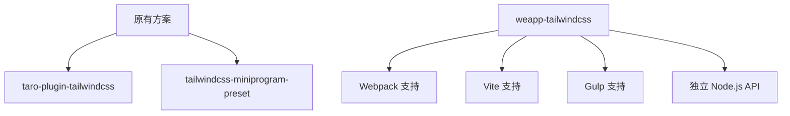

# 从其他 Tailwind 适配方案迁移

<cite>
**本文档中引用的文件**  
- [weapp-tailwindcss/package.json](file://packages/weapp-tailwindcss/package.json)
- [weapp-tailwindcss/README.md](file://packages/weapp-tailwindcss/README.md)
- [weapp-tailwindcss/src/index.ts](file://packages/weapp-tailwindcss/src/index.ts)
- [weapp-tailwindcss/src/vite.ts](file://packages/weapp-tailwindcss/src/vite.ts)
- [weapp-tailwindcss/src/webpack.ts](file://packages/weapp-tailwindcss/src/webpack.ts)
- [weapp-tailwindcss/src/gulp.ts](file://packages/weapp-tailwindcss/src/gulp.ts)
- [demo/taro-app/tailwind.config.js](file://demo/taro-app/tailwind.config.js)
- [demo/taro-app/postcss.config.js](file://demo/taro-app/postcss.config.js)
- [apps/vite-native/tailwind.config.js](file://apps/vite-native/tailwind.config.js)
- [apps/vite-native/postcss.config.js](file://apps/vite-native/postcss.config.js)
</cite>

## 目录
1. [简介](#简介)
2. [架构差异对比](#架构差异对比)
3. [配置方式对比](#配置方式对比)
4. [迁移步骤](#迁移步骤)
5. [配置转换示例](#配置转换示例)
6. [兼容性问题与解决方案](#兼容性问题与解决方案)
7. [功能完整性验证](#功能完整性验证)
8. [总结](#总结)

## 简介

`weapp-tailwindcss` 是一个专为小程序环境设计的 Tailwind CSS 适配解决方案，支持多种构建工具和框架，包括 `taro-plugin-tailwindcss` 和旧版 `tailwindcss-miniprogram-preset` 的迁移场景。本指南旨在帮助开发者从其他 Tailwind 适配方案顺利迁移到 `weapp-tailwindcss`，涵盖架构差异、配置调整、迁移步骤以及常见问题的解决方法。

**Section sources**
- [weapp-tailwindcss/README.md](file://packages/weapp-tailwindcss/README.md)

## 架构差异对比

### 原有方案架构特点
- **taro-plugin-tailwindcss**：基于 Taro 框架的插件系统，依赖于 Taro 的编译流程，主要通过 Webpack 或 Vite 集成。
- **tailwindcss-miniprogram-preset**：作为 Tailwind CSS 的预设插件，修改默认样式生成逻辑以适应小程序环境，通常需要手动配置 PostCSS 插件链。

### weapp-tailwindcss 架构特点
- **多构建工具支持**：原生支持 Webpack、Vite、Gulp 等主流构建工具，提供统一的 API 接口。
- **模块化设计**：通过 `exports` 字段导出不同环境下的适配器（如 `./vite`、`./webpack`、`./gulp`），便于按需引入。
- **自动识别与处理**：能够自动识别并精确处理所有 Tailwind CSS 工具类，适配小程序环境。



**Diagram sources**
- [weapp-tailwindcss/package.json](file://packages/weapp-tailwindcss/package.json)
- [weapp-tailwindcss/src/index.ts](file://packages/weapp-tailwindcss/src/index.ts)

**Section sources**
- [weapp-tailwindcss/package.json](file://packages/weapp-tailwindcss/package.json)
- [weapp-tailwindcss/README.md](file://packages/weapp-tailwindcss/README.md)

## 配置方式对比

### 原有方案配置方式
- **taro-plugin-tailwindcss**：在 `config/index.js` 中配置插件，并通过 `postcss.config.js` 引入 Tailwind CSS。
- **tailwindcss-miniprogram-preset**：在 `tailwind.config.js` 中使用 `presets` 字段引入预设，并在 `postcss.config.js` 中注册插件。

### weapp-tailwindcss 配置方式
- **统一配置入口**：通过 `tailwind.config.js` 定义内容扫描路径、主题扩展等。
- **构建工具集成**：根据使用的构建工具（Webpack/Vite/Gulp）选择对应的插件模块进行集成。
- **核心插件禁用**：建议禁用 `preflight` 和 `container`，因为这些主要用于 H5 端。

```mermaid
flowchart TD
A[配置文件] --> B[tailwind.config.js]
B --> C[content: 扫描路径]
B --> D[plugins: 插件列表]
B --> E[corePlugins: 核心插件控制]
A --> F[postcss.config.js]
F --> G[插件注册]
G --> H[@tailwindcss/postcss]
```

**Diagram sources**
- [demo/taro-app/tailwind.config.js](file://demo/taro-app/tailwind.config.js)
- [apps/vite-native/tailwind.config.js](file://apps/vite-native/tailwind.config.js)

**Section sources**
- [demo/taro-app/tailwind.config.js](file://demo/taro-app/tailwind.config.js)
- [apps/vite-native/tailwind.config.js](file://apps/vite-native/tailwind.config.js)

## 迁移步骤

### 1. 移除旧插件
- 卸载原有插件：
  ```bash
  npm uninstall taro-plugin-tailwindcss tailwindcss-miniprogram-preset
  ```
- 清理相关配置文件中的引用。

### 2. 安装新插件
- 安装 `weapp-tailwindcss`：
  ```bash
  npm install weapp-tailwindcss --save-dev
  ```

### 3. 调整配置文件
- 更新 `tailwind.config.js`，确保 `content` 正确指向项目文件路径。
- 禁用不必要的核心插件：
  ```js
  corePlugins: {
    preflight: false,
    container: false,
  }
  ```

### 4. 集成到构建工具
- **Vite**：在 `vite.config.ts` 中引入 `weapp-tailwindcss/vite`。
- **Webpack**：在 `webpack.config.js` 中使用 `weapp-tailwindcss/webpack`。
- **Gulp**：通过 `weapp-tailwindcss/gulp` 提供的 API 进行集成。

**Section sources**
- [weapp-tailwindcss/src/vite.ts](file://packages/weapp-tailwindcss/src/vite.ts)
- [weapp-tailwindcss/src/webpack.ts](file://packages/weapp-tailwindcss/src/webpack.ts)
- [weapp-tailwindcss/src/gulp.ts](file://packages/weapp-tailwindcss/src/gulp.ts)

## 配置转换示例

### 原有配置（taro-plugin-tailwindcss）
```js
// config/index.js
const config = {
  plugins: {
    tailwindcss: {},
  },
};
```

### 转换后配置（weapp-tailwindcss）
```js
// vite.config.ts
import { defineConfig } from 'vite';
import { weappTailwindcss } from 'weapp-tailwindcss/vite';

export default defineConfig({
  plugins: [
    weappTailwindcss({
      // 自定义选项
    }),
  ],
});
```

```js
// tailwind.config.js
/** @type {import('tailwindcss').Config} */
export default {
  content: ['./pages/**/*.{wxml,html,js,ts,jsx,tsx,vue}'],
  plugins: [],
  corePlugins: {
    preflight: false,
    container: false,
  },
};
```

**Section sources**
- [apps/vite-native/tailwind.config.js](file://apps/vite-native/tailwind.config.js)
- [apps/vite-native/postcss.config.js](file://apps/vite-native/postcss.config.js)

## 兼容性问题与解决方案

### 类名处理逻辑不同
- **问题**：旧方案可能对类名的提取和处理方式与 `weapp-tailwindcss` 不一致。
- **解决方案**：确保 `content` 配置正确覆盖所有模板文件路径，避免遗漏。

### 预设样式冲突
- **问题**：某些预设样式可能与小程序原生样式冲突。
- **解决方案**：禁用 `preflight`，并通过自定义样式覆盖。

### 构建流程集成差异
- **问题**：不同构建工具的插件生命周期和执行顺序可能影响结果。
- **解决方案**：参考官方文档中的集成示例，确保插件正确注册和调用。

**Section sources**
- [weapp-tailwindcss/README.md](file://packages/weapp-tailwindcss/README.md)
- [demo/taro-app/postcss.config.js](file://demo/taro-app/postcss.config.js)

## 功能完整性验证

### 1. 构建输出检查
- 确认生成的 CSS 文件包含预期的工具类。
- 检查是否有未处理的类名或错误提示。

### 2. 小程序运行测试
- 在开发者工具中运行小程序，验证样式是否正常应用。
- 测试不同页面和组件的显示效果。

### 3. 自动化测试
- 使用 `vitest` 进行单元测试，确保插件行为符合预期。
- 参考项目中的 `test` 脚本进行完整测试。

**Section sources**
- [weapp-tailwindcss/package.json](file://packages/weapp-tailwindcss/package.json)

## 总结

`weapp-tailwindcss` 提供了一套完整的 Tailwind CSS 小程序适配方案，支持多种构建工具和框架。通过本文档的指导，开发者可以顺利从 `taro-plugin-tailwindcss` 或 `tailwindcss-miniprogram-preset` 迁移到 `weapp-tailwindcss`，享受更高效、稳定的开发体验。建议在迁移过程中仔细核对配置文件，并充分测试功能完整性。