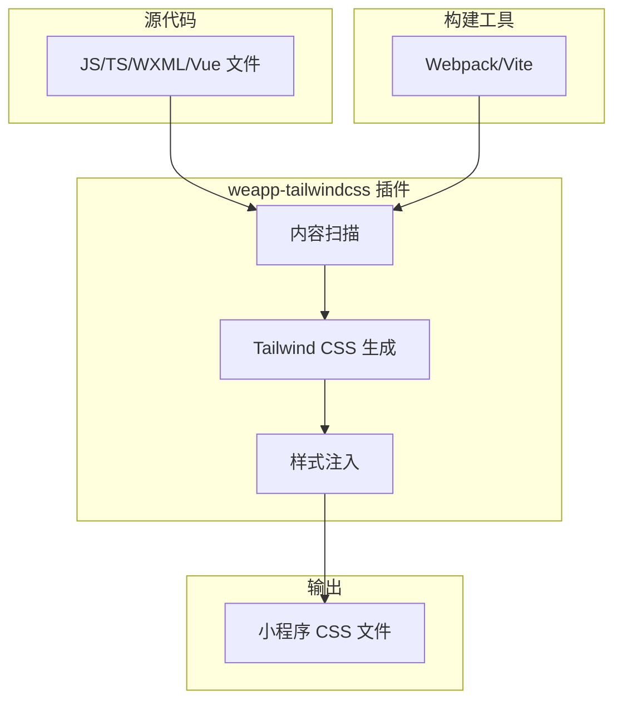
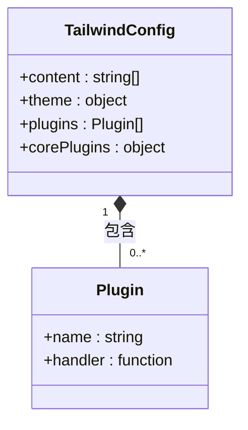
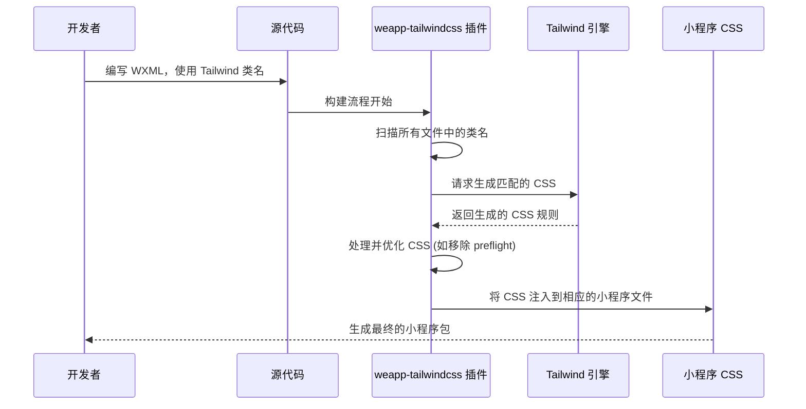

# 从原生 CSS 迁移到 Tailwind CSS

<cite>
**本文档中引用的文件**  
- [app.wxss](file://demo/native/app.wxss)
- [tailwind.config.js](file://demo/native-mina/tailwind.config.js)
- [tailwind.config.js](file://demo/taro-app/tailwind.config.js)
- [tailwind.config.js](file://demo/uni-app/tailwind.config.js)
- [tailwind.config.js](file://apps/vite-native/tailwind.config.js)
- [index.ts](file://packages/weapp-tailwindcss/src/index.ts)
- [index.ts](file://packages/tailwindcss-config/src/index.ts)
- [index.ts](file://packages/weapp-style-injector/src/index.ts)
</cite>

## 目录
1. [简介](#简介)
2. [项目结构](#项目结构)
3. [核心组件](#核心组件)
4. [架构概述](#架构概述)
5. [详细组件分析](#详细组件分析)
6. [依赖分析](#依赖分析)
7. [性能考虑](#性能考虑)
8. [故障排除指南](#故障排除指南)
9. [结论](#结论)

## 简介
本指南旨在为从小程序原生 CSS 迁移到 Tailwind CSS 提供全面的指导。通过分析 `weapp-tailwindcss` 项目，我们将展示如何将现有的 CSS 样式重构为 Tailwind 的实用类（utility classes），并提供迁移过程中的最佳实践、自动化思路和性能优化策略。该解决方案支持多种构建工具和框架，包括 webpack、vite、gulp 等，并兼容主流的小程序开发框架。

## 项目结构
该项目是一个多包（monorepo）结构，包含多个子项目和包，专注于为小程序提供 Tailwind CSS 支持。主要目录包括 `apps`（应用示例）、`demo`（演示项目）、`packages`（核心包）和 `templates`（项目模板）。这种结构允许核心功能的集中开发和维护，同时为不同框架和用例提供具体的实现和示例。

**Section sources**
- [README.md](file://README.md#L1-L101)

## 核心组件
核心功能由 `packages` 目录下的多个包提供。`weapp-tailwindcss` 是主包，导出针对不同构建工具（如 webpack 和 vite）的插件。`tailwindcss-config` 负责加载和解析 Tailwind 配置文件，而 `weapp-style-injector` 则处理样式注入逻辑，确保生成的 CSS 能正确应用于小程序环境。

**Section sources**
- [index.ts](file://packages/weapp-tailwindcss/src/index.ts#L1-L5)
- [index.ts](file://packages/tailwindcss-config/src/index.ts#L1-L58)
- [index.ts](file://packages/weapp-style-injector/src/index.ts#L1-L37)

## 架构概述
系统的架构围绕着将 Tailwind CSS 集成到小程序构建流程中。它通过插件的形式介入 webpack 或 vite 的构建过程，扫描源代码中的 Tailwind 类名，利用 Tailwind 的核心引擎生成相应的 CSS，并通过样式注入器将这些样式正确地分配到各个小程序页面和组件中。这确保了生成的 CSS 既符合 Tailwind 的设计原则，又满足小程序的运行时要求。



**Diagram sources**
- [index.ts](file://packages/weapp-tailwindcss/src/index.ts#L1-L5)
- [index.ts](file://packages/weapp-style-injector/src/index.ts#L1-L37)

## 详细组件分析

### 迁移策略分析
从小程序原生 CSS 迁移到 Tailwind CSS 的核心在于将传统的 CSS 规则转换为内联的实用类。例如，一个包含 `display: flex` 和 `flex-direction: column` 的 `.container` 类，可以直接在 WXML 的 `class` 属性中替换为 `flex flex-col`。此项目通过构建插件自动处理这一过程，开发者只需在代码中使用 Tailwind 类名，插件会负责生成和注入相应的 CSS。

#### 对于配置文件:


**Diagram sources**
- [tailwind.config.js](file://demo/native-mina/tailwind.config.js#L1-L10)
- [tailwind.config.js](file://demo/taro-app/tailwind.config.js#L1-L35)
- [tailwind.config.js](file://demo/uni-app/tailwind.config.js#L1-L37)
- [tailwind.config.js](file://apps/vite-native/tailwind.config.js#L1-L21)

#### 对于样式迁移:


**Diagram sources**
- [app.wxss](file://demo/native/app.wxss#L1-L11)
- [tailwind.config.js](file://demo/native-mina/tailwind.config.js#L1-L10)

### 概念概述
Tailwind CSS 的实用优先方法论鼓励在 HTML 模板中直接使用原子化的 CSS 类。这与传统 CSS 中定义语义化类名的方法形成对比。对于小程序，这种迁移可以极大地提高开发速度和样式的可维护性，因为样式与结构紧密耦合，减少了全局 CSS 文件的复杂性。

## 依赖分析
该项目依赖于 Tailwind CSS 的核心库以及特定的构建工具（如 webpack 或 vite）。它通过插件机制与这些工具集成，同时依赖 `@egoist/tailwindcss-icons` 等插件来扩展功能。`lilconfig` 库用于加载配置文件，确保了配置的灵活性。

```mermaid
graph LR
A[weapp-tailwindcss] --> B[Tailwind CSS]
A --> C[webpack]
A --> D[vite]
A --> E[gulp]
A --> F[lilconfig]
A --> G[@egoist/tailwindcss-icons]
```

**Diagram sources**
- [package.json](file://package.json)
- [tailwind.config.js](file://demo/uni-app/tailwind.config.js#L1-L37)

## 性能考虑
通过禁用 Tailwind 的 `preflight` 核心插件（`corePlugins: { preflight: false }`），可以显著减少生成的 CSS 体积，因为小程序有自己的基础样式。此外，精确配置 `content` 字段，确保只扫描项目中的相关文件，可以加快构建速度并减少不必要的 CSS 生成。JIT（即时）编译模式是 Tailwind v3+ 的默认模式，它只生成实际在代码中使用的类，进一步优化了最终包的大小。

**Section sources**
- [tailwind.config.js](file://demo/native-mina/tailwind.config.js#L7-L9)
- [tailwind.config.js](file://apps/vite-native/tailwind.config.js#L15-L18)

## 故障排除指南
常见的迁移问题包括类名未被识别和样式未正确注入。确保 `tailwind.config.js` 中的 `content` 数组正确指向了所有包含 Tailwind 类名的文件（如 `.wxml`, `.vue`, `.ts`）。检查构建工具的插件是否已正确配置。如果遇到样式冲突，检查是否意外启用了 `preflight`，或者是否有其他全局 CSS 覆盖了 Tailwind 的样式。

**Section sources**
- [tailwind.config.js](file://demo/taro-app/tailwind.config.js#L4-L9)
- [tailwind.config.js](file://apps/vite-native/tailwind.config.js#L7-L8)

## 结论
`weapp-tailwindcss` 项目为将 Tailwind CSS 引入小程序开发提供了一个成熟且功能丰富的解决方案。通过遵循本指南中的策略，开发者可以系统地将现有项目从原生 CSS 迁移到 Tailwind，享受其带来的开发效率提升和性能优势。关键是理解其插件架构和配置要求，以确保平滑的迁移过程。