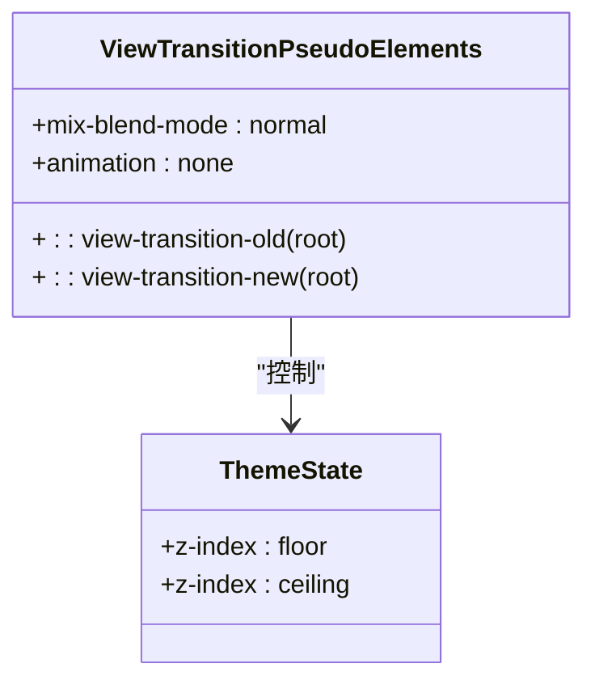
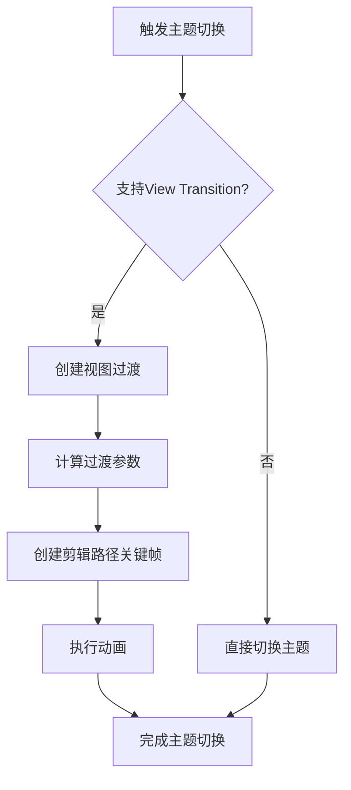
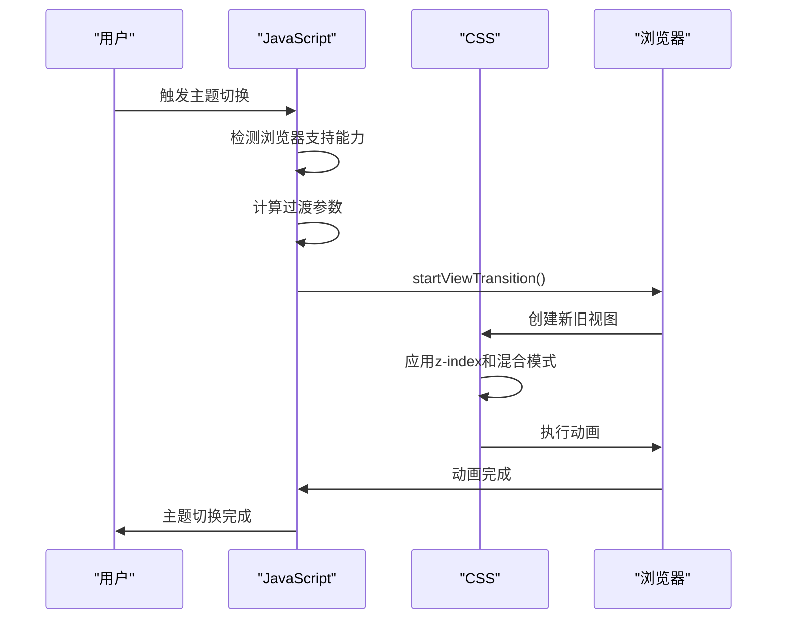

# 主题切换

<cite>
**本文档引用的文件**
- [index.ts](file://packages-runtime/theme-transition/src/index.ts)
- [tailwindcss.ts](file://packages-runtime/theme-transition/src/tailwindcss.ts)
- [mixins.scss](file://packages-runtime/theme-transition/scss/mixins.scss)
- [index.css](file://packages-runtime/theme-transition/css/index.css)
- [environment.ts](file://packages-runtime/theme-transition/src/utils/environment.ts)
- [geometry.ts](file://packages-runtime/theme-transition/src/utils/geometry.ts)
- [types.ts](file://packages-runtime/theme-transition/src/utils/types.ts)
- [promise.ts](file://packages-runtime/theme-transition/src/utils/promise.ts)
</cite>

## 目录
1. [简介](#简介)
2. [核心机制](#核心机制)
3. [集成方式](#集成方式)
4. [主题配置与变体注册](#主题配置与变体注册)
5. [运行时主题切换](#运行时主题切换)
6. [性能优化技巧](#性能优化技巧)
7. [与Tailwind CSS dark mode集成](#与tailwind-css-dark-mode集成)
8. [自定义主题逻辑](#自定义主题逻辑)
9. [总结](#总结)

## 简介

`theme-transition` 是一个为小程序和Web应用提供平滑主题切换效果的工具库。它利用CSS View Transitions API实现视觉上流畅的主题过渡动画，同时提供多种集成方式以适应不同的开发环境和技术栈。该工具支持uni-app、Taro和原生小程序环境，并提供SCSS混合宏和CSS-in-JS两种实现方式。

**Section sources**
- [README.md](file://packages-runtime/theme-transition/README.md#L1-L176)

## 核心机制

### CSS变量管理

`theme-transition` 通过CSS自定义属性（CSS变量）来管理主题状态。它利用View Transition伪元素 `::view-transition-old(root)` 和 `::view-transition-new(root)` 来分别表示当前主题和目标主题的视图状态。这种机制允许在主题切换过程中对新旧视图进行独立的样式控制。



**Diagram sources**
- [index.css](file://packages-runtime/theme-transition/css/index.css#L1-L22)
- [mixins.scss](file://packages-runtime/theme-transition/scss/mixins.scss#L1-L24)

### 动态样式注入

`theme-transition` 提供了多种方式注入必要的CSS样式：

1. **CSS方式**：直接导入预编译的CSS文件
2. **SCSS方式**：使用SCSS混合宏自定义主题选择器
3. **Tailwind CSS插件**：通过插件系统集成

动态样式注入的核心是为View Transition伪元素设置正确的z-index层级和混合模式，确保过渡动画的正确显示。

### 过渡动画处理

过渡动画的处理基于View Transition API，其核心流程如下：



**Diagram sources**
- [index.ts](file://packages-runtime/theme-transition/src/index.ts#L61-L174)
- [geometry.ts](file://packages-runtime/theme-transition/src/utils/geometry.ts#L59-L69)

## 集成方式

### uni-app环境集成

在uni-app环境中，可以通过以下步骤集成主题切换功能：

1. 安装`theme-transition`依赖
2. 在主样式文件中导入CSS或SCSS
3. 在应用入口文件中初始化主题切换逻辑

```scss
// uni.scss
@use 'theme-transition/scss/mixins.scss' as M;
@include M.theme-transition('[data-theme="dark"]');
```

**Section sources**
- [mixins.scss](file://packages-runtime/theme-transition/scss/mixins.scss#L1-L24)

### Taro环境集成

Taro环境的集成方式与uni-app类似，但需要考虑Taro的编译特性：

```ts
// tailwind.config.ts
import { themeTransitionPlugin } from 'theme-transition/tailwindcss'

export default {
  content: ['./src/**/*.{html,js,ts,jsx,tsx}'],
  plugins: [themeTransitionPlugin()],
} satisfies Config
```

**Section sources**
- [tailwindcss.ts](file://packages-runtime/theme-transition/src/tailwindcss.ts#L24-L116)

### 原生小程序环境集成

原生小程序环境需要手动处理样式注入和主题切换逻辑：

```js
// app.js
import 'theme-transition/css'

App({
  onLaunch() {
    // 初始化主题切换
  }
})
```

**Section sources**
- [index.css](file://packages-runtime/theme-transition/css/index.css#L1-L22)

### SCSS混合宏实现

使用SCSS混合宏可以自定义主题选择器和z-index值：

```scss
@use 'theme-transition/scss/mixins.scss' as M;
@include M.theme-transition('[data-theme="dark"]', 1, 9999);
```

混合宏提供了三个参数：
- `$darkSelector`：暗色主题选择器
- `$floorZIndex`：基础z-index值
- `$ceilingZIndex`：顶层z-index值

**Section sources**
- [mixins.scss](file://packages-runtime/theme-transition/scss/mixins.scss#L1-L24)

### CSS-in-JS实现

CSS-in-JS方式通过JavaScript动态注入样式：

```js
import 'theme-transition/css'
```

这种方式适合需要动态控制样式注入时机的场景。

**Section sources**
- [index.css](file://packages-runtime/theme-transition/css/index.css#L1-L22)

## 主题配置与变体注册

### 主题配置

`theme-transition` 允许通过插件选项进行主题配置：

```ts
interface ThemeTransitionPluginOptions {
  zIndex?: {
    ceiling?: string | number
    floor?: string | number
  }
  baseCss?: CSSRuleObject
  darkMode?: Config['darkMode']
}
```

配置项说明：
- `zIndex`：定义z-index的上下限值
- `baseCss`：基础CSS规则
- `darkMode`：暗色模式配置

**Section sources**
- [tailwindcss.ts](file://packages-runtime/theme-transition/src/tailwindcss.ts#L6-L14)

### 主题变体注册

主题变体的注册通过Tailwind CSS插件系统完成，支持多种模式：

```ts
// 支持的模式
type DarkMode = 'class' | 'media' | 'variant' | ['variant', string | string[] | ((...args: any[]) => string)]

// class模式
darkMode: 'class' // 使用 .dark 类

// media模式
darkMode: 'media' // 使用 prefers-color-scheme 媒体查询

// variant模式
darkMode: ['variant', '.custom-selector &']
```

**Section sources**
- [tailwindcss.ts](file://packages-runtime/theme-transition/src/tailwindcss.ts#L44-L80)

## 运行时主题切换

### useToggleTheme API

`useToggleTheme` 是核心的JavaScript API，用于实现运行时主题切换：

```ts
interface UseToggleThemeOptions {
  toggle?: () => void | Promise<void>
  isCurrentDark?: () => boolean
  viewTransition?: {
    before?: () => void | Promise<void>
    after?: () => void | Promise<void>
    callback?: () => void | Promise<void>
  }
  duration?: number
  easing?: string
  document?: Document
  window?: Window & typeof globalThis
  animationTarget?: Element | (() => Element | null)
  fallbackCoordinates?: { x: number, y: number } | ((context: { viewportWidth: number, viewportHeight: number, target: Element | null }) => { x: number, y: number } | null | undefined)
  logger?: Pick<Console, 'warn'>
}

interface UseToggleThemeResult {
  toggleTheme: (event?: { clientX: number, clientY: number }) => Promise<void>
  isAppearanceTransition: boolean
  capabilities: {
    hasViewTransition: boolean
    prefersReducedMotion: boolean
    supportsAnimate: boolean
  }
  environment: {
    document: Document | undefined
    window: (Window & typeof globalThis) | undefined
    target: Element | null
  }
}
```

**Section sources**
- [index.ts](file://packages-runtime/theme-transition/src/index.ts#L27-L59)

### 主题切换流程

主题切换的完整流程如下：



**Diagram sources**
- [index.ts](file://packages-runtime/theme-transition/src/index.ts#L113-L165)
- [environment.ts](file://packages-runtime/theme-transition/src/utils/environment.ts#L30-L32)

## 性能优化技巧

### 主题预加载

通过预加载主题资源避免切换时的延迟：

```ts
// 预加载暗色主题
const darkTheme = document.createElement('link')
darkTheme.rel = 'stylesheet'
darkTheme.href = '/css/dark-theme.css'
document.head.appendChild(darkTheme)
```

### CSS变量缓存

利用CSS变量缓存减少样式计算：

```css
:root {
  --transition-duration: 400ms;
  --transition-easing: ease-in;
  --z-index-floor: 1;
  --z-index-ceiling: 2147483646;
}
```

### 减少重绘重排

通过优化z-index管理和混合模式减少重绘重排：

```css
::view-transition-old(root),
::view-transition-new(root) {
  mix-blend-mode: normal;
  animation: none;
  contain: layout style paint;
}
```

**Section sources**
- [index.css](file://packages-runtime/theme-transition/css/index.css#L1-L22)
- [mixins.scss](file://packages-runtime/theme-transition/scss/mixins.scss#L1-L24)

## 与Tailwind CSS dark mode集成

### 插件集成

`theme-transition` 提供了Tailwind CSS插件，可以无缝集成到现有项目中：

```ts
// tailwind.config.ts
import { themeTransitionPlugin } from 'theme-transition/tailwindcss'

export default {
  content: ['./src/**/*.{html,js,ts,jsx,tsx}'],
  plugins: [themeTransitionPlugin()],
} satisfies Config
```

### v3和v4版本支持

支持Tailwind CSS v3和v4两个版本：

```css
/* Tailwind CSS v4 */
@import 'tailwindcss';
@plugin 'theme-transition/tailwindcss';
```

**Section sources**
- [tailwindcss.ts](file://packages-runtime/theme-transition/src/tailwindcss.ts#L24-L116)
- [README.md](file://packages-runtime/theme-transition/README.md#L25-L76)

## 自定义主题逻辑

### 自定义过渡效果

可以通过配置参数自定义过渡效果：

```ts
const { toggleTheme } = useToggleTheme({
  duration: 600,
  easing: 'cubic-bezier(0.4, 0, 0.2, 1)',
  viewTransition: {
    before: () => {
      // 切换前的准备工作
    },
    after: () => {
      // 切换后的清理工作
    }
  }
})
```

### 自定义动画目标

可以指定特定的动画目标元素：

```ts
const { toggleTheme } = useToggleTheme({
  animationTarget: () => document.getElementById('app')!
})
```

### 键盘触发支持

通过`fallbackCoordinates`支持键盘触发的过渡动画：

```ts
const { toggleTheme } = useToggleTheme({
  fallbackCoordinates: { x: window.innerWidth / 2, y: window.innerHeight / 2 }
})
```

**Section sources**
- [index.ts](file://packages-runtime/theme-transition/src/index.ts#L27-L59)
- [types.ts](file://packages-runtime/theme-transition/src/utils/types.ts#L18-L22)

## 总结

`theme-transition` 工具通过结合CSS View Transitions API和灵活的集成方式，为小程序和Web应用提供了优雅的主题切换解决方案。其核心优势包括：

1. **多环境支持**：兼容uni-app、Taro和原生小程序
2. **多种集成方式**：支持CSS、SCSS和Tailwind CSS插件
3. **平滑过渡效果**：利用现代浏览器API实现视觉流畅的动画
4. **渐进式增强**：自动检测浏览器支持能力并优雅降级
5. **高度可配置**：提供丰富的配置选项满足不同需求

通过合理使用这些特性，开发者可以为用户提供更加流畅和愉悦的主题切换体验。