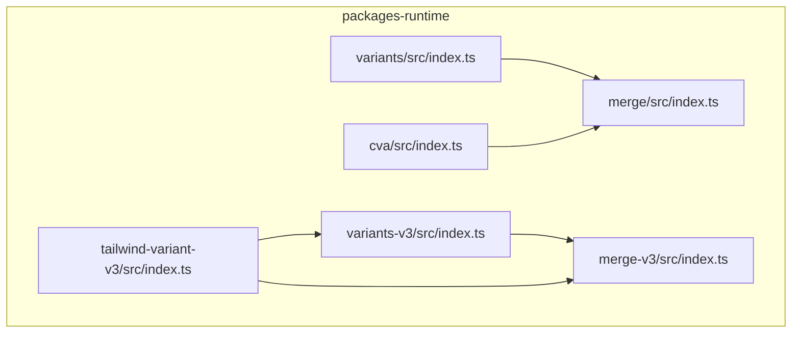
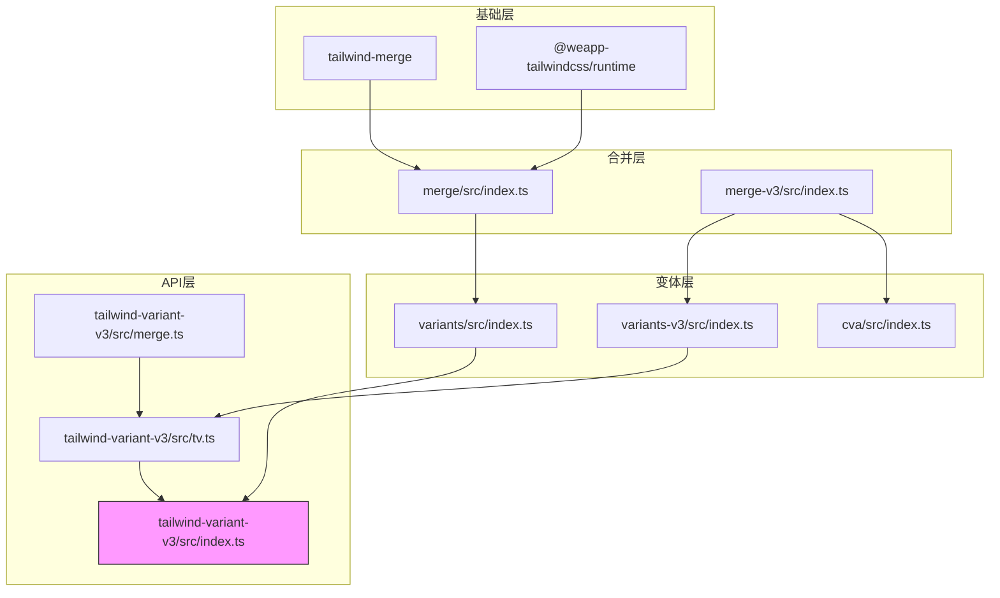
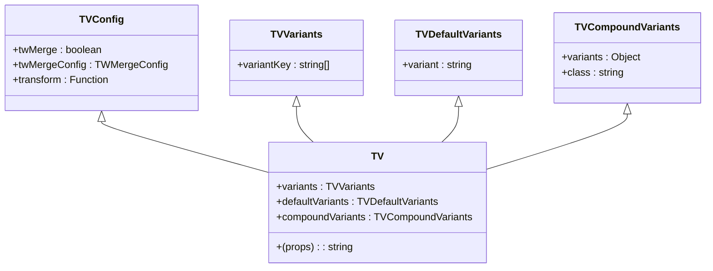
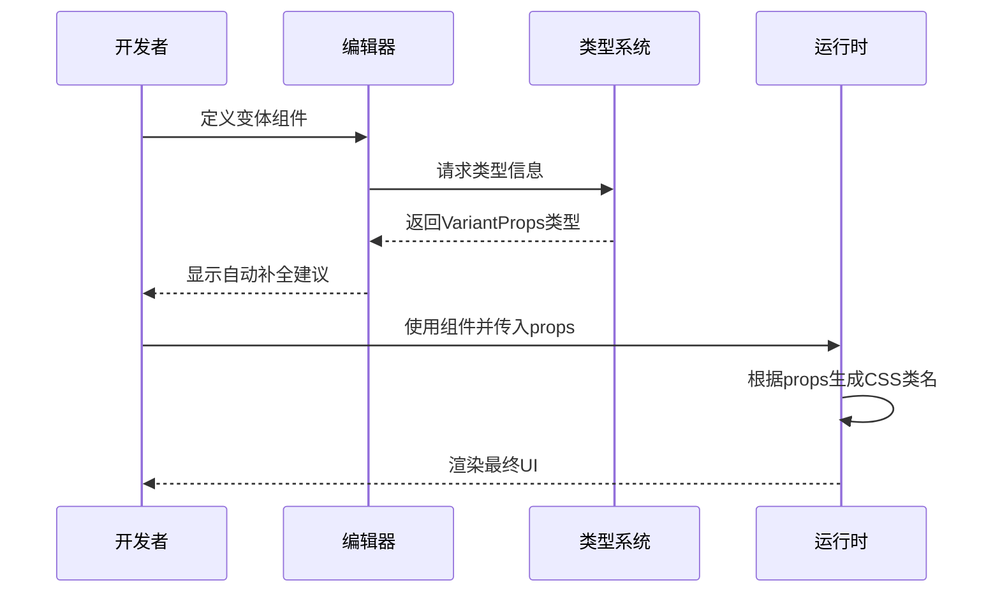
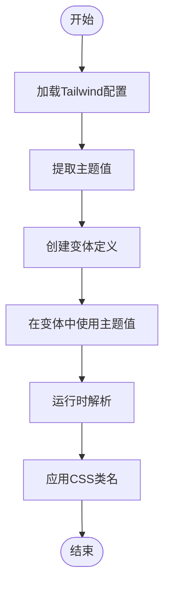
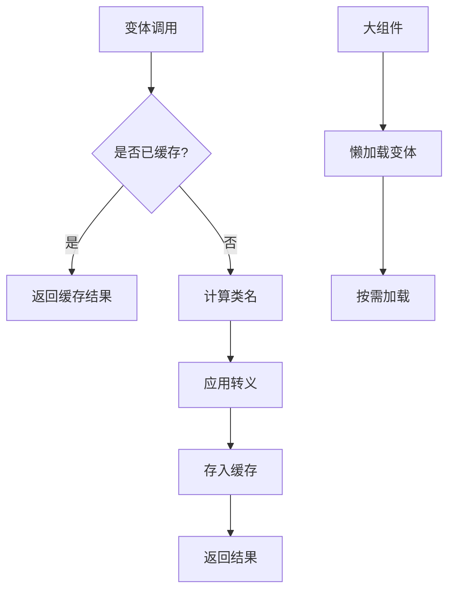

# 变体系统

<cite>
**本文档中引用的文件**  
- [index.ts](file://packages-runtime/variants/src/index.ts)
- [index.ts](file://packages-runtime/tailwind-variant-v3/src/index.ts)
- [index.ts](file://packages-runtime/variants-v3/src/index.ts)
- [index.ts](file://packages-runtime/cva/src/index.ts)
- [index.ts](file://packages-runtime/merge/src/index.ts)
- [index.ts](file://packages-runtime/merge-v3/src/index.ts)
- [constants.ts](file://packages-runtime/tailwind-variant-v3/src/constants.ts)
- [types.ts](file://packages-runtime/tailwind-variant-v3/src/types.ts)
- [tv.ts](file://packages-runtime/tailwind-variant-v3/src/tv.ts)
- [merge.ts](file://packages-runtime/tailwind-variant-v3/src/merge.ts)
</cite>

## 目录
1. [引言](#引言)
2. [项目结构](#项目结构)
3. [核心组件](#核心组件)
4. [架构概述](#架构概述)
5. [详细组件分析](#详细组件分析)
6. [依赖分析](#依赖分析)
7. [性能考虑](#性能考虑)
8. [故障排除指南](#故障排除指南)
9. [结论](#结论)

## 引言
变体系统是 `weapp-tailwindcss` 生态中的核心功能模块，旨在为小程序开发提供强大的 UI 组件变体管理能力。该系统通过 `variants` 和 `tailwind-variant-v3` 两个主要包实现，支持基础变体、复合变体和默认变体的定义与使用。系统深度集成 TypeScript 类型系统，提供卓越的类型推断和自动补全体验。同时，它兼容 Taro、uni-app 和原生小程序等多种框架，并支持与 Tailwind CSS 主题配置的无缝集成，实现运行时变体切换。本文档将全面介绍该系统的功能、实现原理和最佳实践。

## 项目结构
变体系统相关的代码主要位于 `packages-runtime` 目录下，包含多个独立但相互关联的包。这些包共同构成了一个完整的变体管理解决方案。



**Diagram sources**
- [index.ts](file://packages-runtime/variants/src/index.ts)
- [index.ts](file://packages-runtime/variants-v3/src/index.ts)
- [index.ts](file://packages-runtime/tailwind-variant-v3/src/index.ts)
- [index.ts](file://packages-runtime/cva/src/index.ts)
- [index.ts](file://packages-runtime/merge/src/index.ts)
- [index.ts](file://packages-runtime/merge-v3/src/index.ts)

**Section sources**
- [index.ts](file://packages-runtime/variants/src/index.ts)
- [index.ts](file://packages-runtime/tailwind-variant-v3/src/index.ts)

## 核心组件
变体系统的核心由以下几个关键组件构成：`tv` 函数用于创建具有变体的组件，`cn` 函数用于条件性地合并 CSS 类名，`createTV` 函数用于创建自定义的变体工厂，以及 `cva` 函数提供与 class-variance-authority 的兼容性。这些组件共同作用，使得开发者可以轻松地定义和使用复杂的 UI 变体。

**Section sources**
- [index.ts](file://packages-runtime/variants/src/index.ts)
- [index.ts](file://packages-runtime/tailwind-variant-v3/src/index.ts)
- [index.ts](file://packages-runtime/cva/src/index.ts)

## 架构概述
变体系统的架构设计遵循分层原则，从底层的类名合并到上层的变体定义，每一层都职责明确。



**Diagram sources**
- [index.ts](file://packages-runtime/variants/src/index.ts)
- [index.ts](file://packages-runtime/variants-v3/src/index.ts)
- [index.ts](file://packages-runtime/merge/src/index.ts)
- [index.ts](file://packages-runtime/merge-v3/src/index.ts)
- [tv.ts](file://packages-runtime/tailwind-variant-v3/src/tv.ts)
- [merge.ts](file://packages-runtime/tailwind-variant-v3/src/merge.ts)

## 详细组件分析

### 变体定义与使用
变体系统允许开发者通过 `tv` 函数定义组件的变体。这包括基础变体、复合变体和默认变体。

#### 变体类型定义


**Diagram sources**
- [types.ts](file://packages-runtime/tailwind-variant-v3/src/types.ts)

**Section sources**
- [types.ts](file://packages-runtime/tailwind-variant-v3/src/types.ts)
- [tv.ts](file://packages-runtime/tailwind-variant-v3/src/tv.ts)

### TypeScript 类型系统
变体系统提供了强大的 TypeScript 类型支持，确保在开发过程中获得准确的类型推断和自动补全。

#### 类型推断流程


**Diagram sources**
- [types.ts](file://packages-runtime/tailwind-variant-v3/src/types.ts)
- [tv.ts](file://packages-runtime/tailwind-variant-v3/src/tv.ts)

### 框架集成示例
变体系统设计为与多种小程序框架兼容，包括 Taro、uni-app 和原生小程序。

#### 集成架构
```mermaid
graph TD
A[Taro框架] --> B(tailwind-variant-v3)
C[uni-app框架] --> B
D[原生小程序] --> B
B --> E[merge-v3]
E --> F[tailwind-merge]
B --> G[@weapp-tailwindcss/runtime]
G --> H[平台适配]
```

**Diagram sources**
- [index.ts](file://packages-runtime/tailwind-variant-v3/src/index.ts)
- [index.ts](file://packages-runtime/merge-v3/src/index.ts)

### Tailwind CSS 主题集成
变体系统能够与 Tailwind CSS 的主题配置无缝集成，实现主题感知的变体。

#### 主题集成流程


**Diagram sources**
- [index.ts](file://packages-runtime/tailwind-variant-v3/src/index.ts)
- [constants.ts](file://packages-runtime/tailwind-variant-v3/src/constants.ts)

## 依赖分析
变体系统依赖于多个内部和外部包，形成了一个复杂的依赖网络。

```mermaid
graph LR
A[tailwind-variant-v3] --> B[tailwind-merge]
A --> C[@weapp-tailwindcss/runtime]
A --> D[variants-v3]
D --> E[merge-v3]
E --> B
E --> C
F[variants] --> G[merge]
G --> B
G --> C
H[cva] --> E
```

**Diagram sources**
- [index.ts](file://packages-runtime/tailwind-variant-v3/src/index.ts)
- [index.ts](file://packages-runtime/variants-v3/src/index.ts)
- [index.ts](file://packages-runtime/variants/src/index.ts)
- [index.ts](file://packages-runtime/cva/src/index.ts)
- [index.ts](file://packages-runtime/merge-v3/src/index.ts)
- [index.ts](file://packages-runtime/merge/src/index.ts)

**Section sources**
- [index.ts](file://packages-runtime/tailwind-variant-v3/src/index.ts)
- [index.ts](file://packages-runtime/variants-v3/src/index.ts)
- [index.ts](file://packages-runtime/variants/src/index.ts)

## 性能考虑
变体系统在设计时充分考虑了性能优化，包括类名合并缓存和懒加载策略。

### 性能优化策略


**Section sources**
- [index.ts](file://packages-runtime/variants/src/index.ts)
- [index.ts](file://packages-runtime/variants-v3/src/index.ts)
- [index.ts](file://packages-runtime/cva/src/index.ts)

## 故障排除指南
当使用变体系统时，可能会遇到一些常见问题，本节提供相应的解决方案。

**Section sources**
- [index.ts](file://packages-runtime/variants/src/index.ts)
- [index.ts](file://packages-runtime/tailwind-variant-v3/src/index.ts)
- [index.ts](file://packages-runtime/variants-v3/src/index.ts)

## 结论
变体系统为小程序开发提供了一套完整、高效且类型安全的 UI 组件管理方案。通过 `variants` 和 `tailwind-variant-v3` 包的协同工作，开发者可以轻松创建可复用的 UI 组件，实现复杂的变体逻辑。系统不仅支持多种开发框架，还提供了卓越的开发体验和性能表现。随着版本的迭代，API 也在不断优化，为开发者提供更加简洁和强大的功能。