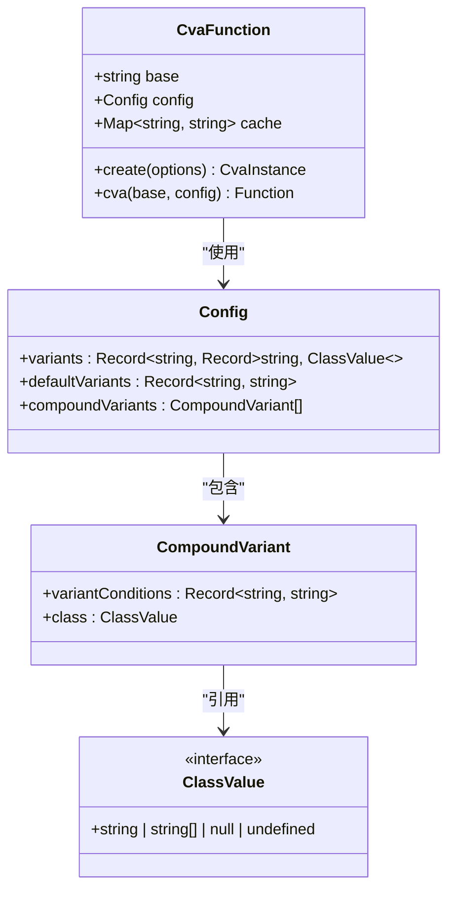
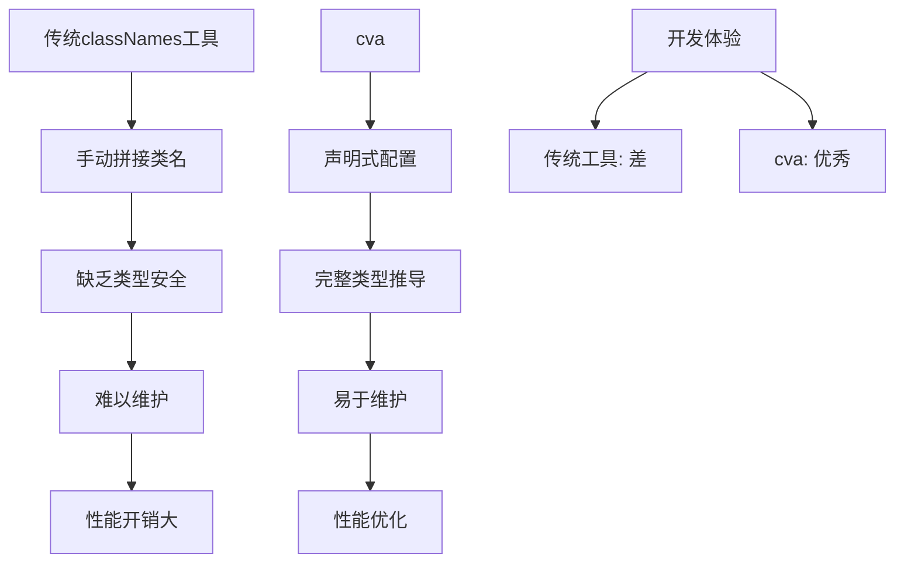

# 条件变体分析 (cva)

<cite>
**本文档引用文件**  
- [index.ts](file://packages-runtime/cva/src/index.ts)
- [types.ts](file://packages-runtime/cva/src/types.ts)
- [cva.test.ts](file://packages-runtime/cva/test/cva.test.ts)
- [cva-and-variants.mdx](file://website/docs/community/merge/cva-and-variants.mdx)
- [button-variants.ts](file://apps/react-app/src/components/ui/button-variants.ts)
- [index.ts](file://apps/vite-native-ts/miniprogram/components/IceButton/index.ts)
- [package.json](file://packages-runtime/cva/package.json)
</cite>

## 目录
1. [简介](#简介)
2. [核心功能与设计](#核心功能与设计)
3. [TypeScript类型定义](#typescript类型定义)
4. [实际使用示例](#实际使用示例)
5. [与Tailwind CSS变体系统的集成](#与tailwind-css变体系统的集成)
6. [与传统classNames工具的对比](#与传统classnames工具的对比)
7. [常见使用模式与最佳实践](#常见使用模式与最佳实践)
8. [潜在陷阱与解决方案](#潜在陷阱与解决方案)
9. [性能优化](#性能优化)
10. [总结](#总结)

## 简介

条件变体分析（cva）是`@weapp-tailwindcss/cva`包提供的核心功能，它基于`class-variance-authority`库，为小程序环境提供了运行时的类名变体管理能力。该功能允许开发者通过声明式的方式定义UI组件的条件变体，根据传入的props动态生成符合小程序规范的Tailwind CSS类名。

cva的主要目标是解决在小程序中使用Tailwind CSS时遇到的类名转义问题，确保运行时动态生成的类名与编译期生成的类名保持一致。它通过内置的escape/unescape逻辑，自动处理`[#...]`等非法字符，使开发者可以专注于UI逻辑的实现，而无需担心底层的兼容性问题。

**Section sources**
- [README.md](file://packages-runtime/cva/README.md#L1-L50)
- [cva-and-variants.mdx](file://website/docs/community/merge/cva-and-variants.mdx#L1-L152)

## 核心功能与设计

cva的核心功能是创建一个可复用的变体函数，该函数可以根据传入的配置对象和props生成相应的类名字符串。其设计遵循了函数式编程的原则，通过高阶函数的方式封装了类名生成的逻辑。

cva函数的主要特性包括：
- **自动转义**：内置weapp-tailwindcss的escape/unescape逻辑，确保运行时拼接出来的类名与编译期一致
- **API兼容**：完全兼容`class-variance-authority`的原有API和类型推导
- **可定制性**：通过`create`函数可以自定义escape、unescape或字符映射行为
- **缓存机制**：内置缓存机制，避免重复计算，提高性能

cva的设计还考虑了小程序的特殊环境，通过运行时封装的方式，解决了在小程序中动态生成类名时可能遇到的各种兼容性问题。它不仅处理了标准的Tailwind CSS类名，还支持任意值语法和自定义属性，为开发者提供了极大的灵活性。



**Diagram sources**
- [index.ts](file://packages-runtime/cva/src/index.ts#L1-L66)
- [types.ts](file://packages-runtime/cva/src/types.ts#L1-L60)

## TypeScript类型定义

cva提供了完整的TypeScript类型定义，确保在开发过程中获得最佳的类型安全和开发体验。主要的类型定义包括配置对象的结构、variant、defaultVariants和compoundVariants等属性。

### 配置对象结构

配置对象（Config）是cva函数的核心输入，它定义了组件的所有变体和默认值。其类型定义如下：

```typescript
export type Config<T> = T extends ConfigSchema
  ? {
      variants?: T
      defaultVariants?: ConfigVariants<T>
      compoundVariants?: (
        T extends ConfigSchema
          ? (ConfigVariants<T> | ConfigVariantsMulti<T>) & ClassProp
          : ClassProp
      )[]
    }
  : never
```

### 变体类型

变体（variants）定义了组件的不同状态和样式。每个变体可以有多个值，每个值对应一组类名。其类型定义如下：

```typescript
export type ConfigSchema = Record<string, Record<string, ClassValue>>
export type ConfigVariants<T extends ConfigSchema> = {
  [Variant in keyof T]?:
    | StringToBoolean<keyof T[Variant]>
    | null
    | undefined
}
```

### 默认变体

默认变体（defaultVariants）定义了组件的默认状态。当没有传入相应的props时，组件将使用这些默认值。其类型定义与ConfigVariants相同。

### 复合变体

复合变体（compoundVariants）允许定义多个变体条件的组合。当所有条件都满足时，对应的类名将被应用。其类型定义如下：

```typescript
export type ConfigVariantsMulti<T extends ConfigSchema> = {
  [Variant in keyof T]?:
    | StringToBoolean<keyof T[Variant]>
    | StringToBoolean<keyof T[Variant]>[]
    | undefined
}
```

这些类型定义确保了在使用cva时可以获得完整的类型推导和错误检查，大大提高了代码的可维护性和开发效率。

**Section sources**
- [types.ts](file://packages-runtime/cva/src/types.ts#L1-L60)
- [index.ts](file://packages-runtime/cva/src/index.ts#L1-L66)

## 实际使用示例

本节将展示在不同框架中使用cva的实际代码示例，包括React、Vue和原生小程序。

### React中的使用

在React应用中，cva可以用于创建可复用的UI组件。以下是一个按钮组件的示例：

```typescript
import { cva, type VariantProps } from "class-variance-authority"

export const buttonVariants = cva(
  "inline-flex items-center justify-center gap-2 whitespace-nowrap rounded-md text-sm font-medium transition-all disabled:pointer-events-none disabled:opacity-50 [&_svg]:pointer-events-none [&_svg:not([class*='size-'])]:size-4 shrink-0 [&_svg]:shrink-0 outline-none focus-visible:border-ring focus-visible:ring-ring/50 focus-visible:ring-[3px] aria-invalid:ring-destructive/20 dark:aria-invalid:ring-destructive/40 aria-invalid:border-destructive",
  {
    variants: {
      variant: {
        default: "bg-primary text-primary-foreground hover:bg-primary/90",
        destructive: "bg-destructive text-white hover:bg-destructive/90 focus-visible:ring-destructive/20 dark:focus-visible:ring-destructive/40 dark:bg-destructive/60",
        outline: "border bg-background shadow-xs hover:bg-accent hover:text-accent-foreground dark:bg-input/30 dark:border-input dark:hover:bg-input/50",
        secondary: "bg-secondary text-secondary-foreground hover:bg-secondary/80",
        ghost: "hover:bg-accent hover:text-accent-foreground dark:hover:bg-accent/50",
        link: "text-primary underline-offset-4 hover:underline",
      },
      size: {
        default: "h-9 px-4 py-2 has-[>svg]:px-3",
        sm: "h-8 rounded-md gap-1.5 px-3 has-[>svg]:px-2.5",
        lg: "h-10 rounded-md px-6 has-[>svg]:px-4",
        icon: "size-9",
        "icon-sm": "size-8",
        "icon-lg": "size-10",
      },
    },
    defaultVariants: {
      variant: "default",
      size: "default",
    },
  }
)

export type ButtonVariants = VariantProps<typeof buttonVariants>
```

### Vue中的使用

在Vue应用中，cva的使用方式与React类似。以下是一个按钮组件的示例：

```typescript
import type { VariantProps } from "class-variance-authority"
import { cva } from "class-variance-authority"

export { default as Button } from "./Button.vue"

export const buttonVariants = cva(
  "inline-flex items-center justify-center gap-2 whitespace-nowrap rounded-md text-sm font-medium transition-all disabled:pointer-events-none disabled:opacity-50 [&_svg]:pointer-events-none [&_svg:not([class*='size-'])]:size-4 shrink-0 [&_svg]:shrink-0 outline-none focus-visible:border-ring focus-visible:ring-ring/50 focus-visible:ring-[3px] aria-invalid:ring-destructive/20 dark:aria-invalid:ring-destructive/40 aria-invalid:border-destructive",
  {
    variants: {
      variant: {
        default: "bg-primary text-primary-foreground hover:bg-primary/90",
        destructive: "bg-destructive text-white hover:bg-destructive/90 focus-visible:ring-destructive/20 dark:focus-visible:ring-destructive/40 dark:bg-destructive/60",
        outline: "border bg-background shadow-xs hover:bg-accent hover:text-accent-foreground dark:bg-input/30 dark:border-input dark:hover:bg-input/50",
        secondary: "bg-secondary text-secondary-foreground hover:bg-secondary/80",
        ghost: "hover:bg-accent hover:text-accent-foreground dark:hover:bg-accent/50",
        link: "text-primary underline-offset-4 hover:underline",
      },
      size: {
        "default": "h-9 px-4 py-2 has-[>svg]:px-3",
        "sm": "h-8 rounded-md gap-1.5 px-3 has-[>svg]:px-2.5",
        "lg": "h-10 rounded-md px-6 has-[>svg]:px-4",
        "icon": "size-9",
        "icon-sm": "size-8",
        "icon-lg": "size-10",
      },
    },
    defaultVariants: {
      variant: "default",
      size: "default",
    },
  },
)

export type ButtonVariants = VariantProps<typeof buttonVariants>
```

### 原生小程序中的使用

在原生小程序中，cva的使用需要考虑小程序的特殊环境。以下是一个按钮组件的示例：

```typescript
import { cva } from '@weapp-tailwindcss/cva'
import { twMerge } from '@weapp-tailwindcss/merge-v3'

const button = cva(['font-semibold', 'border', 'rounded'], {
  variants: {
    intent: {
      primary: ['bg-blue-500', 'text-white', 'border-transparent'],
      secondary: ['bg-white', 'text-gray-800', 'border-gray-400'],
    },
    size: {
      small: ['text-sm', 'py-1', 'px-2'],
      medium: ['text-base', 'py-2', 'px-4'],
    },
    disabled: {
      false: null,
      true: ['opacity-50', 'cursor-not-allowed'],
    },
  },
  compoundVariants: [
    {
      intent: 'primary',
      disabled: false,
      class: 'hover:bg-blue-600',
    },
    {
      intent: 'secondary',
      disabled: false,
      class: 'hover:bg-gray-100',
    },
    {
      intent: 'primary',
      size: 'medium',
      class: 'uppercase',
    },
  ],
  defaultVariants: {
    intent: 'primary',
    size: 'medium',
    disabled: false,
  },
})

Component({
  options: {
    virtualHost: true,
    styleIsolation: 'apply-shared',
  },
  externalClasses: ['class'],
  properties: {
    class: {
      type: String,
      value: '',
    },
    twClass: {
      type: String,
      value: '',
    },
    hoverClass: {
      type: String,
      value: '',
    },
    twHoverClass: {
      type: String,
      value: '',
    },
    style: {
      type: String,
      value: '',
    },
  },
  data: {
    mergedClass: '',
  },
  observers: {
    twClass(val) {
      this.setData({
        mergedClass: twMerge(button(), val),
      })
    },
  },
  lifetimes: {
    attached() {
      this.setData({
        mergedClass: button(this.data),
      })
    },
  },
})
```

这些示例展示了cva在不同框架中的使用方式，体现了其良好的跨平台兼容性和灵活性。

**Section sources**
- [button-variants.ts](file://apps/react-app/src/components/ui/button-variants.ts#L1-L34)
- [index.ts](file://apps/vue-app/src/components/ui/button/index.ts#L1-L39)
- [index.ts](file://apps/vite-native-ts/miniprogram/components/IceButton/index.ts#L1-L100)

## 与Tailwind CSS变体系统的集成

cva与Tailwind CSS的变体系统深度集成，通过运行时封装的方式解决了小程序环境中使用Tailwind CSS的主要挑战。

### 变体系统集成机制

cva通过以下机制与Tailwind CSS变体系统集成：

1. **自动转义处理**：cva内置了weapp-tailwindcss的escape/unescape逻辑，确保运行时生成的类名与编译期生成的类名完全一致。这对于包含`[#...]`等非法字符的任意值语法尤为重要。

2. **冲突解决**：cva继承了Tailwind CSS的冲突解决机制，后声明的类名会覆盖先声明的类名。这确保了组件的样式行为与直接使用Tailwind CSS类名时一致。

3. **修饰符支持**：cva完全支持Tailwind CSS的所有修饰符，包括`hover`、`focus`、`dark`等状态修饰符，以及`lg`、`xl`等断点修饰符。

4. **任意值支持**：cva支持Tailwind CSS的任意值语法，如`w-[12rpx]`、`text-[#ececec]`等，为开发者提供了极大的灵活性。

### 复杂状态组合处理

cva能够优雅地处理复杂的状态组合，主要通过以下方式：

1. **变体组合**：通过`variants`配置，可以定义多个独立的变体，每个变体可以有多个值。当组件使用时，这些变体可以自由组合。

2. **复合变体**：通过`compoundVariants`配置，可以定义多个变体条件的组合。只有当所有条件都满足时，对应的类名才会被应用。

3. **默认变体**：通过`defaultVariants`配置，可以定义组件的默认状态，简化组件的使用。

4. **条件逻辑**：cva支持布尔类型的变体，如`disabled`，可以直接使用`true`/`false`作为键名，使条件逻辑更加直观。

这种集成方式使得开发者可以像在Web环境中一样使用Tailwind CSS的变体系统，同时无需担心小程序环境的特殊限制。

**Section sources**
- [cva-and-variants.mdx](file://website/docs/community/merge/cva-and-variants.mdx#L1-L152)
- [index.ts](file://packages-runtime/cva/src/index.ts#L1-L66)

## 与传统classNames工具的对比

cva相比传统的classNames工具具有显著的优势，主要体现在类型安全、可维护性和性能优化等方面。

### 类型安全

cva提供了完整的TypeScript类型推导，这是传统classNames工具无法比拟的优势：

- **自动类型推导**：cva可以根据配置对象自动推导出`VariantProps`类型，为组件的props提供精确的类型定义。
- **错误检查**：在使用组件时，TypeScript编译器可以检查传入的props是否符合定义，避免运行时错误。
- **智能提示**：在IDE中使用时，可以获得完整的智能提示，包括可用的变体和值。

相比之下，传统的classNames工具通常需要手动定义类型，或者完全放弃类型检查，增加了出错的风险。

### 可维护性

cva在可维护性方面也有明显优势：

- **集中管理**：所有变体定义都集中在配置对象中，便于维护和修改。
- **可复用性**：定义好的变体函数可以在多个组件中复用，减少重复代码。
- **文档化**：配置对象本身就是最好的文档，清晰地展示了组件的所有状态和样式。

传统classNames工具通常将类名拼接逻辑分散在各个组件中，难以维护和复用。

### 性能优化

cva在性能方面也进行了优化：

- **缓存机制**：内置缓存机制，避免重复计算相同的props组合。
- **按需生成**：只在需要时生成类名字符串，减少不必要的计算。
- **轻量级**：基于`class-variance-authority`，代码体积小，性能开销低。

传统classNames工具通常没有这些优化，可能导致性能问题。



**Diagram sources**
- [types.ts](file://packages-runtime/cva/src/types.ts#L1-L60)
- [index.ts](file://packages-runtime/cva/src/index.ts#L1-L66)

## 常见使用模式与最佳实践

本节将介绍cva的常见使用模式和最佳实践，帮助开发者更好地使用这一功能。

### 基本使用模式

1. **定义基础样式**：在`base`属性中定义组件的基础样式，这些样式在所有状态下都适用。
2. **定义变体**：在`variants`属性中定义组件的不同状态和对应的样式。
3. **设置默认值**：在`defaultVariants`属性中设置组件的默认状态，简化使用。
4. **处理复杂组合**：在`compoundVariants`属性中处理多个变体的组合情况。

### 最佳实践

1. **命名规范**：使用语义化的变体名称，如`size`、`variant`、`state`等，避免使用具体的样式名称。
2. **合理分组**：将相关的变体分组，如将所有尺寸相关的变体放在`size`组中。
3. **避免过度复杂**：不要定义过多的变体和组合，保持组件的简单性。
4. **文档化**：为复杂的变体配置添加注释，说明每个变体的用途和取值。
5. **测试覆盖**：为变体函数编写单元测试，确保所有变体组合都能正确工作。

### 高级使用技巧

1. **动态变体**：可以将变体配置存储在外部文件中，实现主题化或动态配置。
2. **组合使用**：可以将多个cva函数组合使用，创建更复杂的组件。
3. **运行时定制**：通过`create`函数创建定制化的cva实例，满足特殊需求。

这些使用模式和最佳实践可以帮助开发者充分发挥cva的潜力，创建高质量的UI组件。

**Section sources**
- [cva-and-variants.mdx](file://website/docs/community/merge/cva-and-variants.mdx#L1-L152)
- [index.ts](file://packages-runtime/cva/src/index.ts#L1-L66)

## 潜在陷阱与解决方案

在使用cva时，可能会遇到一些潜在的陷阱，本节将介绍这些陷阱及其解决方案。

### 类名转义问题

**问题**：在小程序中，包含`[#...]`等特殊字符的类名需要转义，否则会导致解析错误。

**解决方案**：cva内置了自动转义机制，确保生成的类名符合小程序的规范。开发者无需手动处理转义，可以直接使用任意值语法。

### 性能问题

**问题**：在大量使用cva的场景下，可能会出现性能问题，特别是在频繁重新渲染的组件中。

**解决方案**：
1. 利用cva内置的缓存机制，避免重复计算。
2. 将cva函数定义在组件外部，避免在每次渲染时重新创建。
3. 对于复杂的变体组合，考虑使用memoization技术。

### 类型推导问题

**问题**：在某些复杂的类型场景下，TypeScript可能无法正确推导出`VariantProps`类型。

**解决方案**：
1. 明确指定类型参数，帮助TypeScript进行类型推导。
2. 使用`as const`断言，固定配置对象的类型。
3. 在必要时手动定义类型，确保类型安全。

### 兼容性问题

**问题**：在不同环境（如Web、小程序、SSR）中，类名的处理方式可能不同。

**解决方案**：使用`create`函数创建针对特定环境的cva实例，通过配置`escape`和`unescape`选项来适应不同环境的需求。

通过了解这些潜在陷阱并采取相应的解决方案，可以确保cva的稳定和高效使用。

**Section sources**
- [cva.test.ts](file://packages-runtime/cva/test/cva.test.ts#L1-L44)
- [cva-and-variants.mdx](file://website/docs/community/merge/cva-and-variants.mdx#L1-L152)

## 性能优化

cva在设计时充分考虑了性能优化，通过多种机制确保在各种使用场景下都能保持良好的性能表现。

### 缓存机制

cva内置了LRU（Least Recently Used）缓存机制，限制缓存大小为256个条目。当缓存达到上限时，最久未使用的条目将被移除。这种机制可以有效避免内存泄漏，同时提高重复调用的性能。

```typescript
const cache = new Map<string, string>()
const cacheLimit = 256

return (...props) => {
  const value = fn(...props)
  if (!value) {
    return value
  }

  const cached = cache.get(value)
  if (cached !== undefined) {
    return cached
  }

  const escaped = transformers.escape(value)

  if (cache.size >= cacheLimit) {
    const firstEntry = cache.keys().next()
    if (!firstEntry.done) {
      cache.delete(firstEntry.value)
    }
  }
  cache.set(value, escaped)

  return escaped
}
```

### 懒加载

cva采用懒加载的方式，只有在实际调用时才会生成类名字符串。这种按需生成的策略避免了不必要的计算，特别是在组件初始化阶段。

### 批量处理

对于需要处理多个类名的场景，cva可以与`twMerge`等工具结合使用，实现批量处理和优化。这可以减少DOM操作次数，提高渲染性能。

### 环境适配

通过`create`函数，可以创建针对特定环境优化的cva实例。例如，在SSR环境中可以禁用转义，提高渲染速度；在客户端可以启用完整的转义机制，确保兼容性。

这些性能优化措施使得cva不仅功能强大，而且在实际使用中也能保持良好的性能表现。

**Section sources**
- [index.ts](file://packages-runtime/cva/src/index.ts#L1-L66)
- [cva.test.ts](file://packages-runtime/cva/test/cva.test.ts#L1-L44)

## 总结

条件变体分析（cva）是`@weapp-tailwindcss/cva`包提供的强大功能，它为小程序环境中的UI组件开发提供了声明式的变体管理能力。通过深入分析cva的实现和使用，我们可以得出以下结论：

1. **功能强大**：cva不仅提供了基本的变体管理功能，还通过`compoundVariants`和`defaultVariants`等特性支持复杂的条件组合。

2. **类型安全**：完整的TypeScript类型定义确保了开发过程中的类型安全，提供了优秀的开发体验。

3. **性能优化**：内置的缓存机制和懒加载策略确保了在各种使用场景下的良好性能。

4. **易于集成**：与Tailwind CSS变体系统的深度集成，使得开发者可以像在Web环境中一样使用Tailwind CSS。

5. **跨平台兼容**：通过`create`函数的定制能力，可以轻松适应不同环境的需求。

6. **社区支持**：作为`weapp-tailwindcss`生态的一部分，cva得到了良好的文档支持和社区维护。

总的来说，cva是一个成熟、稳定且功能丰富的工具，特别适合在小程序项目中构建可复用的UI组件。通过遵循本文档中介绍的最佳实践，开发者可以充分发挥cva的潜力，提高开发效率和代码质量。

**Section sources**
- [README.md](file://packages-runtime/cva/README.md#L1-L50)
- [cva-and-variants.mdx](file://website/docs/community/merge/cva-and-variants.mdx#L1-L152)