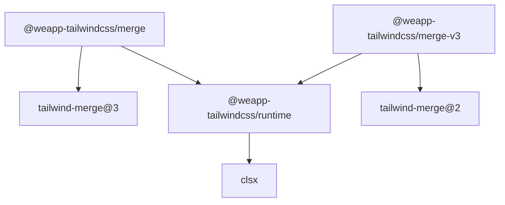
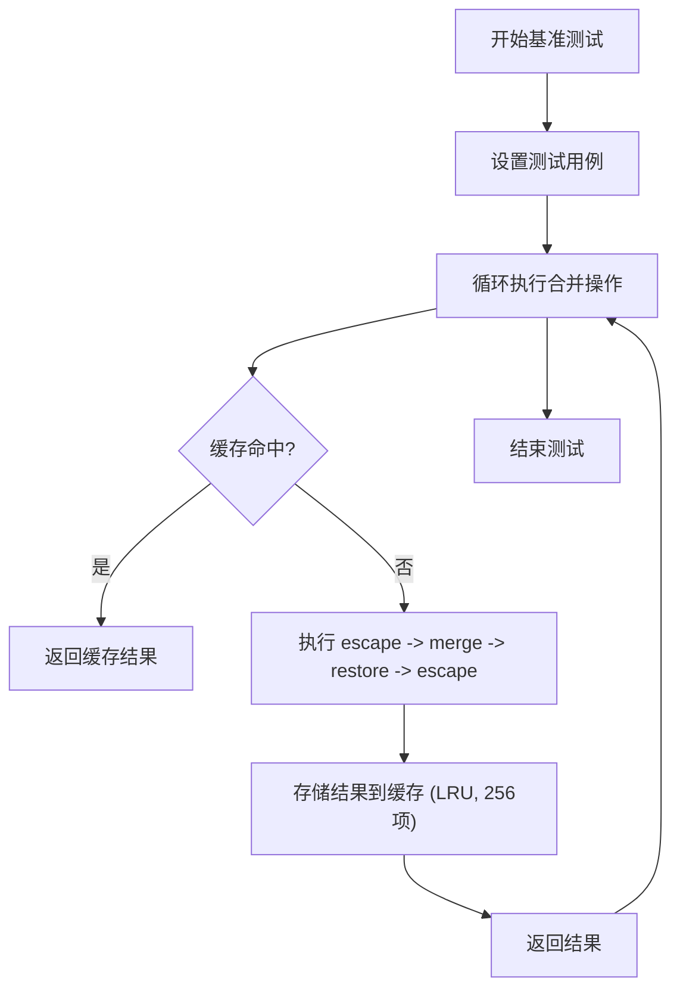

# 类名合并工具

<cite>
**本文档中引用的文件**  
- [merge/index.ts](file://packages-runtime/merge/src/index.ts)
- [merge-v3/index.ts](file://packages-runtime/merge-v3/src/index.ts)
- [merge/README.md](file://packages-runtime/merge/README.md)
- [merge-v3/README.md](file://packages-runtime/merge-v3/README.md)
- [merge/test/index.test.ts](file://packages-runtime/merge/test/index.test.ts)
- [runtime/src/index.ts](file://packages-runtime/runtime/src/index.ts)
- [runtime/src/create-runtime.ts](file://packages-runtime/runtime/src/create-runtime.ts)
- [runtime/src/types.ts](file://packages-runtime/runtime/src/types.ts)
- [benchmark/tailwindcss3/bench.bench.ts](file://benchmark/tailwindcss3/bench.bench.ts)
- [benchmark/tailwindcss4/bench.bench.ts](file://benchmark/tailwindcss4/bench.bench.ts)
</cite>

## 目录
1. [简介](#简介)
2. [项目结构](#项目结构)
3. [核心组件](#核心组件)
4. [架构概述](#架构概述)
5. [详细组件分析](#详细组件分析)
6. [依赖分析](#依赖分析)
7. [性能考量](#性能考量)
8. [故障排除指南](#故障排除指南)
9. [结论](#结论)

## 简介
本文档详细介绍了 `@weapp-tailwindcss/merge` 和 `@weapp-tailwindcss/merge-v3` 两个类名合并工具包的功能、差异和使用方法。这两个工具专为在小程序环境中安全地合并 Tailwind CSS 类名而设计，解决了类名冲突和覆盖问题，并针对不同版本的 Tailwind CSS 提供了优化支持。

## 项目结构
`@weapp-tailwindcss` 项目是一个 monorepo 结构，包含多个包，其中 `merge` 和 `merge-v3` 是专门用于类名合并的核心运行时工具。它们位于 `packages-runtime` 目录下，各自独立但共享核心逻辑。

```mermaid
graph TB
subgraph "packages-runtime"
merge["@weapp-tailwindcss/merge"]
mergev3["@weapp-tailwindcss/merge-v3"]
runtime["@weapp-tailwindcss/runtime"]
end
merge --> runtime
mergev3 --> runtime
merge -.-> "tailwind-merge@3"
mergev3 -.-> "tailwind-merge@2"
```

**Diagram sources**
- [merge/index.ts](file://packages-runtime/merge/src/index.ts)
- [merge-v3/index.ts](file://packages-runtime/merge-v3/src/index.ts)
- [runtime/src/index.ts](file://packages-runtime/runtime/src/index.ts)

**Section sources**
- [merge/index.ts](file://packages-runtime/merge/src/index.ts)
- [merge-v3/index.ts](file://packages-runtime/merge-v3/src/index.ts)

## 核心组件
`merge` 和 `merge-v3` 的核心功能是提供一个安全、高效的类名合并机制。它们基于 `tailwind-merge` 库，并通过 `@weapp-tailwindcss/runtime` 进行封装，以适应小程序环境的特殊需求，如类名转义和 rpx 单位处理。

**Section sources**
- [merge/index.ts](file://packages-runtime/merge/src/index.ts)
- [merge-v3/index.ts](file://packages-runtime/merge-v3/src/index.ts)

## 架构概述
这两个工具包的架构基于工厂模式和装饰器模式。`@weapp-tailwindcss/runtime` 提供了 `createRuntimeFactory`，它接收 `tailwind-merge` 的核心函数，并添加了预处理（prepare）和恢复（restore）的钩子，以及类名的 escape/unescape 转换。

```mermaid
classDiagram
class createRuntimeFactory {
+createRuntime(options) TailwindMergeRuntime
}
class TailwindMergeRuntime {
+twMerge(...inputs) string
+twJoin(...inputs) string
+extendTailwindMerge(config) TailwindMergeRuntime
+createTailwindMerge(config) TailwindMergeRuntime
}
class Transformers {
+escape(value) string
+unescape(value) string
}
createRuntimeFactory --> TailwindMergeRuntime : "creates"
createRuntimeFactory --> Transformers : "uses"
TailwindMergeRuntime --> "tailwind-merge" : "wraps"
```

**Diagram sources**
- [runtime/src/create-runtime.ts](file://packages-runtime/runtime/src/create-runtime.ts)
- [runtime/src/types.ts](file://packages-runtime/runtime/src/types.ts)

## 详细组件分析

### merge 与 merge-v3 分析
`merge` 和 `merge-v3` 的主要区别在于它们所依赖的 `tailwind-merge` 版本和内部配置的 `version` 标识。

#### 功能差异
`merge` 包（位于 `packages-runtime/merge`）是为 Tailwind CSS v4 设计的，它内部使用 `tailwind-merge@3` 并将 `version` 设置为 `3`。

```ts
const create = createRuntimeFactory({
  // ... 其他选项
  version: 3,
  ...rpxTransform,
})
```

`merge-v3` 包（位于 `packages-runtime/merge-v3`）是为 Tailwind CSS v3 设计的，它同样使用 `tailwind-merge@2`（在代码中导入为 `tailwind-merge`），但将 `version` 设置为 `2`。

```ts
const create = createRuntimeFactory({
  // ... 其他选项
  version: 2,
  ...rpxTransform,
})
```

这种设计允许上层工具（如 `variants` 和 `cva`）根据 `version` 来决定使用哪种配置和行为，从而实现向后兼容。

#### TypeScript 类型定义
两个包都导出了相同的类型和函数，确保了 API 的一致性。

```ts
export type {
  ClassValue,
}

export type {
  CreateOptions,
  EscapeConfig,
  UnescapeConfig,
} from '@weapp-tailwindcss/runtime'
```

这使得开发者可以无缝地在两个包之间切换，而无需更改类型定义。

**Section sources**
- [merge/index.ts](file://packages-runtime/merge/src/index.ts)
- [merge-v3/index.ts](file://packages-runtime/merge-v3/src/index.ts)
- [runtime/src/types.ts](file://packages-runtime/runtime/src/types.ts)

### 在函数组件和类组件中的使用
这些工具可以在任何 React 或 Vue 组件中使用，无论是函数组件还是类组件。

```tsx
// 函数组件示例
import { twMerge } from '@weapp-tailwindcss/merge'

function Button({ className, children }) {
  return (
    <button className={twMerge('px-4 py-2 rounded', className)}>
      {children}
    </button>
  )
}
```

```tsx
// 类组件示例
import { twMerge } from '@weapp-tailwindcss/merge'

class Button extends React.Component {
  render() {
    const { className, children } = this.props
    return (
      <button className={twMerge('px-4 py-2 rounded', className)}>
        {children}
      </button>
    )
  }
}
```

**Section sources**
- [merge/README.md](file://packages-runtime/merge/README.md)
- [merge-v3/README.md](file://packages-runtime/merge-v3/README.md)

### 实际应用示例

#### 组件库开发
在开发可复用的 UI 组件库时，`twMerge` 可以安全地合并组件的默认样式和用户传入的自定义样式。

```ts
const buttonBase = 'font-medium transition'
const buttonPrimary = 'bg-indigo-600 text-white hover:bg-indigo-700'

function Button({ variant = 'primary', className }) {
  const baseClasses = buttonBase
  const variantClasses = variant === 'primary' ? buttonPrimary : 'border border-gray-300 text-gray-700'
  return <button className={twMerge(baseClasses, variantClasses, className)} />
}
```

#### 动态类名生成
可以结合条件逻辑动态生成类名。

```ts
function StatusBadge({ status }) {
  const statusClasses = {
    online: 'bg-green-100 text-green-800',
    offline: 'bg-gray-100 text-gray-800',
    busy: 'bg-red-100 text-red-800',
  }
  return <span className={twMerge('px-2 py-1 rounded-full text-xs', statusClasses[status])}></span>
}
```

#### 主题系统集成
与主题系统集成，根据当前主题动态调整样式。

```ts
import { useTheme } from './theme-context'

function ThemedCard({ children }) {
  const { theme } = useTheme()
  const themeClasses = theme === 'dark' 
    ? 'bg-gray-800 text-white border-gray-700' 
    : 'bg-white text-gray-900 border-gray-200'
  
  return (
    <div className={twMerge('p-4 rounded-lg border shadow', themeClasses)}>
      {children}
    </div>
  )
}
```

**Section sources**
- [merge-v3/README.md](file://packages-runtime/merge-v3/README.md)

## 依赖分析
`merge` 和 `merge-v3` 的依赖关系清晰，核心依赖是 `tailwind-merge` 和 `@weapp-tailwindcss/runtime`。



**Diagram sources**
- [merge/index.ts](file://packages-runtime/merge/src/index.ts)
- [merge-v3/index.ts](file://packages-runtime/merge-v3/src/index.ts)
- [runtime/src/index.ts](file://packages-runtime/runtime/src/index.ts)

## 性能考量
基准测试显示，`@weapp-tailwindcss/merge` 和 `@weapp-tailwindcss/merge-v3` 在性能上与上游库 `tailwind-merge` 相当。



**Diagram sources**
- [runtime/src/create-runtime.ts](file://packages-runtime/runtime/src/create-runtime.ts)

`create-runtime.ts` 中实现了一个 LRU 缓存（大小为 256），用于缓存合并结果，避免重复计算，从而提升性能。

**Section sources**
- [benchmark/tailwindcss3/bench.bench.ts](file://benchmark/tailwindcss3/bench.bench.ts)
- [benchmark/tailwindcss4/bench.bench.ts](file://benchmark/tailwindcss4/bench.bench.ts)

## 故障排除指南
- **类名未正确合并**：检查是否正确安装了对应版本的包（`merge` 用于 v4，`merge-v3` 用于 v3）。
- **转义问题**：如果类名中包含特殊字符（如 `#`），确保 `escape` 和 `unescape` 配置正确。
- **性能问题**：虽然有缓存，但在极端情况下，可以考虑对高频调用的组合进行预计算。

**Section sources**
- [merge/test/index.test.ts](file://packages-runtime/merge/test/index.test.ts)

## 结论
`@weapp-tailwindcss/merge` 和 `@weapp-tailwindcss/merge-v3` 是为小程序环境量身定制的强大类名合并工具。它们通过封装 `tailwind-merge` 并添加小程序特有的转义逻辑，提供了一个安全、高效且兼容的解决方案。开发者可以根据项目使用的 Tailwind CSS 版本选择合适的包，并利用其丰富的 API 来构建灵活、可维护的 UI 组件。