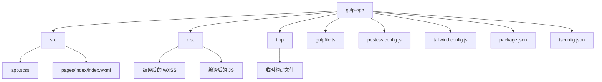
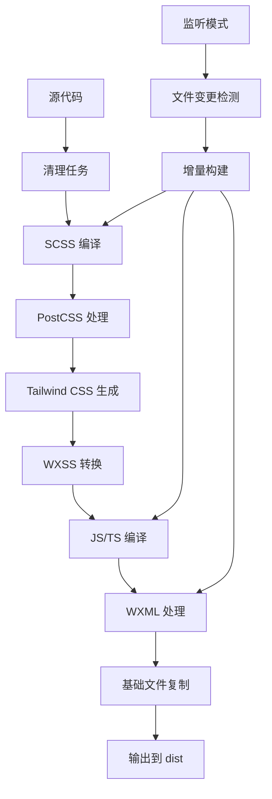
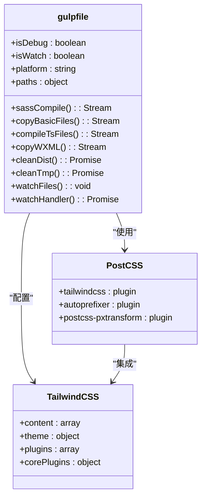
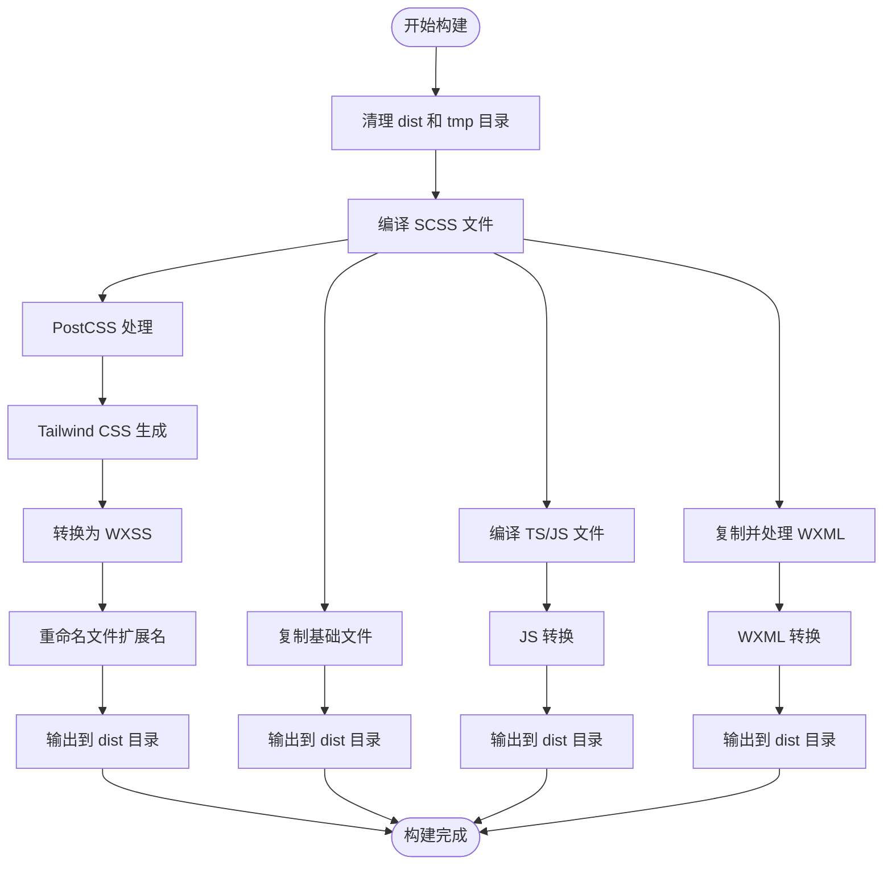
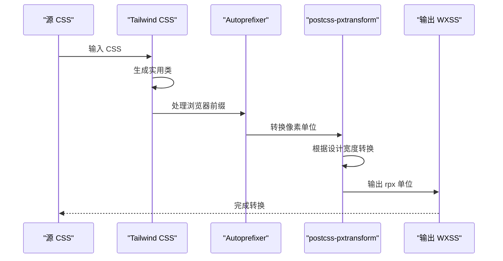
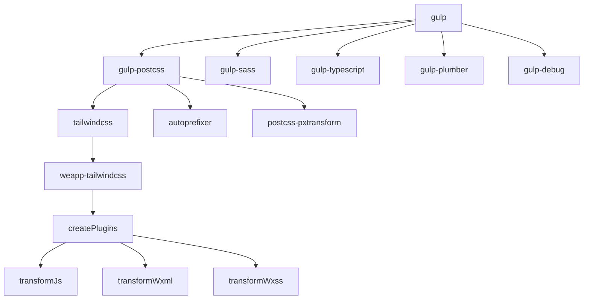
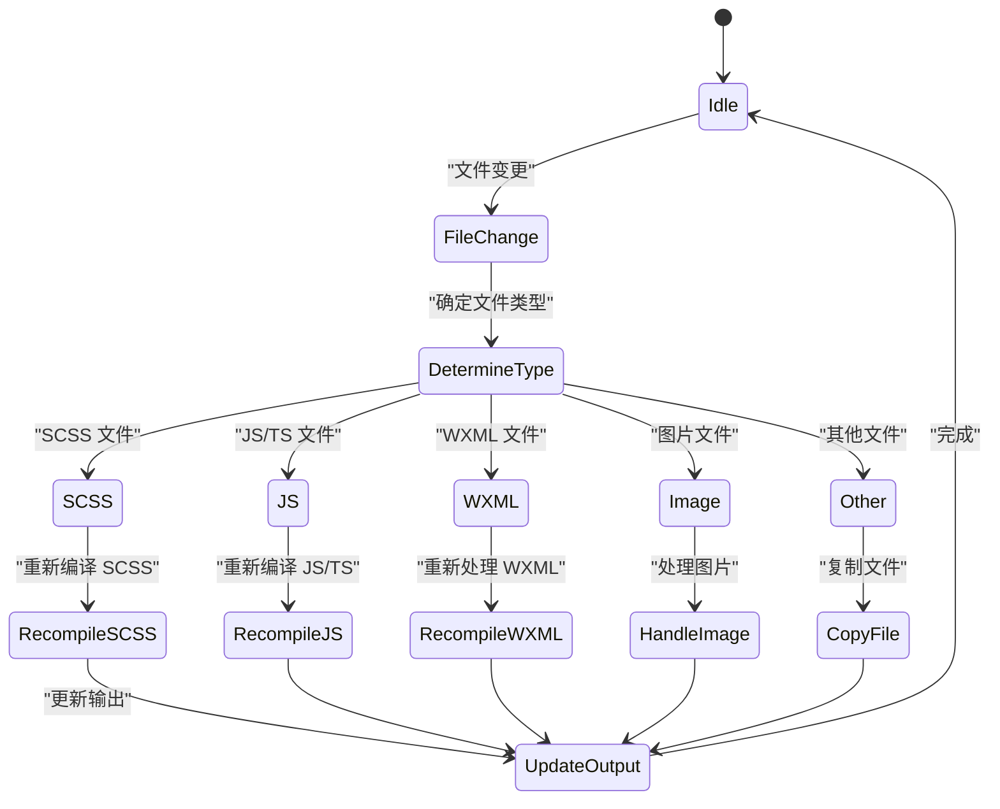
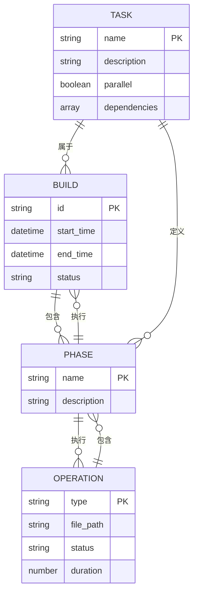

# Gulp 配置

<cite>
**本文档引用的文件**
- [gulpfile.ts](file://demo/gulp-app/gulpfile.ts)
- [postcss.config.js](file://demo/gulp-app/postcss.config.js)
- [tailwind.config.js](file://demo/gulp-app/tailwind.config.js)
- [package.json](file://demo/gulp-app/package.json)
- [tsconfig.json](file://demo/gulp-app/tsconfig.json)
- [src/app.scss](file://demo/gulp-app/src/app.scss)
- [src/pages/index/index.wxml](file://demo/gulp-app/src/pages/index/index.wxml)
- [packages/weapp-tailwindcss/src/gulp/index.ts](file://packages/weapp-tailwindcss/src/bundlers/gulp/index.ts)
</cite>

## 目录
1. [简介](#简介)
2. [项目结构](#项目结构)
3. [核心组件](#核心组件)
4. [架构概述](#架构概述)
5. [详细组件分析](#详细组件分析)
6. [依赖分析](#依赖分析)
7. [性能考虑](#性能考虑)
8. [故障排除指南](#故障排除指南)
9. [结论](#结论)

## 简介
本文档详细介绍了如何在 Gulp 构建流程中集成 weapp-tailwindcss，实现微信小程序的现代化前端开发工作流。文档涵盖了 Gulp 任务定义、文件流处理、PostCSS 插件链配置等关键环节，并提供了完整的构建脚本示例。同时，文档还探讨了 Gulp 环境下的性能优化策略以及与其他构建工具的差异。

## 项目结构
Gulp 构建系统位于 `demo/gulp-app` 目录下，包含完整的构建配置和源代码。该结构展示了如何组织小程序项目以支持 Tailwind CSS 集成。

**Diagram sources**
- [gulpfile.ts](file://demo/gulp-app/gulpfile.ts#L79-L104)
- [package.json](file://demo/gulp-app/package.json#L2-26)

**Section sources**
- [gulpfile.ts](file://demo/gulp-app/gulpfile.ts#L79-L104)
- [package.json](file://demo/gulp-app/package.json#L2-26)

## 核心组件
Gulp 构建系统的核心组件包括任务定义、文件路径配置、编译流程和插件集成。系统通过 gulp-postcss 与 Tailwind CSS 集成，实现了从 SCSS 到 WXSS 的自动化转换。

**Section sources**
- [gulpfile.ts](file://demo/gulp-app/gulpfile.ts#L1-261)
- [postcss.config.js](file://demo/gulp-app/postcss.config.js#L1-22)

## 架构概述
Gulp 构建架构采用流式处理模式，通过一系列管道操作将源代码转换为小程序可执行文件。架构核心是任务依赖关系和文件流处理。

**Diagram sources**
- [gulpfile.ts](file://demo/gulp-app/gulpfile.ts#L241-L257)
- [postcss.config.js](file://demo/gulp-app/postcss.config.js#L1-22)

## 详细组件分析

### Gulp 任务定义分析
Gulpfile.ts 定义了完整的构建任务链，包括编译、复制和清理任务。

#### 任务函数分析

**Diagram sources**
- [gulpfile.ts](file://demo/gulp-app/gulpfile.ts#L118-L240)
- [postcss.config.js](file://demo/gulp-app/postcss.config.js#L1-22)
- [tailwind.config.js](file://demo/gulp-app/tailwind.config.js#L1-31)

### 文件流处理分析
Gulp 的流式处理机制实现了高效的文件转换和管道操作。

#### 文件处理流程

**Diagram sources**
- [gulpfile.ts](file://demo/gulp-app/gulpfile.ts#L118-L150)
- [packages/weapp-tailwindcss/src/bundlers/gulp/index.ts](file://packages/weapp-tailwindcss/src/bundlers/gulp/index.ts)

### PostCSS 插件链配置
PostCSS 配置文件定义了插件执行顺序和参数设置。

#### 插件链执行顺序

**Diagram sources**
- [postcss.config.js](file://demo/gulp-app/postcss.config.js#L1-22)
- [tailwind.config.js](file://demo/gulp-app/tailwind.config.js#L1-31)

**Section sources**
- [postcss.config.js](file://demo/gulp-app/postcss.config.js#L1-22)
- [tailwind.config.js](file://demo/gulp-app/tailwind.config.js#L1-31)

## 依赖分析
Gulp 构建系统的依赖关系包括开发依赖和运行时依赖，确保了构建流程的完整性和功能性。

**Diagram sources**
- [package.json](file://demo/gulp-app/package.json#L40-88)
- [gulpfile.ts](file://demo/gulp-app/gulpfile.ts#L1-20)

**Section sources**
- [package.json](file://demo/gulp-app/package.json#L40-88)
- [gulpfile.ts](file://demo/gulp-app/gulpfile.ts#L1-20)

## 性能考虑
Gulp 构建系统通过多种策略优化构建性能，包括增量构建、并发处理和缓存机制。

### 增量构建机制

**Diagram sources**
- [gulpfile.ts](file://demo/gulp-app/gulpfile.ts#L162-L221)
- [gulpfile.ts](file://demo/gulp-app/gulpfile.ts#L224-L239)

### 并发处理策略
Gulp 通过并行任务执行提高构建效率，特别是在清理和复制操作中。

**Diagram sources**
- [gulpfile.ts](file://demo/gulp-app/gulpfile.ts#L241-L257)
- [package.json](file://demo/gulp-app/package.json#L29-38)

## 故障排除指南
本节分析构建过程中可能遇到的常见问题及其解决方案。

**Section sources**
- [gulpfile.ts](file://demo/gulp-app/gulpfile.ts#L122-L125)
- [gulpfile.ts](file://demo/gulp-app/gulpfile.ts#L144)
- [gulpfile.ts](file://demo/gulp-app/gulpfile.ts#L149)

## 结论
Gulp 构建系统为微信小程序开发提供了灵活且强大的构建流程。通过与 weapp-tailwindcss 的集成，实现了现代化的 CSS 开发体验。系统支持增量构建、类型检查和多平台适配，为小程序开发提供了完整的解决方案。与其他构建工具相比，Gulp 的流式处理模式提供了更好的控制力和可调试性，特别适合需要精细控制构建流程的项目。