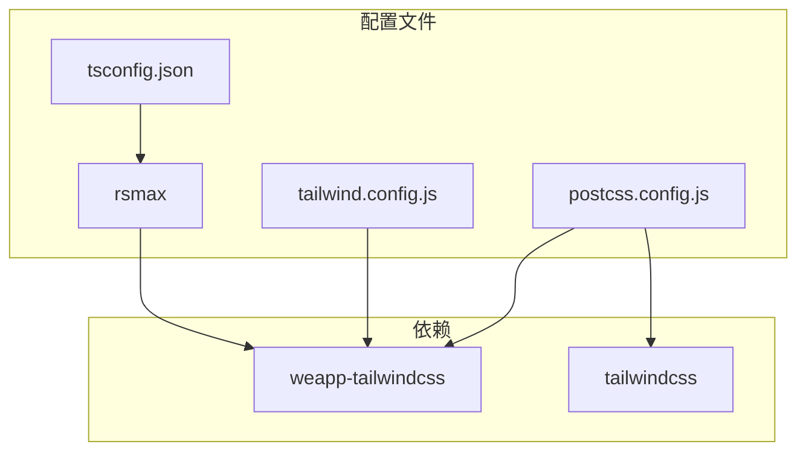
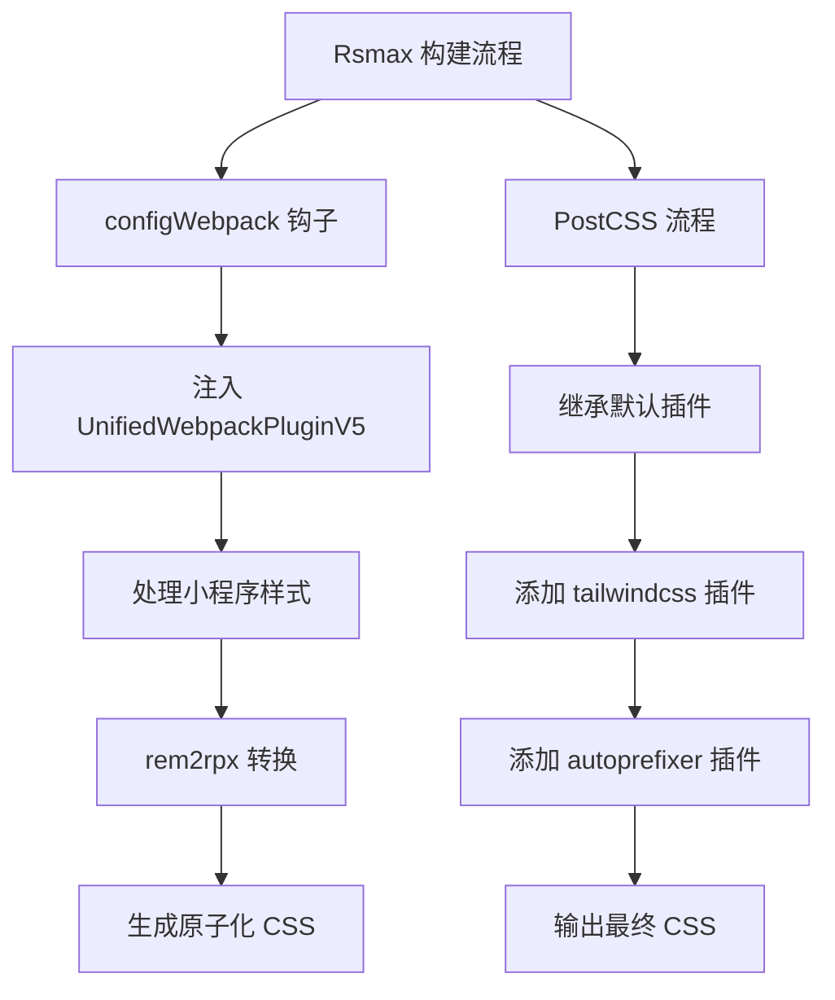
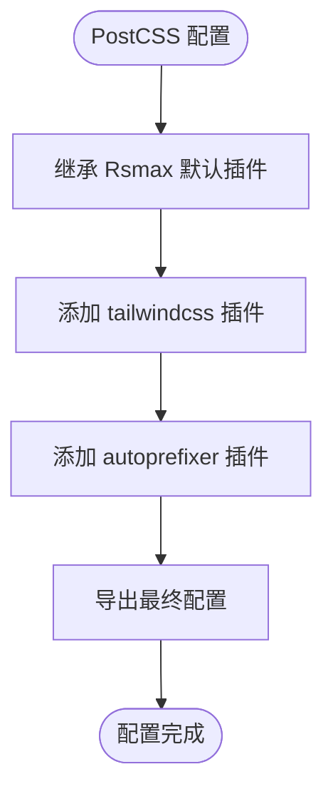
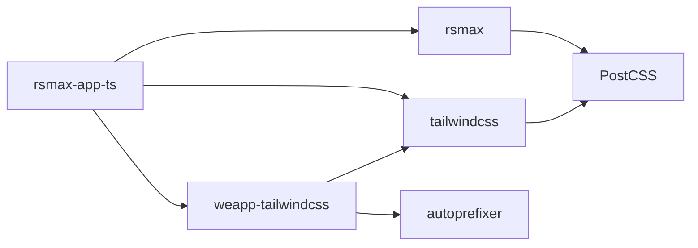

# Rspack 配置

<cite>
**本文档中引用的文件**  
- [rsmax.config.js](file://apps/rsmax-app-ts/rsmax.config.js)
- [tailwind.config.js](file://apps/rsmax-app-ts/tailwind.config.js)
- [postcss.config.js](file://apps/rsmax-app-ts/postcss.config.js)
- [package.json](file://apps/rsmax-app-ts/package.json)
- [weapp-tailwindcss/package.json](file://packages/weapp-tailwindcss/package.json)
- [weapp-tailwindcss/src/index.ts](file://packages/weapp-tailwindcss/src/index.ts)
- [project.config.json](file://apps/rsmax-app-ts/project.config.json)
- [tsconfig.json](file://apps/rsmax-app-ts/tsconfig.json)
</cite>

## 目录
1. [简介](#简介)
2. [项目结构](#项目结构)
3. [核心组件](#核心组件)
4. [架构概述](#架构概述)
5. [详细组件分析](#详细组件分析)
6. [依赖分析](#依赖分析)
7. [性能考虑](#性能考虑)
8. [故障排除指南](#故障排除指南)
9. [结论](#结论)

## 简介
本文档详细描述了在 Rspack 构建环境中集成 `weapp-tailwindcss` 的配置方法。重点介绍如何在 `rsmax.config.js` 或 `rspack.config.ts` 中正确注册插件、配置模块解析和 CSS 处理管道，以实现高效的小程序构建流程。文档还涵盖了 Rspack 特有的性能优势及其与 `weapp-tailwindcss` 的协同优化机制。

## 项目结构
`rsmax-app-ts` 示例项目展示了 Rspack 与 `weapp-tailwindcss` 的集成方式。项目采用 TypeScript 构建，通过 Rsmax 工具链支持微信小程序开发。关键配置文件包括 `rsmax.config.js`（构建配置）、`tailwind.config.js`（TailwindCSS 配置）和 `postcss.config.js`（PostCSS 配置）。



**Diagram sources**
- [rsmax.config.js](file://apps/rsmax-app-ts/rsmax.config.js)
- [tailwind.config.js](file://apps/rsmax-app-ts/tailwind.config.js)
- [postcss.config.js](file://apps/rsmax-app-ts/postcss.config.js)
- [tsconfig.json](file://apps/rsmax-app-ts/tsconfig.json)

**Section sources**
- [rsmax.config.js](file://apps/rsmax-app-ts/rsmax.config.js)
- [package.json](file://apps/rsmax-app-ts/package.json)

## 核心组件
`weapp-tailwindcss` 提供了针对小程序环境的 TailwindCSS 集成解决方案，其核心是 `UnifiedWebpackPluginV5` 插件。该插件通过 `weapp-tailwindcss/webpack` 模块导出，能够在 Rspack 环境中正确处理小程序的样式和类名转换。

**Section sources**
- [weapp-tailwindcss/src/index.ts](file://packages/weapp-tailwindcss/src/index.ts)
- [weapp-tailwindcss/package.json](file://packages/weapp-tailwindcss/package.json)

## 架构概述
Rspack 与 `weapp-tailwindcss` 的集成架构基于模块化配置和插件系统。Rsmax 作为构建工具，通过 `configWebpack` 钩子注入 `UnifiedWebpackPluginV5` 插件，实现对构建流程的定制化控制。PostCSS 配置继承 Rsmax 默认设置并添加 TailwindCSS 相关插件，确保样式处理的完整性和正确性。



**Diagram sources**
- [rsmax.config.js](file://apps/rsmax-app-ts/rsmax.config.js)
- [postcss.config.js](file://apps/rsmax-app-ts/postcss.config.js)

## 详细组件分析

### Rspack 配置分析
`rsmax.config.js` 文件通过 `configWebpack` 方法配置 Webpack 兼容的构建选项。核心是将 `UnifiedWebpackPluginV5` 插件注册到构建流程中，并配置 `rem2rpx: true` 选项以支持小程序的尺寸单位转换。

```mermaid
classDiagram
class RsmaxConfig {
+configWebpack({config, webpack, addCSSRule})
}
class UnifiedWebpackPluginV5 {
+apply(compiler)
+rem2rpx : boolean
}
RsmaxConfig --> UnifiedWebpackPluginV5 : "使用"
```

**Diagram sources**
- [rsmax.config.js](file://apps/rsmax-app-ts/rsmax.config.js)
- [weapp-tailwindcss/src/index.ts](file://packages/weapp-tailwindcss/src/index.ts)

### TailwindCSS 配置分析
`tailwind.config.js` 配置文件定义了 TailwindCSS 的内容扫描范围，确保所有源文件中的类名都能被正确识别和处理。配置中指定了源文件路径模式，覆盖了项目中的主要代码文件。

**Section sources**
- [tailwind.config.js](file://apps/rsmax-app-ts/tailwind.config.js)

### PostCSS 配置分析
`postcss.config.js` 配置文件通过函数形式导出配置对象，能够访问 Rsmax 的默认插件配置。配置中使用扩展运算符继承默认插件，并添加 `tailwindcss` 和 `autoprefixer` 插件，确保样式处理的完整流程。



**Diagram sources**
- [postcss.config.js](file://apps/rsmax-app-ts/postcss.config.js)

## 依赖分析
项目依赖关系清晰地展示了 Rspack 生态与 `weapp-tailwindcss` 的集成方式。`rsmax-app-ts` 项目直接依赖 `weapp-tailwindcss` 和 `rsmax`，而 `weapp-tailwindcss` 包本身又依赖 `tailwindcss` 和相关工具库。



**Diagram sources**
- [package.json](file://apps/rsmax-app-ts/package.json)
- [weapp-tailwindcss/package.json](file://packages/weapp-tailwindcss/package.json)

## 性能考虑
Rspack 提供了比传统 Webpack 更快的构建速度，结合 `weapp-tailwindcss` 的优化处理，能够显著提升小程序的开发体验。`UnifiedWebpackPluginV5` 插件经过专门优化，能够在构建过程中高效处理类名转换和样式生成，减少不必要的计算开销。

## 故障排除指南
当在 Rspack 环境中使用 `weapp-tailwindcss` 遇到问题时，可参考以下排查步骤：
1. 确认 `weapp-tailwindcss` 已正确安装并添加到 `devDependencies`
2. 检查 `rsmax.config.js` 中的插件注册是否正确
3. 验证 `tailwind.config.js` 的 `content` 配置是否覆盖了所有源文件
4. 确保 `postcss.config.js` 正确继承了 Rsmax 的默认插件配置
5. 检查构建输出中是否有样式处理相关的错误信息

**Section sources**
- [rsmax.config.js](file://apps/rsmax-app-ts/rsmax.config.js)
- [tailwind.config.js](file://apps/rsmax-app-ts/tailwind.config.js)
- [postcss.config.js](file://apps/rsmax-app-ts/postcss.config.js)

## 结论
通过正确配置 `rsmax.config.js`、`tailwind.config.js` 和 `postcss.config.js`，可以成功在 Rspack 环境中集成 `weapp-tailwindcss`，实现高效的小程序开发工作流。这种集成方式充分利用了 Rspack 的性能优势和 `weapp-tailwindcss` 的功能特性，为小程序开发者提供了现代化的开发体验。