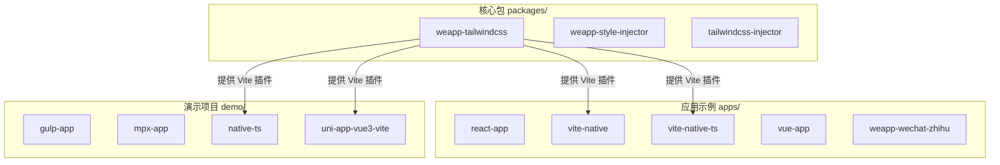
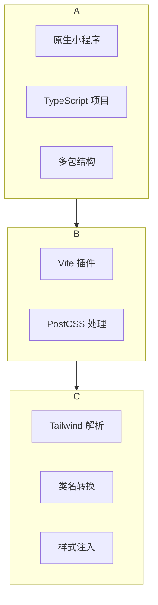
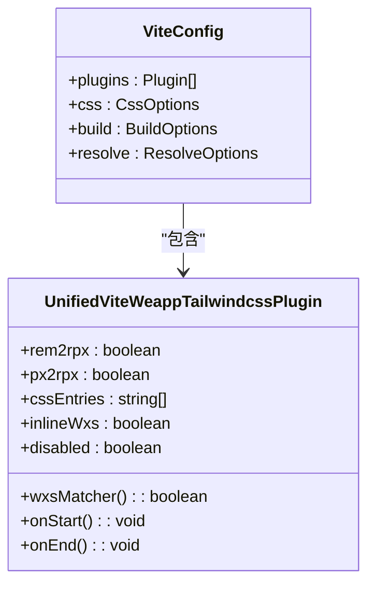
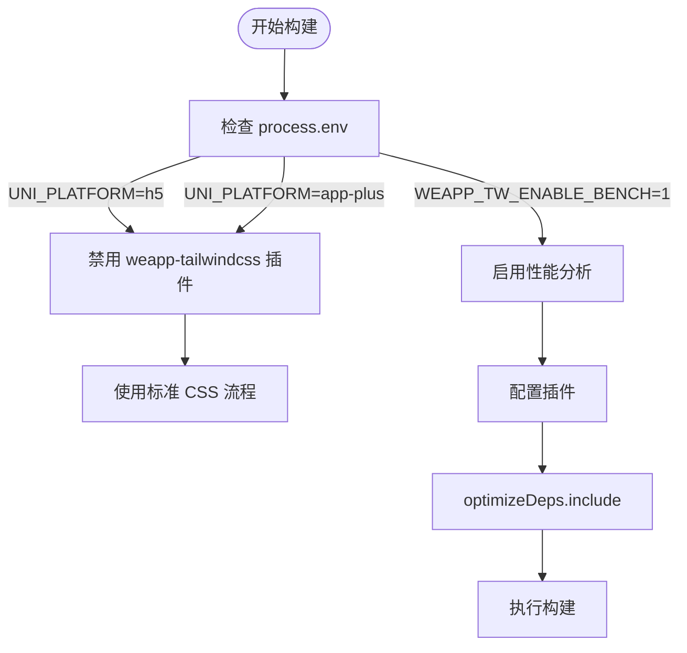
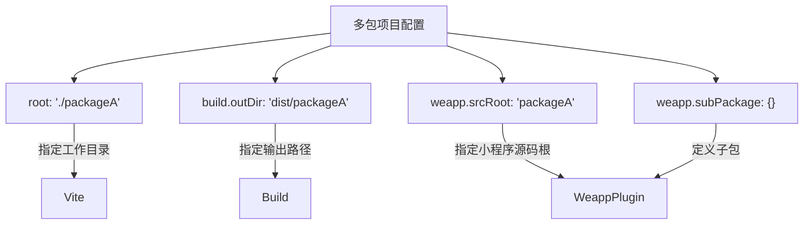
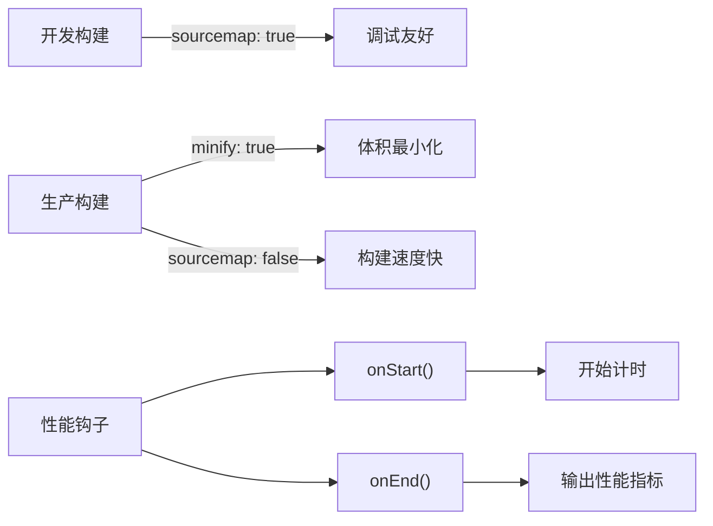

# Vite 配置

<cite>
**本文档中引用的文件**  
- [vite.config.ts](file://apps/vite-native/vite.config.ts)
- [vite.config.ts](file://apps/vite-native-ts/vite.config.ts)
- [vite.config.ts](file://demo/uni-app-vue3-vite/vite.config.ts)
- [vite.config.ts](file://demo/native-ts/vite.config.ts)
- [vite.ts](file://packages/weapp-tailwindcss/src/vite.ts)
- [index.ts](file://packages/weapp-tailwindcss/src/index.ts)
- [package.json](file://packages/weapp-tailwindcss/package.json)
- [README.md](file://README.md)
</cite>

## 目录
1. [简介](#简介)
2. [项目结构](#项目结构)
3. [核心组件](#核心组件)
4. [架构概述](#架构概述)
5. [详细组件分析](#详细组件分析)
6. [依赖分析](#依赖分析)
7. [性能考虑](#性能考虑)
8. [故障排除指南](#故障排除指南)
9. [结论](#结论)

## 简介
本指南旨在为 `weapp-tailwindcss` 项目提供 Vite 构建工具的完整集成方案。涵盖 `vite.config.ts` 的配置模式、Vite 插件注册、预构建设置、环境变量处理以及与 `weapp-tailwindcss` 的兼容性配置。通过多个实际案例（包括原生小程序、TypeScript 项目和多包结构）展示 Vite 配置的最佳实践，并解释开发服务器与生产构建中的协同工作机制及优化选项。同时提供热更新失败、CSS 生成异常等常见问题的解决方案。

## 项目结构
该项目是一个围绕 `weapp-tailwindcss` 的多环境适配解决方案，支持多种小程序框架和构建工具。其结构以 `apps/`、`demo/` 和 `packages/` 为核心，分别存放应用示例、演示项目和核心包模块。



**Diagram sources**
- [vite.config.ts](file://apps/vite-native/vite.config.ts)
- [vite.config.ts](file://demo/uni-app-vue3-vite/vite.config.ts)
- [package.json](file://packages/weapp-tailwindcss/package.json)

**Section sources**
- [README.md](file://README.md#L1-L101)

## 核心组件
`weapp-tailwindcss` 的核心在于其对不同构建工具（如 Vite、Webpack、Gulp）的支持，通过统一的插件接口实现 Tailwind CSS 在小程序环境中的无缝集成。Vite 构建的核心组件是 `UnifiedViteWeappTailwindcssPlugin`，它负责将 Tailwind 的原子类转换为小程序可用的样式系统。

**Section sources**
- [index.ts](file://packages/weapp-tailwindcss/src/index.ts#L1-L5)
- [vite.ts](file://packages/weapp-tailwindcss/src/vite.ts#L1-L3)

## 架构概述
整个系统的架构分为三层：应用层、构建层和核心库层。应用层包含各种使用 Vite 构建的小程序项目；构建层通过 Vite 插件桥接应用与核心库；核心库层则实现了 Tailwind 到小程序样式的转换逻辑。



**Diagram sources**
- [vite.config.ts](file://apps/vite-native-ts/vite.config.ts#L1-L42)
- [vite.ts](file://packages/weapp-tailwindcss/src/vite.ts#L1-L3)

## 详细组件分析

### Vite 插件注册分析
Vite 插件通过 `plugins` 数组注册，核心插件为 `UnifiedViteWeappTailwindcssPlugin`，来自 `weapp-tailwindcss/vite` 模块。该插件可接受配置选项以控制 rem 转 rpx、CSS 入口文件等行为。



**Diagram sources**
- [vite.config.ts](file://apps/vite-native/vite.config.ts#L1-L41)
- [vite.ts](file://packages/weapp-tailwindcss/src/vite.ts#L1-L3)

### 预构建与环境变量处理
Vite 的 `optimizeDeps` 配置用于预构建依赖，`resolve.alias` 用于路径别名映射。环境变量通过 `process.env` 访问，如 `WEAPP_TW_ENABLE_BENCH` 用于启用性能分析。



**Diagram sources**
- [vite.config.ts](file://demo/uni-app-vue3-vite/vite.config.ts#L1-L118)

### 多包结构配置
对于多包项目，可通过 `defineConfig` 中的 `root` 和 `build.outDir` 进行配置，结合 `weapp` 选项指定源码根目录和子包结构。



**Diagram sources**
- [vite.config.ts](file://apps/vite-native/vite.config.ts#L6-L17)

## 依赖分析
项目依赖主要分为三类：构建工具依赖（Vite、weapp-vite）、样式处理依赖（tailwindcss、postcss）和核心功能依赖（weapp-tailwindcss）。

```mermaid
dependencyDiagram
Vite --> weapp-vite
weapp-vite --> weapp-tailwindcss
weapp-tailwindcss --> tailwindcss
weapp-tailwindcss --> postcss
Vite --> postcss
postcss --> tailwindcss
postcss --> autoprefixer
```

**Diagram sources**
- [package.json](file://packages/weapp-tailwindcss/package.json#L189-L212)

**Section sources**
- [package.json](file://packages/weapp-tailwindcss/package.json#L1-L215)

## 性能考虑
在生产构建时，可通过 `build.minify` 控制是否压缩代码，`build.sourcemap` 生成源码映射以辅助调试。同时，通过 `onStart` 和 `onEnd` 钩子可集成性能分析工具。



**Diagram sources**
- [vite.config.ts](file://demo/uni-app-vue3-vite/vite.config.ts#L111-L115)

## 故障排除指南
常见问题包括热更新失效和 CSS 生成异常。热更新问题通常与文件监听配置有关，CSS 问题则可能源于 PostCSS 插件顺序或 Tailwind 配置错误。

**Section sources**
- [README.md](file://README.md#L69-L70)
- [vite.config.ts](file://demo/uni-app-vue3-vite/vite.config.ts#L100-L104)

## 结论
`weapp-tailwindcss` 提供了一套完整的 Vite 集成方案，支持从原生小程序到复杂框架的各种项目类型。通过合理的 `vite.config.ts` 配置，可以实现高效的开发体验和优化的生产构建。建议遵循文档中的配置模式，并利用提供的插件和工具链来最大化开发效率。