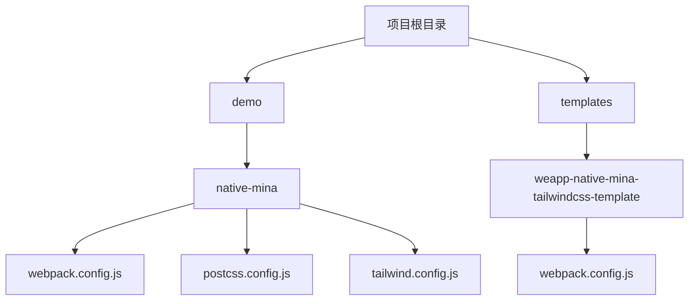
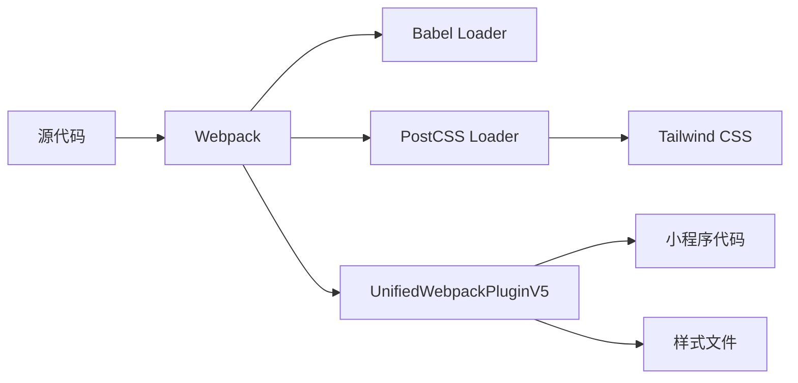
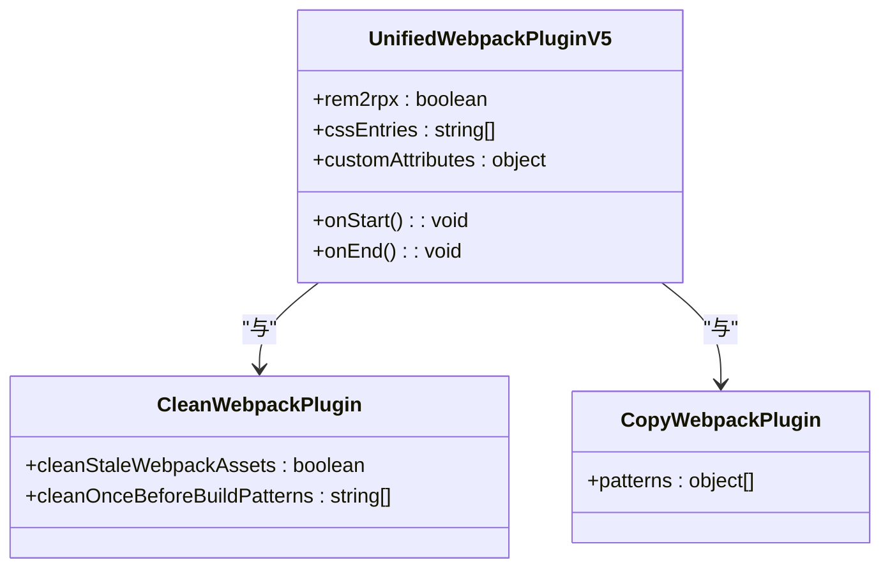
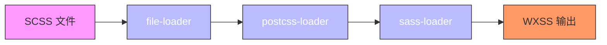
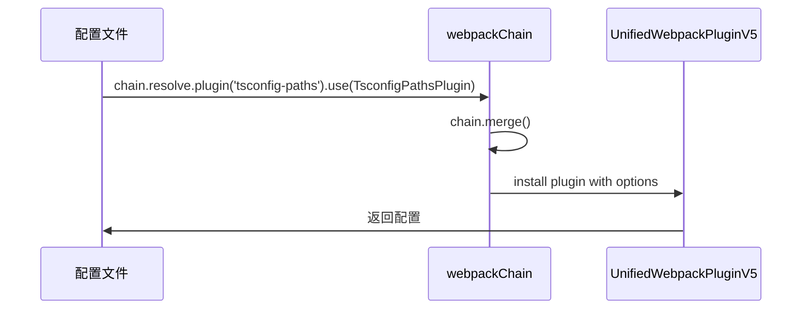
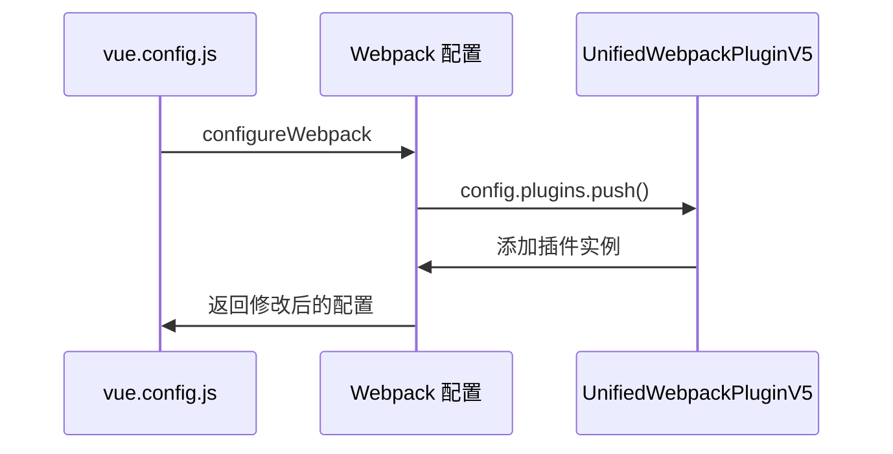
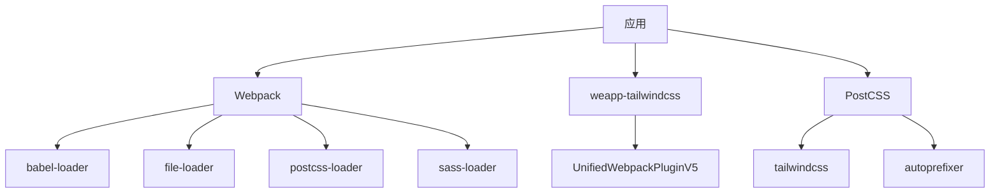
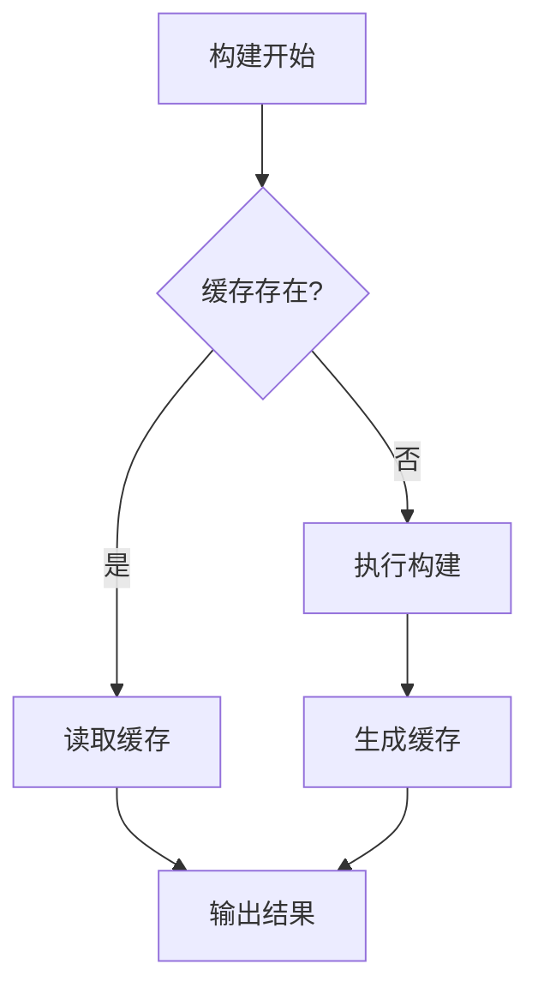
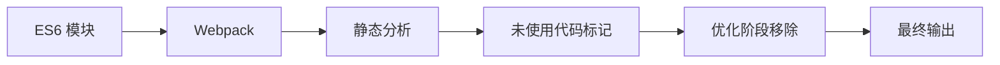

# Webpack 配置

<cite>
**本文档中引用的文件**  
- [webpack.config.js](file://demo/native-mina/webpack.config.js)
- [webpack.config.js](file://templates/weapp-native-mina-tailwindcss-template/webpack.config.js)
- [postcss.config.js](file://demo/native-mina/postcss.config.js)
- [tailwind.config.js](file://demo/native-mina/tailwind.config.js)
- [config/index.ts](file://demo/taro-webpack-tailwindcss-v4/config/index.ts)
- [vue.config.js](file://demo/uni-app-webpack-tailwindcss-v4/vue.config.js)
- [postcss.config.mjs](file://demo/taro-webpack-tailwindcss-v4/postcss.config.mjs)
- [postcss.config.js](file://demo/uni-app-webpack-tailwindcss-v4/postcss.config.js)
</cite>

## 目录
1. [简介](#简介)
2. [项目结构](#项目结构)
3. [核心组件](#核心组件)
4. [架构概述](#架构概述)
5. [详细组件分析](#详细组件分析)
6. [依赖分析](#依赖分析)
7. [性能考虑](#性能考虑)
8. [故障排除指南](#故障排除指南)
9. [结论](#结论)

## 简介
本文档详细说明了 `weapp-tailwindcss` 与 Webpack 构建工具的集成方式。重点介绍 Webpack 配置中的关键插件、loader 顺序、自定义解析规则等配置项，并提供完整的配置示例。同时涵盖 Webpack 环境下的性能优化技巧和常见问题排查方法。

## 项目结构
本项目包含多个使用不同构建工具的示例应用，其中 Webpack 相关配置主要位于 `demo` 和 `templates` 目录下。重点关注 `native-mina` 和 `weapp-native-mina-tailwindcss-template` 中的 Webpack 配置。



**图示来源**
- [webpack.config.js](file://demo/native-mina/webpack.config.js)
- [webpack.config.js](file://templates/weapp-native-mina-tailwindcss-template/webpack.config.js)

**本节来源**
- [demo/native-mina](file://demo/native-mina)
- [templates/weapp-native-mina-tailwindcss-template](file://templates/weapp-native-mina-tailwindcss-template)

## 核心组件
核心组件包括 Webpack 配置文件、PostCSS 配置、Tailwind CSS 配置以及 `weapp-tailwindcss` 提供的 Webpack 插件。这些组件协同工作，实现小程序环境下的 Tailwind CSS 集成。

**本节来源**
- [webpack.config.js](file://demo/native-mina/webpack.config.js)
- [postcss.config.js](file://demo/native-mina/postcss.config.js)
- [tailwind.config.js](file://demo/native-mina/tailwind.config.js)

## 架构概述
系统架构基于 Webpack 构建流程，通过自定义插件和 loader 实现 Tailwind CSS 在小程序环境中的完整支持。核心是 `UnifiedWebpackPluginV5` 插件，它负责处理样式转换和优化。



**图示来源**
- [webpack.config.js](file://demo/native-mina/webpack.config.js#L24-L55)
- [postcss.config.js](file://demo/native-mina/postcss.config.js)

## 详细组件分析

### Webpack 配置分析
Webpack 配置文件定义了完整的构建流程，包括入口、输出、模块规则、插件和优化选项。

#### 插件配置
配置中使用了多个关键插件：
- `UnifiedWebpackPluginV5`：核心插件，处理 Tailwind CSS 集成
- `CleanWebpackPlugin`：清理输出目录
- `CopyWebpackPlugin`：复制静态资源
- `MinaWebpackPlugin` 和 `MinaRuntimePlugin`：小程序特定插件
- `LodashWebpackPlugin`：Lodash 模块优化



**图示来源**
- [webpack.config.js](file://demo/native-mina/webpack.config.js#L56-L97)
- [webpack.config.js](file://templates/weapp-native-mina-tailwindcss-template/webpack.config.js#L67-L100)

#### Loader 顺序
样式处理的 loader 顺序至关重要，必须按照正确的顺序执行：



**图示来源**
- [webpack.config.js](file://demo/native-mina/webpack.config.js#L31-L53)
- [webpack.config.js](file://templates/weapp-native-mina-tailwindcss-template/webpack.config.js#L42-L64)

#### 自定义解析规则
配置中包含了重要的解析规则，确保模块正确加载：

```mermaid
graph TD
A[模块解析] --> B[扩展名]
A --> C[别名]
B --> D[".ts", ".js"]
C --> E["tdesign-miniprogram": "dist/miniprogram_npm/tdesign-miniprogram/"]
```

**图示来源**
- [webpack.config.js](file://templates/weapp-native-mina-tailwindcss-template/webpack.config.js#L21-L27)

**本节来源**
- [webpack.config.js](file://demo/native-mina/webpack.config.js)
- [webpack.config.js](file://templates/weapp-native-mina-tailwindcss-template/webpack.config.js)

### Taro 框架集成
对于使用 Taro 框架的项目，通过 `webpackChain` 方法集成插件：



**图示来源**
- [config/index.ts](file://demo/taro-webpack-tailwindcss-v4/config/index.ts#L68-L87)

**本节来源**
- [config/index.ts](file://demo/taro-webpack-tailwindcss-v4/config/index.ts)

### UniApp 框架集成
UniApp 项目通过 `configureWebpack` 方法集成插件：



**图示来源**
- [vue.config.js](file://demo/uni-app-webpack-tailwindcss-v4/vue.config.js#L11-L19)

**本节来源**
- [vue.config.js](file://demo/uni-app-webpack-tailwindcss-v4/vue.config.js)

## 依赖分析
项目依赖关系清晰，核心依赖包括 Webpack、weapp-tailwindcss、PostCSS 相关插件等。



**图示来源**
- [webpack.config.js](file://demo/native-mina/webpack.config.js#L1-L8)
- [postcss.config.js](file://demo/native-mina/postcss.config.js)

**本节来源**
- [webpack.config.js](file://demo/native-mina/webpack.config.js)
- [postcss.config.js](file://demo/native-mina/postcss.config.js)

## 性能考虑
配置中包含了多项性能优化策略：

### 缓存策略
使用文件系统缓存提高构建速度：



**图示来源**
- [webpack.config.js](file://templates/weapp-native-mina-tailwindcss-template#L28-L34)

### Tree-shaking 兼容性
通过配置确保 Tree-shaking 正常工作：



**本节来源**
- [webpack.config.js](file://templates/weapp-native-mina-tailwindcss-template)

## 故障排除指南
常见问题及解决方案：

### 样式未生效
可能原因及解决方案：
- **PostCSS 配置错误**：检查 `postcss.config.js` 中是否正确引入 `tailwindcss`
- **内容路径配置**：确保 `tailwind.config.js` 中的 `content` 字段包含正确的文件路径
- **loader 顺序**：确认 loader 执行顺序正确

### HMR 失效
可能原因及解决方案：
- **缓存问题**：尝试清除 Webpack 缓存
- **插件冲突**：检查是否有其他插件干扰 HMR
- **配置问题**：确保开发模式下 `devtool` 配置正确

**本节来源**
- [postcss.config.js](file://demo/native-mina/postcss.config.js)
- [tailwind.config.js](file://demo/native-mina/tailwind.config.js)
- [webpack.config.js](file://demo/native-mina/webpack.config.js)

## 结论
本文档详细介绍了 `weapp-tailwindcss` 与 Webpack 的集成方法，涵盖了配置要点、框架集成、性能优化和故障排除。通过正确配置 `UnifiedWebpackPluginV5` 插件和相关 loader，可以实现在小程序环境中的高效 Tailwind CSS 开发体验。