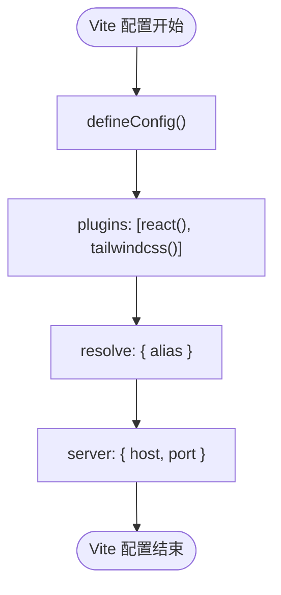
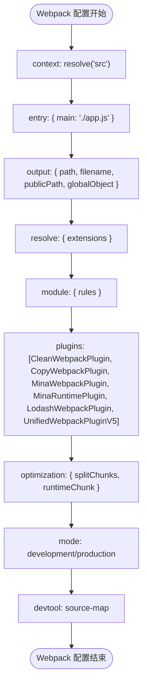
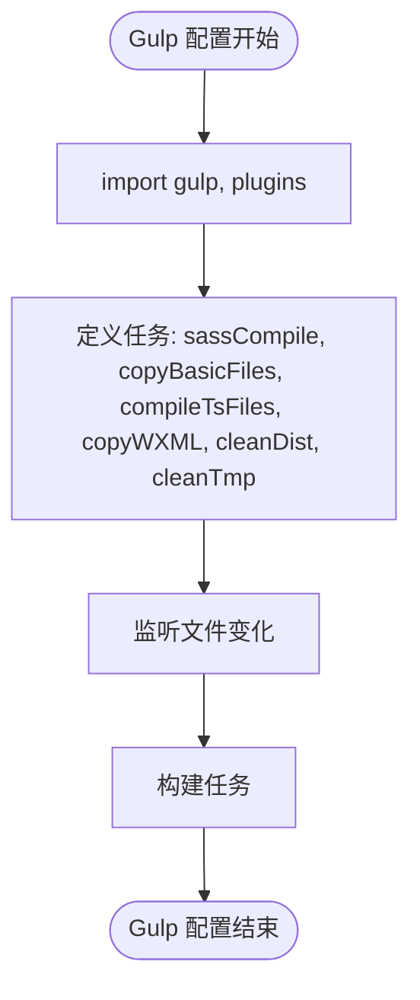
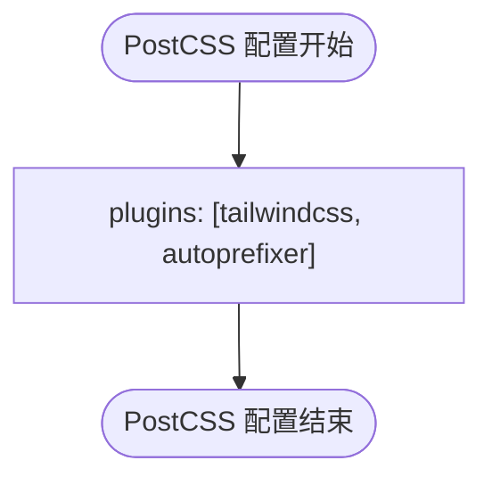

# 构建工具配置

<cite>
**本文档中引用的文件**  
- [webpack.config.js](file://demo/native-mina/webpack.config.js)
- [gulpfile.ts](file://demo/gulp-app/gulpfile.ts)
- [vite.config.ts](file://apps/react-app/vite.config.ts)
- [vite.config.ts](file://apps/uni-app-x-hbuilderx-tailwindcss3/vite.config.ts)
- [vite.config.ts](file://apps/uni-app-x-hbuilderx-tailwindcss4/vite.config.ts)
- [rsmax.config.js](file://apps/rsmax-app-ts/rsmax.config.js)
- [postcss.config.js](file://apps/vite-native/postcss.config.js)
- [postcss.config.mjs](file://apps/taro-webpack-tailwindcss-v4/postcss.config.mjs)
- [UnifiedViteWeappTailwindcssPlugin.ts](file://packages/weapp-tailwindcss/src/bundlers/vite/index.ts)
- [UnifiedWebpackPluginV5.ts](file://packages/weapp-tailwindcss/src/bundlers/webpack/BaseUnifiedPlugin/v5.ts)
- [UnifiedWebpackPluginV4.ts](file://packages/weapp-tailwindcss/src/bundlers/webpack/BaseUnifiedPlugin/v4.ts)
- [createPlugins.ts](file://packages/weapp-tailwindcss/src/bundlers/gulp/index.ts)
</cite>

## 目录
1. [简介](#简介)
2. [支持的构建工具](#支持的构建工具)
3. [构建工具检测机制](#构建工具检测机制)
4. [Vite 配置](#vite-配置)
5. [Webpack 配置](#webpack-配置)
6. [Gulp 配置](#gulp-配置)
7. [Rspack 配置](#rspack-配置)
8. [PostCSS 配置](#postcss-配置)
9. [构建工具特定配置陷阱](#构建工具特定配置陷阱)
10. [性能优化建议](#性能优化建议)
11. [手动指定构建工具](#手动指定构建工具)
12. [结论](#结论)

## 简介

本文档详细介绍了 `weapp-tailwindcss` 项目中构建工具的配置方法，涵盖 Vite、Webpack、Gulp 等多种构建工具的集成方式。文档将解释不同构建工具下的配置差异、注意事项，并提供完整的配置示例。同时，文档还将介绍构建工具检测机制、手动指定构建工具的场景，以及构建工具特定的配置陷阱和性能优化建议。

**Section sources**
- [UnifiedViteWeappTailwindcssPlugin.ts](file://packages/weapp-tailwindcss/src/bundlers/vite/index.ts#L134-L478)
- [UnifiedWebpackPluginV5.ts](file://packages/weapp-tailwindcss/src/bundlers/webpack/BaseUnifiedPlugin/v5.ts#L32-L435)
- [createPlugins.ts](file://packages/weapp-tailwindcss/src/bundlers/gulp/index.ts#L23-L249)

## 支持的构建工具

`weapp-tailwindcss` 支持多种构建工具，包括 Vite、Webpack、Gulp 等。每种构建工具都有其特定的配置方式和集成方法。

### Vite

Vite 是一个现代化的前端构建工具，以其快速的冷启动和热模块替换（HMR）而闻名。在 `weapp-tailwindcss` 中，Vite 通过插件系统集成 Tailwind CSS。

### Webpack

Webpack 是一个功能强大的模块打包工具，广泛用于各种前端项目。`weapp-tailwindcss` 提供了对 Webpack 4 和 Webpack 5 的支持，通过插件机制实现 Tailwind CSS 的集成。

### Gulp

Gulp 是一个基于流的自动化构建工具，适用于需要高度定制化构建流程的项目。`weapp-tailwindcss` 提供了 Gulp 插件，允许在 Gulp 流程中集成 Tailwind CSS。

### Rspack

Rspack 是一个新兴的构建工具，旨在提供比 Webpack 更快的构建速度。虽然目前项目中没有直接的 Rspack 配置示例，但其配置方式与 Webpack 类似，可以通过类似的插件机制集成。

### PostCSS

PostCSS 是一个用 JavaScript 转换 CSS 的工具，`weapp-tailwindcss` 通过 PostCSS 插件实现 Tailwind CSS 的处理。

**Section sources**
- [UnifiedViteWeappTailwindcssPlugin.ts](file://packages/weapp-tailwindcss/src/bundlers/vite/index.ts#L134-L478)
- [UnifiedWebpackPluginV5.ts](file://packages/weapp-tailwindcss/src/bundlers/webpack/BaseUnifiedPlugin/v5.ts#L32-L435)
- [createPlugins.ts](file://packages/weapp-tailwindcss/src/bundlers/gulp/index.ts#L23-L249)

## 构建工具检测机制

`weapp-tailwindcss` 通过检测项目中的配置文件来自动识别使用的构建工具。例如，如果项目中存在 `vite.config.ts` 文件，则自动使用 Vite 构建工具；如果存在 `webpack.config.js` 文件，则使用 Webpack 构建工具。

### 自动检测逻辑

1. **Vite**: 检测 `vite.config.ts` 或 `vite.config.js` 文件。
2. **Webpack**: 检测 `webpack.config.js` 或 `webpack.config.ts` 文件。
3. **Gulp**: 检测 `gulpfile.ts` 或 `gulpfile.js` 文件。
4. **Rspack**: 检测 `rspack.config.js` 或 `rspack.config.ts` 文件。
5. **PostCSS**: 检测 `postcss.config.js` 或 `postcss.config.ts` 文件。

### 手动指定构建工具

在某些情况下，自动检测可能无法正确识别构建工具，或者需要强制使用特定的构建工具。此时，可以通过配置文件手动指定构建工具。

**Section sources**
- [UnifiedViteWeappTailwindcssPlugin.ts](file://packages/weapp-tailwindcss/src/bundlers/vite/index.ts#L134-L478)
- [UnifiedWebpackPluginV5.ts](file://packages/weapp-tailwindcss/src/bundlers/webpack/BaseUnifiedPlugin/v5.ts#L32-L435)
- [createPlugins.ts](file://packages/weapp-tailwindcss/src/bundlers/gulp/index.ts#L23-L249)

## Vite 配置

Vite 配置文件通常命名为 `vite.config.ts` 或 `vite.config.js`。以下是一个典型的 Vite 配置示例：



**Diagram sources**
- [vite.config.ts](file://apps/react-app/vite.config.ts#L1-L25)
- [vite.config.ts](file://apps/uni-app-x-hbuilderx-tailwindcss3/vite.config.ts#L1-L25)
- [vite.config.ts](file://apps/uni-app-x-hbuilderx-tailwindcss4/vite.config.ts#L1-L25)

### 配置示例

```typescript
import { defineConfig } from 'vite'
import react from '@vitejs/plugin-react'
import path from "path"
import tailwindcss from "@tailwindcss/vite"

export default defineConfig({
  plugins: [
    react({
      babel: {
        plugins: [['babel-plugin-react-compiler']],
      },
    }),
    tailwindcss()
  ],
  resolve: {
    alias: {
      "@": path.resolve(__dirname, "./src"),
    },
  },
  server: {
    host: true,
    port: 5173,
  },
})
```

### 配置说明

- **plugins**: 配置 Vite 插件，如 `@vitejs/plugin-react` 和 `@tailwindcss/vite`。
- **resolve.alias**: 配置路径别名，方便模块导入。
- **server**: 配置开发服务器，如主机和端口。

**Section sources**
- [vite.config.ts](file://apps/react-app/vite.config.ts#L1-L25)
- [UnifiedViteWeappTailwindcssPlugin.ts](file://packages/weapp-tailwindcss/src/bundlers/vite/index.ts#L134-L478)

## Webpack 配置

Webpack 配置文件通常命名为 `webpack.config.js` 或 `webpack.config.ts`。以下是一个典型的 Webpack 配置示例：



**Diagram sources**
- [webpack.config.js](file://demo/native-mina/webpack.config.js#L1-L113)

### 配置示例

```javascript
const { resolve } = require('path')
const webpack = require('webpack')
const CopyWebpackPlugin = require('copy-webpack-plugin')
const { CleanWebpackPlugin } = require('clean-webpack-plugin')
const MinaWebpackPlugin = require('./plugin/MinaWebpackPlugin')
const MinaRuntimePlugin = require('./plugin/MinaRuntimePlugin')
const LodashWebpackPlugin = require('lodash-webpack-plugin')
const { UnifiedWebpackPluginV5 } = require('weapp-tailwindcss/webpack')
const bench = require('../bench.cjs')('native-webpack')
const debuggable = process.env.BUILD_TYPE !== 'release'

module.exports = {
  context: resolve('src'),
  entry: { main: './app.js' },
  output: {
    path: resolve('dist'),
    filename: '[name].js',
    publicPath: resolve('dist'),
    globalObject: 'wx',
  },
  resolve: {
    extensions: ['.ts', '.js'],
  },
  module: {
    rules: [
      {
        test: /\.(ts|js)x?$/,
        exclude: /node_modules/,
        use: 'babel-loader',
      },
      {
        test: /\.(scss)$/,
        include: /src/,
        use: [
          {
            loader: 'file-loader',
            options: {
              useRelativePath: true,
              name: '[path][name].wxss',
              context: resolve('src'),
            },
          },
          {
            loader: 'postcss-loader',
          },
          {
            loader: 'sass-loader',
            options: {
              // sassOptions: { includePaths: [resolve('src', 'styles'), resolve('src')] },
            },
          },
        ],
      },
    ],
  },
  plugins: [
    new CleanWebpackPlugin({
      cleanStaleWebpackAssets: false,
      cleanOnceBeforeBuildPatterns: [
        '**/*',
        '!miniprogram_npm/**',
      ],
    }),
    new CopyWebpackPlugin({
      patterns: [
        {
          from: '**/*',
          to: './',
          filter: resourcePath => !['.ts', '.js', '.scss'].some(item => resourcePath.endsWith(item)),
        },
      ],
    }),
    new MinaWebpackPlugin({
      scriptExtensions: ['.ts', '.js'],
      assetExtensions: ['.scss'],
    }),
    new MinaRuntimePlugin(),
    new LodashWebpackPlugin(),
    new webpack.EnvironmentPlugin({
      NODE_ENV: 'development',
      BUILD_TYPE: 'debug',
    }),
    new UnifiedWebpackPluginV5({
      rem2rpx: true,
      onStart() {
        bench.start()
      },
      onEnd() {
        bench.end()
        bench.dump()
      },
    }),
  ],
  optimization: {
    splitChunks: {
      chunks: 'all',
      name: 'common',
      minChunks: 2,
      minSize: 0,
    },
    runtimeChunk: {
      name: 'runtime',
    },
  },
  mode: debuggable ? 'none' : 'production',
  devtool: debuggable ? 'inline-source-map' : 'source-map',
}
```

### 配置说明

- **context**: 设置上下文目录。
- **entry**: 配置入口文件。
- **output**: 配置输出文件。
- **resolve.extensions**: 配置模块解析扩展名。
- **module.rules**: 配置模块加载规则。
- **plugins**: 配置插件，如 `CleanWebpackPlugin`、`CopyWebpackPlugin`、`MinaWebpackPlugin`、`MinaRuntimePlugin`、`LodashWebpackPlugin` 和 `UnifiedWebpackPluginV5`。
- **optimization**: 配置优化选项，如代码分割和运行时块。
- **mode**: 配置构建模式。
- **devtool**: 配置源码映射。

**Section sources**
- [webpack.config.js](file://demo/native-mina/webpack.config.js#L1-L113)
- [UnifiedWebpackPluginV5.ts](file://packages/weapp-tailwindcss/src/bundlers/webpack/BaseUnifiedPlugin/v5.ts#L32-L435)

## Gulp 配置

Gulp 配置文件通常命名为 `gulpfile.ts` 或 `gulpfile.js`。以下是一个典型的 Gulp 配置示例：



**Diagram sources**
- [gulpfile.ts](file://demo/gulp-app/gulpfile.ts#L1-L261)

### 配置示例

```typescript
import path from 'node:path'
import process from 'node:process'
import { rm } from 'node:fs/promises'
import gulp from 'gulp'
import type { TaskFunction, TaskFunctionCallback } from 'gulp'
import debug from 'gulp-debug'
import gulpif from 'gulp-if'
import plumber from 'gulp-plumber'
import postcss from 'gulp-postcss'
import rename from 'gulp-rename'
import replace from 'gulp-replace'
import gulpSass from 'gulp-sass'
import ts from 'gulp-typescript'
import gutil from 'gulp-util'
import dartSass from 'sass'
import { createPlugins } from 'weapp-tailwindcss/gulp'

const isDebug = Boolean(process.env.DEBUG)
const isWatch = Boolean(process.env.WATCH)
const useBabel = Boolean(process.env.BABEL)

const platformMap = {
  weapp: {
    template: 'wxml',
    css: 'wxss',
  },
  tt: {
    template: 'ttml',
    css: 'ttss',
  },
}

const platform = (process.env.PLATFORM ?? 'weapp') as keyof typeof platformMap

const platformHit = platformMap[platform]
if (!platformHit) {
  throw new Error(`not support ${platform} platform`)
}

const sass = gulpSass(dartSass)
const tsProject = ts.createProject('tsconfig.json')

const { transformJs, transformWxml, transformWxss } = createPlugins({
  rem2rpx: true,
})

type StreamTask = NodeJS.ReadWriteStream & { destroyed?: boolean }

function promisify(task: StreamTask) {
  return new Promise<void>((resolve, reject) => {
    if (task.destroyed) {
      resolve()
      return
    }
    const cleanup = () => {
      task.removeListener('finish', onResolve)
      task.removeListener('end', onResolve)
      task.removeListener('error', onError)
    }
    const onResolve = () => {
      cleanup()
      resolve()
    }
    const onError = (error: unknown) => {
      cleanup()
      reject(error)
    }
    task.once('finish', onResolve)
    task.once('end', onResolve)
    task.once('error', onError)
  })
}

const paths = {
  src: {
    baseDir: 'src',
    imgDir: 'src/image',
    spriteDir: 'src/assets/sprites',
    scssDir: 'src/assets/scss',
    imgFiles: 'src/image/**/*',
    scssFiles: 'src/**/*.scss',
    baseFiles: ['src/**/*.{png,jpg,json}'],
    assetsDir: 'src/assets',
    assetsImgFiles: 'src/assets/images/**/*.{png,jpg,jpeg,svg,gif}',
    wxmlFiles: `src/**/*.${platformHit.template}`,
    jsFiles: 'src/**/*.{js,ts}',
  },
  dist: {
    baseDir: 'dist',
    imgDir: 'dist/image',
    wxssFiles: `dist/**/*.${platformHit.css}`,
  },
  tmp: {
    baseDir: 'tmp',
    imgDir: 'tmp/assets/images',
    imgFiles: 'tmp/assets/images/**/*.{png,jpg,jpeg,svg,gif}',
  },
}

function log(...args: unknown[]) {
  gutil.log(...args)
}

async function deleteAsync(paths: string | string[]) {
  const targets = Array.isArray(paths) ? paths : [paths]
  await Promise.all(
    targets.map(async target => rm(target, { force: true, recursive: true })),
  )
}

function sassCompile() {
  return gulp
    .src(paths.src.scssFiles)
    .pipe(sass({
      style: 'expanded',
      silenceDeprecations: ['legacy-js-api'],
    }).on('error', sass.logError))
    .pipe(gulpif(isDebug, debug({ title: '`sassCompile` Debug:' })))
    .pipe(postcss())
    .pipe(transformWxss())
    .pipe(
      rename({
        extname: `.${platformHit.css}`,
      }),
    )
    .pipe(replace('.scss', `.${platformHit.css}`))
    .pipe(gulp.dest(paths.dist.baseDir))
}

function copyBasicFiles() {
  return gulp.src(paths.src.baseFiles, {}).pipe(gulp.dest(paths.dist.baseDir))
}

function compileTsFiles() {
  return gulp.src(paths.src.jsFiles, {}).pipe(plumber()).pipe(tsProject()).pipe(transformJs()).pipe(gulp.dest(paths.dist.baseDir))
}

function copyWXML() {
  return gulp.src(paths.src.wxmlFiles, {}).pipe(transformWxml()).pipe(gulp.dest(paths.dist.baseDir))
}

function cleanDist() {
  return deleteAsync([paths.dist.baseDir])
}

function cleanTmp() {
  return deleteAsync([paths.tmp.baseDir])
}

const watchHandler = async function (type: 'changed' | 'removed' | 'add', file: string) {
  const extname = path.extname(file)
  if (extname === '.scss') {
    if (type === 'removed') {
      const tmp = file.replace('src/', 'dist/').replace(extname, `.${platformHit.css}`)
      await deleteAsync([tmp])
    }
    else {
      await promisify(sassCompile())
    }
  }
  else if (extname === '.png' || extname === '.jpg' || extname === '.jpeg' || extname === '.svg' || extname === '.gif') {
    if (type === 'removed') {
      if (file.includes('assets')) {
        await deleteAsync([file.replace('src/', 'tmp/')])
      }
      else {
        await deleteAsync([file.replace('src/', 'dist/')])
      }
    }
    else {
      // do sth
    }
  }
  else if (extname === `.${platformHit.template}`) {
    if (type === 'removed') {
      const tmp = file.replace('src/', 'dist/')
      await deleteAsync([tmp])
    }
    else {
      await promisify(sassCompile())
      await promisify(copyWXML())
    }
  }
  else if (extname === '.js' || extname === '.ts') {
    if (type === 'removed') {
      const tmp = file.replace('src/', 'dist/')
      await deleteAsync([tmp])
    }
    else {
      await promisify(sassCompile())
      await promisify(compileTsFiles())
    }
  }
  else {
    if (type === 'removed') {
      const tmp = file.replace('src/', 'dist/')
      await deleteAsync([tmp])
    }
    else {
      await promisify(copyBasicFiles())
    }
  }
}

function watchFiles() {
  const watcher = gulp.watch([paths.src.baseDir, paths.tmp.imgDir], { ignored: /[/\\]\./ })
  watcher
    .on('change', (file) => {
      log(`${gutil.colors.yellow(file)} is changed`)
      void watchHandler('changed', file)
    })
    .on('add', (file) => {
      log(`${gutil.colors.yellow(file)} is added`)
      void watchHandler('add', file)
    })
    .on('unlink', (file) => {
      log(`${gutil.colors.yellow(file)} is deleted`)
      void watchHandler('removed', file)
    })
}

const buildTasks: TaskFunction[] = [
  cleanTmp as TaskFunction,
  copyBasicFiles as TaskFunction,
  sassCompile as TaskFunction,
  copyWXML as TaskFunction,
  compileTsFiles as TaskFunction,
]

if (isWatch) {
  const watchTask: TaskFunction = (done: TaskFunctionCallback) => {
    watchFiles()
    done()
  }
  buildTasks.push(watchTask)
}

gulp.task('default', gulp.series(...buildTasks))
gulp.task('clean', gulp.parallel(cleanTmp, cleanDist))
```

### 配置说明

- **import**: 导入所需的模块和插件。
- **defineTasks**: 定义各种构建任务，如 `sassCompile`、`copyBasicFiles`、`compileTsFiles`、`copyWXML`、`cleanDist` 和 `cleanTmp`。
- **watch**: 监听文件变化，自动执行相应的构建任务。
- **buildTasks**: 定义构建任务序列。
- **gulp.task**: 注册默认任务和清理任务。

**Section sources**
- [gulpfile.ts](file://demo/gulp-app/gulpfile.ts#L1-L261)
- [createPlugins.ts](file://packages/weapp-tailwindcss/src/bundlers/gulp/index.ts#L23-L249)

## Rspack 配置

Rspack 是一个新兴的构建工具，旨在提供比 Webpack 更快的构建速度。虽然目前项目中没有直接的 Rspack 配置示例，但其配置方式与 Webpack 类似，可以通过类似的插件机制集成。

### 配置示例

```javascript
const { resolve } = require('path')
const { UnifiedWebpackPluginV5 } = require('weapp-tailwindcss/webpack')

module.exports = {
  context: resolve('src'),
  entry: { main: './app.js' },
  output: {
    path: resolve('dist'),
    filename: '[name].js',
    publicPath: resolve('dist'),
    globalObject: 'wx',
  },
  resolve: {
    extensions: ['.ts', '.js'],
  },
  module: {
    rules: [
      {
        test: /\.(ts|js)x?$/,
        exclude: /node_modules/,
        use: 'babel-loader',
      },
      {
        test: /\.(scss)$/,
        include: /src/,
        use: [
          {
            loader: 'file-loader',
            options: {
              useRelativePath: true,
              name: '[path][name].wxss',
              context: resolve('src'),
            },
          },
          {
            loader: 'postcss-loader',
          },
          {
            loader: 'sass-loader',
            options: {
              // sassOptions: { includePaths: [resolve('src', 'styles'), resolve('src')] },
            },
          },
        ],
      },
    ],
  },
  plugins: [
    new UnifiedWebpackPluginV5({
      rem2rpx: true,
      onStart() {
        bench.start()
      },
      onEnd() {
        bench.end()
        bench.dump()
      },
    }),
  ],
  optimization: {
    splitChunks: {
      chunks: 'all',
      name: 'common',
      minChunks: 2,
      minSize: 0,
    },
    runtimeChunk: {
      name: 'runtime',
    },
  },
  mode: debuggable ? 'none' : 'production',
  devtool: debuggable ? 'inline-source-map' : 'source-map',
}
```

### 配置说明

- **context**: 设置上下文目录。
- **entry**: 配置入口文件。
- **output**: 配置输出文件。
- **resolve.extensions**: 配置模块解析扩展名。
- **module.rules**: 配置模块加载规则。
- **plugins**: 配置插件，如 `UnifiedWebpackPluginV5`。
- **optimization**: 配置优化选项，如代码分割和运行时块。
- **mode**: 配置构建模式。
- **devtool**: 配置源码映射。

**Section sources**
- [UnifiedWebpackPluginV5.ts](file://packages/weapp-tailwindcss/src/bundlers/webpack/BaseUnifiedPlugin/v5.ts#L32-L435)

## PostCSS 配置

PostCSS 配置文件通常命名为 `postcss.config.js` 或 `postcss.config.ts`。以下是一个典型的 PostCSS 配置示例：



**Diagram sources**
- [postcss.config.js](file://apps/vite-native/postcss.config.js#L1-L10)
- [postcss.config.mjs](file://apps/taro-webpack-tailwindcss-v4/postcss.config.mjs#L1-L10)

### 配置示例

```javascript
module.exports = {
  plugins: [
    require('tailwindcss'),
    require('autoprefixer'),
  ],
}
```

### 配置说明

- **plugins**: 配置 PostCSS 插件，如 `tailwindcss` 和 `autoprefixer`。

**Section sources**
- [postcss.config.js](file://apps/vite-native/postcss.config.js#L1-L10)
- [postcss.config.mjs](file://apps/taro-webpack-tailwindcss-v4/postcss.config.mjs#L1-L10)

## 构建工具特定配置陷阱

### Vite

- **HMR 问题**: 在某些情况下，Vite 的热模块替换（HMR）可能无法正常工作，特别是在复杂的项目结构中。可以通过配置 `server.hmr` 选项来解决。
- **别名问题**: Vite 的路径别名配置需要与 TypeScript 的 `tsconfig.json` 文件中的 `paths` 配置保持一致。

### Webpack

- **性能问题**: Webpack 的构建速度可能较慢，特别是在大型项目中。可以通过配置 `optimization.splitChunks` 和 `optimization.runtimeChunk` 来优化。
- **插件冲突**: 某些 Webpack 插件可能与其他插件冲突，导致构建失败。需要仔细检查插件的兼容性。

### Gulp

- **任务顺序**: Gulp 任务的执行顺序可能影响构建结果。需要确保任务之间的依赖关系正确。
- **流处理**: Gulp 的流处理机制可能导致内存泄漏，特别是在处理大量文件时。需要合理管理流的生命周期。

### Rspack

- **兼容性问题**: Rspack 作为一个新兴的构建工具，可能与某些现有的插件不兼容。需要测试和验证插件的兼容性。
- **文档不足**: Rspack 的文档可能不如 Webpack 丰富，需要参考社区资源和示例。

**Section sources**
- [UnifiedViteWeappTailwindcssPlugin.ts](file://packages/weapp-tailwindcss/src/bundlers/vite/index.ts#L134-L478)
- [UnifiedWebpackPluginV5.ts](file://packages/weapp-tailwindcss/src/bundlers/webpack/BaseUnifiedPlugin/v5.ts#L32-L435)
- [createPlugins.ts](file://packages/weapp-tailwindcss/src/bundlers/gulp/index.ts#L23-L249)

## 性能优化建议

### Vite

- **使用缓存**: 启用 Vite 的缓存功能，减少重复构建时间。
- **优化依赖**: 使用 `optimizeDeps` 配置项，提前优化依赖项。

### Webpack

- **代码分割**: 配置 `optimization.splitChunks`，将代码分割成多个小块，提高加载速度。
- **懒加载**: 使用动态导入（`import()`）实现懒加载，减少初始加载时间。

### Gulp

- **并行任务**: 使用 `gulp.parallel` 并行执行多个任务，提高构建速度。
- **流优化**: 优化流处理逻辑，减少内存占用。

### Rspack

- **增量构建**: 启用增量构建功能，只重新构建发生变化的文件。
- **缓存**: 使用缓存机制，减少重复构建时间。

**Section sources**
- [UnifiedViteWeappTailwindcssPlugin.ts](file://packages/weapp-tailwindcss/src/bundlers/vite/index.ts#L134-L478)
- [UnifiedWebpackPluginV5.ts](file://packages/weapp-tailwindcss/src/bundlers/webpack/BaseUnifiedPlugin/v5.ts#L32-L435)
- [createPlugins.ts](file://packages/weapp-tailwindcss/src/bundlers/gulp/index.ts#L23-L249)

## 手动指定构建工具

在某些情况下，自动检测可能无法正确识别构建工具，或者需要强制使用特定的构建工具。此时，可以通过配置文件手动指定构建工具。

### 配置示例

```javascript
// vite.config.ts
export default defineConfig({
  plugins: [
    // 手动指定使用 Vite 构建工具
    tailwindcss()
  ],
})

// webpack.config.js
module.exports = {
  plugins: [
    // 手动指定使用 Webpack 构建工具
    new UnifiedWebpackPluginV5({
      rem2rpx: true,
    }),
  ],
}

// gulpfile.ts
const { createPlugins } = require('weapp-tailwindcss/gulp')
const { transformJs, transformWxml, transformWxss } = createPlugins({
  rem2rpx: true,
})
```

### 配置说明

- **vite.config.ts**: 在 `plugins` 中手动指定 `tailwindcss` 插件。
- **webpack.config.js**: 在 `plugins` 中手动指定 `UnifiedWebpackPluginV5` 插件。
- **gulpfile.ts**: 使用 `createPlugins` 函数创建 Gulp 插件。

**Section sources**
- [vite.config.ts](file://apps/react-app/vite.config.ts#L1-L25)
- [webpack.config.js](file://demo/native-mina/webpack.config.js#L1-L113)
- [gulpfile.ts](file://demo/gulp-app/gulpfile.ts#L1-L261)

## 结论

本文档详细介绍了 `weapp-tailwindcss` 项目中构建工具的配置方法，涵盖了 Vite、Webpack、Gulp 等多种构建工具的集成方式。通过本文档，开发者可以更好地理解和使用这些构建工具，优化项目构建流程，提高开发效率。

**Section sources**
- [UnifiedViteWeappTailwindcssPlugin.ts](file://packages/weapp-tailwindcss/src/bundlers/vite/index.ts#L134-L478)
- [UnifiedWebpackPluginV5.ts](file://packages/weapp-tailwindcss/src/bundlers/webpack/BaseUnifiedPlugin/v5.ts#L32-L435)
- [createPlugins.ts](file://packages/weapp-tailwindcss/src/bundlers/gulp/index.ts#L23-L249)