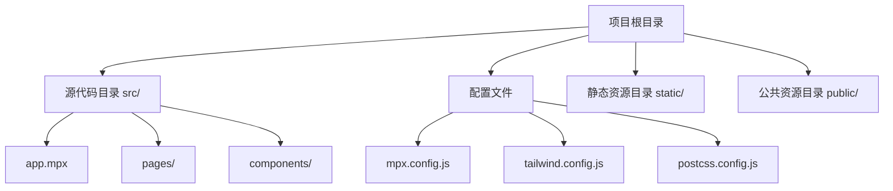
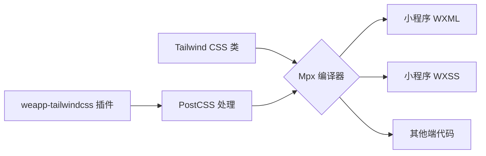
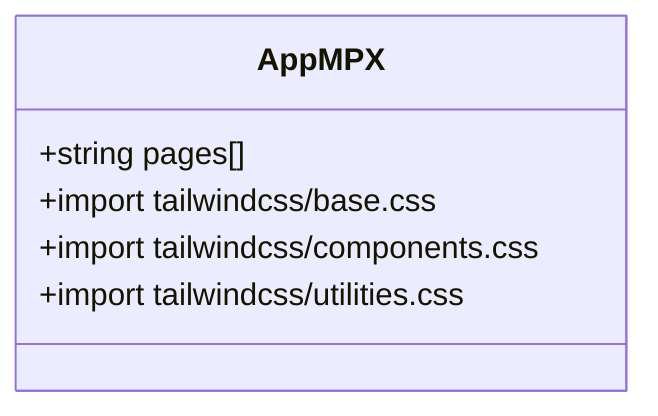
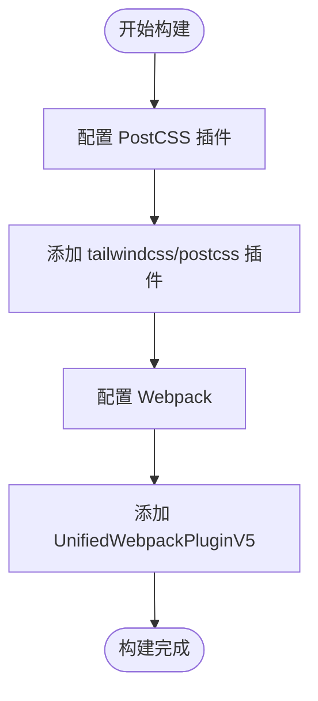

# Mpx 框架配置

<cite>
**本文档中引用的文件**  
- [mpx.config.js](file://demo/mpx-tailwindcss-v4/mpx.config.js)
- [app.mpx](file://demo/mpx-tailwindcss-v4/src/app.mpx)
- [tailwind.config.js](file://demo/mpx-app/tailwind.config.js)
- [package.json](file://demo/mpx-app/package.json)
- [postcss.config.js](file://demo/mpx-tailwindcss-v4/postcss.config.js)
</cite>

## 目录
1. [简介](#简介)
2. [项目结构](#项目结构)
3. [核心组件](#核心组件)
4. [架构概述](#架构概述)
5. [详细组件分析](#详细组件分析)
6. [依赖分析](#依赖分析)
7. [性能考虑](#性能考虑)
8. [故障排除指南](#故障排除指南)
9. [结论](#结论)

## 简介
本文档详细说明了如何在 Mpx 多端框架中集成 weapp-tailwindcss，重点介绍 app.mpx 文件中的配置方法、Mpx 特有的语法和构建流程集成。文档还解释了 Mpx 的多端编译机制与 weapp-tailwindcss 的协作方式，并提供完整的配置示例，展示如何在 Mpx 项目中实现 Tailwind CSS 的跨平台支持。同时包含常见问题的解决方案，如模板语法冲突、条件编译处理等，并阐述样式作用域和组件样式的最佳实践。

## 项目结构
Mpx 项目的典型结构包含源代码目录（src）、配置文件（如 mpx.config.js、tailwind.config.js）以及构建脚本。项目通过 Mpx CLI 工具进行构建和开发服务启动，利用 Webpack 或 Vite 等构建工具完成多端编译。



**Diagram sources**
- [mpx.config.js](file://demo/mpx-tailwindcss-v4/mpx.config.js#L1-L48)
- [app.mpx](file://demo/mpx-tailwindcss-v4/src/app.mpx#L1-L32)

**Section sources**
- [mpx.config.js](file://demo/mpx-tailwindcss-v4/mpx.config.js#L1-L48)
- [app.mpx](file://demo/mpx-tailwindcss-v4/src/app.mpx#L1-L32)

## 核心组件
Mpx 框架的核心组件包括应用入口文件 app.mpx、页面组件和自定义组件。这些组件通过 Mpx 的编译系统转换为各端原生代码，并集成 Tailwind CSS 样式类。

**Section sources**
- [app.mpx](file://demo/mpx-tailwindcss-v4/src/app.mpx#L1-L32)
- [package.json](file://demo/mpx-app/package.json#L1-L86)

## 架构概述
Mpx 框架采用基于 Vue 的语法结构，通过编译时转换实现多端支持。weapp-tailwindcss 插件通过 PostCSS 处理 Tailwind CSS 类，将其转换为小程序可用的样式规则。



**Diagram sources**
- [mpx.config.js](file://demo/mpx-tailwindcss-v4/mpx.config.js#L6-L48)
- [postcss.config.js](file://demo/mpx-tailwindcss-v4/postcss.config.js#L1-L7)

## 详细组件分析
### app.mpx 配置分析
app.mpx 是 Mpx 应用的入口文件，包含应用的全局配置、样式导入和页面路由定义。

#### 样式导入
在 `<style>` 标签中导入 Tailwind CSS 的基础、组件和工具类样式文件。



**Diagram sources**
- [app.mpx](file://demo/mpx-tailwindcss-v4/src/app.mpx#L9-L13)

#### JSON 配置
使用 `<script type="application/json">` 标签定义应用的页面路由和其他配置。

**Section sources**
- [app.mpx](file://demo/mpx-tailwindcss-v4/src/app.mpx#L14-L32)

### mpx.config.js 配置分析
mpx.config.js 是 Mpx 项目的构建配置文件，用于配置插件、加载器和 Webpack 选项。

#### PostCSS 配置
在 pluginOptions.mpx.plugin.postcssInlineConfig 中配置 Tailwind CSS PostCSS 插件。

#### Webpack 插件配置
在 configureWebpack 中添加 UnifiedWebpackPluginV5 插件，用于处理 rem 到 rpx 的转换和 CSS 入口。



**Diagram sources**
- [mpx.config.js](file://demo/mpx-tailwindcss-v4/mpx.config.js#L6-L48)

**Section sources**
- [mpx.config.js](file://demo/mpx-tailwindcss-v4/mpx.config.js#L6-L48)

## 依赖分析
Mpx 项目依赖于 Mpx 核心库、weapp-tailwindcss 插件和 Tailwind CSS 本身。这些依赖通过 package.json 管理，并在构建时由 Webpack 或 Vite 处理。

```mermaid
graph TD
A[项目] --> B[@mpxjs/core]
A --> C[weapp-tailwindcss]
A --> D[tailwindcss]
C --> E[@tailwindcss/postcss]
C --> F[UnifiedWebpackPluginV5]
```

**Diagram sources**
- [package.json](file://demo/mpx-app/package.json#L1-L86)
- [mpx.config.js](file://demo/mpx-tailwindcss-v4/mpx.config.js#L2-L3)

**Section sources**
- [package.json](file://demo/mpx-app/package.json#L1-L86)

## 性能考虑
- 使用 `content` 配置精确指定需要扫描的文件路径，避免不必要的文件扫描。
- 在生产环境中禁用调试模式，减少构建输出。
- 合理使用 `corePlugins.preflight` 配置，避免不必要的样式重置。

## 故障排除指南
### 模板语法冲突
当 Mpx 模板语法与 Tailwind CSS 类名冲突时，可使用字符串拼接或动态类名绑定。

### 条件编译处理
使用 Mpx 的条件编译语法 `<!-- #ifdef -->` 和 `<!-- #endif -->` 来处理不同平台的样式差异。

### 样式作用域问题
确保组件样式使用正确的作用域策略，避免样式泄漏。

**Section sources**
- [app.mpx](file://demo/mpx-tailwindcss-v4/src/app.mpx#L22-L31)
- [mpx.config.js](file://demo/mpx-tailwindcss-v4/mpx.config.js#L11-L16)

## 结论
通过正确配置 mpx.config.js 和 app.mpx 文件，可以成功在 Mpx 项目中集成 weapp-tailwindcss，实现高效的跨平台样式开发。遵循最佳实践可以避免常见问题，提高开发效率和代码质量。