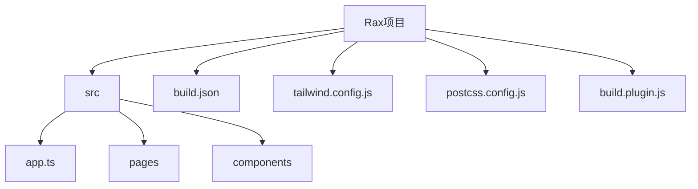
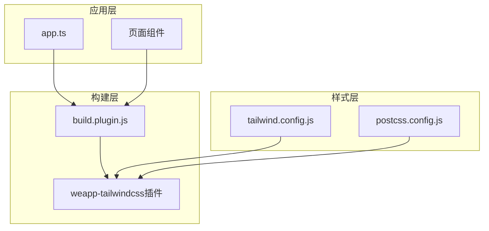
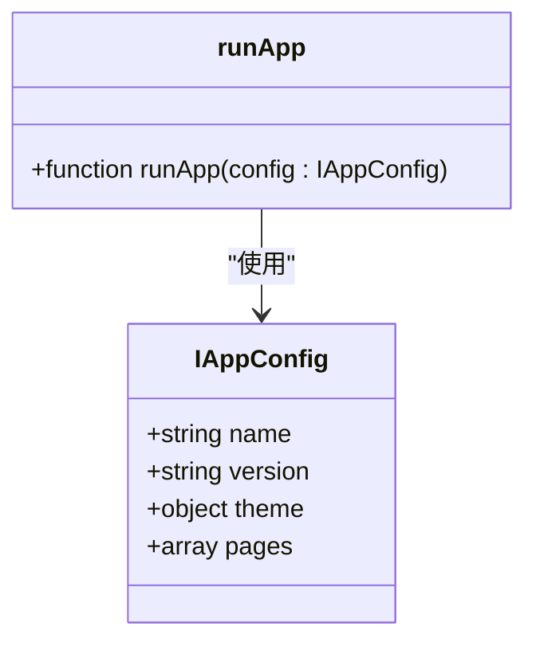
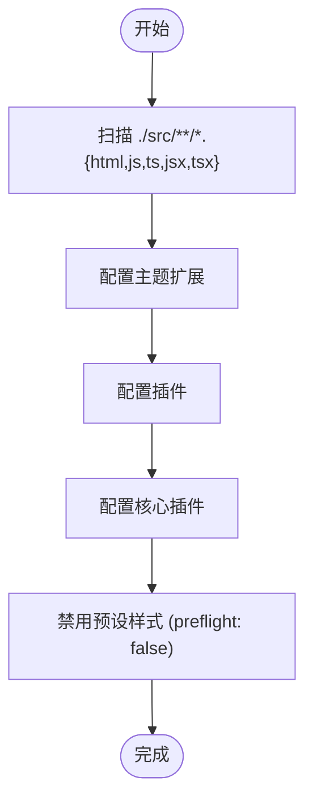
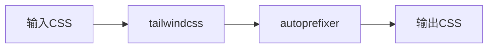
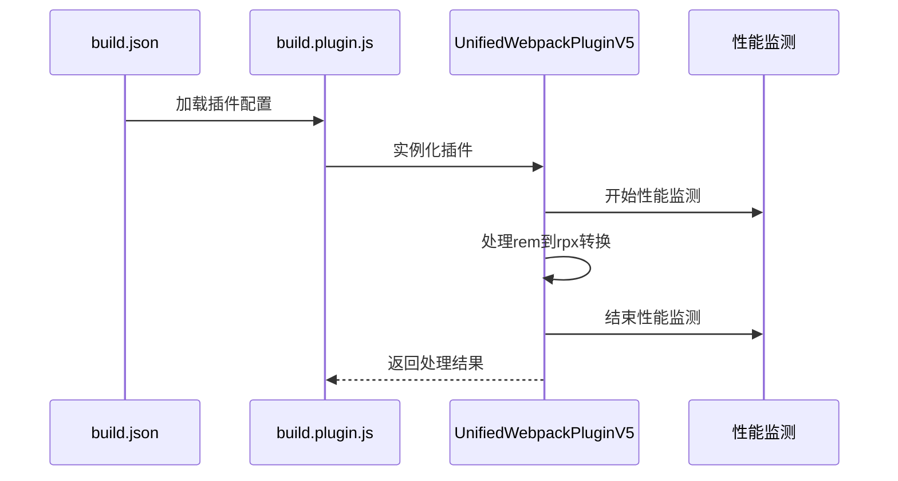
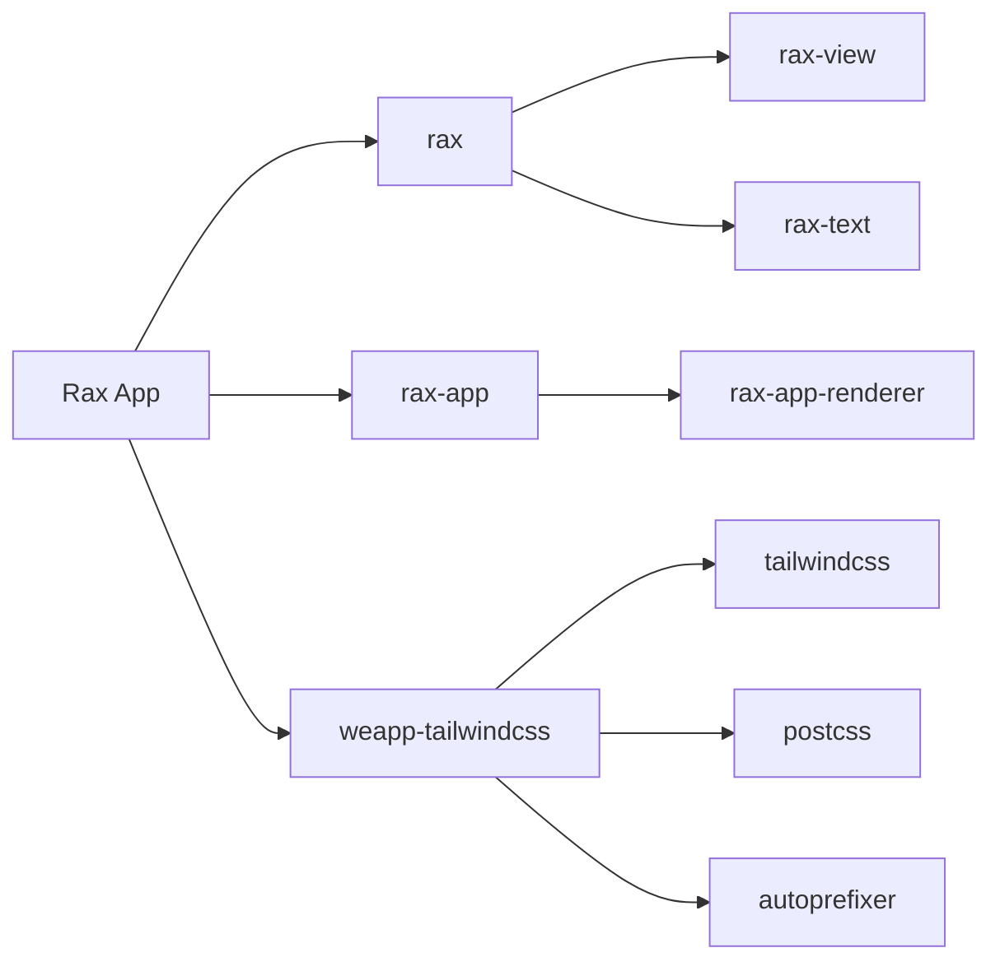

# Rax 框架配置

<cite>
**本文档中引用的文件**  
- [app.ts](file://demo/rax-app/src/app.ts)
- [tailwind.config.js](file://demo/rax-app/tailwind.config.js)
- [postcss.config.js](file://demo/rax-app/postcss.config.js)
- [build.plugin.js](file://demo/rax-app/build.plugin.js)
- [build.json](file://demo/rax-app/build.json)
- [package.json](file://demo/rax-app/package.json)
- [webpack.ts](file://packages/weapp-tailwindcss/src/webpack.ts)
- [index.tsx](file://demo/rax-app/src/pages/index/index.tsx)
- [index.css](file://demo/rax-app/src/pages/index/index.css)
</cite>

## 目录
1. [简介](#简介)
2. [项目结构](#项目结构)
3. [核心组件](#核心组件)
4. [架构概述](#架构概述)
5. [详细组件分析](#详细组件分析)
6. [依赖分析](#依赖分析)
7. [性能考虑](#性能考虑)
8. [故障排除指南](#故障排除指南)
9. [结论](#结论)

## 简介
本文档详细介绍了在 Rax 框架项目中集成和配置 weapp-tailwindcss 的方法。重点说明了如何在 Rax 多端项目中启用 Tailwind CSS 支持，涵盖框架特有的构建流程适配、组件模型差异、样式作用域处理等关键问题。通过完整的配置示例，帮助开发者快速在 Rax 项目中实现现代化的 Tailwind CSS 开发体验。

## 项目结构
Rax 项目采用标准的多端应用结构，核心配置文件位于项目根目录，源代码存放在 `src` 目录下。项目通过 `build.json` 配置多端构建目标，使用 `postcss` 和 `tailwindcss` 实现样式处理。

**图示来源**  
- [build.json](file://demo/rax-app/build.json#L1-L21)
- [app.ts](file://demo/rax-app/src/app.ts#L1-L6)

**本节来源**  
- [build.json](file://demo/rax-app/build.json#L1-L21)
- [package.json](file://demo/rax-app/package.json#L1-L65)

## 核心组件
Rax 框架的核心配置包括应用入口文件 `app.ts`、Tailwind CSS 配置文件 `tailwind.config.js`、PostCSS 配置文件 `postcss.config.js` 以及自定义构建插件 `build.plugin.js`。这些文件共同构成了 Rax 项目中 Tailwind CSS 支持的基础。

**本节来源**  
- [app.ts](file://demo/rax-app/src/app.ts#L1-L6)
- [tailwind.config.js](file://demo/rax-app/tailwind.config.js#L1-L11)
- [postcss.config.js](file://demo/rax-app/postcss.config.js#L1-L12)
- [build.plugin.js](file://demo/rax-app/build.plugin.js#L1-L27)

## 架构概述
Rax 项目的架构采用分层设计，从应用入口到页面组件，再到样式系统，形成了完整的开发链路。weapp-tailwindcss 通过 Webpack 插件机制深度集成到 Rax 的构建流程中，实现了 Tailwind CSS 在小程序环境中的无缝支持。

**图示来源**  
- [app.ts](file://demo/rax-app/src/app.ts#L1-L6)
- [build.plugin.js](file://demo/rax-app/build.plugin.js#L1-L27)
- [tailwind.config.js](file://demo/rax-app/tailwind.config.js#L1-L11)

## 详细组件分析

### 应用入口配置分析
Rax 应用的入口文件 `app.ts` 定义了应用的基本配置，通过 `runApp` 函数启动应用。在 MPA 模式下，该文件可能无效，但在 SPA 模式下是应用的核心。

**图示来源**  
- [app.ts](file://demo/rax-app/src/app.ts#L2-L5)

**本节来源**  
- [app.ts](file://demo/rax-app/src/app.ts#L1-L6)

### Tailwind CSS 配置分析
Tailwind CSS 配置文件 `tailwind.config.js` 定义了内容扫描范围、主题扩展和核心插件设置。特别地，`preflight: false` 配置禁用了 Tailwind 的默认样式重置，以避免与小程序原生样式冲突。

**图示来源**  
- [tailwind.config.js](file://demo/rax-app/tailwind.config.js#L1-L11)

**本节来源**  
- [tailwind.config.js](file://demo/rax-app/tailwind.config.js#L1-L11)

### PostCSS 配置分析
PostCSS 配置文件 `postcss.config.js` 设置了构建过程中的样式处理插件链，包括 `tailwindcss` 和 `autoprefixer`，为 Tailwind CSS 提供了必要的处理支持。

**图示来源**  
- [postcss.config.js](file://demo/rax-app/postcss.config.js#L1-L12)

**本节来源**  
- [postcss.config.js](file://demo/rax-app/postcss.config.js#L1-L12)

### 构建插件配置分析
构建插件 `build.plugin.js` 是 Rax 项目与 weapp-tailwindcss 集成的关键，通过 `UnifiedWebpackPluginV5` 插件实现了 Tailwind CSS 到小程序样式的转换，并支持 rem 到 rpx 的单位转换。

**图示来源**  
- [build.plugin.js](file://demo/rax-app/build.plugin.js#L1-L27)
- [build.json](file://demo/rax-app/build.json#L1-L21)

**本节来源**  
- [build.plugin.js](file://demo/rax-app/build.plugin.js#L1-L27)
- [build.json](file://demo/rax-app/build.json#L1-L21)

## 依赖分析
Rax 项目通过 `package.json` 管理依赖，关键依赖包括 Rax 核心库、weapp-tailwindcss 插件以及相关的构建工具。这些依赖共同支持了 Tailwind CSS 在 Rax 项目中的运行。

**图示来源**  
- [package.json](file://demo/rax-app/package.json#L28-L61)

**本节来源**  
- [package.json](file://demo/rax-app/package.json#L1-L65)

## 性能考虑
在 Rax 项目中使用 weapp-tailwindcss 时，需要注意构建性能问题。通过 `build.plugin.js` 中的性能监测功能，可以追踪构建过程的耗时，优化构建流程。建议在生产环境中启用适当的缓存策略，并定期检查构建输出的大小。

**本节来源**  
- [build.plugin.js](file://demo/rax-app/build.plugin.js#L2-L17)

## 故障排除指南
当在 Rax 项目中遇到 Tailwind CSS 配置问题时，应首先检查 `tailwind.config.js` 的内容扫描路径是否正确，确保包含了所有需要处理的文件。其次，验证 `postcss.config.js` 是否正确配置了 `tailwindcss` 插件。最后，检查 `build.plugin.js` 是否正确集成了 `UnifiedWebpackPluginV5` 插件。

**本节来源**  
- [tailwind.config.js](file://demo/rax-app/tailwind.config.js#L1-L11)
- [postcss.config.js](file://demo/rax-app/postcss.config.js#L1-L12)
- [build.plugin.js](file://demo/rax-app/build.plugin.js#L1-L27)

## 结论
通过本文档的配置方法，开发者可以在 Rax 框架项目中成功集成 weapp-tailwindcss，实现现代化的 CSS 开发体验。关键在于正确配置 `tailwind.config.js`、`postcss.config.js` 和 `build.plugin.js` 三个核心文件，并理解 Rax 框架特有的构建流程。这种集成方式不仅提高了开发效率，还确保了样式在多端环境中的兼容性。