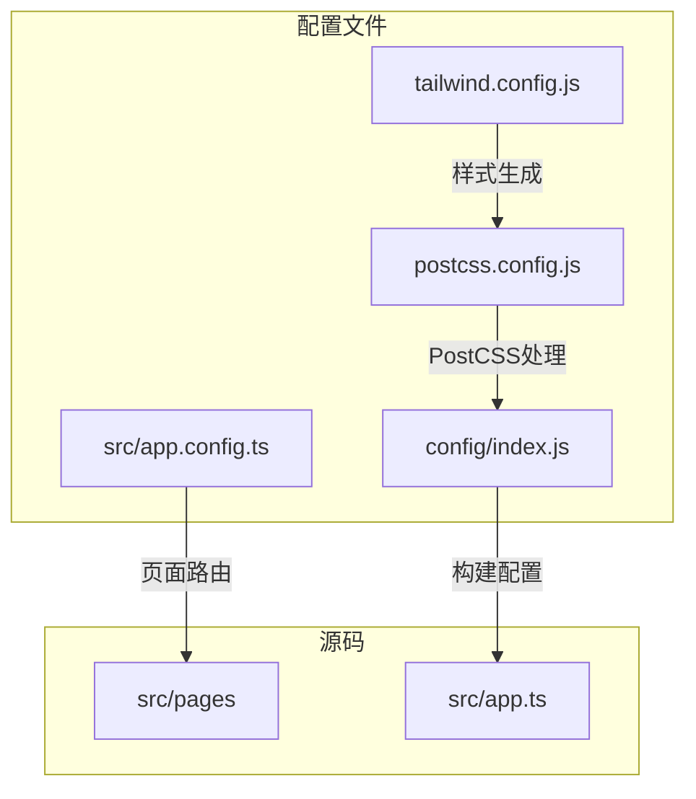
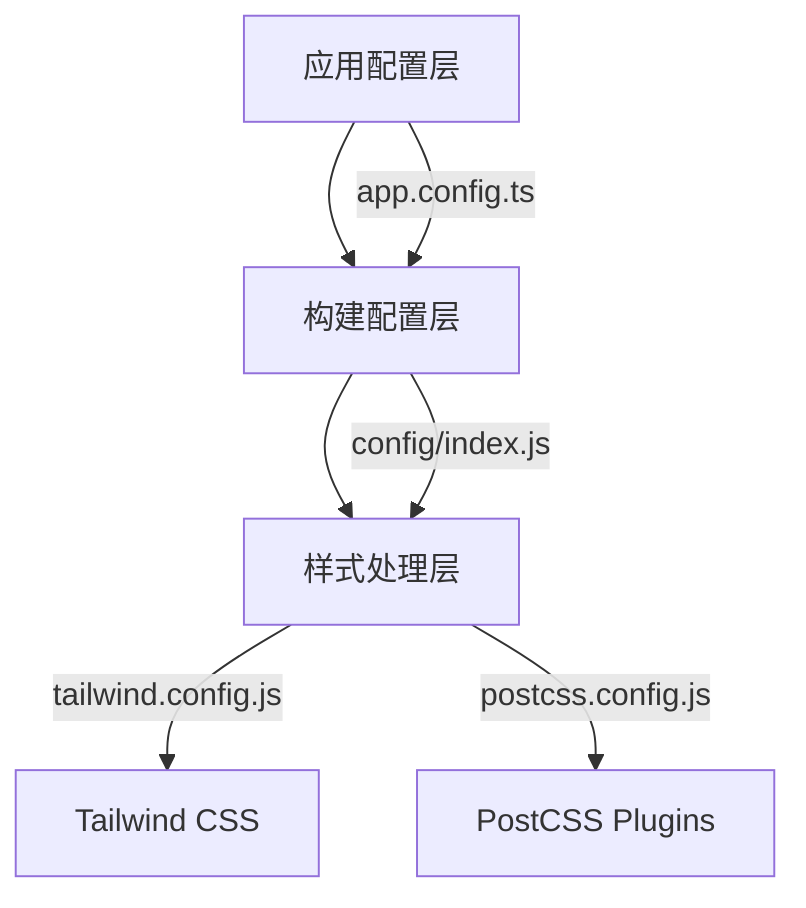
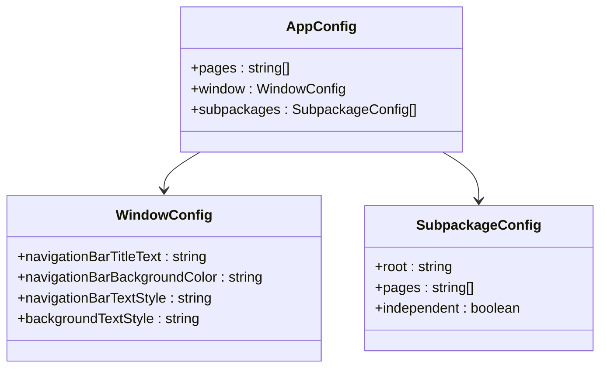
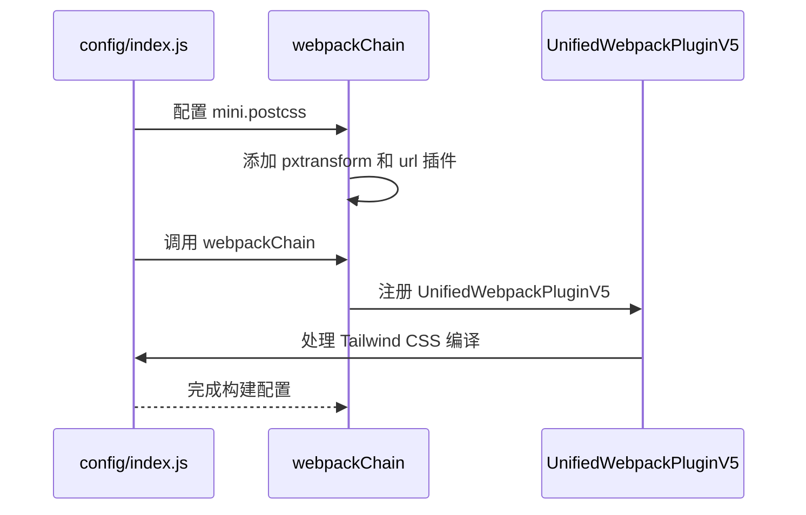
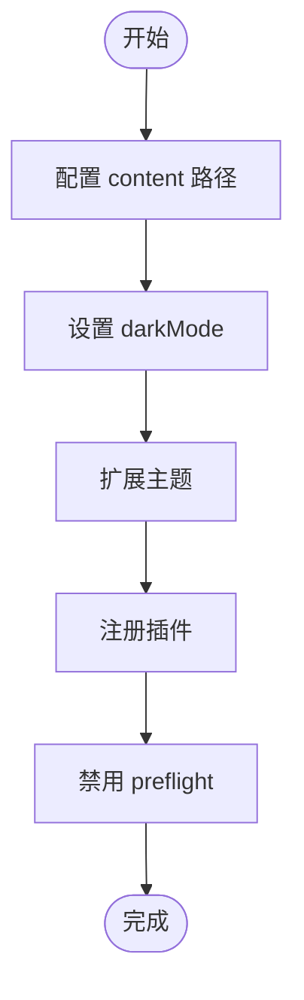
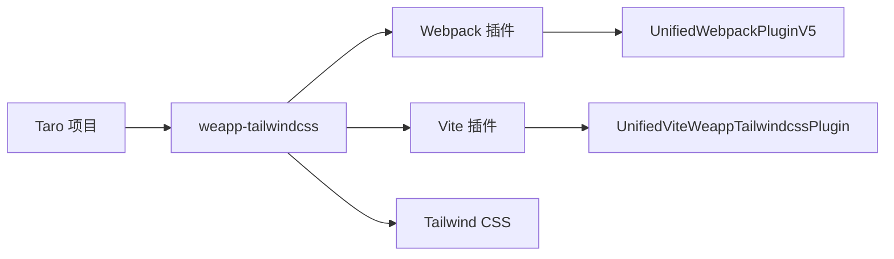

# Taro 框架配置

<cite>
**本文档引用文件**  
- [index.js](file://demo/taro-app/config/index.js)
- [app.config.ts](file://demo/taro-app/src/app.config.ts)
- [tailwind.config.js](file://demo/taro-app/tailwind.config.js)
- [postcss.config.js](file://demo/taro-app/postcss.config.js)
- [index.ts](file://demo/taro-app-vite/config/index.ts)
- [app.ts](file://demo/taro-app/src/app.ts)
- [dev.js](file://demo/taro-app/config/dev.js)
- [prod.js](file://demo/taro-app/config/prod.js)
- [package.json](file://packages/weapp-tailwindcss/package.json)
</cite>

## 目录
1. [简介](#简介)
2. [项目结构](#项目结构)
3. [核心组件](#核心组件)
4. [架构概述](#架构概述)
5. [详细组件分析](#详细组件分析)
6. [依赖分析](#依赖分析)
7. [性能考虑](#性能考虑)
8. [故障排除指南](#故障排除指南)
9. [结论](#结论)

## 简介
本文档详细说明了如何在 Taro 项目中正确配置 `weapp-tailwindcss` 插件，以实现 Tailwind CSS 在多端小程序开发中的集成。重点涵盖 `app.config.ts` 文件的配置项集成、框架类型指定、路径配置、插件注册等关键步骤。文档提供完整的配置示例，展示如何在 Taro 多端项目中使用 Tailwind CSS，并解释 Taro 特有的构建流程集成点以及与 Taro CLI 的协作方式。

## 项目结构
Taro 项目通常采用模块化结构，包含配置文件、源代码、资源文件等。主要配置文件包括 `config/index.js`（或 `.ts`）用于构建配置，`src/app.config.ts` 定义小程序页面路由和窗口样式，`tailwind.config.js` 配置 Tailwind CSS 行为。

**图示来源**  
- [index.js](file://demo/taro-app/config/index.js#L6-L131)
- [app.config.ts](file://demo/taro-app/src/app.config.ts#L1-L43)
- [tailwind.config.js](file://demo/taro-app/tailwind.config.js#L1-L35)
- [postcss.config.js](file://demo/taro-app/postcss.config.js#L1-L45)

**本节来源**  
- [index.js](file://demo/taro-app/config/index.js#L1-L157)
- [app.config.ts](file://demo/taro-app/src/app.config.ts#L1-L43)

## 核心组件
Taro 框架的核心组件包括应用入口文件 `app.ts`、页面配置文件 `app.config.ts` 和构建配置文件 `config/index.js`。这些文件共同定义了应用的结构、样式和构建行为。

**本节来源**  
- [app.ts](file://demo/taro-app/src/app.ts#L1-L8)
- [app.config.ts](file://demo/taro-app/src/app.config.ts#L1-L43)
- [index.js](file://demo/taro-app/config/index.js#L1-L157)

## 架构概述
Taro 项目的架构分为三层：应用配置层、构建配置层和样式处理层。应用配置层定义页面结构和窗口样式；构建配置层管理编译、打包和插件；样式处理层通过 PostCSS 和 Tailwind CSS 实现原子化样式。

**图示来源**  
- [index.js](file://demo/taro-app/config/index.js#L6-L131)
- [app.config.ts](file://demo/taro-app/src/app.config.ts#L1-L43)
- [tailwind.config.js](file://demo/taro-app/tailwind.config.js#L1-L35)
- [postcss.config.js](file://demo/taro-app/postcss.config.js#L1-L45)

## 详细组件分析

### 应用配置分析
`app.config.ts` 文件定义了小程序的页面路由、窗口样式和分包配置。通过 `defineAppConfig` 函数可以启用类型检查。

**图示来源**  
- [app.config.ts](file://demo/taro-app/src/app.config.ts#L1-L43)
- [apps/taro-webpack-tailwindcss-v4/src/app.config.ts](file://apps/taro-webpack-tailwindcss-v4/src/app.config.ts#L1-L12)

### 构建配置分析
`config/index.js` 文件通过 `webpackChain` 方法集成 `weapp-tailwindcss` 插件，实现 Tailwind CSS 在小程序中的编译。

**图示来源**  
- [index.js](file://demo/taro-app/config/index.js#L63-L130)
- [postcss.config.js](file://demo/taro-app/postcss.config.js#L36-L41)

### 样式配置分析
Tailwind CSS 配置通过 `content` 字段指定需要扫描的文件路径，`corePlugins.preflight` 设置为 `false` 以避免与小程序样式冲突。

**图示来源**  
- [tailwind.config.js](file://demo/taro-app/tailwind.config.js#L1-L35)

**本节来源**  
- [tailwind.config.js](file://demo/taro-app/tailwind.config.js#L1-L35)
- [postcss.config.js](file://demo/taro-app/postcss.config.js#L1-L45)
- [index.js](file://demo/taro-app/config/index.js#L63-L130)

## 依赖分析
Taro 项目依赖 `weapp-tailwindcss` 包来实现 Tailwind CSS 支持，该包提供了 Webpack 和 Vite 的插件适配器。

**图示来源**  
- [package.json](file://packages/weapp-tailwindcss/package.json#L42-L128)
- [index.ts](file://demo/taro-app-vite/config/index.ts#L7-L55)

**本节来源**  
- [package.json](file://packages/weapp-tailwindcss/package.json#L1-L215)
- [index.ts](file://demo/taro-app-vite/config/index.ts#L1-L122)

## 性能考虑
在生产环境中，建议启用代码压缩和混淆以减小包体积。可以通过配置 `terserOptions` 来控制压缩行为，同时使用 `webpack-bundle-analyzer` 分析打包体积。

## 故障排除指南
常见问题包括配置文件位置错误、框架检测失败等。确保 `tailwind.config.js` 位于项目根目录，`postcss.config.js` 正确引用 `tailwindcss` 插件。对于独立分包，需要配置不同的 Tailwind 配置文件。

**本节来源**  
- [dev.js](file://demo/taro-app/config/dev.js#L1-L35)
- [prod.js](file://demo/taro-app/config/prod.js#L1-L18)

## 结论
通过正确配置 `weapp-tailwindcss` 插件，可以在 Taro 项目中高效使用 Tailwind CSS。关键在于理解构建配置的集成点，正确设置 PostCSS 处理流程，并处理好独立分包的特殊配置需求。