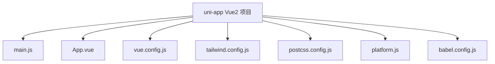
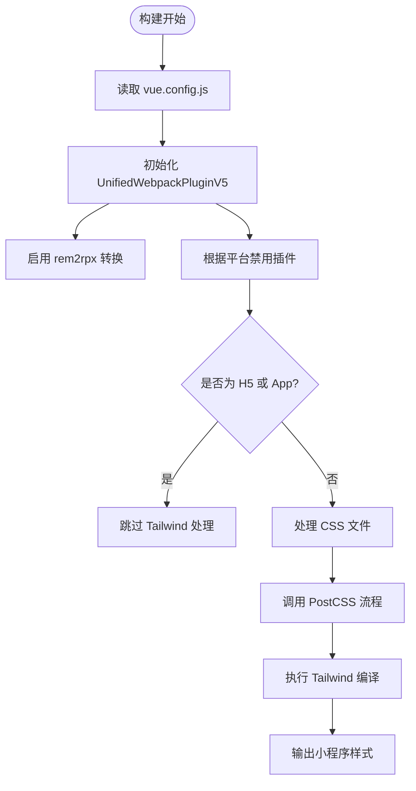
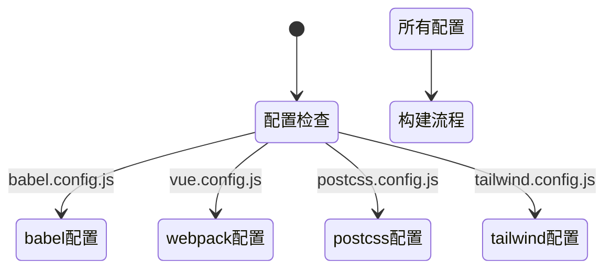

# uni-app Vue2 配置

<cite>
**本文档中引用的文件**  
- [main.js](file://templates/uni-app-vue2-tailwind-hbuilder-template/main.js)
- [App.vue](file://templates/uni-app-vue2-tailwind-hbuilder-template/App.vue)
- [vue.config.js](file://templates/uni-app-vue2-tailwind-vscode-template/vue.config.js)
- [tailwind.config.js](file://templates/uni-app-vue2-tailwind-vscode-template/tailwind.config.js)
- [postcss.config.js](file://templates/uni-app-vue2-tailwind-vscode-template/postcss.config.js)
- [platform.js](file://templates/uni-app-vue2-tailwind-vscode-template/platform.js)
- [babel.config.js](file://templates/uni-app-vue2-tailwind-vscode-template/babel.config.js)
- [types/index.ts](file://packages/weapp-tailwindcss/src/types/index.ts)
</cite>

## 目录
1. [简介](#简介)
2. [项目结构](#项目结构)
3. [核心配置](#核心配置)
4. [main.js 初始化配置](#mainjs-初始化配置)
5. [Vue2 特有配置要求](#vue2-特有配置要求)
6. [HBuilderX 中的构建流程](#hbuilderx-中的构建流程)
7. [常见问题与解决方案](#常见问题与解决方案)
8. [从传统 uni-app 迁移指南](#从传统-uni-app-迁移指南)
9. [结论](#结论)

## 简介
本文档详细说明了在 uni-app Vue2 项目中集成 `weapp-tailwindcss` 的完整流程。重点涵盖初始化配置、插件注册、框架类型指定和路径配置等关键步骤，并提供针对 Vue2 的特殊配置说明及常见问题解决方案。

## 项目结构
本项目基于 uni-app 框架，采用 Vue2 语法标准，结合 Tailwind CSS 实现小程序端的原子化样式开发。项目结构遵循 uni-app 标准布局，同时引入了 Tailwind 相关的构建工具链。



**图示来源**  
- [main.js](file://templates/uni-app-vue2-tailwind-hbuilder-template/main.js)
- [App.vue](file://templates/uni-app-vue2-tailwind-hbuilder-template/App.vue)
- [vue.config.js](file://templates/uni-app-vue2-tailwind-vscode-template/vue.config.js)

## 核心配置
`weapp-tailwindcss` 的核心配置涉及多个文件协同工作，包括 Webpack 插件配置、PostCSS 处理器、Tailwind 配置以及平台判断逻辑。

### 插件注册与构建工具集成
通过 `UnifiedWebpackPluginV5` 插件实现 Tailwind 在 uni-app 中的无缝集成，支持 rem 到 rpx 的自动转换。



**图示来源**  
- [vue.config.js](file://templates/uni-app-vue2-tailwind-vscode-template/vue.config.js)
- [platform.js](file://templates/uni-app-vue2-tailwind-vscode-template/platform.js)

## main.js 初始化配置
`main.js` 是 uni-app Vue2 项目的入口文件，负责 Vue 实例的创建和挂载。

### Vue 构造函数集成方式
在 Vue2 项目中，使用传统的 `new Vue()` 方式创建应用实例，并通过 `$mount()` 方法挂载。

```javascript
import App from './App'
import Vue from 'vue'

Vue.config.productionTip = false
App.mpType = 'app'

const app = new Vue({
  ...App
})
app.$mount()
```

该配置确保了与 uni-app 运行时的兼容性，同时保留了 Vue2 的经典写法。

**本节来源**  
- [main.js](file://templates/uni-app-vue2-tailwind-hbuilder-template/main.js#L1-L11)

## Vue2 特有配置要求
### 使用 main.js 而非 main.ts
由于 Vue2 对 TypeScript 的原生支持有限，推荐使用 `main.js` 作为项目入口，避免类型检查带来的构建问题。

### 生命周期兼容性
`weapp-tailwindcss` 完全兼容 Vue2 的生命周期钩子，无需额外适配。所有样式处理均在构建阶段完成，不影响运行时性能。

### 构建配置差异
与 Vue3 项目相比，Vue2 需要特别注意以下几点：
- 禁用 `fork-ts-checker` 插件以提升构建速度
- 正确配置 `transpileDependencies` 以处理第三方库
- 使用 `@vue/app` preset 进行 Babel 转译



**本节来源**  
- [babel.config.js](file://templates/uni-app-vue2-tailwind-vscode-template/babel.config.js)
- [vue.config.js](file://templates/uni-app-vue2-tailwind-vscode-template/vue.config.js)

## HBuilderX 中的构建流程
在 HBuilderX 环境下，uni-app Vue2 项目的构建流程具有以下特点：

### 特殊环境变量
- `UNI_PLATFORM`: 当前编译平台（如 mp-weixin）
- `UNI_INPUT_DIR`: 源码根目录
- `UNI_OUTPUT_DIR`: 输出目录

### 构建插件链
HBuilderX 内置了对 `weapp-tailwindcss` 的支持，构建流程如下：
1. 解析 `vue.config.js` 中的插件配置
2. 执行 `UnifiedWebpackPluginV5`
3. 调用 PostCSS 处理器链
4. 生成最终的小程序代码

## 常见问题与解决方案
### this.$tailwind 未定义
**问题原因**：`weapp-tailwindcss` 不提供运行时 `$tailwind` 实例，所有功能均在构建阶段完成。

**解决方案**：无需在代码中调用 `this.$tailwind`，直接使用 Tailwind 类名即可。

### 组件样式不生效
**可能原因及解决方案**：
1. **content 配置错误**：确保 `tailwind.config.js` 中的 `content` 包含所有模板文件路径
   ```js
   content: ['./src/**/*.{vue,js,ts,wxml}']
   ```
2. **PostCSS 配置缺失**：确认 `postcss.config.js` 正确引入了 `tailwindcss` 和 `weapp-tailwindcss/css-macro`
3. **缓存问题**：清除 HBuilderX 缓存并重新构建

### 平台兼容性问题
通过 `platform.js` 动态控制插件启用状态：

```js
const isH5 = process.env.UNI_PLATFORM === "h5";
const isApp = process.env.UNI_PLATFORM === "app-plus";
const WeappTailwindcssDisabled = isH5 || isApp;

module.exports = {
  WeappTailwindcssDisabled,
};
```

**本节来源**  
- [platform.js](file://templates/uni-app-vue2-tailwind-vscode-template/platform.js)
- [tailwind.config.js](file://templates/uni-app-vue2-tailwind-vscode-template/tailwind.config.js)

## 从传统 uni-app 迁移指南
### 迁移步骤
1. **安装依赖**
   ```bash
   npm install weapp-tailwindcss --save-dev
   ```

2. **配置 vue.config.js**
   添加 `UnifiedWebpackPluginV5` 插件配置

3. **更新 postcss.config.js**
   引入 Tailwind 和 css-macro 处理器

4. **修改 App.vue**
   在 `<style>` 标签中导入 Tailwind 基础样式

5. **调整 tailwind.config.js**
   设置正确的 content 路径和插件

### 注意事项
- 确保项目使用 Vue2 语法
- 检查是否有冲突的 CSS 处理插件
- 测试不同平台（微信小程序、H5、App）的兼容性
- 逐步迁移，先在新页面使用 Tailwind，再逐步改造旧页面

## 结论
通过本文档的配置，开发者可以在 uni-app Vue2 项目中成功集成 `weapp-tailwindcss`，享受原子化 CSS 带来的开发效率提升。关键在于正确配置构建工具链，理解 Vue2 的特殊要求，并遵循推荐的最佳实践。