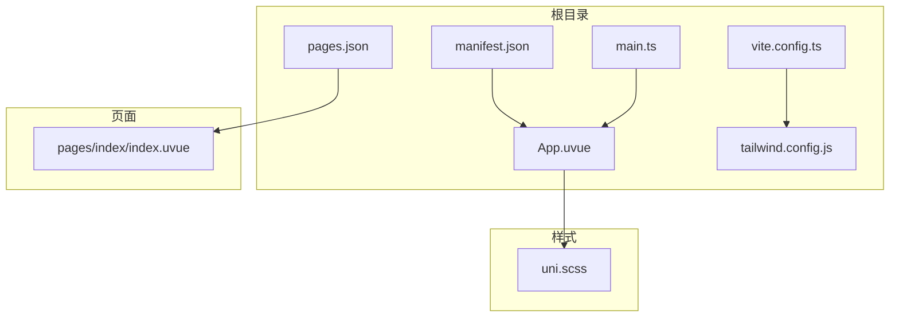
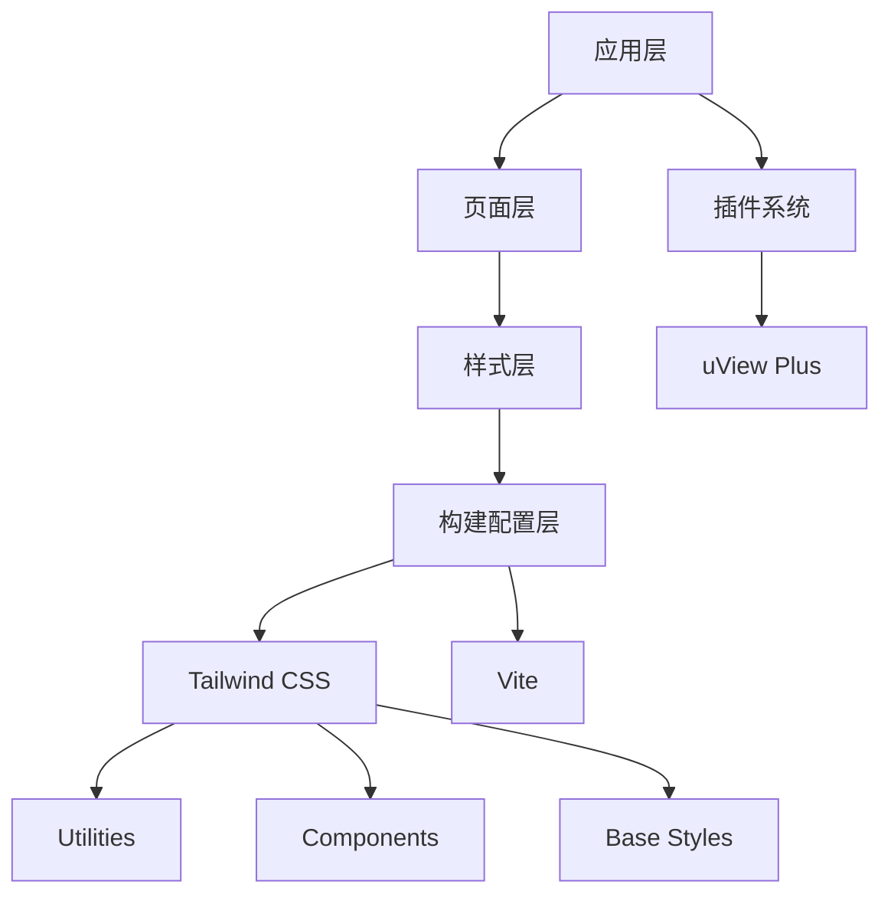
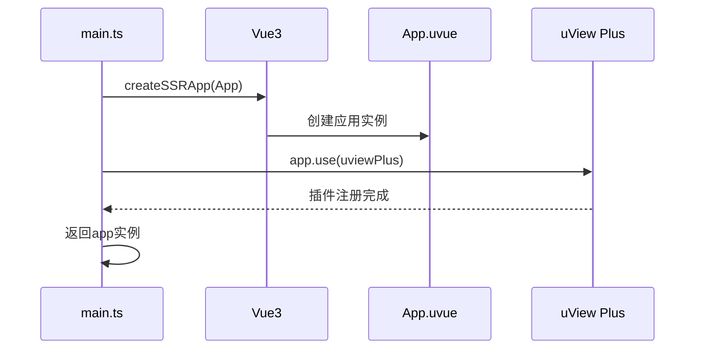
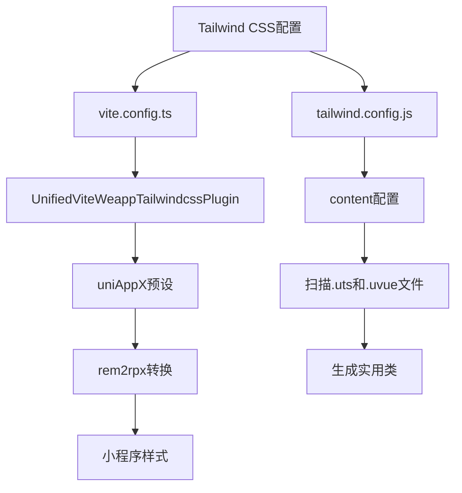
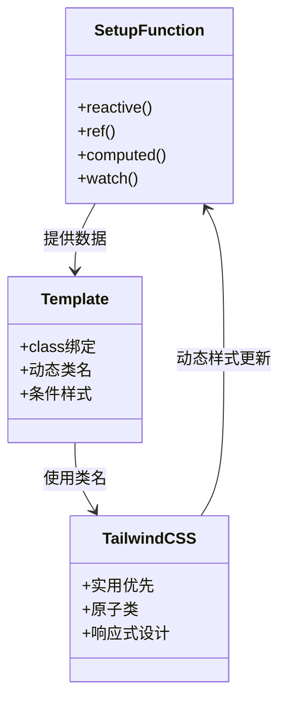
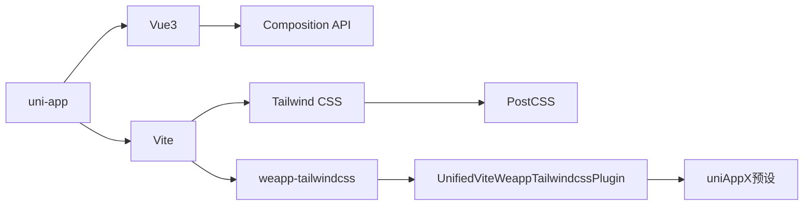

# uni-app Vue3 配置

<cite>
**本文档引用文件**  
- [main.ts](file://demo/uni-app-vue3-vite/src/main.ts)
- [vite.config.ts](file://demo/uni-app-x-hbuilderx-tailwindcss3/vite.config.ts)
- [App.uvue](file://demo/uni-app-x-hbuilderx-tailwindcss3/App.uvue)
- [tailwind.config.js](file://demo/uni-app-x-hbuilderx-tailwindcss3/tailwind.config.js)
- [pages.json](file://demo/uni-app-x-hbuilderx-tailwindcss3/pages.json)
- [shared.js](file://demo/uni-app-x-hbuilderx-tailwindcss3/shared.js)
- [uni.scss](file://demo/uni-app-x-hbuilderx-tailwindcss3/uni.scss)
- [manifest.json](file://demo/uni-app-x-hbuilderx-tailwindcss3/manifest.json)
- [index.ts](file://packages/weapp-tailwindcss/src/index.ts)
- [types/index.ts](file://packages/weapp-tailwindcss/src/types/index.ts)
</cite>

## 目录
1. [简介](#简介)
2. [项目结构](#项目结构)
3. [核心组件](#核心组件)
4. [架构概述](#架构概述)
5. [详细组件分析](#详细组件分析)
6. [依赖分析](#依赖分析)
7. [性能考虑](#性能考虑)
8. [故障排除指南](#故障排除指南)
9. [结论](#结论)

## 简介
本文档全面阐述了在uni-app Vue3项目中集成weapp-tailwindcss的最佳实践。重点介绍Vue3 Composition API与Tailwind CSS的集成方式、Vite构建工具的配置、HBuilderX开发环境支持以及从传统uni-app项目迁移到weapp-tailwindcss的完整路径。

## 项目结构
uni-app Vue3项目采用模块化结构，结合Vite构建工具和Tailwind CSS进行样式管理。项目包含标准的uni-app配置文件和针对微信小程序优化的构建流程。

**图示来源**  
- [manifest.json](file://demo/uni-app-x-hbuilderx-tailwindcss3/manifest.json)
- [pages.json](file://demo/uni-app-x-hbuilderx-tailwindcss3/pages.json)
- [App.uvue](file://demo/uni-app-x-hbuilderx-tailwindcss3/App.uvue)
- [main.ts](file://demo/uni-app-vue3-vite/src/main.ts)
- [vite.config.ts](file://demo/uni-app-x-hbuilderx-tailwindcss3/vite.config.ts)
- [tailwind.config.js](file://demo/uni-app-x-hbuilderx-tailwindcss3/tailwind.config.js)
- [uni.scss](file://demo/uni-app-x-hbuilderx-tailwindcss3/uni.scss)

**本节来源**  
- [manifest.json](file://demo/uni-app-x-hbuilderx-tailwindcss3/manifest.json)
- [pages.json](file://demo/uni-app-x-hbuilderx-tailwindcss3/pages.json)
- [App.uvue](file://demo/uni-app-x-hbuilderx-tailwindcss3/App.uvue)

## 核心组件
在uni-app Vue3项目中，核心组件包括应用入口、页面结构、样式配置和构建工具集成。通过createSSRApp创建Vue3应用实例，并集成uView等UI框架。

**本节来源**  
- [main.ts](file://demo/uni-app-vue3-vite/src/main.ts)
- [App.uvue](file://demo/uni-app-x-hbuilderx-tailwindcss3/App.uvue)

## 架构概述
uni-app Vue3项目采用分层架构，结合Vite构建工具和Tailwind CSS实现高效的开发体验。架构包含应用层、页面层、样式层和构建配置层。

**图示来源**  
- [main.ts](file://demo/uni-app-vue3-vite/src/main.ts)
- [vite.config.ts](file://demo/uni-app-x-hbuilderx-tailwindcss3/vite.config.ts)
- [tailwind.config.js](file://demo/uni-app-x-hbuilderx-tailwindcss3/tailwind.config.js)

## 详细组件分析

### 应用初始化分析
在uni-app Vue3项目中，应用初始化通过createApp函数完成，使用createSSRApp创建服务端渲染应用实例。

**图示来源**  
- [main.ts](file://demo/uni-app-vue3-vite/src/main.ts)
- [App.uvue](file://demo/uni-app-x-hbuilderx-tailwindcss3/App.uvue)

**本节来源**  
- [main.ts](file://demo/uni-app-vue3-vite/src/main.ts)

### 样式系统分析
Tailwind CSS在uni-app Vue3项目中的集成通过vite.config.ts配置实现，使用UnifiedViteWeappTailwindcssPlugin插件。

**图示来源**  
- [vite.config.ts](file://demo/uni-app-x-hbuilderx-tailwindcss3/vite.config.ts)
- [tailwind.config.js](file://demo/uni-app-x-hbuilderx-tailwindcss3/tailwind.config.js)

**本节来源**  
- [vite.config.ts](file://demo/uni-app-x-hbuilderx-tailwindcss3/vite.config.ts)
- [tailwind.config.js](file://demo/uni-app-x-hbuilderx-tailwindcss3/tailwind.config.js)

### Vue3 Composition API集成
Vue3 Composition API与weapp-tailwindcss的集成主要体现在setup函数中的响应式数据与样式类名的动态绑定。

**图示来源**  
- [main.ts](file://demo/uni-app-vue3-vite/src/main.ts)
- [App.uvue](file://demo/uni-app-x-hbuilderx-tailwindcss3/App.uvue)

**本节来源**  
- [main.ts](file://demo/uni-app-vue3-vite/src/main.ts)
- [App.uvue](file://demo/uni-app-x-hbuilderx-tailwindcss3/App.uvue)

## 依赖分析
项目依赖关系清晰，主要依赖Vite构建工具、Tailwind CSS和uni-app框架。

**图示来源**  
- [vite.config.ts](file://demo/uni-app-x-hbuilderx-tailwindcss3/vite.config.ts)
- [package.json](file://demo/uni-app-x-hbuilderx-tailwindcss3/package.json)

**本节来源**  
- [vite.config.ts](file://demo/uni-app-x-hbuilderx-tailwindcss3/vite.config.ts)

## 性能考虑
在uni-app Vue3项目中集成weapp-tailwindcss时需要考虑以下性能因素：
- 构建时间优化
- 包体积控制
- 运行时性能
- 样式加载策略

通过配置tailwind.config.js中的content字段精确指定需要扫描的文件路径，可以有效减少构建时间。使用preflight: false可以移除默认样式重置，减小CSS文件体积。

## 故障排除指南
### 常见问题及解决方案

1. **样式不生效**
   - 检查tailwind.config.js中的content配置是否正确
   - 确认Vite插件已正确注册

2. **构建失败**
   - 检查Node.js版本兼容性
   - 验证依赖包版本匹配

3. **响应式数据与样式不同步**
   - 确保在setup函数中正确使用ref和reactive
   - 检查类名绑定语法

4. **Teleport组件样式问题**
   - 使用全局样式覆盖
   - 检查作用域样式限制

**本节来源**  
- [tailwind.config.js](file://demo/uni-app-x-hbuilderx-tailwindcss3/tailwind.config.js)
- [vite.config.ts](file://demo/uni-app-x-hbuilderx-tailwindcss3/vite.config.ts)
- [main.ts](file://demo/uni-app-vue3-vite/src/main.ts)

## 结论
uni-app Vue3项目与weapp-tailwindcss的集成提供了现代化的开发体验。通过合理的配置和最佳实践，可以实现高效、可维护的小程序开发。关键要点包括：
- 正确配置Vite构建工具
- 合理使用Vue3 Composition API
- 优化Tailwind CSS配置
- 注意性能影响
- 遵循迁移最佳实践