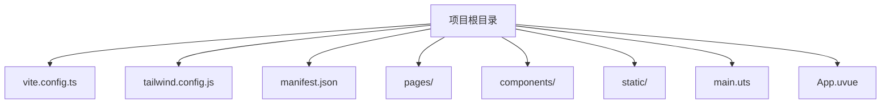
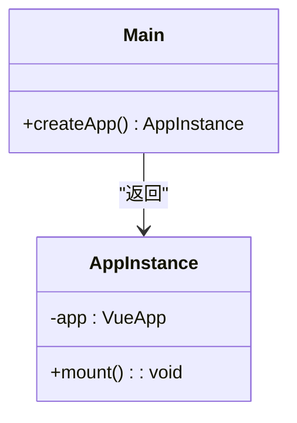
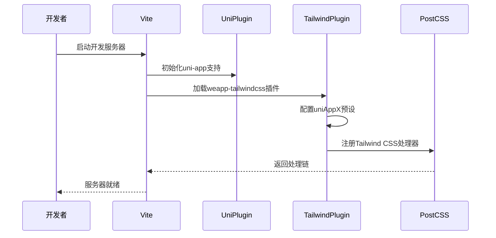
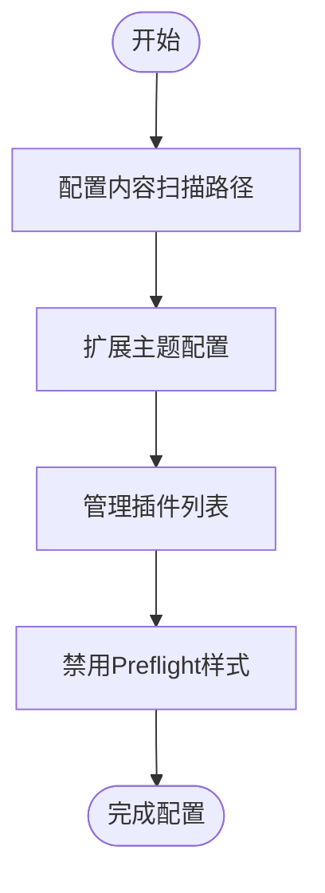

# uni-app 框架配置

<cite>
**本文档引用文件**  
- [main.uts](file://apps/uni-app-x-hbuilderx-tailwindcss3/main.uts)
- [App.uvue](file://apps/uni-app-x-hbuilderx-tailwindcss3/App.uvue)
- [vite.config.ts](file://apps/uni-app-x-hbuilderx-tailwindcss3/vite.config.ts)
- [tailwind.config.js](file://apps/uni-app-x-hbuilderx-tailwindcss3/tailwind.config.js)
- [manifest.json](file://apps/uni-app-x-hbuilderx-tailwindcss3/manifest.json)
- [shared.js](file://apps/uni-app-x-hbuilderx-tailwindcss3/shared.js)
- [main.css](file://apps/uni-app-x-hbuilderx-tailwindcss4/main.css)
- [package.json](file://packages/weapp-tailwindcss/package.json)
</cite>

## 目录
1. [简介](#简介)
2. [项目结构](#项目结构)
3. [核心组件](#核心组件)
4. [架构概述](#架构概述)
5. [详细组件分析](#详细组件分析)
6. [依赖分析](#依赖分析)
7. [性能考虑](#性能考虑)
8. [故障排除指南](#故障排除指南)
9. [结论](#结论)

## 简介
本文档详细说明了在uni-app项目中集成weapp-tailwindcss的完整配置流程。重点涵盖main.ts（或main.uts）文件中的初始化配置、插件注册、框架类型指定和路径配置等内容。同时提供Vue2/Vue3版本差异说明、HBuilderX开发工具协作方式、常见配置陷阱及最佳实践建议，并介绍@uni-helper/vite-plugin-uni-tailwind的迁移路径。

## 项目结构
uni-app项目采用标准的前端项目目录结构，结合了Vue框架特性和小程序平台要求。核心配置文件包括vite.config.ts、tailwind.config.js、manifest.json等，位于项目根目录下。页面文件存放在pages目录中，组件和资源分别组织在各自目录内。



**图示来源**  
- [vite.config.ts](file://apps/uni-app-x-hbuilderx-tailwindcss3/vite.config.ts#L1-L40)
- [main.uts](file://apps/uni-app-x-hbuilderx-tailwindcss3/main.uts#L1-L9)

**本节来源**  
- [vite.config.ts](file://apps/uni-app-x-hbuilderx-tailwindcss3/vite.config.ts#L1-L40)
- [manifest.json](file://apps/uni-app-x-hbuilderx-tailwindcss3/manifest.json#L1-L64)

## 核心组件
uni-app的核心初始化逻辑集中在main.uts文件中，通过createApp函数创建Vue应用实例。该文件导入App组件并使用createSSRApp进行实例化，返回应用对象供框架使用。此模式适用于uni-app x版本，体现了服务端渲染支持能力。

**本节来源**  
- [main.uts](file://apps/uni-app-x-hbuilderx-tailwindcss3/main.uts#L1-L9)
- [App.uvue](file://apps/uni-app-x-hbuilderx-tailwindcss3/App.uvue#L1-L37)

## 架构概述
uni-app项目采用模块化架构设计，基于Vite构建系统集成weapp-tailwindcss插件。整体架构分为应用层、框架层、构建层和工具层四个主要部分。Vite插件系统负责处理Tailwind CSS的转换和优化，确保样式能在小程序环境中正确运行。

```mermaid
graph TB
subgraph "应用层"
A[App.uvue]
B[main.uts]
C[pages/]
end
subgraph "框架层"
D[@dcloudio/vite-plugin-uni]
E[Vue 3]
end
subgraph "构建层"
F[Vite]
G[weapp-tailwindcss]
H[Tailwind CSS]
end
subgraph "工具层"
I[PostCSS]
J[Node.js]
end
A --> D
B --> D
C --> D
D --> F
G --> F
H --> G
F --> I
I --> J
```

**图示来源**  
- [vite.config.ts](file://apps/uni-app-x-hbuilderx-tailwindcss3/vite.config.ts#L1-L40)
- [package.json](file://packages/weapp-tailwindcss/package.json#L1-L215)

## 详细组件分析

### 主入口文件分析
main.uts作为uni-app x版本的入口文件，承担着应用初始化的职责。它通过标准的ES模块语法导入依赖，并导出createApp工厂函数。这种设计模式支持服务端渲染场景，提高了应用的灵活性和可测试性。

#### 入口函数实现


**图示来源**  
- [main.uts](file://apps/uni-app-x-hbuilderx-tailwindcss3/main.uts#L1-L9)
- [App.uvue](file://apps/uni-app-x-hbuilderx-tailwindcss3/App.uvue#L1-L37)

### 构建配置分析
vite.config.ts文件定义了Vite构建系统的完整配置，包含插件注册、CSS处理和路径解析等关键设置。其中UnifiedViteWeappTailwindcssPlugin插件的配置尤为关键，决定了Tailwind CSS如何与uni-app框架集成。

#### 构建流程序列图


**图示来源**  
- [vite.config.ts](file://apps/uni-app-x-hbuilderx-tailwindcss3/vite.config.ts#L1-L40)
- [shared.js](file://apps/uni-app-x-hbuilderx-tailwindcss3/shared.js#L1-L10)

### 样式配置分析
tailwind.config.js文件配置了Tailwind CSS的核心选项，包括内容扫描路径、主题扩展和核心插件管理。特别值得注意的是preflight设置为false，这符合小程序环境的需求，避免与原生生命周期冲突。



**图示来源**  
- [tailwind.config.js](file://apps/uni-app-x-hbuilderx-tailwindcss3/tailwind.config.js#L1-L16)
- [vite.config.ts](file://apps/uni-app-x-hbuilderx-tailwindcss3/vite.config.ts#L30-L38)

**本节来源**  
- [tailwind.config.js](file://apps/uni-app-x-hbuilderx-tailwindcss3/tailwind.config.js#L1-L16)
- [vite.config.ts](file://apps/uni-app-x-hbuilderx-tailwindcss3/vite.config.ts#L1-L40)

## 依赖分析
项目依赖关系清晰地展示了uni-app与weapp-tailwindcss的集成方式。核心依赖包括@dcouldio/vite-plugin-uni用于uni-app支持，weapp-tailwindcss提供Tailwind CSS集成能力，以及tailwindcss本身作为样式引擎。

```mermaid
graph LR
A[uni-app项目] --> B[@dcloudio/vite-plugin-uni]
A --> C[weapp-tailwindcss]
C --> D[tailwindcss]
C --> E[@weapp-tailwindcss/shared]
C --> F[@weapp-tailwindcss/logger]
B --> G[Vue 3]
D --> H[PostCSS]
```

**图示来源**  
- [package.json](file://packages/weapp-tailwindcss/package.json#L188-L212)
- [vite.config.ts](file://apps/uni-app-x-hbuilderx-tailwindcss3/vite.config.ts#L1-L40)

**本节来源**  
- [package.json](file://packages/weapp-tailwindcss/package.json#L1-L215)
- [vite.config.ts](file://apps/uni-app-x-hbuilderx-tailwindcss3/vite.config.ts#L1-L40)

## 性能考虑
在uni-app中集成Tailwind CSS时需要考虑编译性能和运行时性能。建议使用内容扫描精确控制生成的CSS范围，避免全量打包带来的体积膨胀。同时合理配置缓存策略，提升二次构建速度。

## 故障排除指南
常见问题包括main.js/main.ts位置错误、平台条件编译冲突、路径解析失败等。建议检查文件路径是否正确，确保vite.config.ts中的base配置与项目根目录一致。对于条件编译问题，应使用正确的预处理器语法。

**本节来源**  
- [vite.config.ts](file://apps/uni-app-x-hbuilderx-tailwindcss3/vite.config.ts#L9-L40)
- [manifest.json](file://apps/uni-app-x-hbuilderx-tailwindcss3/manifest.json#L11-L17)

## 结论
本文档全面介绍了uni-app框架中集成weapp-tailwindcss的配置方法。通过合理的配置和最佳实践，开发者可以高效地在uni-app项目中使用Tailwind CSS，提升开发效率和代码质量。建议遵循文档中的指导原则，避免常见配置陷阱。