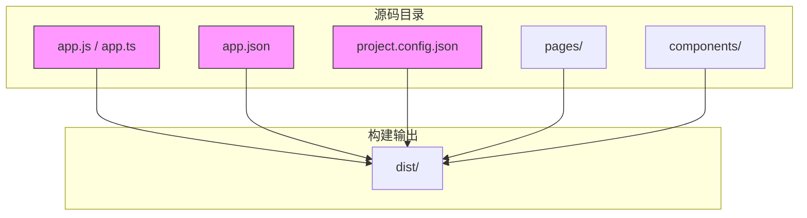
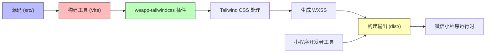
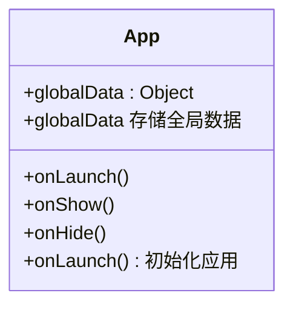
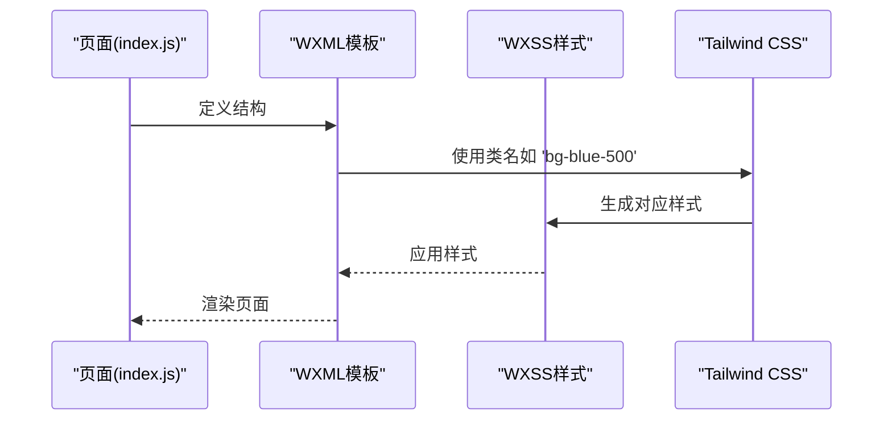
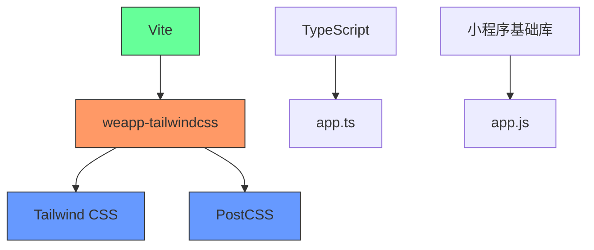

# 原生小程序配置

<cite>
**本文档中引用的文件**  
- [app.js](file://demo/native/app.js)
- [app.json](file://demo/native/app.json)
- [project.config.json](file://demo/native/project.config.json)
- [app.ts](file://demo/native-ts/miniprogram/app.ts)
- [app.json](file://demo/native-ts/miniprogram/app.json)
- [project.config.json](file://apps/vite-native/project.config.json)
- [project.config.json](file://apps/vite-native-ts/project.config.json)
- [project.config.json](file://templates/weapp-native-mina-tailwindcss-template/project.config.json)
- [index.js](file://demo/native/pages/index/index.js)
- [index.json](file://demo/native/pages/index/index.json)
- [cli.ts](file://packages/weapp-tailwindcss/src/cli.ts)
</cite>

## 目录
1. [简介](#简介)
2. [项目结构](#项目结构)
3. [核心组件](#核心组件)
4. [架构概述](#架构概述)
5. [详细组件分析](#详细组件分析)
6. [依赖分析](#依赖分析)
7. [性能考虑](#性能考虑)
8. [故障排除指南](#故障排除指南)
9. [结论](#结论)

## 简介
本文档旨在为开发者提供在原生微信小程序项目中集成 `weapp-tailwindcss` 的完整配置指导。文档详细说明了如何在 `app.ts`/`app.js` 文件中进行全局样式引入、组件注册和框架初始化，解释了 `project.config.json` 中的关键配置项，并展示了与小程序原生构建流程的集成方式。同时提供了完整的项目结构示例、常见问题解决方案以及从原生小程序迁移到 `weapp-tailwindcss` 的逐步指南。

## 项目结构
本项目展示了原生小程序集成 Tailwind CSS 的典型结构。核心配置文件包括 `app.js`/`app.ts`、`app.json` 和 `project.config.json`，分别用于应用逻辑、页面路由和项目构建设置。`weapp-tailwindcss` 通过 Vite 或原生构建流程集成，支持 TypeScript 和 JavaScript 项目。

**Diagram sources**
- [app.js](file://demo/native/app.js)
- [app.json](file://demo/native/app.json)
- [project.config.json](file://demo/native/project.config.json)

**Section sources**
- [app.js](file://demo/native/app.js)
- [app.json](file://demo/native/app.json)
- [project.config.json](file://demo/native/project.config.json)

## 核心组件
`weapp-tailwindcss` 的核心在于将 Tailwind CSS 的实用类系统无缝集成到微信小程序的 WXSS 系统中。通过配置 `postcss` 和 `tailwind.config.js`，开发者可以在小程序中使用 Tailwind 的原子化 CSS 类名，同时保持小程序的组件化架构。

**Section sources**
- [cli.ts](file://packages/weapp-tailwindcss/src/cli.ts)
- [app.js](file://demo/native/app.js)

## 架构概述
该架构采用现代前端构建工具链（如 Vite）与微信小程序原生能力相结合的方式。`weapp-tailwindcss` 作为构建插件，在编译时处理 CSS，并生成适用于小程序的样式文件。项目结构清晰分离源码与构建输出，确保开发与生产环境的一致性。

**Diagram sources**
- [project.config.json](file://apps/vite-native/project.config.json)
- [cli.ts](file://packages/weapp-tailwindcss/src/cli.ts)

## 详细组件分析

### App 文件配置分析
`app.js` 或 `app.ts` 是小程序的入口文件，负责应用的初始化和全局状态管理。在集成 `weapp-tailwindcss` 时，通常不需要在此文件中进行特殊配置，但需确保全局样式正确引入。

**Diagram sources**
- [app.js](file://demo/native/app.js)
- [app.ts](file://demo/native-ts/miniprogram/app.ts)

### 页面组件分析
小程序页面由 `.js`、`.json`、`.wxml` 和 `.wxss` 文件组成。在使用 `weapp-tailwindcss` 时，`.wxss` 文件通常被 Tailwind 生成的样式替代，开发者直接在 `.wxml` 中使用 Tailwind 类名。

**Diagram sources**
- [index.js](file://demo/native/pages/index/index.js)
- [index.json](file://demo/native/pages/index/index.json)

## 依赖分析
项目依赖主要分为三类：基础依赖（如 `weapp-tailwindcss`）、构建工具（如 `vite`）和开发工具（如 `typescript`）。`project.config.json` 中的 `packNpmRelationList` 配置确保了 NPM 包能正确打包到小程序中。

**Diagram sources**
- [project.config.json](file://templates/weapp-native-mina-tailwindcss-template/project.config.json)
- [package.json](file://apps/vite-native/package.json)

**Section sources**
- [project.config.json](file://templates/weapp-native-mina-tailwindcss-template/project.config.json)

## 性能考虑
启用 `postcss: true` 和 `minified: true` 可以优化样式处理和代码压缩。使用 `packNpmManually: true` 可以精细控制 NPM 包的打包，减少包体积。建议在生产环境中启用 `ignoreUploadUnusedFiles` 以忽略未使用的文件上传。

## 故障排除指南
常见问题包括全局样式未生效、组件引用路径错误等。确保 `project.config.json` 中 `postcss` 设置为 `true`，检查 `tailwind.config.js` 是否正确配置了内容扫描路径。对于组件路径错误，确认 `usingComponents` 中的路径与实际文件位置匹配。

**Section sources**
- [project.config.json](file://apps/vite-native/project.config.json)
- [app.json](file://demo/native/app.json)

## 结论
通过合理配置 `app.js`/`app.ts` 和 `project.config.json`，开发者可以顺利在原生小程序项目中集成 `weapp-tailwindcss`。项目结构应清晰分离源码与构建输出，利用现代构建工具提升开发效率。遵循本文档的指导，可以有效避免常见配置问题，实现高效的小程序开发。