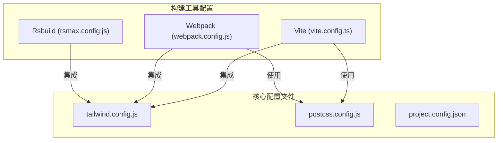
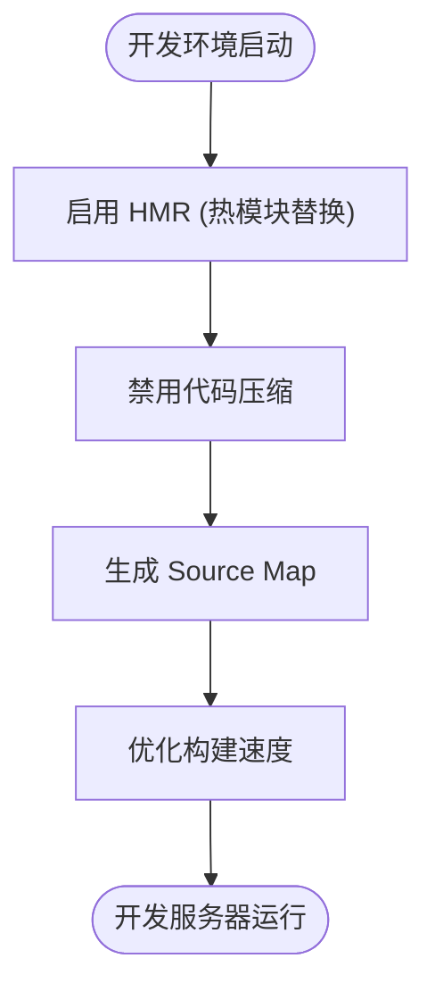
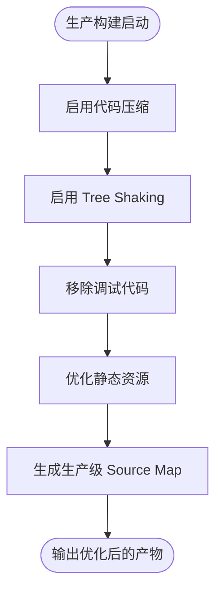

# 编译配置

<cite>
**本文档中引用的文件**  
- [vite.config.ts](file://apps/react-app/vite.config.ts)
- [vite.config.ts](file://apps/vite-native/vite.config.ts)
- [webpack.config.js](file://demo/native-mina/webpack.config.js)
- [tsup.config.ts](file://packages/weapp-tailwindcss/tsup.config.ts)
- [rsmax.config.js](file://apps/rsmax-app-ts/rsmax.config.js)
- [project.config.json](file://apps/taro-webpack-tailwindcss-v4/project.config.json)
- [tailwind.config.js](file://apps/rsmax-app-ts/tailwind.config.js)
- [postcss.config.js](file://apps/vite-native/postcss.config.js)
</cite>

## 目录
1. [引言](#引言)
2. [项目结构](#项目结构)
3. [核心编译配置选项](#核心编译配置选项)
4. [不同环境下的编译配置示例](#不同环境下的编译配置示例)
5. [代码优化机制与条件编译](#代码优化机制与条件编译)
6. [编译性能调优技巧](#编译性能调优技巧)
7. [常见编译错误排查方法](#常见编译错误排查方法)
8. [结论](#结论)

## 引言
本文档旨在全面解析 WeApp-TailwindCSS 项目中的编译配置体系，涵盖 `minify`、`treeShaking`、`env`、`define` 等关键编译选项的作用、默认值及最佳实践。通过分析多个实际项目配置文件，提供开发与生产环境下的配置范例，并深入探讨构建过程中的优化策略和问题诊断方法。

## 项目结构
本项目为多应用单体仓库（monorepo），包含多个基于不同框架（如 Vite、Webpack、Taro、UniApp 等）的子项目。每个子项目拥有独立的构建配置文件，支持灵活的编译定制。

**图示来源**  
- [vite.config.ts](file://apps/react-app/vite.config.ts)
- [webpack.config.js](file://demo/native-mina/webpack.config.js)
- [rsmax.config.js](file://apps/rsmax-app-ts/rsmax.config.js)
- [postcss.config.js](file://apps/vite-native/postcss.config.js)

**本节来源**  
- [vite.config.ts](file://apps/react-app/vite.config.ts)
- [webpack.config.js](file://demo/native-mina/webpack.config.js)
- [rsmax.config.js](file://apps/rsmax-app-ts/rsmax.config.js)

## 核心编译配置选项

### Minify（代码压缩）
在生产环境中启用代码压缩以减小包体积。Vite 和 Webpack 均支持自动压缩。

- **Vite**: 默认在 `build` 模式下启用 Terser 或 Esbuild 进行压缩。
- **Webpack**: 通过 `optimization.minimize` 控制，通常结合 `TerserPlugin` 使用。
- **最佳实践**: 开发环境禁用压缩以提升构建速度，生产环境启用。

### Tree Shaking（摇树优化）
移除未使用的代码模块，减少最终打包体积。

- **前提**: 使用 ES6 模块语法（`import/export`）。
- **Vite**: 基于 Rollup 实现，自动启用。
- **Webpack**: 需设置 `mode: production` 并确保模块为 `sideEffects: false`。
- **最佳实践**: 在 `package.json` 中声明 `sideEffects` 字段以辅助优化。

### Env（环境变量）
用于区分不同运行环境的行为。

- **定义方式**: 通过 `.env.development`、`.env.production` 文件定义。
- **访问方式**: `import.meta.env.VITE_APP_NAME`（Vite）、`process.env.NODE_ENV`（Webpack）。
- **编译时注入**: 构建工具会在编译阶段将环境变量替换为字面量。

### Define（常量替换）
在编译时将指定标识符替换为指定值，常用于条件编译。

- **Vite**: 使用 `define` 配置项，如 `{ __DEV__: true }`。
- **Webpack**: 使用 `DefinePlugin` 插件。
- **作用**: 可用于移除调试代码、切换功能开关等。

**本节来源**  
- [vite.config.ts](file://apps/react-app/vite.config.ts)
- [webpack.config.js](file://demo/native-mina/webpack.config.js)
- [tsup.config.ts](file://packages/weapp-tailwindcss/tsup.config.ts)

## 不同环境下的编译配置示例

### 开发环境配置
开发环境注重快速热更新和调试体验，通常禁用压缩和深度优化。

**图示来源**  
- [vite.config.ts](file://apps/react-app/vite.config.ts)
- [webpack.config.js](file://demo/native-mina/webpack.config.js)

### 生产环境配置
生产环境注重性能和包体积，启用所有优化选项。

**图示来源**  
- [webpack.config.js](file://demo/native-mina/webpack.config.js)
- [tsup.config.ts](file://packages/weapp-tailwindcss/tsup.config.ts)

**本节来源**  
- [vite.config.ts](file://apps/react-app/vite.config.ts)
- [webpack.config.js](file://demo/native-mina/webpack.config.js)
- [tsup.config.ts](file://packages/weapp-tailwindcss/tsup.config.ts)

## 代码优化机制与条件编译

### 代码优化机制
- **CSS 提取与注入**: 使用 `@tailwindcss/vite` 或 `weapp-tailwindcss` 插件处理 Tailwind CSS 的生成与注入。
- **Rem 转 Rpx**: 在小程序环境中，通过插件配置 `rem2rpx: true` 实现单位转换。
- **依赖预构建**: Vite 会对 `node_modules` 中的依赖进行预构建，提升启动速度。

### 条件编译支持
通过 `define` 和 `env` 实现功能开关和环境适配。

- 示例：`define: { __FEATURE_X__: JSON.stringify(true) }`
- 结合环境变量实现 API 地址切换、日志输出控制等。

**本节来源**  
- [vite.config.ts](file://apps/vite-native/vite.config.ts)
- [webpack.config.js](file://demo/native-mina/webpack.config.js)
- [tailwind.config.js](file://apps/rsmax-app-ts/tailwind.config.js)

## 编译性能调优技巧
- **合理使用别名（alias）**: 减少路径解析开销。
- **外部化大型依赖**: 使用 `external` 配置避免将大型库（如 lodash）打包进产物。
- **启用缓存**: 利用 Vite 的持久化缓存或 Webpack 的 `cache` 配置。
- **分包构建**: 对于小程序，合理配置 `subPackage` 实现分包加载。
- **监控构建耗时**: 使用 `bench.start()` 和 `bench.end()` 记录关键阶段耗时。

**本节来源**  
- [webpack.config.js](file://demo/native-mina/webpack.config.js)
- [vite.config.ts](file://apps/vite-native/vite.config.ts)
- [tsup.config.ts](file://packages/weapp-tailwindcss/tsup.config.ts)

## 常见编译错误排查方法
- **模块找不到**: 检查 `resolve.extensions` 和 `alias` 配置是否正确。
- **CSS 未生效**: 确认 `tailwindcss` 插件已正确注册，且 `content` 配置包含模板路径。
- **环境变量未注入**: 检查 `.env` 文件命名是否符合规范（如 `.env.production`），变量是否以 `VITE_` 开头（Vite）。
- **HMR 失效**: 检查服务是否运行在正确端口，防火墙设置，以及代码是否符合 HMR 更新条件。
- **构建卡住**: 查看是否有大型文件未被忽略，或 `watch` 模式下文件监听过多。

**本节来源**  
- [vite.config.ts](file://apps/react-app/vite.config.ts)
- [webpack.config.js](file://demo/native-mina/webpack.config.js)
- [project.config.json](file://apps/taro-webpack-tailwindcss-v4/project.config.json)

## 结论
WeApp-TailwindCSS 项目通过多种构建工具（Vite、Webpack、Rsbuild 等）支持灵活的编译配置。理解 `minify`、`treeShaking`、`env`、`define` 等核心选项的作用机制，结合不同环境的配置实践，能够有效提升开发效率和应用性能。建议根据项目实际需求选择合适的构建方案，并持续优化编译流程。