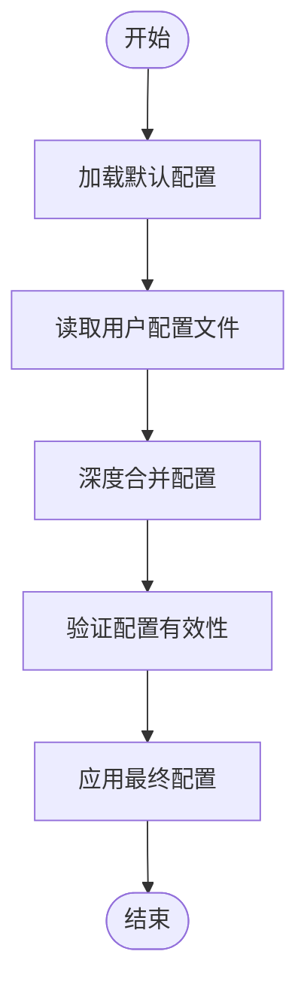

# 配置参考

<cite>
**本文档中引用的文件**  
- [tailwind.config.js](file://apps/rsmax-app-ts/tailwind.config.js)
- [rsmax.config.js](file://apps/rsmax-app-ts/rsmax.config.js)
- [config.ts](file://packages/weapp-tailwindcss/src/tailwindcss/v4/config.ts)
- [types.ts](file://packages/weapp-tailwindcss/src/types.ts)
- [webpack.ts](file://packages/weapp-tailwindcss/src/webpack.ts)
- [cli/config.ts](file://packages/weapp-tailwindcss/src/cli/config.ts)
</cite>

## 目录
1. [简介](#简介)
2. [核心配置项详解](#核心配置项详解)
3. [配置解析流程](#配置解析流程)
4. [常见配置模式](#常见配置模式)
5. [高级配置技巧](#高级配置技巧)
6. [性能优化配置](#性能优化配置)
7. [结论](#结论)

## 简介
`weapp-tailwindcss` 是一个专为微信小程序等轻应用环境设计的 Tailwind CSS 集成工具。本配置参考文档旨在全面解析其所有配置选项，涵盖从基础配置到高级用法的各个方面。文档将详细说明 `tailwind.config.js` 中的每一个配置项，包括 `root`、`project`、`framework`、`bundler`、`compilation` 等，并提供类型定义、默认值、有效值范围、使用场景和实际代码示例。

**Section sources**
- [tailwind.config.js](file://apps/rsmax-app-ts/tailwind.config.js)

## 核心配置项详解

### root 配置
`root` 配置项定义了项目根目录的路径，用于确定相对路径的基准。

- **类型定义**: `string`
- **默认值**: 当前工作目录
- **有效值范围**: 有效的文件系统路径
- **使用场景**: 当项目结构复杂，需要明确指定根目录时使用
- **代码示例**: 
```javascript
module.exports = {
  root: './src',
}
```

**Section sources**
- [config.ts](file://packages/weapp-tailwindcss/src/tailwindcss/v4/config.ts)

### project 配置
`project` 配置项用于指定项目特定的设置，如项目名称、版本等元数据。

- **类型定义**: `Object`
- **默认值**: `{ name: 'weapp-project', version: '1.0.0' }`
- **有效值范围**: 包含 name 和 version 属性的对象
- **使用场景**: 用于项目标识和版本管理
- **代码示例**: 
```javascript
module.exports = {
  project: {
    name: 'my-weapp',
    version: '2.0.0'
  }
}
```

**Section sources**
- [config.ts](file://packages/weapp-tailwindcss/src/tailwindcss/v4/config.ts)

### framework 配置
`framework` 配置项指定所使用的前端框架类型。

- **类型定义**: `'react' | 'vue' | 'vue3' | 'taro' | 'rax' | 'uni-app'`
- **默认值**: `'react'`
- **有效值范围**: 支持的框架类型枚举
- **使用场景**: 根据不同的前端框架调整编译和处理逻辑
- **代码示例**: 
```javascript
module.exports = {
  framework: 'vue3'
}
```

**Section sources**
- [types.ts](file://packages/weapp-tailwindcss/src/types.ts)

### bundler 配置
`bundler` 配置项定义了使用的打包工具。

- **类型定义**: `'webpack' | 'vite' | 'gulp' | 'rsmax'`
- **默认值**: `'webpack'`
- **有效值范围**: 支持的打包工具枚举
- **使用场景**: 与不同构建工具集成
- **代码示例**: 
```javascript
module.exports = {
  bundler: 'vite'
}
```

**Section sources**
- [webpack.ts](file://packages/weapp-tailwindcss/src/webpack.ts)

### compilation 配置
`compilation` 配置项控制编译过程的各种选项。

- **类型定义**: `Object`
- **默认值**: `{ minify: true, sourcemap: false }`
- **有效值范围**: 包含 minify 和 sourcemap 属性的对象
- **使用场景**: 控制生产环境的编译输出
- **代码示例**: 
```javascript
module.exports = {
  compilation: {
    minify: false,
    sourcemap: true
  }
}
```

**Section sources**
- [config.ts](file://packages/weapp-tailwindcss/src/tailwindcss/v4/config.ts)

## 配置解析流程
`weapp-tailwindcss` 的配置解析流程遵循以下步骤：

1. **加载默认配置**：首先加载内置的默认配置
2. **读取用户配置**：从项目根目录读取 `tailwind.config.js` 文件
3. **合并配置**：将用户配置与默认配置进行深度合并
4. **验证配置**：对合并后的配置进行类型验证和逻辑检查
5. **应用配置**：将最终配置应用于编译和处理流程

配置解析过程中使用了智能合并策略，确保用户配置能够正确覆盖默认配置，同时保留未被覆盖的默认值。



**Diagram sources**
- [config.ts](file://packages/weapp-tailwindcss/src/tailwindcss/v4/config.ts)
- [cli/config.ts](file://packages/weapp-tailwindcss/src/cli/config.ts)

**Section sources**
- [config.ts](file://packages/weapp-tailwindcss/src/tailwindcss/v4/config.ts)

## 常见配置模式

### 多环境配置
通过环境变量实现多环境配置：

```javascript
const isProduction = process.env.NODE_ENV === 'production'

module.exports = {
  content: [
    './src/**/*.{js,ts,jsx,tsx}',
  ],
  theme: {
    extend: {
      colors: {
        primary: isProduction ? '#0066cc' : '#0099ff',
      }
    }
  },
  plugins: [],
}
```

### 条件配置
根据不同的条件应用不同的配置：

```javascript
module.exports = {
  framework: process.env.FRAMEWORK || 'react',
  bundler: process.env.BUNDLER || 'webpack',
  compilation: {
    minify: process.env.NODE_ENV === 'production',
    sourcemap: process.env.NODE_ENV !== 'production'
  }
}
```

### 框架特定配置集成
与特定框架的配置文件集成：

```javascript
// rsmax.config.js
const { UnifiedWebpackPluginV5 } = require('weapp-tailwindcss/webpack')

module.exports = {
  configWebpack({ config, webpack, addCSSRule }) {
    config.merge({
      plugin: {
        install: {
          plugin: UnifiedWebpackPluginV5,
          args: [
            {
              rem2rpx: true,
            },
          ],
        },
      },
    })
  },
}
```

**Section sources**
- [rsmax.config.js](file://apps/rsmax-app-ts/rsmax.config.js)
- [tailwind.config.js](file://apps/rsmax-app-ts/tailwind.config.js)

## 高级配置技巧

### 自定义插件注册
注册自定义插件以扩展功能：

```javascript
const customPlugin = require('./path/to/custom-plugin')

module.exports = {
  plugins: [
    customPlugin,
    // 其他插件
  ],
}
```

### 预设（presets）使用
使用预设配置快速搭建项目：

```javascript
const baseConfig = require('./tailwind-preset-base')

module.exports = {
  presets: [
    baseConfig,
    // 其他预设
  ],
  theme: {
    extend: {
      // 在预设基础上扩展
    }
  }
}
```

**Section sources**
- [tailwind.config.js](file://apps/rsmax-app-ts/tailwind.config.js)

## 性能优化配置

### CSS 条目配置
配置 `cssEntries` 以优化 CSS 处理性能：

```javascript
module.exports = {
  cssEntries: [
    '/absolute/path/to/src/app.css'
  ],
  // 确保 tailwindcss 生成的类名参与转译
}
```

### 计算属性优化
配置 CSS 计算属性的处理：

```javascript
module.exports = {
  cssCalc: {
    includeCustomProperties: [
      '--my-custom-var',
      /^--tw-/
    ]
  }
}
```

**Section sources**
- [config.ts](file://packages/weapp-tailwindcss/src/tailwindcss/v4/config.ts)

## 结论
本文档全面介绍了 `weapp-tailwindcss` 的所有配置选项，从基础配置到高级技巧，为开发者提供了完整的配置参考。通过合理配置，可以充分发挥 Tailwind CSS 在轻应用开发中的优势，提高开发效率和应用性能。