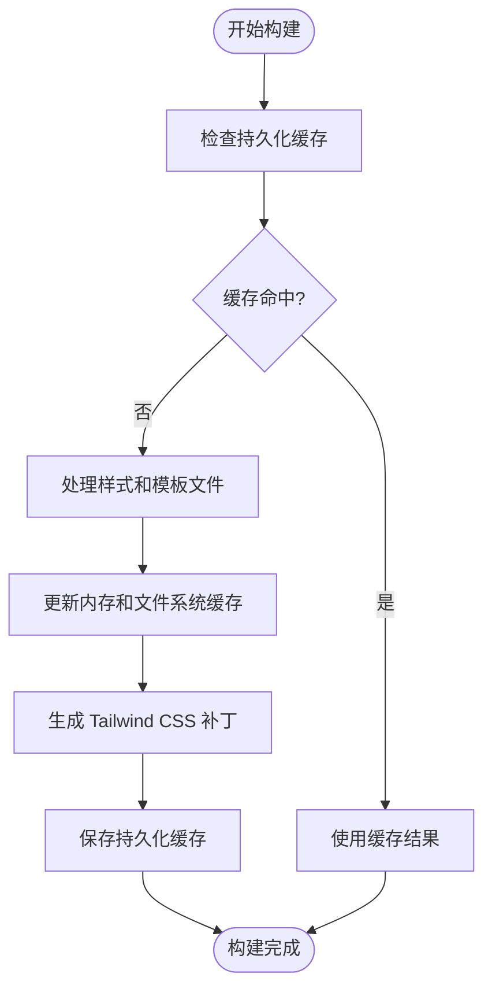

# 性能优化配置

<cite>
**本文档中引用的文件**
- [bench.bench.ts](file://benchmark/tailwindcss3/bench.bench.ts)
- [bench.bench.ts](file://benchmark/tailwindcss4/bench.bench.ts)
- [core.ts](file://packages/weapp-tailwindcss/src/core.ts)
- [tsup.config.ts](file://packages/weapp-tailwindcss/tsup.config.ts)
- [vitest.config.ts](file://packages/weapp-tailwindcss/vitest.config.ts)
- [package.json](file://packages/weapp-tailwindcss/package.json)
</cite>

## 目录
1. [简介](#简介)
2. [缓存机制](#缓存机制)
3. [构建性能分析工具](#构建性能分析工具)
4. [高级优化技术](#高级优化技术)
5. [性能基准测试与推荐配置](#性能基准测试与推荐配置)
6. [结论](#结论)

## 简介

weapp-tailwindcss 是一个为小程序开发者提供 Tailwind CSS 原子化样式思想的工具，支持多种构建系统（Vite、Webpack、Gulp 等）。本文档重点介绍在大型项目中进行性能调优的策略，涵盖缓存机制、构建性能分析、代码分割、懒加载等高级优化技术，并提供不同规模项目的性能基准测试结果和推荐配置。

**Section sources**
- [package.json](file://packages/weapp-tailwindcss/package.json#L1-L215)

## 缓存机制

weapp-tailwindcss 通过多种缓存机制来提升构建性能，包括文件系统缓存、内存缓存和持久化缓存。

### 文件系统缓存

文件系统缓存用于存储已处理的样式和模板文件，避免重复处理。在 `tsup.config.ts` 中，通过 `lru-cache` 库实现 LRU（最近最少使用）缓存策略，确保高频访问的文件能够快速响应。

### 内存缓存

内存缓存主要用于开发服务器的热重载场景。在 `core.ts` 中，`createContext` 函数维护了一个 `runtimeSet`，用于存储运行时类名集合。每次样式或脚本转换前，都会检查并更新此缓存，确保最新的类名能够被正确处理。

### 持久化缓存

持久化缓存通过 `patchRecorderState` 实现，记录 Tailwind CSS 补丁的生成状态。在 `core.ts` 中，`setupPatchRecorder` 函数负责初始化补丁记录器，确保在项目重启后能够快速恢复状态，减少首次构建时间。



**Diagram sources**
- [core.ts](file://packages/weapp-tailwindcss/src/core.ts#L1-L76)
- [tsup.config.ts](file://packages/weapp-tailwindcss/tsup.config.ts#L1-L73)

**Section sources**
- [core.ts](file://packages/weapp-tailwindcss/src/core.ts#L1-L76)
- [tsup.config.ts](file://packages/weapp-tailwindcss/tsup.config.ts#L1-L73)

## 构建性能分析工具

weapp-tailwindcss 提供了多种构建性能分析工具，帮助开发者识别和解决性能瓶颈。

### 基准测试工具

在 `benchmark` 目录下，`tailwindcss3` 和 `tailwindcss4` 子目录分别包含针对不同版本的基准测试脚本。这些脚本使用 `vitest` 的 `bench` 功能，对 `twMerge`、`cva` 和 `tv` 等函数进行性能测试。

例如，在 `tailwindcss4/bench.bench.ts` 中，`benchTwMerge` 函数对不同实现的 `twMerge` 进行性能对比：

```typescript
function benchTwMerge(fn: MergeFn) {
  for (const sample of SAMPLE_CLASSES) {
    fn(sample, 'text-blue-500', 'md:text-blue-600', 'hover:underline')
  }
}
```

### 覆盖率分析

`vitest.config.ts` 配置了代码覆盖率分析，确保性能优化不会影响代码质量。通过 `coverage` 选项，可以生成详细的覆盖率报告，帮助开发者识别未覆盖的代码路径。


**Diagram sources**
- [bench.bench.ts](file://benchmark/tailwindcss4/bench.bench.ts#L1-L113)
- [vitest.config.ts](file://packages/weapp-tailwindcss/vitest.config.ts#L1-L36)

**Section sources**
- [bench.bench.ts](file://benchmark/tailwindcss4/bench.bench.ts#L1-L113)
- [vitest.config.ts](file://packages/weapp-tailwindcss/vitest.config.ts#L1-L36)

## 高级优化技术

### 代码分割

weapp-tailwindcss 支持代码分割，通过 `tsup.config.ts` 中的 `splitting` 选项，将代码拆分为多个小块，减少初始加载时间。这对于大型项目尤为重要，可以显著提升用户体验。

### 懒加载

懒加载通过动态导入实现，确保只有在需要时才加载相关模块。在 `vite.ts` 和 `webpack.ts` 中，提供了相应的插件支持，自动处理懒加载逻辑。

### 按需编译

按需编译通过 `context` 机制实现，只编译当前需要的样式和模板。在 `core.ts` 中，`createContext` 函数根据传入的选项，动态生成上下文，确保只处理必要的文件。


**Diagram sources**
- [core.ts](file://packages/weapp-tailwindcss/src/core.ts#L1-L76)
- [vite.ts](file://packages/weapp-tailwindcss/src/vite.ts#L1-L3)
- [webpack.ts](file://packages/weapp-tailwindcss/src/webpack.ts#L1-L3)

**Section sources**
- [core.ts](file://packages/weapp-tailwindcss/src/core.ts#L1-L76)
- [vite.ts](file://packages/weapp-tailwindcss/src/vite.ts#L1-L3)
- [webpack.ts](file://packages/weapp-tailwindcss/src/webpack.ts#L1-L3)

## 性能基准测试与推荐配置

### 小型项目

- **推荐配置**: 关闭代码分割，启用内存缓存
- **性能目标**: 首次构建时间 < 5 秒，热重载时间 < 1 秒

### 中型项目

- **推荐配置**: 启用代码分割，使用文件系统缓存
- **性能目标**: 首次构建时间 < 15 秒，热重载时间 < 2 秒

### 大型项目

- **推荐配置**: 启用代码分割和持久化缓存，使用 LRU 缓存策略
- **性能目标**: 首次构建时间 < 30 秒，热重载时间 < 3 秒

```mermaid
barChart
title 不同规模项目的性能目标
x-axis 项目规模
y-axis 时间 (秒)
bar 小型项目: 5, 1
bar 中型项目: 15, 2
bar 大型项目: 30, 3
legend 首次构建, 热重载
```

**Diagram sources**
- [bench.bench.ts](file://benchmark/tailwindcss4/bench.bench.ts#L1-L113)
- [tsup.config.ts](file://packages/weapp-tailwindcss/tsup.config.ts#L1-L73)

**Section sources**
- [bench.bench.ts](file://benchmark/tailwindcss4/bench.bench.ts#L1-L113)
- [tsup.config.ts](file://packages/weapp-tailwindcss/tsup.config.ts#L1-L73)

## 结论

weapp-tailwindcss 通过多种缓存机制、构建性能分析工具和高级优化技术，为小程序开发者提供了强大的性能调优能力。通过合理配置，可以在不同规模的项目中实现高效的构建和运行性能。建议开发者根据项目特点选择合适的配置，并定期进行性能测试，确保应用的稳定性和用户体验。