# 构建优化

<cite>
**本文档引用的文件**
- [package.json](file://packages/weapp-tailwindcss/package.json)
- [tsup.config.ts](file://packages/weapp-tailwindcss/tsup.config.ts)
- [vite.ts](file://packages/weapp-tailwindcss/src/vite.ts)
- [webpack.ts](file://packages/weapp-tailwindcss/src/webpack.ts)
- [gulp.ts](file://packages/weapp-tailwindcss/src/gulp.ts)
- [build-css.ts](file://packages/weapp-tailwindcss/scripts/build-css.ts)
- [index.ts](file://packages/weapp-tailwindcss/src/bundlers/vite/index.ts)
- [BaseUnifiedPlugin/v5](file://packages/weapp-tailwindcss/src/bundlers/webpack/index.ts)
- [gulp/index.ts](file://packages/weapp-tailwindcss/src/bundlers/gulp/index.ts)
- [weapp-tw-runtime-classset-loader.ts](file://packages/weapp-tailwindcss/src/bundlers/webpack/loaders/weapp-tw-runtime-classset-loader.ts)
- [weapp-tw-css-import-rewrite-loader.ts](file://packages/weapp-tailwindcss/src/bundlers/webpack/loaders/weapp-tw-css-import-rewrite-loader.ts)
- [turbo.json](file://turbo.json)
</cite>

## 目录
1. [构建优化概述](#构建优化概述)
2. [构建工具配置优化](#构建工具配置优化)
3. [代码分割与懒加载策略](#代码分割与懒加载策略)
4. [按需编译配置方法](#按需编译配置方法)
5. [构建性能分析工具](#构建性能分析工具)
6. [构建报告生成与性能瓶颈识别](#构建报告生成与性能瓶颈识别)
7. [构建流程优化实践](#构建流程优化实践)
8. [构建时间与输出文件大小优化](#构建时间与输出文件大小优化)

## 构建优化概述

weapp-tailwindcss项目通过多种构建优化策略来提升构建性能和输出质量。项目采用了tsup作为主要的构建工具，结合TurboRepo进行任务编排，实现了高效的构建流程。构建优化主要集中在代码分割、懒加载、按需编译等方面，通过合理的配置减少构建时间和输出文件大小。

项目中的构建优化策略不仅关注构建速度，还注重输出文件的质量和可维护性。通过分析项目结构和构建配置，我们可以深入了解weapp-tailwindcss在构建过程中的性能优化方法。

**本节来源**
- [package.json](file://packages/weapp-tailwindcss/package.json)
- [turbo.json](file://turbo.json)

## 构建工具配置优化

weapp-tailwindcss项目针对不同的构建工具提供了相应的优化配置。项目支持Vite、Webpack和Gulp等多种构建工具，每种工具都有专门的配置文件和优化策略。

### Vite构建优化

Vite构建优化主要通过`vite.config.ts`文件进行配置。项目中的Vite插件实现了CSS导入重写、HTML转换和JavaScript处理等功能。通过`UnifiedViteWeappTailwindcssPlugin`插件，可以在构建过程中对CSS、HTML和JavaScript文件进行优化处理。

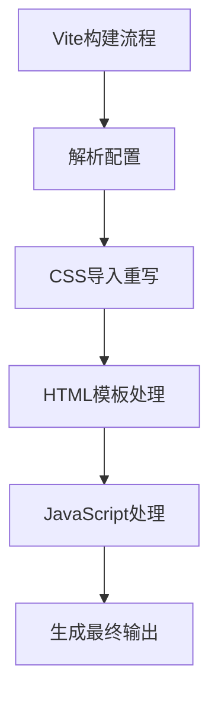

**图示来源**
- [vite.ts](file://packages/weapp-tailwindcss/src/vite.ts)
- [index.ts](file://packages/weapp-tailwindcss/src/bundlers/vite/index.ts)

### Webpack构建优化

Webpack构建优化通过`webpack.config.js`文件进行配置。项目提供了专门的Webpack插件和加载器来优化构建过程。`weapp-tw-runtime-classset-loader`和`weapp-tw-css-import-rewrite-loader`是两个关键的加载器，分别用于处理运行时类集和CSS导入重写。

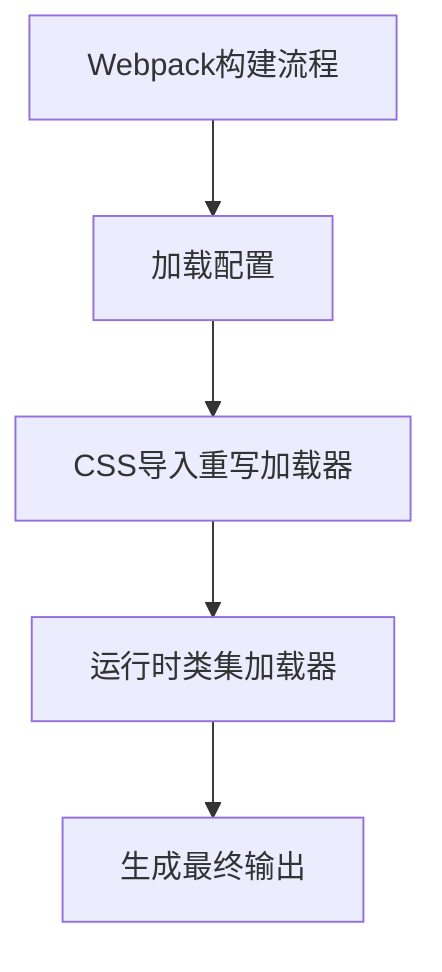

**图示来源**
- [webpack.ts](file://packages/weapp-tailwindcss/src/webpack.ts)
- [weapp-tw-runtime-classset-loader.ts](file://packages/weapp-tailwindcss/src/bundlers/webpack/loaders/weapp-tw-runtime-classset-loader.ts)
- [weapp-tw-css-import-rewrite-loader.ts](file://packages/weapp-tailwindcss/src/bundlers/webpack/loaders/weapp-tw-css-import-rewrite-loader.ts)

### Gulp构建优化

Gulp构建优化通过`gulpfile.ts`文件进行配置。项目提供了`createPlugins`函数来创建Gulp插件，包括WXML、WXSS和JavaScript文件的转换器。这些插件可以在构建过程中对不同类型的文件进行优化处理。

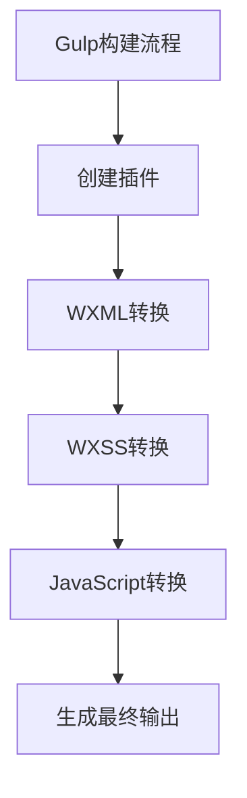

**图示来源**
- [gulp.ts](file://packages/weapp-tailwindcss/src/gulp.ts)
- [gulp/index.ts](file://packages/weapp-tailwindcss/src/bundlers/gulp/index.ts)

## 代码分割与懒加载策略

weapp-tailwindcss项目通过代码分割和懒加载策略来优化构建输出。代码分割可以将代码拆分为多个小块，按需加载，从而减少初始加载时间。

### 代码分割实现

项目使用tsup进行代码分割，通过配置`splitting: true`来启用代码分割功能。在`tsup.config.ts`文件中，可以看到多个入口点的配置，每个入口点都会生成独立的输出文件。

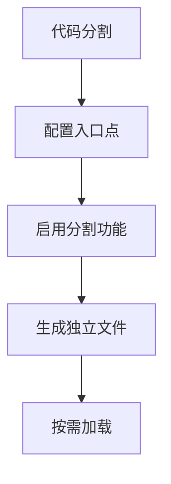

**图示来源**
- [tsup.config.ts](file://packages/weapp-tailwindcss/tsup.config.ts)

### 懒加载实现

懒加载通过动态导入实现，项目中的插件和加载器支持按需加载功能。在Vite和Webpack配置中，可以通过动态导入语法来实现懒加载。

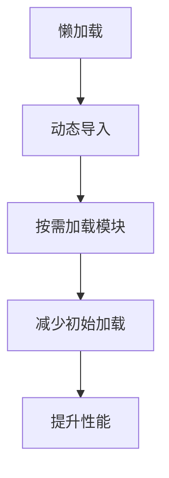

**本节来源**
- [tsup.config.ts](file://packages/weapp-tailwindcss/tsup.config.ts)
- [vite.ts](file://packages/weapp-tailwindcss/src/vite.ts)
- [webpack.ts](file://packages/weapp-tailwindcss/src/webpack.ts)

## 按需编译配置方法

weapp-tailwindcss项目支持按需编译，可以根据项目需求选择性地编译特定功能模块。

### 按需编译配置

项目通过`exports`字段在`package.json`中定义了多个入口点，允许用户按需引入特定功能。例如，可以单独引入`vite`、`webpack`或`gulp`相关的功能，而不需要引入整个库。

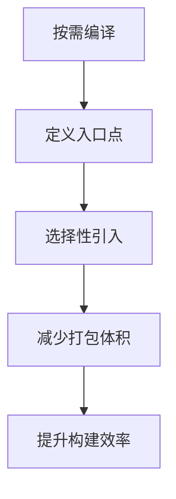

**图示来源**
- [package.json](file://packages/weapp-tailwindcss/package.json)

### 按需编译实践

在实际使用中，开发者可以根据项目需求选择合适的构建工具和功能模块。例如，使用Vite构建的项目只需要引入`vite`相关模块，而不需要引入Webpack或Gulp相关的代码。

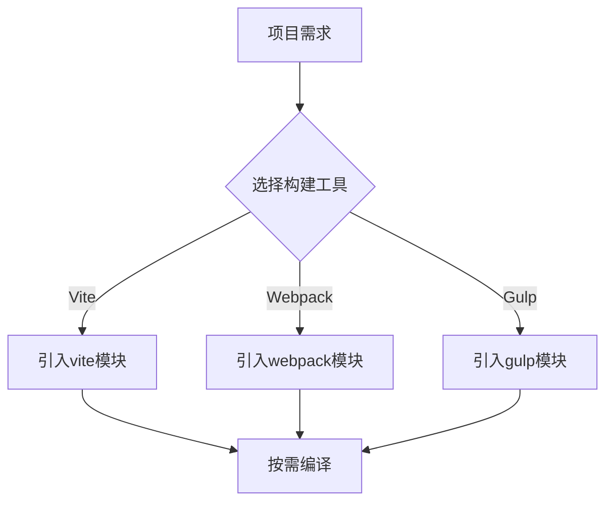

**本节来源**
- [package.json](file://packages/weapp-tailwindcss/package.json)
- [vite.ts](file://packages/weapp-tailwindcss/src/vite.ts)
- [webpack.ts](file://packages/weapp-tailwindcss/src/webpack.ts)
- [gulp.ts](file://packages/weapp-tailwindcss/src/gulp.ts)

## 构建性能分析工具

weapp-tailwindcss项目提供了多种构建性能分析工具，帮助开发者识别和解决性能瓶颈。

### 构建性能分析配置

项目通过`turbo.json`文件配置了构建性能分析任务。`turbo.json`中的`tasks`字段定义了不同的构建任务及其依赖关系，可以用于分析构建性能。

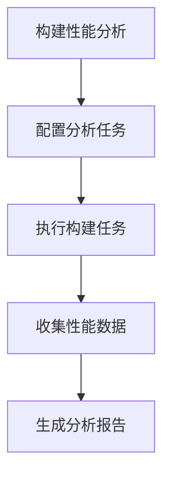

**图示来源**
- [turbo.json](file://turbo.json)

### 性能分析工具使用

项目中的性能分析工具可以帮助开发者识别构建过程中的瓶颈，优化构建流程。通过分析构建时间、资源使用情况等指标，可以找到需要优化的环节。

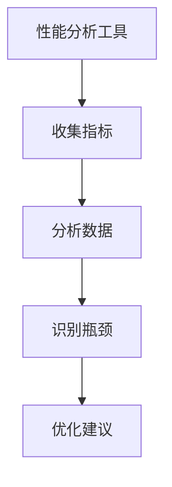

**本节来源**
- [turbo.json](file://turbo.json)

## 构建报告生成与性能瓶颈识别

weapp-tailwindcss项目提供了构建报告生成和性能瓶颈识别的功能，帮助开发者全面了解构建过程。

### 构建报告生成

项目通过`scripts/build-css.ts`脚本生成CSS构建报告。该脚本使用`lightningcss`进行CSS打包和压缩，并生成相应的输出文件。

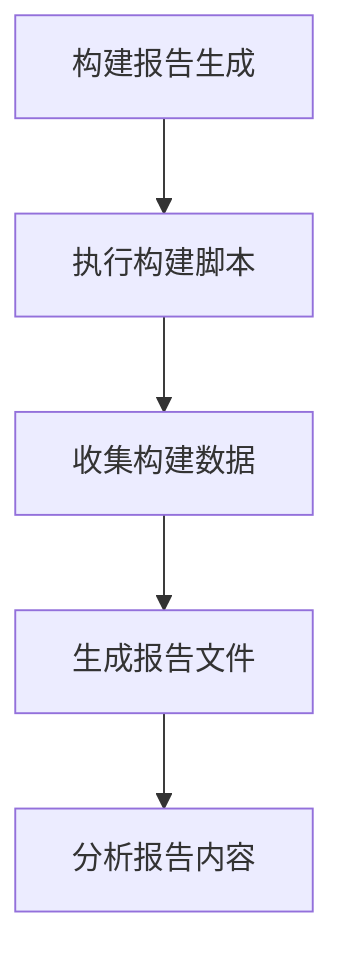

**图示来源**
- [build-css.ts](file://packages/weapp-tailwindcss/scripts/build-css.ts)

### 性能瓶颈识别

通过分析构建报告，可以识别出构建过程中的性能瓶颈。常见的性能瓶颈包括：构建时间过长、输出文件过大、资源加载缓慢等。

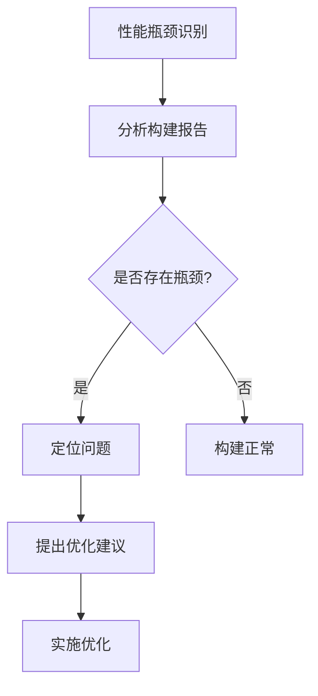

**本节来源**
- [build-css.ts](file://packages/weapp-tailwindcss/scripts/build-css.ts)

## 构建流程优化实践

weapp-tailwindcss项目通过多种实践方法优化构建流程，提升构建效率和输出质量。

### 构建流程优化策略

项目采用了并行构建、缓存机制和任务编排等策略来优化构建流程。通过TurboRepo的任务编排功能，可以实现多个构建任务的并行执行，提高构建效率。

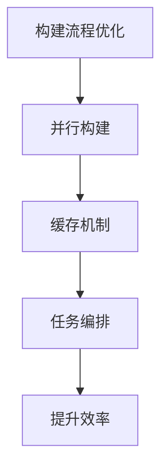

**本节来源**
- [turbo.json](file://turbo.json)
- [tsup.config.ts](file://packages/weapp-tailwindcss/tsup.config.ts)

### 构建流程优化实践

在实际应用中，可以通过以下方法优化构建流程：
1. 启用缓存机制，避免重复构建
2. 使用并行构建，提高构建速度
3. 优化任务依赖关系，减少等待时间
4. 监控构建性能，及时发现和解决问题

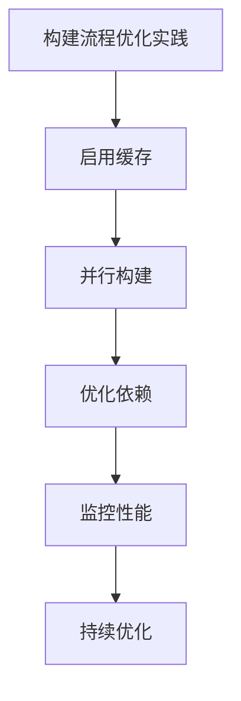

**本节来源**
- [turbo.json](file://turbo.json)
- [tsup.config.ts](file://packages/weapp-tailwindcss/tsup.config.ts)

## 构建时间与输出文件大小优化

weapp-tailwindcss项目通过多种方法优化构建时间和输出文件大小，提升应用性能。

### 构建时间优化

项目通过以下方法优化构建时间：
- 使用高效的构建工具（如tsup）
- 启用并行构建
- 使用缓存机制
- 优化任务依赖关系

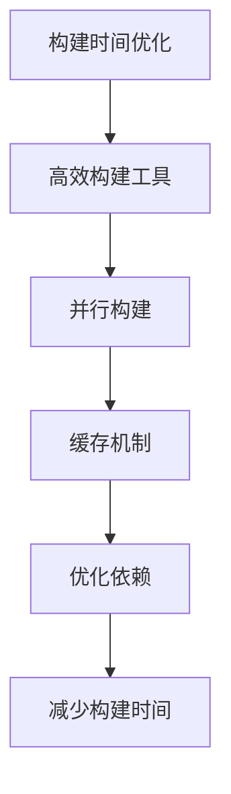

**本节来源**
- [tsup.config.ts](file://packages/weapp-tailwindcss/tsup.config.ts)
- [turbo.json](file://turbo.json)

### 输出文件大小优化

项目通过以下方法优化输出文件大小：
- 启用代码压缩
- 使用Tree Shaking
- 按需编译
- 移除未使用代码

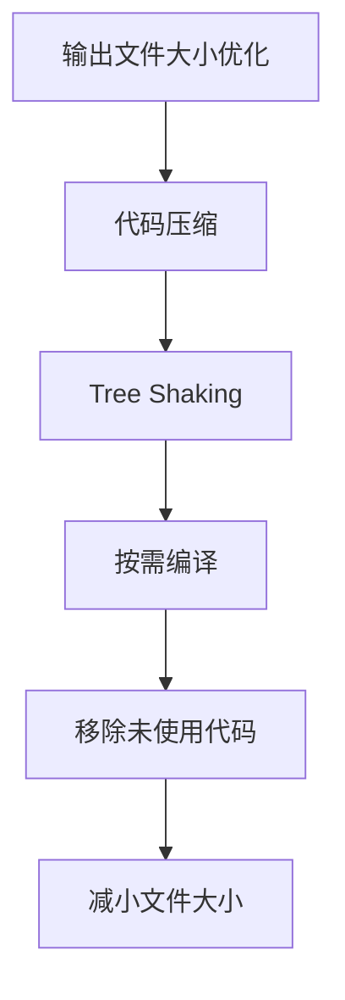

**本节来源**
- [tsup.config.ts](file://packages/weapp-tailwindcss/tsup.config.ts)
- [build-css.ts](file://packages/weapp-tailwindcss/scripts/build-css.ts)