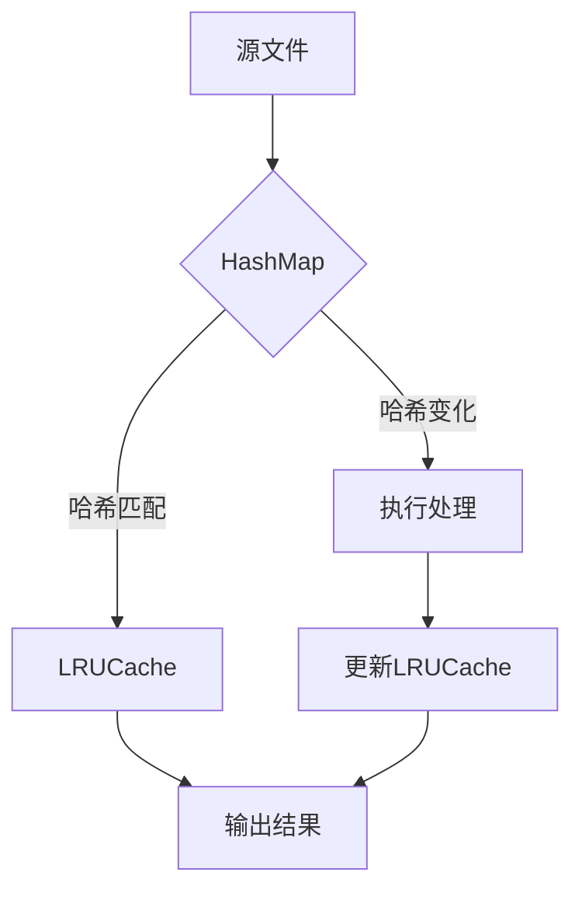
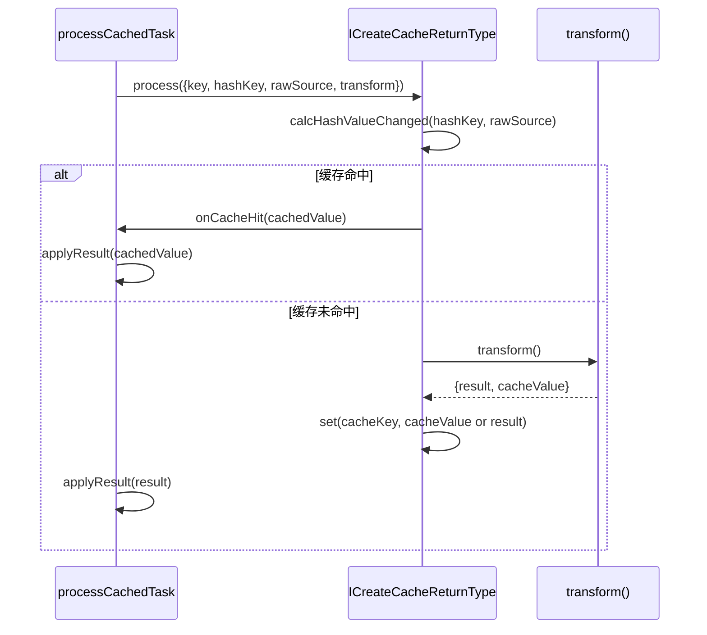
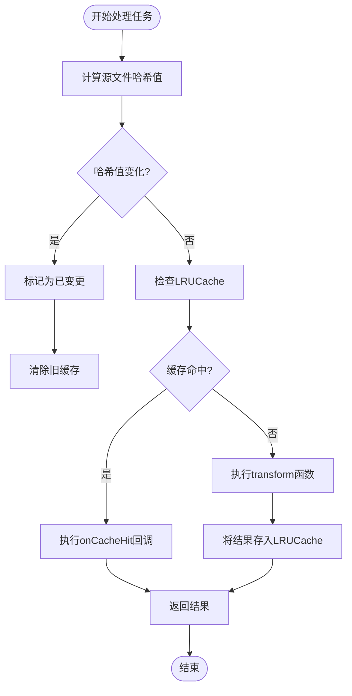
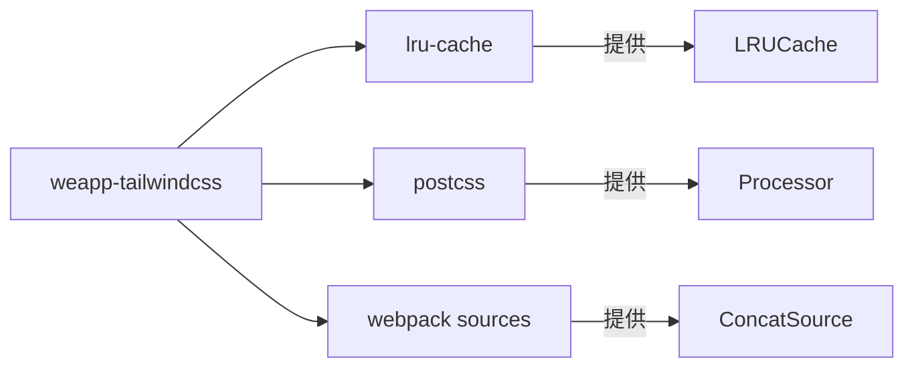

# 缓存配置

<cite>
**本文档引用的文件**  
- [cache.ts](file://packages/weapp-tailwindcss/src/cache/index.ts)
- [md5.ts](file://packages/weapp-tailwindcss/src/cache/md5.ts)
- [compiler-context-cache.ts](file://packages/weapp-tailwindcss/src/context/compiler-context-cache.ts)
- [cache.test.ts](file://packages/weapp-tailwindcss/test/cache.test.ts)
- [processor-cache.ts](file://packages/postcss/src/processor-cache.ts)
- [shared/cache.ts](file://packages/weapp-tailwindcss/src/bundlers/shared/cache.ts)
</cite>

## 目录
1. [简介](#简介)
2. [项目结构](#项目结构)
3. [核心组件](#核心组件)
4. [架构概述](#架构概述)
5. [详细组件分析](#详细组件分析)
6. [依赖分析](#依赖分析)
7. [性能考虑](#性能考虑)
8. [故障排除指南](#故障排除指南)
9. [结论](#结论)

## 简介
weapp-tailwindcss 是一个专为微信小程序优化的 Tailwind CSS 集成工具，其核心性能优势来源于精心设计的多层缓存机制。该机制显著提升了大型项目的构建速度，通过避免重复计算和资源处理来优化构建流程。本文档详细阐述其文件系统缓存、内存缓存和持久化缓存的工作原理、配置选项、缓存键生成策略、失效机制及清理方法，并提供不同环境下的最佳实践。

## 项目结构
weapp-tailwindcss 的缓存相关代码主要集中在 `packages/weapp-tailwindcss/src/cache` 和 `packages/postcss/src` 目录下。核心的缓存管理逻辑由 `cache/index.ts` 实现，而上下文缓存和处理器缓存则分别位于 `context/compiler-context-cache.ts` 和 `processor-cache.ts` 中。测试文件位于 `test/` 目录下，用于验证缓存行为。

**Section sources**
- [cache.ts](file://packages/weapp-tailwindcss/src/cache/index.ts)
- [processor-cache.ts](file://packages/postcss/src/processor-cache.ts)

## 核心组件
weapp-tailwindcss 的缓存系统由多个核心组件构成：`LRUCache` 实例用于内存中的快速缓存，`HashMap` 用于跟踪源文件的哈希变化，`StyleProcessorCache` 用于缓存 PostCSS 处理器和处理管道，以及 `compiler-context-cache` 用于缓存编译器上下文。这些组件协同工作，确保构建过程的高效性。

**Section sources**
- [cache.ts](file://packages/weapp-tailwindcss/src/cache/index.ts)
- [compiler-context-cache.ts](file://packages/weapp-tailwindcss/src/context/compiler-context-cache.ts)
- [processor-cache.ts](file://packages/postcss/src/processor-cache.ts)

## 架构概述
weapp-tailwindcss 的缓存架构采用分层设计，结合了内存缓存和基于哈希的文件状态跟踪。内存缓存（`LRUCache`）存储处理结果，而 `HashMap` 则存储源文件内容的哈希值，用于检测变化。当文件内容未变时，系统直接复用缓存结果，从而跳过昂贵的处理过程。



**Diagram sources**
- [cache.ts](file://packages/weapp-tailwindcss/src/cache/index.ts)
- [shared/cache.ts](file://packages/weapp-tailwindcss/src/bundlers/shared/cache.ts)

## 详细组件分析

### 缓存管理器分析
缓存管理器是整个系统的核心，负责协调缓存的读取、写入和失效。

#### 对于对象导向的组件：
```mermaid
classDiagram
class ICreateCacheReturnType {
+hashMap : Map<HashMapKey, CacheValue>
+instance : LRUCache<string, CacheValue>
+process(options) : Promise<CacheValue>
+get(key) : CacheValue
+has(key) : boolean
+set(key, value) : void
+calcHashValueChanged(key, hash) : boolean
}
class ProcessCachedTaskOptions {
+cache : ICreateCacheReturnType
+cacheKey : string
+hashKey? : HashMapKey
+rawSource? : string
+readCache() : CacheValue
+applyResult(value) : void
+transform() : Promise<{result, cacheValue?}>
+onCacheHit() : void
}
class StyleProcessorCache {
-pipelineCache : WeakMap
-processOptionsCache : WeakMap
-processorCache : WeakMap
+getPipeline(options) : StyleProcessingPipeline
+getProcessOptions(options) : ProcessOptions
+getProcessor(options) : Processor
}
ICreateCacheReturnType --> StyleProcessorCache : "用于缓存处理器"
ICreateCacheReturnType --> ProcessCachedTaskOptions : "作为参数传入"
```

**Diagram sources**
- [cache.ts](file://packages/weapp-tailwindcss/src/cache/index.ts)
- [shared/cache.ts](file://packages/weapp-tailwindcss/src/bundlers/shared/cache.ts)
- [processor-cache.ts](file://packages/postcss/src/processor-cache.ts)

#### 对于API/服务组件：


**Diagram sources**
- [shared/cache.ts](file://packages/weapp-tailwindcss/src/bundlers/shared/cache.ts)
- [cache.ts](file://packages/weapp-tailwindcss/src/cache/index.ts)

#### 对于复杂逻辑组件：


**Diagram sources**
- [cache.ts](file://packages/weapp-tailwindcss/src/cache/index.ts)
- [shared/cache.ts](file://packages/weapp-tailwindcss/src/bundlers/shared/cache.ts)

**Section sources**
- [cache.ts](file://packages/weapp-tailwindcss/src/cache/index.ts)
- [shared/cache.ts](file://packages/weapp-tailwindcss/src/bundlers/shared/cache.ts)
- [cache.test.ts](file://packages/weapp-tailwindcss/test/cache.test.ts)

### 缓存键生成策略
缓存键的生成是确保缓存正确性的关键。对于编译器上下文，系统使用 `createCompilerContextCacheKey` 函数，该函数首先对用户配置选项进行深度归一化（处理函数、正则表达式、Set、Map等复杂类型），然后将其序列化为字符串，并通过 MD5 哈希生成最终的缓存键。对于普通文件处理任务，缓存键通常由文件路径和内容哈希共同决定。

**Section sources**
- [compiler-context-cache.ts](file://packages/weapp-tailwindcss/src/context/compiler-context-cache.ts)
- [md5.ts](file://packages/weapp-tailwindcss/src/cache/md5.ts)

### 缓存失效机制
缓存失效基于内容哈希（content hash）的变化。系统通过 `calcHashValueChanged` 方法比较 `HashMap` 中存储的旧哈希值与当前源文件的新哈希值。如果哈希值不同，则认为文件已变更，旧缓存失效，需要重新执行处理流程。这种机制确保了缓存结果的准确性。

**Section sources**
- [cache.ts](file://packages/weapp-tailwindcss/src/cache/index.ts)

### 缓存清理方法
缓存清理主要通过两种方式实现：一是当检测到文件哈希变化时，自动清除 `LRUCache` 中对应的旧条目；二是利用 `LRUCache` 自身的容量限制和过期策略（TTL），当缓存达到上限时，自动移除最近最少使用的条目，防止内存无限增长。

**Section sources**
- [cache.ts](file://packages/weapp-tailwindcss/src/cache/index.ts)

## 依赖分析
weapp-tailwindcss 的缓存系统依赖于 `lru-cache` 库来实现高性能的内存缓存。同时，它与 `postcss` 库深度集成，通过 `StyleProcessorCache` 缓存 PostCSS 处理器实例和插件管道，避免了重复创建的开销。此外，`webpack` 的 `sources` 模块被用于处理和缓存源码。



**Diagram sources**
- [package.json](file://packages/weapp-tailwindcss/package.json)
- [cache.ts](file://packages/weapp-tailwindcss/src/cache/index.ts)
- [processor-cache.ts](file://packages/postcss/src/processor-cache.ts)

**Section sources**
- [package.json](file://packages/weapp-tailwindcss/package.json)

## 性能考虑
多层缓存机制极大地提升了构建性能，尤其是在大型项目中。通过复用编译器上下文和 PostCSS 处理器，避免了重复的初始化开销。基于哈希的缓存失效策略确保了增量构建的高效性。在开发环境下，内存缓存能提供最快的响应速度；在生产环境下，合理的缓存配置可以显著缩短 CI/CD 流水线的构建时间。

## 故障排除指南
如果遇到缓存相关的问题，如样式未更新，可以尝试以下方法：
1.  **检查缓存键**：确认 `HashMap` 是否正确计算了文件哈希。
2.  **验证缓存失效**：确保 `calcHashValueChanged` 方法能正确检测到文件变更。
3.  **查看日志**：启用调试日志，观察 `logger.debug` 输出，了解缓存命中和未命中的情况。
4.  **临时禁用缓存**：在测试时，可以创建一个禁用的缓存实例（`createCache(false)`）来确认问题是否由缓存引起。

**Section sources**
- [cache.ts](file://packages/weapp-tailwindcss/src/cache/index.ts)
- [compiler-context-cache.ts](file://packages/weapp-tailwindcss/src/context/compiler-context-cache.ts)
- [logger.ts](file://packages/logger/src/index.ts)

## 结论
weapp-tailwindcss 的多层缓存机制是其高性能的核心。通过结合内存缓存、哈希校验和智能失效策略，它能够显著提升构建速度。理解其工作原理和配置选项，有助于开发者在不同环境下优化构建流程，充分发挥其性能优势。