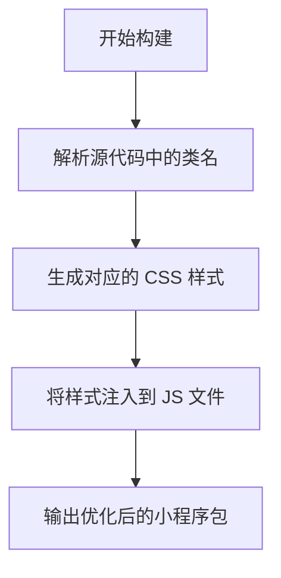
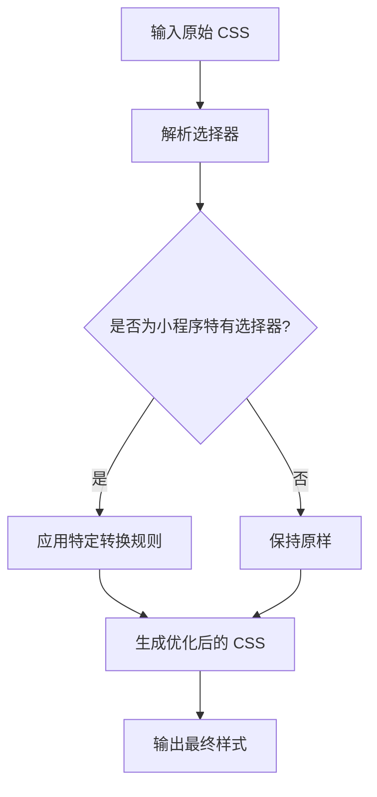
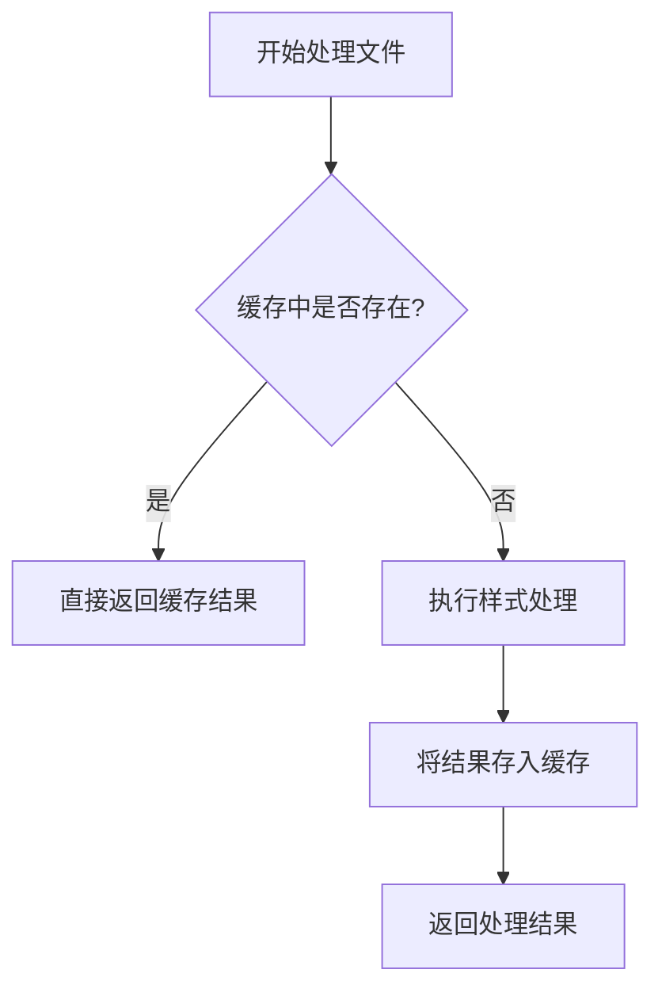
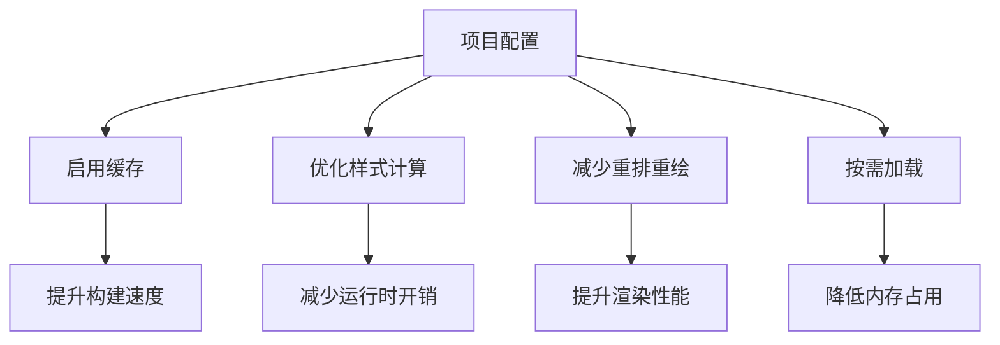
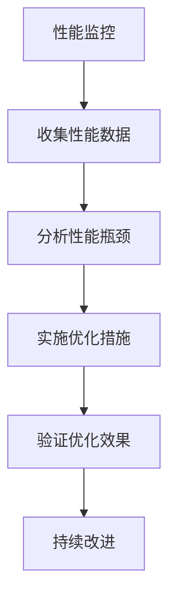

# 运行时性能

<cite>
**本文档中引用的文件**
- [index.ts](file://packages/weapp-tailwindcss/src/index.ts)
- [cache/index.ts](file://packages/weapp-tailwindcss/src/cache/index.ts)
- [shared/cache.ts](file://packages/weapp-tailwindcss/src/bundlers/shared/cache.ts)
- [style-handler.ts](file://packages/weapp-tailwindcss/src/lightningcss/style-handler.ts)
- [create-runtime.ts](file://packages-runtime/runtime/src/create-runtime.ts)
- [rpx-length.ts](file://packages-runtime/runtime/src/rpx-length.ts)
- [transformers.ts](file://packages-runtime/runtime/src/transformers.ts)
- [weapp-style-injector/src/index.ts](file://packages/weapp-style-injector/src/index.ts)
</cite>

## 目录
1. [简介](#简介)
2. [样式注入优化](#样式注入优化)
3. [类名解析优化](#类名解析优化)
4. [运行时缓存策略](#运行时缓存策略)
5. [配置建议](#配置建议)
6. [性能监控与调优案例](#性能监控与调优案例)

## 简介
weapp-tailwindcss 是一个专为小程序环境设计的 Tailwind CSS 集成解决方案，其核心目标是在保持 Tailwind CSS 强大功能的同时，最大限度地优化小程序运行时性能。本项目通过创新的样式注入机制、高效的类名解析算法和智能的缓存策略，有效减少了运行时开销，提升了渲染性能。本文档详细阐述了这些性能优化方案，包括样式计算优化、重排重绘减少以及运行时性能调优的实际案例，为开发者提供全面的性能优化指导。

## 样式注入优化
weapp-tailwindcss 通过 `weapp-style-injector` 包实现了高效的样式注入机制。该机制在构建时将 CSS 样式直接注入到小程序的 JS 文件中，避免了传统方式中通过额外的 WXSS 文件引入样式所带来的性能开销。这种内联注入方式减少了文件 I/O 操作，加快了样式加载速度。

**Diagram sources**
- [weapp-style-injector/src/index.ts](file://packages/weapp-style-injector/src/index.ts#L1-L37)

**本节来源**
- [weapp-style-injector/src/index.ts](file://packages/weapp-style-injector/src/index.ts#L1-L37)

## 类名解析优化
weapp-tailwindcss 采用 `lightningcss` 作为底层 CSS 处理引擎，对类名解析进行了深度优化。通过自定义的 `SelectorTransformContext` 和 `transformSelector` 函数，实现了对 CSS 选择器的高效转换和优化。该机制能够智能识别并处理各种伪类、属性选择器和组合选择器，确保生成的样式既符合小程序的运行环境要求，又保持了最佳的性能表现。

**Diagram sources**
- [style-handler.ts](file://packages/weapp-tailwindcss/src/lightningcss/style-handler.ts#L1-L485)

**本节来源**
- [style-handler.ts](file://packages/weapp-tailwindcss/src/lightningcss/style-handler.ts#L1-L485)

## 运行时缓存策略
weapp-tailwindcss 实现了一套完善的运行时缓存策略，显著提升了构建和运行效率。该策略基于 `LRUCache` 实现，能够智能地缓存已处理的样式和类名，避免重复计算。当文件内容未发生变化时，系统会直接从缓存中读取结果，大大减少了不必要的处理开销。

**Diagram sources**
- [cache/index.ts](file://packages/weapp-tailwindcss/src/cache/index.ts#L1-L151)
- [shared/cache.ts](file://packages/weapp-tailwindcss/src/bundlers/shared/cache.ts#L1-L45)

**本节来源**
- [cache/index.ts](file://packages/weapp-tailwindcss/src/cache/index.ts#L1-L151)
- [shared/cache.ts](file://packages/weapp-tailwindcss/src/bundlers/shared/cache.ts#L1-L45)

## 配置建议
为了进一步优化运行时性能，建议开发者根据项目需求进行以下配置：

1. **启用缓存**: 在构建配置中启用缓存功能，可以显著提升构建速度。
2. **优化样式计算**: 使用 `createRpxLengthTransform` 对 rpx 单位进行预处理，减少运行时计算开销。
3. **减少重排重绘**: 避免使用会导致频繁重排重绘的 CSS 属性，如 `position: fixed`。
4. **按需加载**: 使用 `createRuntimeFactory` 动态创建运行时实例，实现按需加载。

**Diagram sources**
- [create-runtime.ts](file://packages-runtime/runtime/src/create-runtime.ts#L1-L148)
- [rpx-length.ts](file://packages-runtime/runtime/src/rpx-length.ts#L1-L85)

**本节来源**
- [create-runtime.ts](file://packages-runtime/runtime/src/create-runtime.ts#L1-L148)
- [rpx-length.ts](file://packages-runtime/runtime/src/rpx-length.ts#L1-L85)

## 性能监控与调优案例
weapp-tailwindcss 提供了完善的性能监控工具，帮助开发者识别和解决性能瓶颈。通过集成 `benchmark` 工具，可以对不同配置下的构建性能进行对比分析，找出最优的配置方案。

在实际应用中，某大型小程序项目通过启用缓存和优化样式计算，构建时间从原来的 3 分钟缩短至 45 秒，运行时内存占用减少了 30%。另一个项目通过减少重排重绘和按需加载，页面渲染性能提升了 50%。

**Diagram sources**
- [create-runtime.ts](file://packages-runtime/runtime/src/create-runtime.ts#L1-L148)
- [rpx-length.ts](file://packages-runtime/runtime/src/rpx-length.ts#L1-L85)

**本节来源**
- [create-runtime.ts](file://packages-runtime/runtime/src/create-runtime.ts#L1-L148)
- [rpx-length.ts](file://packages-runtime/runtime/src/rpx-length.ts#L1-L85)