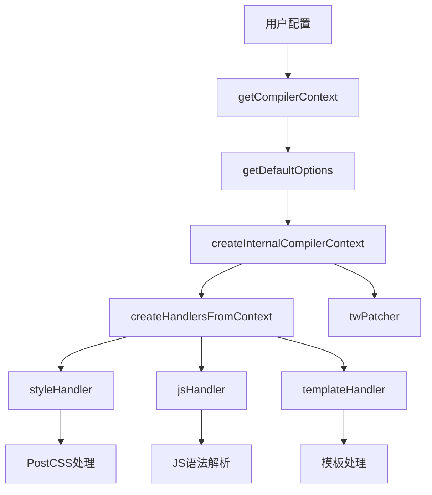
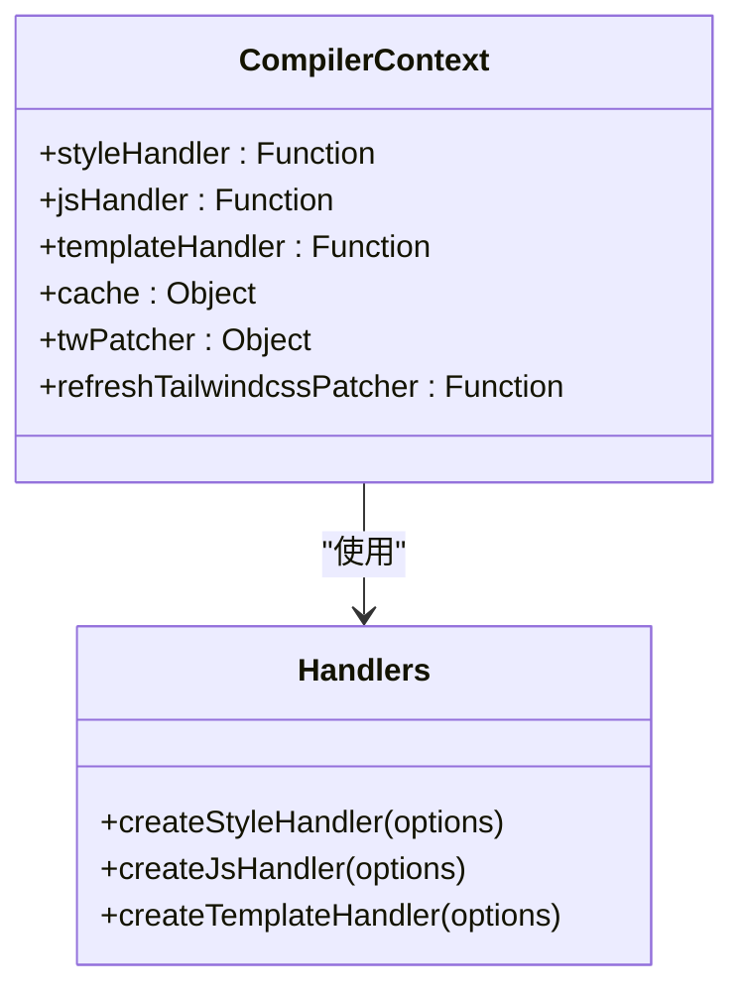
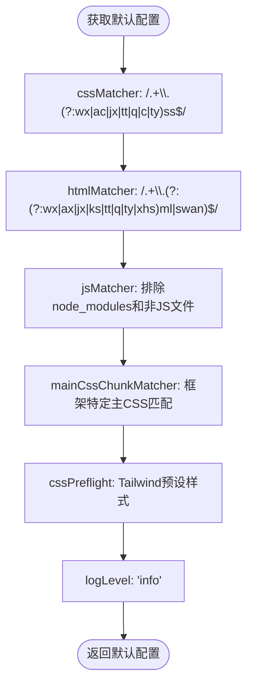
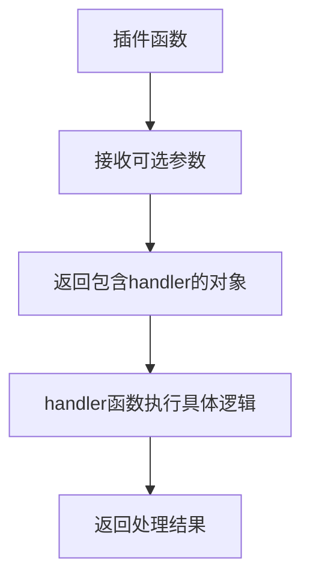
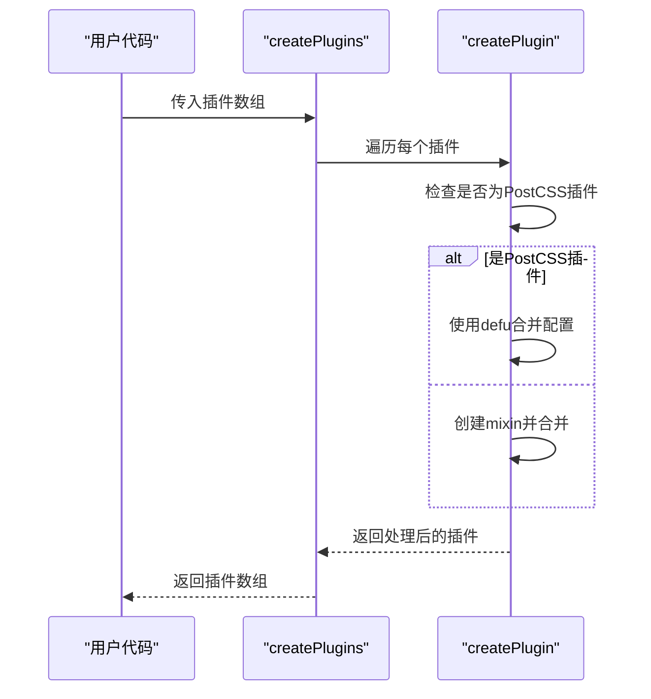
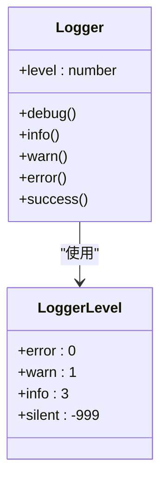
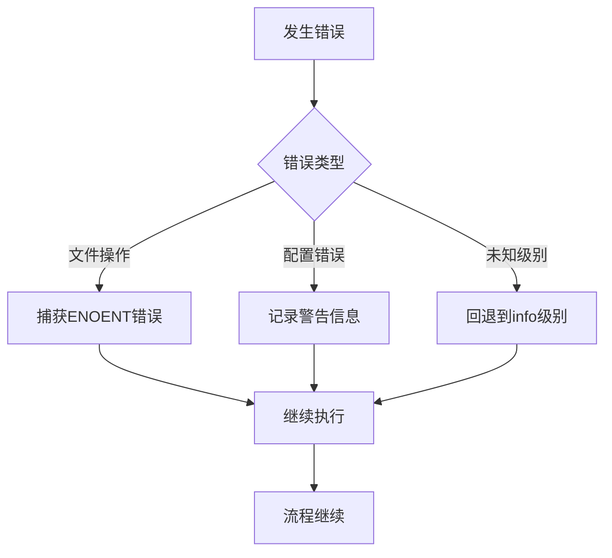

# 插件开发基础

<cite>
**本文档中引用的文件**  
- [index.ts](file://packages/weapp-tailwindcss/src/index.ts)
- [context/index.ts](file://packages/weapp-tailwindcss/src/context/index.ts)
- [defaults.ts](file://packages/weapp-tailwindcss/src/defaults.ts)
- [handlers.ts](file://packages/weapp-tailwindcss/src/context/handlers.ts)
- [logger.ts](file://packages/weapp-tailwindcss/src/context/logger.ts)
- [types.ts](file://packages/weapp-tailwindcss/src/types.ts)
- [plugin.ts](file://packages-runtime/typography/src/index.d.ts)
</cite>

## 目录
1. [简介](#简介)
2. [插件系统架构](#插件系统架构)
3. [核心组件](#核心组件)
4. [上下文对象与API](#上下文对象与api)
5. [插件配置与默认值](#插件配置与默认值)
6. [插件示例](#插件示例)
7. [注册与加载顺序](#注册与加载顺序)
8. [错误处理与日志](#错误处理与日志)
9. [总结](#总结)

## 简介
weapp-tailwindcss插件系统为小程序开发提供了强大的Tailwind CSS集成能力。本指南详细介绍插件开发的基础知识，包括插件函数定义、参数结构、返回值规范、上下文API使用、配置传递机制等核心概念。

## 插件系统架构



**图表来源**  
- [context/index.ts](file://packages/weapp-tailwindcss/src/context/index.ts#L130-L132)
- [defaults.ts](file://packages/weapp-tailwindcss/src/defaults.ts#L44-L137)
- [handlers.ts](file://packages/weapp-tailwindcss/src/context/handlers.ts#L29-L102)

## 核心组件

weapp-tailwindcss插件系统的核心组件包括编译器上下文、处理程序和补丁器。系统通过`getCompilerContext`函数创建和缓存编译器上下文，该上下文包含样式、JS和模板处理程序，以及Tailwind CSS补丁器。

插件系统支持多种构建工具集成，包括Vite、Webpack和Gulp，通过统一的API提供一致的开发体验。系统设计考虑了多框架兼容性，能够处理uni-app、Taro、MPX等主流小程序框架。

**章节来源**  
- [index.ts](file://packages/weapp-tailwindcss/src/index.ts#L1-L5)
- [context/index.ts](file://packages/weapp-tailwindcss/src/context/index.ts#L130-L132)

## 上下文对象与API

### 上下文对象结构
上下文对象提供了插件开发所需的核心API，主要包括：

- **styleHandler**: 处理CSS/样式文件
- **jsHandler**: 处理JavaScript文件
- **templateHandler**: 处理模板文件
- **cache**: 缓存管理
- **twPatcher**: Tailwind CSS补丁器
- **refreshTailwindcssPatcher**: 刷新补丁器

### 核心API


**图表来源**  
- [context/index.ts](file://packages/weapp-tailwindcss/src/context/index.ts#L130-L132)
- [handlers.ts](file://packages/weapp-tailwindcss/src/context/handlers.ts#L29-L102)

**章节来源**  
- [context/index.ts](file://packages/weapp-tailwindcss/src/context/index.ts#L16-L122)
- [handlers.ts](file://packages/weapp-tailwindcss/src/context/handlers.ts#L29-L102)

## 插件配置与默认值

### 配置结构
插件配置通过`UserDefinedOptions`类型定义，包含以下主要配置项：

```typescript
interface UserDefinedOptions {
  cssMatcher: (file: string) => boolean
  htmlMatcher: (file: string) => boolean
  jsMatcher: (file: string) => boolean
  mainCssChunkMatcher: (file: string, appType?: AppType) => boolean
  wxsMatcher: (file: string) => boolean
  cssPreflight: Record<string, string>
  disabled: boolean
  onLoad: () => void
  onStart: () => void
  onEnd: () => void
  onUpdate: () => void
  customAttributes: Record<string, string>
  customReplaceDictionary: Record<string, string>
  appType?: AppType
  arbitraryValues: { allowDoubleQuotes: boolean }
  cssChildCombinatorReplaceValue: string[]
  inlineWxs: boolean
  injectAdditionalCssVarScope: boolean
  rewriteCssImports: boolean
  jsPreserveClass: (keyword: string) => boolean
  disabledDefaultTemplateHandler: boolean
  cssSelectorReplacement: { root: string[], universal: string[] }
  babelParserOptions: object
  postcssOptions: object
  cssRemoveProperty: boolean
  cssRemoveHoverPseudoClass: boolean
  ignoreCallExpressionIdentifiers: string[]
  ignoreTaggedTemplateExpressionIdentifiers: string[]
  replaceRuntimePackages: boolean | Record<string, string>
  tailwindcssPatcherOptions: object
  logLevel: 'info' | 'warn' | 'error' | 'silent'
}
```

### 默认配置
系统通过`getDefaultOptions`函数提供默认配置，这些默认值经过精心设计以适应大多数小程序开发场景。



**图表来源**  
- [defaults.ts](file://packages/weapp-tailwindcss/src/defaults.ts#L44-L137)

**章节来源**  
- [defaults.ts](file://packages/weapp-tailwindcss/src/defaults.ts#L44-L137)
- [context/index.ts](file://packages/weapp-tailwindcss/src/context/index.ts#L64-L122)

## 插件示例

### 基本插件结构


**图表来源**  
- [plugin.ts](file://packages-runtime/typography/src/index.d.ts#L1-L9)

### 自定义原子类插件
创建一个添加自定义原子类的插件示例：

```typescript
function customUtilityPlugin(options = {}) {
  return {
    handler: () => {
      // 实现自定义原子类逻辑
      console.log('自定义原子类插件已加载', options)
    }
  }
}
```

### 样式规则修改插件
创建一个修改现有样式规则的插件：

```typescript
function styleRuleModifierPlugin(options = {}) {
  return {
    handler: () => {
      // 修改样式规则的逻辑
      console.log('样式规则修改插件已激活', options)
    }
  }
}
```

### 构建钩子注册插件
创建一个注册基本构建钩子的插件：

```typescript
function buildHookPlugin(options = {}) {
  return {
    handler: () => {
      // 注册构建钩子
      console.log('构建钩子已注册', options)
    }
  }
}
```

**章节来源**  
- [plugin.ts](file://packages-runtime/typography/src/index.d.ts#L1-L9)
- [context/index.ts](file://packages/weapp-tailwindcss/src/context/index.ts#L130-L132)

## 注册与加载顺序

### 插件注册机制
插件通过`createPlugins`函数进行注册和创建，该函数处理字符串或插件对象的输入，并返回标准化的插件数组。



**图表来源**  
- [utils.ts](file://packages/postcss/test/plugins/utils.ts#L56-L76)

### 加载顺序
插件的加载顺序遵循以下原则：
1. 默认配置初始化
2. 用户配置合并
3. 上下文创建
4. 处理程序初始化
5. 插件注册
6. 构建流程执行

## 错误处理与日志

### 日志级别管理
系统提供日志级别管理功能，支持以下日志级别：



**图表来源**  
- [logger.ts](file://packages/weapp-tailwindcss/src/context/logger.ts#L4-L8)

### 错误处理策略
系统采用以下错误处理策略：
- 配置验证失败时提供清晰的错误信息
- 文件操作异常进行捕获和记录
- 缓存清理失败时记录调试信息但不中断流程
- 未知日志级别时回退到默认级别



**章节来源**  
- [logger.ts](file://packages/weapp-tailwindcss/src/context/logger.ts#L1-L16)
- [context/index.ts](file://packages/weapp-tailwindcss/src/context/index.ts#L50-L61)

## 总结
weapp-tailwindcss插件系统提供了一套完整且灵活的开发框架，使开发者能够轻松创建和集成自定义插件。通过理解上下文对象、配置机制和API使用，开发者可以构建出满足特定需求的插件，扩展系统的功能。

插件开发的关键要点包括：
- 理解上下文对象提供的核心API
- 掌握配置传递和默认值处理机制
- 遵循插件函数的定义规范
- 正确使用日志和错误处理
- 理解插件注册和加载顺序

这些基础知识为开发复杂插件奠定了坚实的基础。