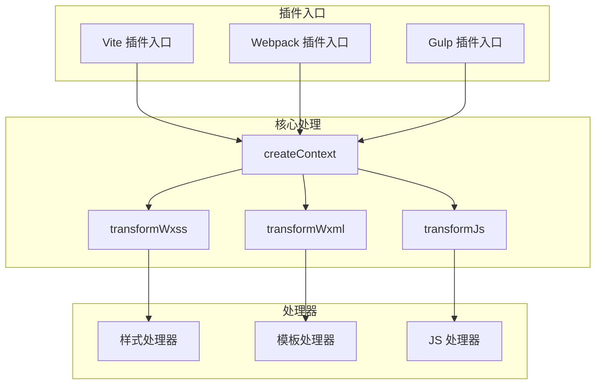
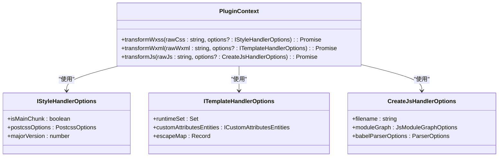
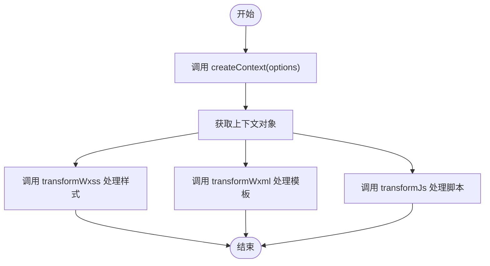

# 插件开发指南

<cite>
**本文档中引用的文件**
- [core.ts](file://packages/weapp-tailwindcss/src/core.ts)
- [context/index.ts](file://packages/weapp-tailwindcss/src/context/index.ts)
- [handlers.ts](file://packages/weapp-tailwindcss/src/context/handlers.ts)
- [vite/index.ts](file://packages/weapp-tailwindcss/src/bundlers/vite/index.ts)
- [webpack/index.ts](file://packages/weapp-tailwindcss/src/bundlers/webpack/index.ts)
- [gulp/index.ts](file://packages/weapp-tailwindcss/src/bundlers/gulp/index.ts)
- [types/index.ts](file://packages/weapp-tailwindcss/src/types/index.ts)
- [createContext.ts](file://packages/weapp-tailwindcss/src/core.ts)
- [tailwindcss/runtime.ts](file://packages/weapp-tailwindcss/src/tailwindcss/runtime.ts)
- [tailwindcss/recorder.ts](file://packages/weapp-tailwindcss/src/tailwindcss/recorder.ts)
- [js/index.ts](file://packages/weapp-tailwindcss/src/js/index.ts)
- [wxml/index.ts](file://packages/weapp-tailwindcss/src/wxml/index.ts)
- [postcss/index.ts](file://packages/weapp-tailwindcss/src/postcss/index.ts)
</cite>

## 目录
1. [简介](#简介)
2. [插件系统架构](#插件系统架构)
3. [核心组件](#核心组件)
4. [插件上下文对象](#插件上下文对象)
5. [插件创建流程](#插件创建流程)
6. [插件类型示例](#插件类型示例)
7. [插件依赖与命名冲突](#插件依赖与命名冲突)
8. [生命周期钩子](#生命周期钩子)
9. [配置选项处理](#配置选项处理)
10. [总结](#总结)

## 简介
weapp-tailwindcss 是一个为小程序开发者提供 Tailwind CSS 原子化样式思想的工具。本指南详细介绍了其插件系统的架构和实现原理，包括插件的创建流程、上下文对象结构、可用 API 以及如何处理插件依赖关系和避免命名冲突。

## 插件系统架构
weapp-tailwindcss 的插件系统基于 Vite、Webpack 和 Gulp 等构建工具的插件机制，通过统一的 API 提供对小程序模板（WXML）、样式（WXSS）和脚本（JS）的转换能力。插件系统的核心是 `createContext` 函数，它创建了一个包含 `transformWxss`、`transformWxml` 和 `transformJs` 方法的上下文对象。

**图源**
- [core.ts](file://packages/weapp-tailwindcss/src/core.ts)
- [vite/index.ts](file://packages/weapp-tailwindcss/src/bundlers/vite/index.ts)
- [webpack/index.ts](file://packages/weapp-tailwindcss/src/bundlers/webpack/index.ts)
- [gulp/index.ts](file://packages/weapp-tailwindcss/src/bundlers/gulp/index.ts)

## 核心组件
weapp-tailwindcss 的核心组件包括 `createContext` 函数、`getCompilerContext` 函数以及各种处理器（`styleHandler`、`templateHandler`、`jsHandler`）。这些组件共同协作，实现了对小程序代码的转换。

**节源**
- [core.ts](file://packages/weapp-tailwindcss/src/core.ts)
- [context/index.ts](file://packages/weapp-tailwindcss/src/context/index.ts)
- [handlers.ts](file://packages/weapp-tailwindcss/src/context/handlers.ts)

## 插件上下文对象
插件上下文对象是插件系统的核心，它包含了所有必要的 API 和配置选项。通过 `createContext` 函数创建的上下文对象提供了 `transformWxss`、`transformWxml` 和 `transformJs` 方法，用于处理小程序的样式、模板和脚本。

**图源**
- [core.ts](file://packages/weapp-tailwindcss/src/core.ts)
- [types/index.ts](file://packages/weapp-tailwindcss/src/types/index.ts)

## 插件创建流程
创建一个 weapp-tailwindcss 插件的流程如下：

1. 调用 `createContext` 函数，传入用户定义的选项。
2. 使用返回的上下文对象中的 `transformWxss`、`transformWxml` 和 `transformJs` 方法处理小程序代码。
3. 在构建工具的插件生命周期中调用相应的转换方法。

**图源**
- [core.ts](file://packages/weapp-tailwindcss/src/core.ts)
- [vite/index.ts](file://packages/weapp-tailwindcss/src/bundlers/vite/index.ts)

## 插件类型示例
### CSS 处理插件
CSS 处理插件负责处理小程序的样式文件。通过 `transformWxss` 方法，可以对 CSS 代码进行转换，例如生成自定义原子类。

**节源**
- [core.ts](file://packages/weapp-tailwindcss/src/core.ts)
- [postcss/index.ts](file://packages/weapp-tailwindcss/src/postcss/index.ts)

### WXML 转换插件
WXML 转换插件负责处理小程序的模板文件。通过 `transformWxml` 方法，可以对 WXML 代码进行转换，例如注入类名。

**节源**
- [core.ts](file://packages/weapp-tailwindcss/src/core.ts)
- [wxml/index.ts](file://packages/weapp-tailwindcss/src/wxml/index.ts)

### 构建流程插件
构建流程插件负责在构建过程中处理资源优化等任务。通过 Vite、Webpack 或 Gulp 的插件机制，可以在构建流程中调用 `transformWxss`、`transformWxml` 和 `transformJs` 方法。

**节源**
- [vite/index.ts](file://packages/weapp-tailwindcss/src/bundlers/vite/index.ts)
- [webpack/index.ts](file://packages/weapp-tailwindcss/src/bundlers/webpack/index.ts)
- [gulp/index.ts](file://packages/weapp-tailwindcss/src/bundlers/gulp/index.ts)

## 插件依赖与命名冲突
weapp-tailwindcss 插件系统通过模块化设计和命名空间管理来避免命名冲突。插件之间的依赖关系通过构建工具的依赖管理系统进行管理。

**节源**
- [types/index.ts](file://packages/weapp-tailwindcss/src/types/index.ts)
- [context/index.ts](file://packages/weapp-tailwindcss/src/context/index.ts)

## 生命周期钩子
weapp-tailwindcss 插件系统提供了多个生命周期钩子，例如 `onStart`、`onEnd`、`onUpdate` 等，用于在构建流程的不同阶段执行自定义逻辑。

**节源**
- [vite/index.ts](file://packages/weapp-tailwindcss/src/bundlers/vite/index.ts)
- [webpack/index.ts](file://packages/weapp-tailwindcss/src/bundlers/webpack/index.ts)
- [gulp/index.ts](file://packages/weapp-tailwindcss/src/bundlers/gulp/index.ts)

## 配置选项处理
插件的配置选项通过 `UserDefinedOptions` 类型定义，包括 `cssMatcher`、`mainCssChunkMatcher`、`cssPreflight` 等。这些选项可以在创建上下文对象时传入。

**节源**
- [types/index.ts](file://packages/weapp-tailwindcss/src/types/index.ts)
- [context/index.ts](file://packages/weapp-tailwindcss/src/context/index.ts)

## 总结
weapp-tailwindcss 插件系统提供了一套完整的 API 和工具，使开发者能够轻松地为小程序项目集成 Tailwind CSS 的原子化样式思想。通过理解插件系统的架构和实现原理，开发者可以创建各种类型的插件，满足不同的开发需求。