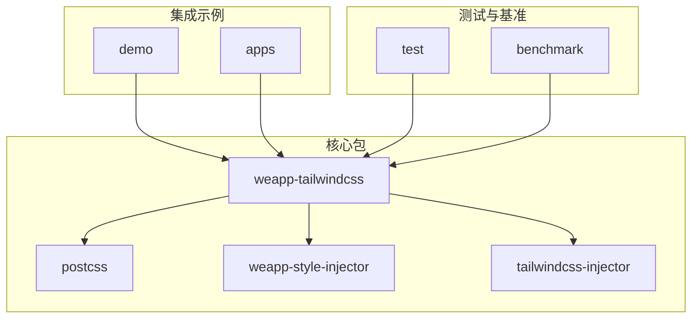
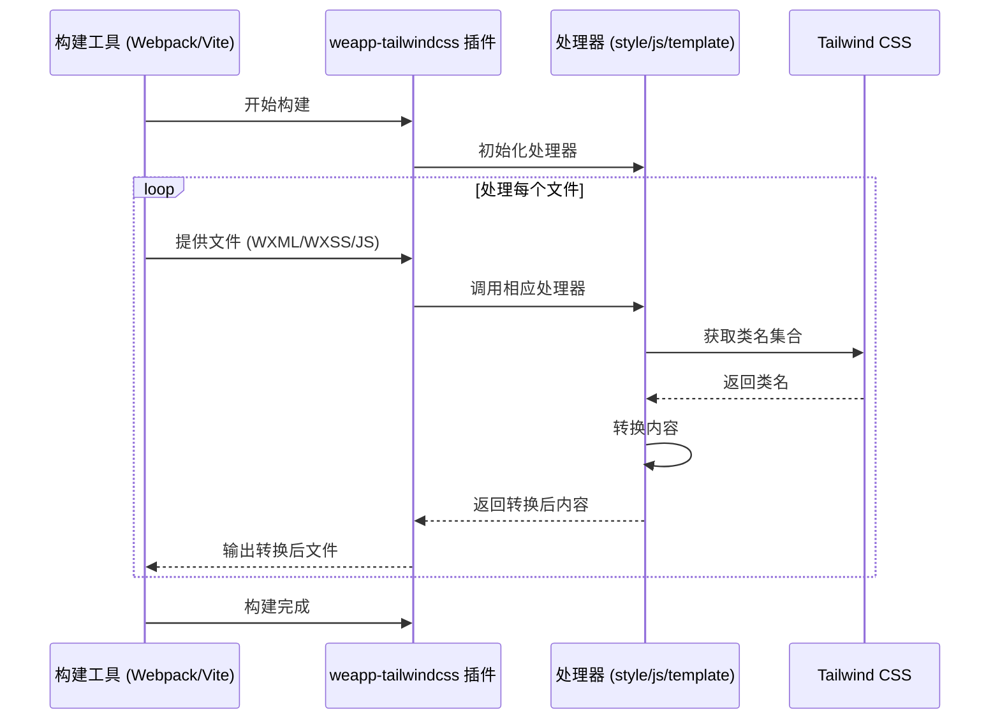
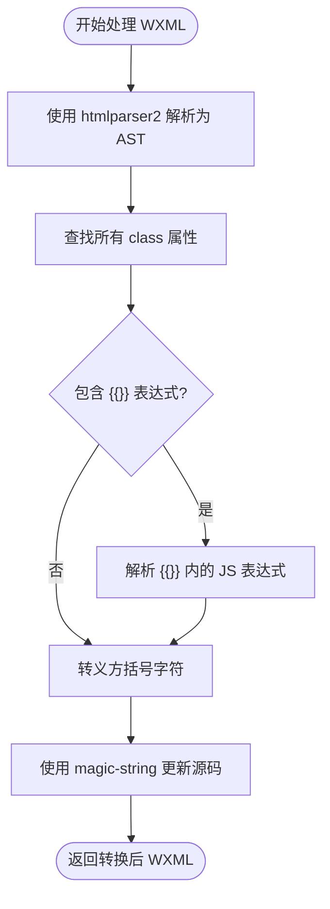
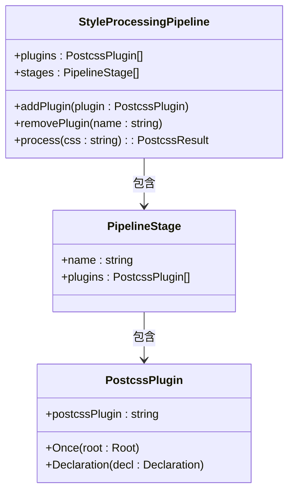
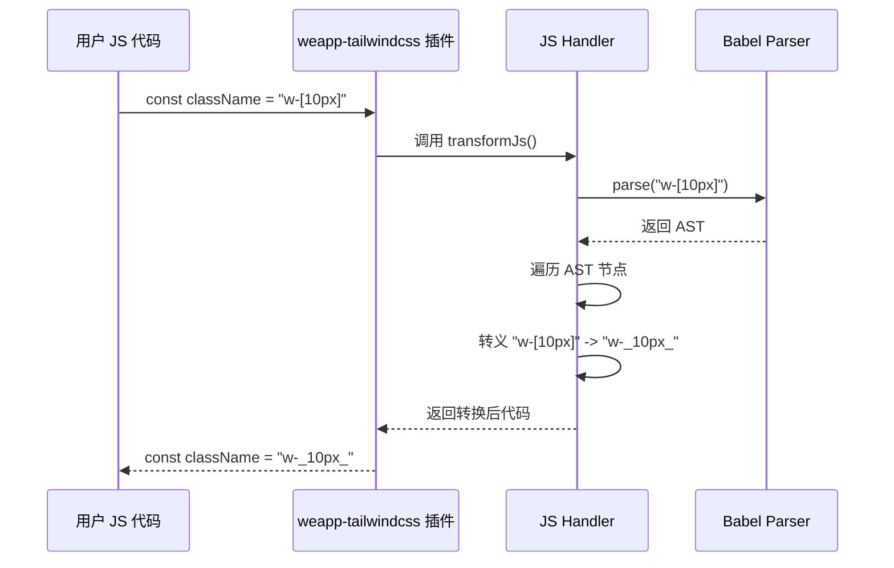
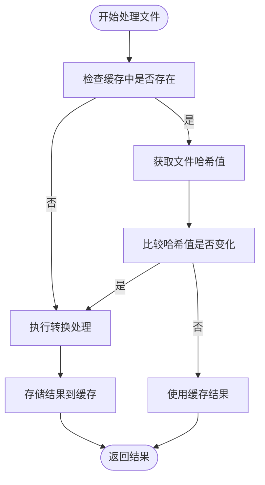

# 插件开发高级模式

<cite>
**本文档引用的文件**  
- [index.ts](file://packages/weapp-tailwindcss/src/index.ts)
- [context/index.ts](file://packages/weapp-tailwindcss/src/context/index.ts)
- [types/index.ts](file://packages/weapp-tailwindcss/src/types/index.ts)
- [postcss/src/index.ts](file://packages/postcss/src/index.ts)
- [templateReplacer.ts](file://packages/weapp-tailwindcss/src/wxml/utils.ts)
- [handler.ts](file://packages/postcss/src/handler.ts)
- [pipeline.ts](file://packages/postcss/src/pipeline.ts)
- [cache/index.ts](file://packages/weapp-tailwindcss/src/cache/index.ts)
</cite>

## 目录
1. [简介](#简介)
2. [项目结构](#项目结构)
3. [核心组件](#核心组件)
4. [架构概述](#架构概述)
5. [详细组件分析](#详细组件分析)
6. [依赖分析](#依赖分析)
7. [性能考虑](#性能考虑)
8. [故障排除指南](#故障排除指南)
9. [结论](#结论)

## 简介
本文档旨在深入探讨 weapp-tailwindcss 插件系统的高级开发模式，涵盖 AST 操作、WXML 节点转换、CSS 规则深度修改等复杂用例。文档将详细说明如何创建高级插件，实现条件编译、动态样式生成、资源优化压缩和自定义预处理器等功能。同时，还将介绍插件间的通信机制、依赖管理、性能优化技巧以及调试和测试的最佳实践。

## 项目结构
weapp-tailwindcss 项目采用 monorepo 结构，核心插件功能主要集中在 `packages` 目录下。`weapp-tailwindcss` 包是主插件，提供与构建工具（如 Webpack、Vite、Gulp）集成的能力。`postcss` 包负责处理 CSS 转换，而 `weapp-style-injector` 等包则处理样式注入。`demo` 和 `apps` 目录包含各种集成示例，`test` 目录包含全面的测试用例。



**图示来源**
- [packages/weapp-tailwindcss](file://packages/weapp-tailwindcss)
- [packages/postcss](file://packages/postcss)
- [demo](file://demo)
- [apps](file://apps)

## 核心组件
weapp-tailwindcss 的核心在于其处理不同文件类型（WXML、WXSS、JS）的能力。它通过 `getCompilerContext` 函数创建一个包含 `styleHandler`、`jsHandler` 和 `templateHandler` 的编译上下文。这些处理器分别负责 CSS、JavaScript 和 WXML 模板的转换，确保 Tailwind CSS 类名能在小程序环境中正确解析和应用。

**本节来源**
- [context/index.ts](file://packages/weapp-tailwindcss/src/context/index.ts)
- [types/index.ts](file://packages/weapp-tailwindcss/src/types/index.ts)

## 架构概述
weapp-tailwindcss 的架构是一个分层的处理管道。在构建过程中，插件会拦截 WXML、WXSS 和 JS 文件。对于 WXML，它使用 `htmlparser2` 解析 AST，识别并转义包含方括号的 Tailwind 类名。对于 WXSS，它通过 PostCSS 插件管道处理 CSS，应用预设和用户配置。对于 JS，它使用 Babel 或 SWC 解析 AST，安全地处理动态类名绑定。



**图示来源**
- [index.ts](file://packages/weapp-tailwindcss/src/index.ts)
- [context/index.ts](file://packages/weapp-tailwindcss/src/context/index.ts)
- [handler.ts](file://packages/postcss/src/handler.ts)

## 详细组件分析

### WXML 处理器分析
WXML 处理器负责将模板中的 Tailwind CSS 类名转换为小程序可接受的格式。它使用 `htmlparser2` 解析 WXML 为 AST，然后遍历节点，找到所有包含 `class`、`hover-class` 等属性的元素。

#### WXML 处理流程


**图示来源**
- [templateReplacer.ts](file://packages/weapp-tailwindcss/src/wxml/utils.ts)
- [htmlparser2](https://www.npmjs.com/package/htmlparser2)

**本节来源**
- [templateReplacer.ts](file://packages/weapp-tailwindcss/src/wxml/utils.ts)

### CSS 处理器分析
CSS 处理器是基于 PostCSS 构建的，它创建了一个可扩展的处理管道。该管道可以注入预设的 CSS 规则（如 `preflight`），并允许用户通过配置添加自定义的 PostCSS 插件。

#### CSS 处理管道


**图示来源**
- [pipeline.ts](file://packages/postcss/src/pipeline.ts)
- [handler.ts](file://packages/postcss/src/handler.ts)

**本节来源**
- [pipeline.ts](file://packages/postcss/src/pipeline.ts)
- [handler.ts](file://packages/postcss/src/handler.ts)

### JS 处理器分析
JS 处理器用于处理 JavaScript 文件中动态绑定的类名。它使用 Babel 或 SWC 解析 JS 代码为 AST，然后遍历 AST 以找到需要转义的类名字符串。

#### JS 处理器调用流程


**图示来源**
- [types/index.ts](file://packages/weapp-tailwindcss/src/types/index.ts)
- [js-bench.ts](file://packages/weapp-tailwindcss/scripts/js-bench.ts)

**本节来源**
- [types/index.ts](file://packages/weapp-tailwindcss/src/types/index.ts)

## 依赖分析
weapp-tailwindcss 依赖于多个关键的第三方库来实现其功能。`postcss` 用于 CSS 转换，`htmlparser2` 用于 WXML 解析，`@babel/parser` 用于 JS AST 操作，`magic-string` 用于高效地修改源代码字符串。这些依赖共同构成了插件的核心处理能力。

```mermaid
graph LR
A[weapp-tailwindcss] --> B[postcss]
A --> C[htmlparser2]
A --> D[@babel/parser]
A --> E[magic-string]
A --> F[tailwindcss]
B --> F
D --> G[@babel/traverse]
D --> H[@babel/generator]
```

**图示来源**
- [package.json](file://packages/weapp-tailwindcss/package.json)
- [package.json](file://packages/postcss/package.json)

**本节来源**
- [package.json](file://packages/weapp-tailwindcss/package.json)

## 性能考虑
为了处理大量文件时保持高性能，weapp-tailwindcss 实现了多层缓存机制。`ICreateCacheReturnType` 接口定义了缓存实例，用于存储已处理文件的结果。通过 `computeHash` 和 `calcHashValueChanged` 方法，插件可以判断文件内容是否发生变化，从而决定是否复用缓存结果，避免重复处理。



**图示来源**
- [cache/index.ts](file://packages/weapp-tailwindcss/src/cache/index.ts)

**本节来源**
- [cache/index.ts](file://packages/weapp-tailwindcss/src/cache/index.ts)

## 故障排除指南
当插件行为不符合预期时，可以利用项目中的单元测试进行调试。项目使用 `vitest` 作为测试框架，提供了大量的测试用例。可以通过在测试文件中添加 `console.log` 语句或在源码中设置断点，然后运行或调试特定的测试用例来定位问题。

**本节来源**
- [how-to-contribute.md](file://website/build/how-to-contribute.md)
- [test](file://packages/weapp-tailwindcss/test)

## 结论
weapp-tailwindcss 插件通过结合 AST 操作、PostCSS 管道和智能缓存，成功地将 Tailwind CSS 的强大功能引入到小程序开发中。其模块化的架构和清晰的处理流程为开发高级插件提供了坚实的基础。通过遵循本文档中介绍的模式，开发者可以创建出功能强大、性能优越的定制化插件，以满足复杂的开发需求。