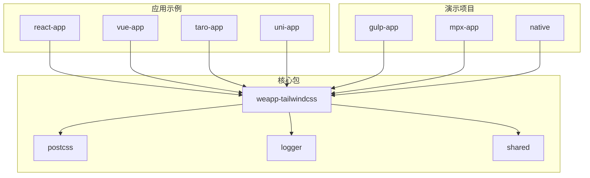
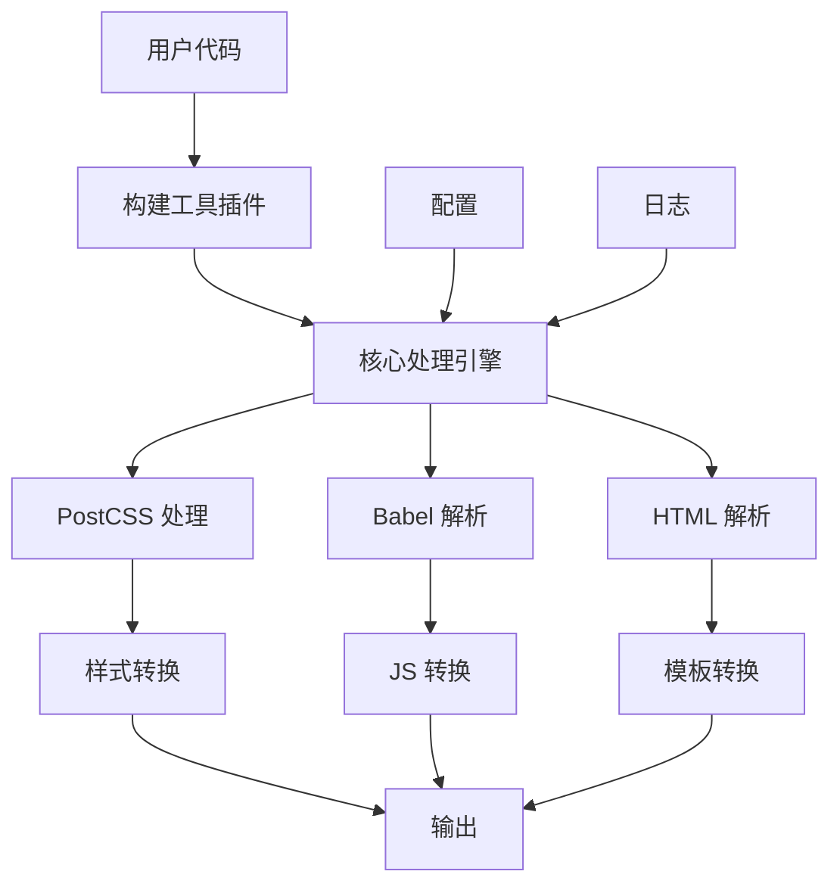
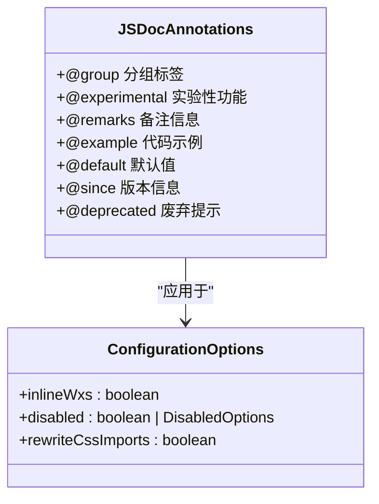
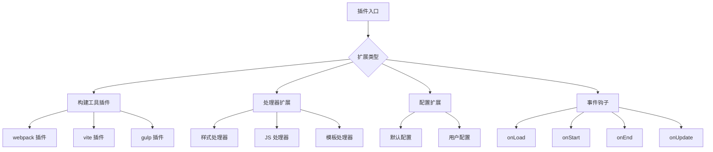
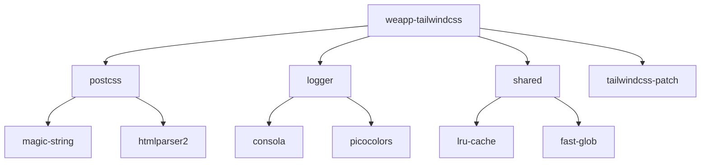
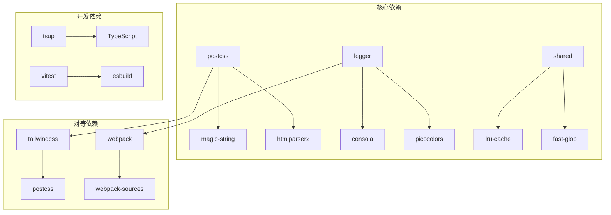
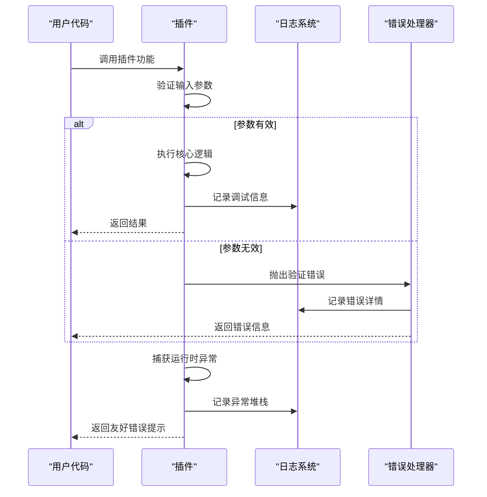

# 插件可维护性

<cite>
**本文档中引用的文件**  
- [index.ts](file://packages/weapp-tailwindcss/src/index.ts)
- [package.json](file://packages/weapp-tailwindcss/package.json)
- [README.md](file://packages/weapp-tailwindcss/README.md)
- [defaults.ts](file://packages/weapp-tailwindcss/src/defaults.ts)
- [types/index.ts](file://packages/weapp-tailwindcss/src/types/index.ts)
- [typedoc.export.ts](file://packages/weapp-tailwindcss/src/typedoc.export.ts)
- [utils/disabled.ts](file://packages/weapp-tailwindcss/src/utils/disabled.ts)
- [logger/src/index.ts](file://packages/logger/src/index.ts)
</cite>

## 目录
1. [简介](#简介)
2. [项目结构](#项目结构)
3. [核心组件](#核心组件)
4. [架构概述](#架构概述)
5. [详细组件分析](#详细组件分析)
6. [依赖分析](#依赖分析)
7. [性能考虑](#性能考虑)
8. [故障排除指南](#故障排除指南)
9. [结论](#结论)

## 简介

weapp-tailwindcss 是一个为小程序开发者提供 Tailwind CSS 原子化样式思想的解决方案。该项目旨在降低开发和维护成本，提升开发效率。它支持多种主流框架和原生开发方式，包括 webpack、vite、rspack、rollup、rolldown 和 gulp。插件能够自动识别并精确处理所有 Tailwind CSS 的工具类来适配小程序环境。

**Section sources**
- [README.md](file://packages/weapp-tailwindcss/README.md#L1-L101)

## 项目结构

weapp-tailwindcss 项目采用 monorepo 结构，包含多个包和应用示例。主要目录包括：

- `packages/`: 核心功能包，如 weapp-tailwindcss、postcss、logger 等
- `apps/`: 各种框架的应用示例，如 react-app、vue-app、taro-app 等
- `demo/`: 演示项目，展示不同构建工具的使用方法
- `templates/`: 项目模板，方便快速启动新项目
- `benchmark/`: 性能基准测试
- `e2e/`: 端到端测试

这种结构使得核心功能与示例应用分离，便于独立维护和测试。



**Diagram sources**
- [package.json](file://package.json#L1-L215)
- [pnpm-workspace.yaml](file://pnpm-workspace.yaml#L1-L10)

## 核心组件

weapp-tailwindcss 的核心组件主要包括：

- **插件系统**: 支持多种构建工具（webpack、vite、gulp 等）
- **样式处理**: 处理 Tailwind CSS 在小程序环境中的适配
- **JS 处理**: 处理 JavaScript 中的类名转换
- **模板处理**: 处理 WXML/AXML 等模板文件
- **日志系统**: 提供详细的构建过程日志

这些组件通过清晰的接口定义和模块化设计实现了高内聚低耦合。

**Section sources**
- [index.ts](file://packages/weapp-tailwindcss/src/index.ts#L1-L5)
- [package.json](file://packages/weapp-tailwindcss/package.json#L1-L215)

## 架构概述

weapp-tailwindcss 采用分层架构设计，各层职责分明：



**Diagram sources**
- [index.ts](file://packages/weapp-tailwindcss/src/index.ts#L1-L5)
- [types/index.ts](file://packages/weapp-tailwindcss/src/types/index.ts#L1-L190)

## 详细组件分析

### 配置系统分析

weapp-tailwindcss 的配置系统设计遵循了可维护性的最佳实践，包括默认值设置、类型安全和向后兼容性。

#### 配置选项类型定义
```mermaid
classDiagram
class UserDefinedOptions {
+cssMatcher : (file : string) => boolean
+htmlMatcher : (file : string) => boolean
+jsMatcher : (file : string) => boolean
+mainCssChunkMatcher : (file : string, appType? : AppType) => boolean
+wxsMatcher : (file : string) => boolean
+cssPreflight : Record<string, string>
+disabled : boolean | DisabledOptions
+onLoad : () => void
+onStart : () => void
+onEnd : () => void
+onUpdate : () => void
+customAttributes : ICustomAttributes
+customReplaceDictionary : Record<string, string>
+appType : AppType
+arbitraryValues : IArbitraryValues
+cssChildCombinatorReplaceValue : string[]
+inlineWxs : boolean
+injectAdditionalCssVarScope : boolean
+rewriteCssImports : boolean
+jsPreserveClass : (keyword : string) => boolean | undefined
+disabledDefaultTemplateHandler : boolean
+cssSelectorReplacement : {root : string[], universal : string[]}
+babelParserOptions : ParserOptions
+postcssOptions : any
+cssRemoveProperty : boolean
+cssRemoveHoverPseudoClass : boolean
+ignoreCallExpressionIdentifiers : (string | RegExp)[]
+ignoreTaggedTemplateExpressionIdentifiers : (string | RegExp)[]
+replaceRuntimePackages : boolean
+tailwindcssPatcherOptions : {filter : (className : string) => boolean}
+logLevel : 'debug' | 'info' | 'warn' | 'error'
}
class InternalUserDefinedOptions {
+cssMatcher : (file : string) => boolean
+htmlMatcher : (file : string) => boolean
+jsMatcher : (file : string) => boolean
+mainCssChunkMatcher : (file : string, appType? : AppType) => boolean
+wxsMatcher : (file : string) => boolean
+cssPreflight : Record<string, string>
+disabled : ResolvedDisabledOptions
+onLoad : () => void
+onStart : () => void
+onEnd : () => void
+onUpdate : () => void
+customAttributes : ICustomAttributes
+customReplaceDictionary : Record<string, string>
+appType : AppType
+arbitraryValues : IArbitraryValues
+cssChildCombinatorReplaceValue : string[]
+inlineWxs : boolean
+injectAdditionalCssVarScope : boolean
+rewriteCssImports : boolean
+jsPreserveClass : (keyword : string) => boolean | undefined
+disabledDefaultTemplateHandler : boolean
+cssSelectorReplacement : {root : string[], universal : string[]}
+babelParserOptions : ParserOptions
+postcssOptions : any
+cssRemoveProperty : boolean
+cssRemoveHoverPseudoClass : boolean
+ignoreCallExpressionIdentifiers : (string | RegExp)[]
+ignoreTaggedTemplateExpressionIdentifiers : (string | RegExp)[]
+replaceRuntimePackages : boolean
+tailwindcssPatcherOptions : {filter : (className : string) => boolean}
+logLevel : 'debug' | 'info' | 'warn' | 'error'
+templateHandler : (rawSource : string, options? : ITemplateHandlerOptions) => Promise<string>
+styleHandler : (rawSource : string, options? : IStyleHandlerOptions) => Promise<PostcssResult<Root | Document>>
+jsHandler : JsHandler
+escapeMap : Record<string, string>
+cache : ICreateCacheReturnType
+twPatcher : TailwindcssPatcherLike
+refreshTailwindcssPatcher : (options? : RefreshTailwindcssPatcherOptions) => Promise<TailwindcssPatcherLike>
}
UserDefinedOptions <|-- InternalUserDefinedOptions : "扩展"
```

**Diagram sources**
- [types/index.ts](file://packages/weapp-tailwindcss/src/types/index.ts#L7-L145)
- [typedoc.export.ts](file://packages/weapp-tailwindcss/src/typedoc.export.ts#L315-L362)

### 文档注释分析

weapp-tailwindcss 项目采用了 JSDoc 标准进行代码注释，确保了代码的可读性和可维护性。

#### JSDoc 注释示例


**Diagram sources**
- [typedoc.export.ts](file://packages/weapp-tailwindcss/src/typedoc.export.ts#L315-L362)
- [defaults.ts](file://packages/weapp-tailwindcss/src/defaults.ts#L44-L137)

### 可扩展架构分析

weapp-tailwindcss 采用了可扩展的架构模式，支持插件功能的灵活扩展。

#### 扩展点设计


**Diagram sources**
- [index.ts](file://packages/weapp-tailwindcss/src/index.ts#L1-L5)
- [package.json](file://packages/weapp-tailwindcss/package.json#L42-L128)

### 模块化设计分析

weapp-tailwindcss 采用了模块化设计，促进代码复用和解耦。

#### 模块依赖关系


**Diagram sources**
- [package.json](file://packages/weapp-tailwindcss/package.json#L188-L212)
- [package.json](file://packages/logger/package.json#L1-L20)

## 依赖分析

weapp-tailwindcss 项目的依赖关系清晰，核心包之间耦合度低。



**Diagram sources**
- [package.json](file://packages/weapp-tailwindcss/package.json#L188-L212)
- [package.json](file://packages/postcss/package.json#L1-L20)
- [package.json](file://packages/logger/package.json#L1-L20)

## 性能考虑

weapp-tailwindcss 在设计时充分考虑了性能因素：

1. **缓存机制**: 使用 LRU 缓存避免重复计算
2. **异步处理**: 采用异步 API 提高构建效率
3. **按需处理**: 只处理匹配的文件类型
4. **配置优化**: 提供多种配置选项以平衡功能和性能

这些设计确保了插件在大型项目中的高效运行。

## 故障排除指南

weapp-tailwindcss 提供了完善的错误处理和日志记录机制。

### 错误处理规范


**Diagram sources**
- [logger/src/index.ts](file://packages/logger/src/index.ts#L1-L9)
- [utils/disabled.ts](file://packages/weapp-tailwindcss/src/utils/disabled.ts#L1-L19)

### 日志记录规范
日志系统采用分级记录策略：

- **debug**: 详细调试信息
- **info**: 重要操作记录
- **warn**: 潜在问题警告
- **error**: 错误信息

这有助于开发者快速定位和解决问题。

**Section sources**
- [logger/src/index.ts](file://packages/logger/src/index.ts#L1-L9)
- [defaults.ts](file://packages/weapp-tailwindcss/src/defaults.ts#L135-L136)

## 结论

weapp-tailwindcss 插件通过以下方式实现了高可维护性：

1. **清晰的文档注释**: 采用 JSDoc 标准，包含详细的类型定义、示例和说明
2. **合理的配置设计**: 提供合理的默认值，确保类型安全和向后兼容性
3. **可扩展的架构**: 支持多种构建工具和自定义扩展点
4. **模块化设计**: 各组件职责分明，便于独立维护和测试
5. **完善的错误处理**: 提供详细的日志记录和错误信息

这些设计原则共同确保了插件的长期可维护性和易用性。