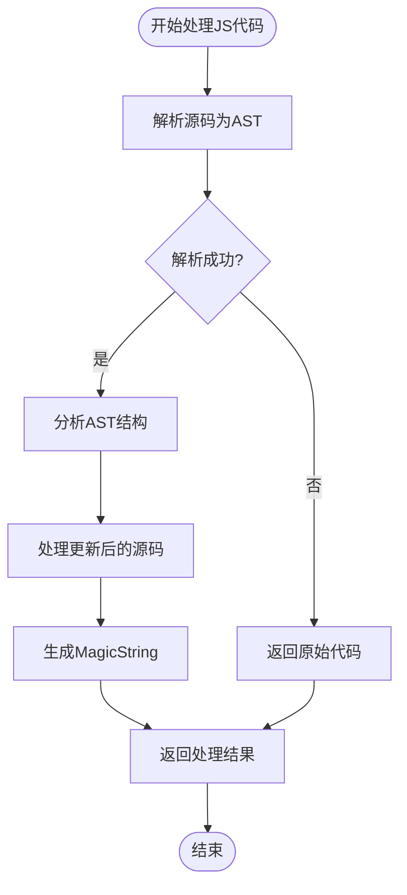
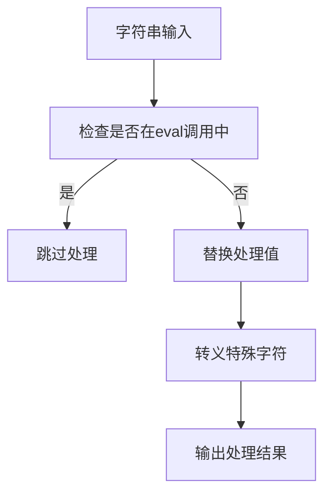
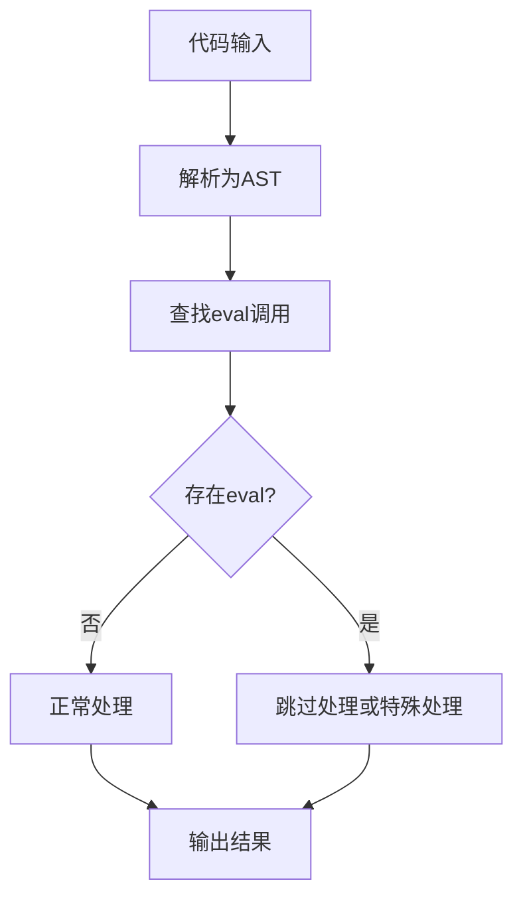
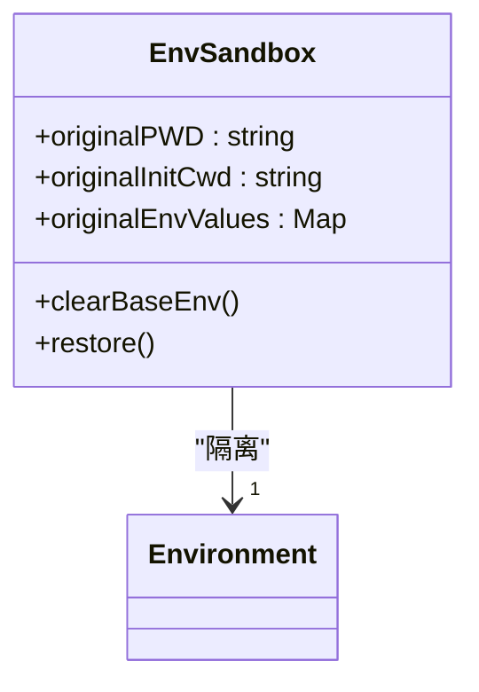
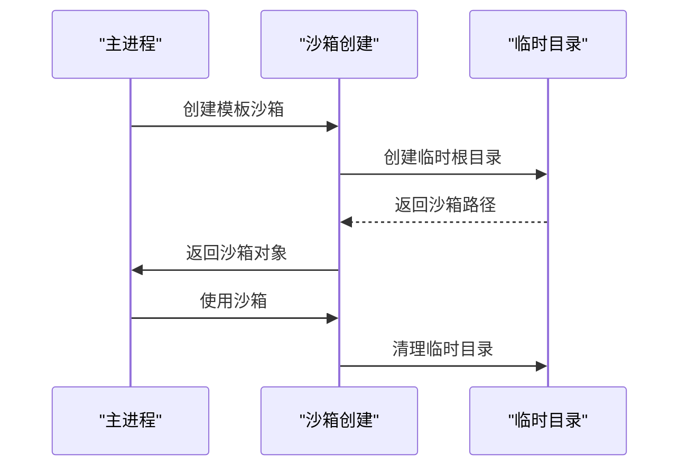
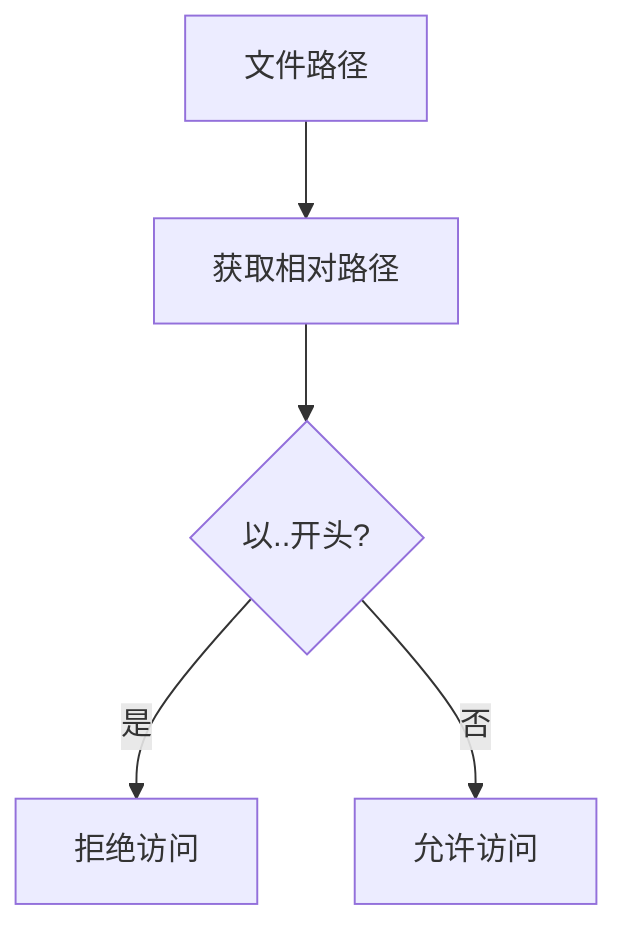

# 插件安全性

<cite>
**本文档中引用的文件**  
- [jsHandler.js](file://demo/rax-app/weapp-tw-dist/options-3191f9c8.js)
- [jsHandler.mjs](file://demo/taro-vue3-app/weapp-tw-dist/options-a2565187.mjs)
- [isEvalPath.js](file://packages/weapp-tailwindcss/src/js/evalTransforms.ts)
- [setupEnvSandbox.ts](file://packages/weapp-tailwindcss/test/presets/helpers.ts)
- [createTemplateSandbox.ts](file://scripts/update-template-deps.ts)
- [replaceCharMap.js](file://packages/weapp-tailwindcss/test/fixtures/js/taro-url-unicode.js)
- [SECURITY.md](file://SECURITY.md)
- [manifest.json](file://templates/uni-app-webpack-tailwindcss-v4/src/manifest.json)
</cite>

## 目录
1. [引言](#引言)
2. [输入验证方法](#输入验证方法)
3. [防止注入攻击策略](#防止注入攻击策略)
4. [权限控制机制](#权限控制机制)
5. [敏感数据处理最佳实践](#敏感数据处理最佳实践)
6. [安全漏洞常见模式与防范](#安全漏洞常见模式与防范)
7. [安全审计与代码审查](#安全审计与代码审查)
8. [总结](#总结)

## 引言

weapp-tailwindcss插件为微信小程序开发提供了Tailwind CSS的集成能力，但在插件开发过程中必须高度重视安全性。本指南全面覆盖插件开发中的安全实践，重点包括输入验证、注入攻击防护、权限控制、敏感数据处理等方面。通过分析代码库中的安全机制，我们将提供具体的实施建议和最佳实践，确保插件在安全沙箱环境中稳定运行。

## 输入验证方法

weapp-tailwindcss插件在处理用户输入时采用了多层次的验证机制。核心的输入验证主要集中在JavaScript代码处理阶段，通过AST（抽象语法树）分析来确保输入的安全性。

### 数据类型检查

插件通过Babel解析器对输入的JavaScript代码进行类型分析，确保所有表达式和语句符合预期的数据类型。在`jsHandler`函数中，系统首先尝试解析原始源码，如果解析失败则直接返回原始代码，避免了无效或恶意代码的执行。



**Diagram sources**
- [jsHandler.js](file://demo/rax-app/weapp-tw-dist/options-3191f9c8.js#L187-L222)

### 格式验证

插件实现了严格的格式验证机制，特别是在处理字符串字面量和模板元素时。系统会检查输入内容是否符合CSS类名的规范格式，防止非法字符的注入。



**Diagram sources**
- [jsHandler.mjs](file://demo/taro-vue3-app/weapp-tw-dist/options-a2565187.mjs#L171-L191)

### 边界检查

在处理字符串替换时，插件实施了严格的边界检查，确保替换操作不会超出原始字符串的范围。通过MagicString库的精确位置跟踪，系统能够准确控制每个字符的修改范围。

**Section sources**
- [jsHandler.js](file://demo/rax-app/weapp-tw-dist/options-3191f9c8.js#L201-L222)

## 防止注入攻击策略

weapp-tailwindcss插件采用了多种策略来防止代码注入攻击，特别是针对JavaScript中的`eval`函数调用进行了特殊处理。

### 转义特殊字符

插件实现了全面的特殊字符转义机制，将潜在的危险字符转换为安全的表示形式。在处理URL和字符串时，系统会自动转义单引号等特殊字符。

```javascript
var replaceCharMap = {
  "'": '%27',
  '%00': '\x00'
};
```

这种转义策略有效防止了跨站脚本（XSS）攻击，确保用户输入的内容不会被解释为可执行代码。

### 使用安全的API调用

插件通过AST分析来识别和处理潜在的危险API调用，特别是`eval`函数。系统实现了`isEvalPath`函数来检测代码中是否存在`eval`调用，并采取相应的防护措施。



**Diagram sources**
- [isEvalPath.js](file://packages/weapp-tailwindcss/src/js/evalTransforms.ts#L148-L154)

### eval调用防护

对于检测到的`eval`调用，插件采取了特殊的处理策略。系统会遍历`eval`表达式中的所有字符串字面量和模板元素，但不会对其进行常规的替换处理，从而防止恶意代码的注入。

**Section sources**
- [evalTransforms.ts](file://packages/weapp-tailwindcss/src/js/evalTransforms.ts#L94-L172)

## 权限控制机制

weapp-tailwindcss插件通过多种机制确保在安全沙箱环境中运行，限制了插件的权限范围。

### 环境沙箱

插件在测试和构建过程中使用了环境沙箱机制，通过`setupEnvSandbox`函数创建隔离的环境变量空间。这确保了插件不会意外修改或访问系统级别的环境变量。



**Diagram sources**
- [setupEnvSandbox.ts](file://packages/weapp-tailwindcss/test/presets/helpers.ts#L20-L54)

### 模板沙箱

在更新模板依赖时，系统创建了临时的沙箱目录来隔离模板文件的操作。通过`createTemplateSandbox`函数，确保所有文件操作都在受控的临时目录中进行。



**Diagram sources**
- [createTemplateSandbox.ts](file://scripts/update-template-deps.ts#L629-L644)

### 权限声明

在UniApp模板中，插件相关的配置文件明确声明了应用所需的权限，遵循最小权限原则。通过`manifest.json`文件中的权限配置，开发者可以清楚地了解插件需要的系统权限。

```json
{
  "app-plus": {
    "distribute": {
      "android": {
        "permissions": [
          "<uses-permission android:name=\"android.permission.CHANGE_NETWORK_STATE\"/>",
          "<uses-permission android:name=\"android.permission.MOUNT_UNMOUNT_FILESYSTEMS\"/>",
          "<uses-permission android:name=\"android.permission.READ_CONTACTS\"/>"
        ]
      }
    }
  }
}
```

**Section sources**
- [manifest.json](file://templates/uni-app-webpack-tailwindcss-v4/src/manifest.json#L1-L25)

## 敏感数据处理最佳实践

weapp-tailwindcss插件在处理敏感数据时遵循了严格的安全标准，确保数据的机密性和完整性。

### 加密存储

虽然插件本身不直接处理用户敏感数据，但在配置和构建过程中，系统建议使用环境变量来管理敏感信息。通过`.env`文件和环境变量的结合，确保密钥等敏感信息不会硬编码在源代码中。

### 传输安全

在插件的构建和发布过程中，所有网络传输都应通过HTTPS协议进行，确保数据在传输过程中的安全性。对于依赖包的下载，建议使用可信的镜像源。

### 数据最小化

插件遵循数据最小化原则，只收集和处理完成其功能所必需的数据。在CSS类名处理过程中，系统只关注与Tailwind相关的类名，忽略其他无关内容。

**Section sources**
- [taro-url-unicode.js](file://packages/weapp-tailwindcss/test/fixtures/js/taro-url-unicode.js#L1-L4)

## 安全漏洞常见模式与防范

### 常见漏洞模式

1. **eval注入**：通过`eval`函数执行恶意代码
2. **XSS攻击**：在CSS类名中注入脚本
3. **路径遍历**：通过特殊路径访问未授权文件
4. **依赖劫持**：恶意修改依赖包

### 防范措施

#### eval注入防范

通过AST分析识别所有`eval`调用，并对其中的字符串进行特殊处理或跳过处理，防止恶意代码执行。

#### XSS攻击防范

实现全面的字符转义机制，特别是对单引号、双引号等特殊字符进行编码处理。

#### 路径遍历防范

在文件操作时，使用`path.relative`检查路径是否超出允许范围，防止访问系统敏感文件。



**Section sources**
- [update-template-deps.ts](file://scripts/update-template-deps.ts#L621-L626)

## 安全审计与代码审查

### 安全审计流程

weapp-tailwindcss项目建立了完善的安全审计流程，通过`SECURITY.md`文件明确了安全策略和漏洞报告机制。

```markdown
# 安全策略

## 支持的版本

| 版本 | 支持情况 |
| ---- | -------- |
| 5.1.x | ✅ |
| 5.0.x | ❌ |
| 4.0.x | ✅ |
| < 4.0 | ❌ |

## 报告漏洞

请通过安全渠道报告发现的漏洞，我们将及时响应和处理。
```

### 代码审查要点

在代码审查过程中，应重点关注以下安全要点：

1. **输入验证**：确保所有用户输入都经过验证和清理
2. **AST处理**：检查AST遍历逻辑是否完整，是否有遗漏的节点类型
3. **沙箱机制**：确认所有文件操作都在沙箱环境中进行
4. **依赖管理**：审查第三方依赖的安全性，避免引入已知漏洞的包

**Section sources**
- [SECURITY.md](file://SECURITY.md#L1-L22)

## 总结

weapp-tailwindcss插件通过多层次的安全机制确保了在小程序环境中的安全运行。从输入验证到注入攻击防护，从权限控制到敏感数据处理，插件实现了全面的安全防护。开发者在使用和扩展插件时，应遵循本文档中的最佳实践，确保应用的安全性。通过持续的安全审计和代码审查，我们可以共同维护一个安全可靠的开发环境。