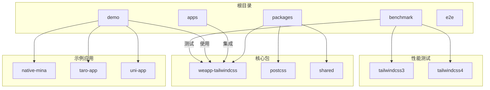
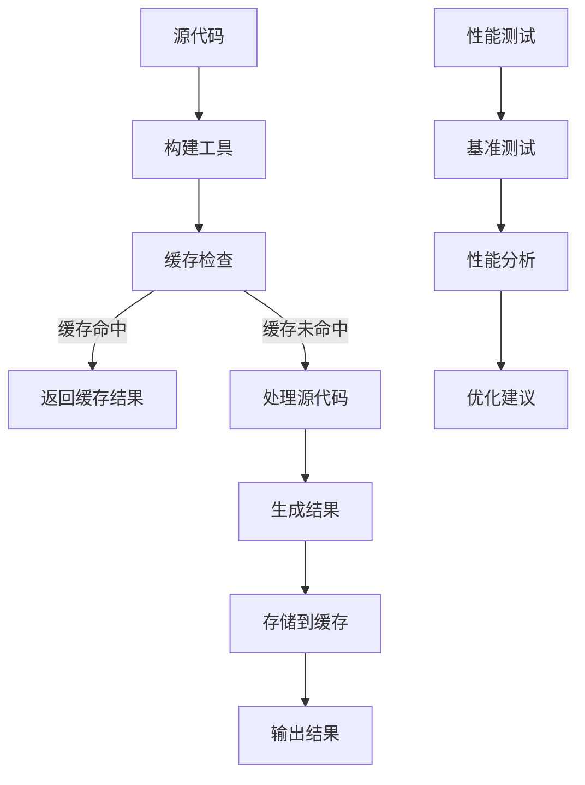
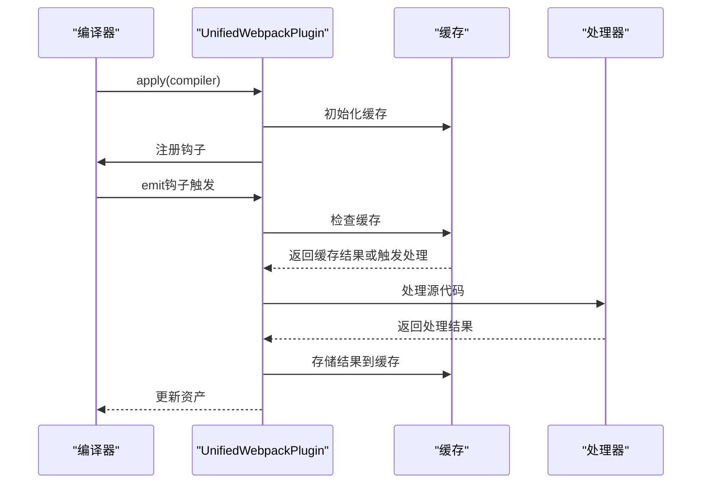
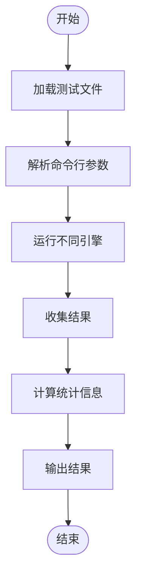
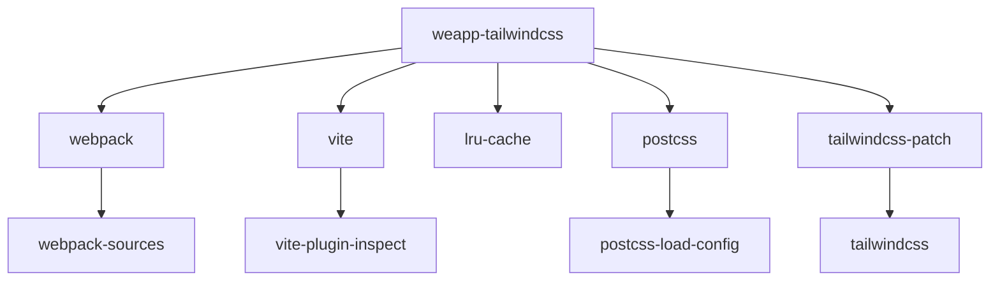

# 插件性能优化

<cite>
**本文档引用的文件**   
- [index.ts](file://packages/weapp-tailwindcss/src/index.ts)
- [cache/index.ts](file://packages/weapp-tailwindcss/src/cache/index.ts)
- [shared/cache.ts](file://packages/weapp-tailwindcss/src/bundlers/shared/cache.ts)
- [BaseUnifiedPlugin/v4.ts](file://packages/weapp-tailwindcss/src/bundlers/webpack/BaseUnifiedPlugin/v4.ts)
- [BaseUnifiedPlugin/v5.ts](file://packages/weapp-tailwindcss/src/bundlers/webpack/BaseUnifiedPlugin/v5.ts)
- [run-tasks.ts](file://packages/weapp-tailwindcss/src/bundlers/shared/run-tasks.ts)
- [js-bench.ts](file://packages/weapp-tailwindcss/scripts/js-bench.ts)
- [js-bench-diff.ts](file://packages/weapp-tailwindcss/scripts/js-bench-diff.ts)
- [vite.config.ts](file://apps/vite-native/vite.config.ts)
- [webpack.config.js](file://demo/native-mina/webpack.config.js)
</cite>

## 目录
1. [引言](#引言)
2. [项目结构](#项目结构)
3. [核心组件](#核心组件)
4. [架构概述](#架构概述)
5. [详细组件分析](#详细组件分析)
6. [依赖分析](#依赖分析)
7. [性能考量](#性能考量)
8. [故障排除指南](#故障排除指南)
9. [结论](#结论)

## 引言
本文档详细阐述了在weapp-tailwindcss插件开发中实现高效性能的策略。重点介绍了避免重复计算的技术，如使用缓存机制和记忆化函数，以及合理使用缓存的策略，包括缓存失效机制和内存管理。同时，文档还涵盖了减少DOM操作的方法，如批量更新和虚拟DOM技术，并提供了实际代码示例展示性能瓶颈的识别和优化过程。此外，文档还解释了与构建工具（如Webpack、Vite）集成时的性能考量，以及性能测试和基准测试的方法。

## 项目结构
weapp-tailwindcss项目是一个复杂的多包项目，包含多个子项目和工具。项目结构清晰，分为多个目录，如`apps`、`demo`、`packages`等，每个目录下包含特定功能的代码。`packages`目录下包含了核心的插件代码，如`weapp-tailwindcss`，而`demo`目录则包含了各种示例应用，用于展示插件的使用方法。



**Diagram sources**
- [package.json](file://package.json)
- [packages/weapp-tailwindcss/package.json](file://packages/weapp-tailwindcss/package.json)

**Section sources**
- [package.json](file://package.json)
- [packages/weapp-tailwindcss/package.json](file://packages/weapp-tailwindcss/package.json)

## 核心组件
weapp-tailwindcss插件的核心组件包括缓存机制、构建工具集成和性能测试工具。缓存机制通过`createCache`函数实现，使用LRU缓存策略来存储和检索计算结果，避免重复计算。构建工具集成支持Webpack和Vite，通过插件形式在构建过程中处理Tailwind CSS类名。性能测试工具则通过基准测试脚本评估不同构建工具的性能。

**Section sources**
- [cache/index.ts](file://packages/weapp-tailwindcss/src/cache/index.ts)
- [BaseUnifiedPlugin/v4.ts](file://packages/weapp-tailwindcss/src/bundlers/webpack/BaseUnifiedPlugin/v4.ts)
- [BaseUnifiedPlugin/v5.ts](file://packages/weapp-tailwindcss/src/bundlers/webpack/BaseUnifiedPlugin/v5.ts)

## 架构概述
weapp-tailwindcss插件的架构设计旨在提供高效的性能优化。插件通过缓存机制减少重复计算，通过构建工具集成确保在构建过程中正确处理Tailwind CSS类名，并通过性能测试工具持续监控和优化性能。



**Diagram sources**
- [BaseUnifiedPlugin/v4.ts](file://packages/weapp-tailwindcss/src/bundlers/webpack/BaseUnifiedPlugin/v4.ts)
- [BaseUnifiedPlugin/v5.ts](file://packages/weapp-tailwindcss/src/bundlers/webpack/BaseUnifiedPlugin/v5.ts)

## 详细组件分析

### 缓存机制分析
weapp-tailwindcss插件的缓存机制是性能优化的核心。通过`createCache`函数创建的缓存实例，使用LRU策略管理缓存项，确保最近使用的项保留在缓存中。`processCachedTask`函数用于处理缓存任务，通过比较源代码的哈希值来判断是否需要重新计算。

```mermaid
classDiagram
class Cache {
+hashMap : Map<HashMapKey, HashMapValue>
+instance : LRUCache<string, CacheValue>
+hasHashKey(key : HashMapKey) : boolean
+getHashValue(key : HashMapKey) : HashMapValue | undefined
+setHashValue(key : HashMapKey, value : HashMapValue) : Map<HashMapKey, HashMapValue>
+computeHash(message : string | Buffer) : string
+get<T>(key : string) : T | undefined
+set(key : string, value : T) : LRUCache<string, CacheValue>
+has(key : string) : boolean
+calcHashValueChanged(key : HashMapKey, hash : string) : ICreateCacheReturnType
+process<T extends CacheValue>(options : CacheProcessOptions<T>) : Promise<T>
}
class ProcessCachedTask {
+cache : ICreateCacheReturnType
+cacheKey : string
+hashKey? : HashMapKey
+rawSource? : string
+readCache? : () => TValue | undefined
+applyResult : (value : TValue) => void | Promise<void>
+transform : () => Promise<{ result : TValue; cacheValue? : CacheValue }>
+onCacheHit? : () => void
}
Cache --> ProcessCachedTask : "使用"
```

**Diagram sources**
- [cache/index.ts](file://packages/weapp-tailwindcss/src/cache/index.ts)
- [shared/cache.ts](file://packages/weapp-tailwindcss/src/bundlers/shared/cache.ts)

### 构建工具集成分析
weapp-tailwindcss插件支持Webpack和Vite两种构建工具。对于Webpack，插件通过`UnifiedWebpackPluginV4`和`UnifiedWebpackPluginV5`类实现，分别支持Webpack 4和Webpack 5。对于Vite，插件通过`vite`模块提供支持。



**Diagram sources**
- [BaseUnifiedPlugin/v4.ts](file://packages/weapp-tailwindcss/src/bundlers/webpack/BaseUnifiedPlugin/v4.ts)
- [BaseUnifiedPlugin/v5.ts](file://packages/weapp-tailwindcss/src/bundlers/webpack/BaseUnifiedPlugin/v5.ts)

### 性能测试分析
weapp-tailwindcss插件提供了性能测试工具，通过`js-bench.ts`和`js-bench-diff.ts`脚本进行基准测试。这些脚本可以比较不同构建工具的性能，帮助开发者选择最优的构建方案。



**Diagram sources**
- [js-bench.ts](file://packages/weapp-tailwindcss/scripts/js-bench.ts)
- [js-bench-diff.ts](file://packages/weapp-tailwindcss/scripts/js-bench-diff.ts)

**Section sources**
- [js-bench.ts](file://packages/weapp-tailwindcss/scripts/js-bench.ts)
- [js-bench-diff.ts](file://packages/weapp-tailwindcss/scripts/js-bench-diff.ts)

## 依赖分析
weapp-tailwindcss插件依赖于多个外部库，如`webpack`、`vite`、`lru-cache`等。这些依赖项在`package.json`文件中定义，确保插件能够正常运行。



**Diagram sources**
- [packages/weapp-tailwindcss/package.json](file://packages/weapp-tailwindcss/package.json)

**Section sources**
- [packages/weapp-tailwindcss/package.json](file://packages/weapp-tailwindcss/package.json)

## 性能考量
在weapp-tailwindcss插件开发中，性能优化是关键。通过合理使用缓存机制，可以显著减少重复计算，提高构建速度。同时，与构建工具的集成需要考虑性能影响，确保插件不会成为构建过程的瓶颈。性能测试工具则帮助开发者持续监控和优化性能。

**Section sources**
- [cache/index.ts](file://packages/weapp-tailwindcss/src/cache/index.ts)
- [BaseUnifiedPlugin/v4.ts](file://packages/weapp-tailwindcss/src/bundlers/webpack/BaseUnifiedPlugin/v4.ts)
- [BaseUnifiedPlugin/v5.ts](file://packages/weapp-tailwindcss/src/bundlers/webpack/BaseUnifiedPlugin/v5.ts)

## 故障排除指南
在使用weapp-tailwindcss插件时，可能会遇到性能问题。以下是一些常见的故障排除步骤：
1. 检查缓存配置，确保缓存机制正常工作。
2. 分析构建日志，查找性能瓶颈。
3. 使用性能测试工具，比较不同构建工具的性能。
4. 调整构建工具配置，优化构建过程。

**Section sources**
- [cache/index.ts](file://packages/weapp-tailwindcss/src/cache/index.ts)
- [BaseUnifiedPlugin/v4.ts](file://packages/weapp-tailwindcss/src/bundlers/webpack/BaseUnifiedPlugin/v4.ts)
- [BaseUnifiedPlugin/v5.ts](file://packages/weapp-tailwindcss/src/bundlers/webpack/BaseUnifiedPlugin/v5.ts)

## 结论
weapp-tailwindcss插件通过高效的缓存机制、灵活的构建工具集成和全面的性能测试工具，实现了卓越的性能优化。开发者可以通过合理配置和使用这些功能，显著提高构建速度和应用性能。