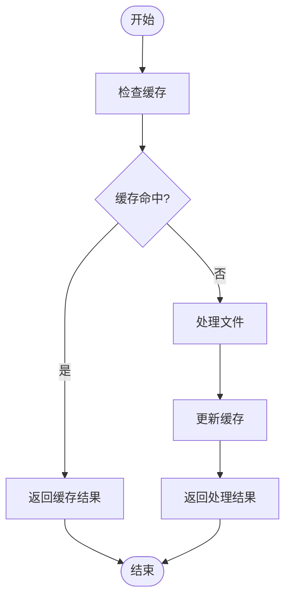

# 插件最佳实践

<cite>
**本文档中引用的文件**  
- [index.ts](file://packages/weapp-tailwindcss/src/index.ts)
- [core.ts](file://packages/weapp-tailwindcss/src/core.ts)
- [vite.ts](file://packages/weapp-tailwindcss/src/vite.ts)
- [webpack.ts](file://packages/weapp-tailwindcss/src/webpack.ts)
- [gulp.ts](file://packages/weapp-tailwindcss/src/gulp.ts)
- [typedoc.export.ts](file://packages/weapp-tailwindcss/src/typedoc.export.ts)
- [defaults.ts](file://packages/weapp-tailwindcss/src/defaults.ts)
- [package.json](file://packages/weapp-tailwindcss/package.json)
</cite>

## 目录
1. [简介](#简介)
2. [性能优化策略](#性能优化策略)
3. [代码组织规范](#代码组织规范)
4. [安全性建议](#安全性建议)
5. [兼容性考虑](#兼容性考虑)
6. [可维护性技巧](#可维护性技巧)
7. [总结](#总结)

## 简介

`weapp-tailwindcss` 是一个为小程序开发者提供 Tailwind CSS 原子化样式思想的解决方案。该插件支持多种构建工具（如 webpack、vite、gulp）和主流框架（如 Taro、uni-app、原生小程序），能够自动识别并精确处理所有 Tailwind CSS 的工具类以适配小程序环境。本指南旨在总结 `weapp-tailwindcss` 插件开发的经验法则，涵盖性能优化、代码组织、安全性、兼容性和可维护性等方面的最佳实践。

**Section sources**
- [README.md](file://packages/weapp-tailwindcss/README.md#L1-L101)

## 性能优化策略

### 避免重复计算

在处理 CSS 和 JS 文件时，避免不必要的重复计算是提升性能的关键。通过缓存机制可以有效减少重复工作。例如，在 `vite` 插件中使用 `processCachedTask` 函数来处理缓存任务，确保只有当文件内容发生变化时才重新处理。

**Diagram sources**
- [vite.ts](file://packages/weapp-tailwindcss/src/bundlers/vite/index.ts#L134-L478)

### 合理使用缓存

合理利用缓存不仅可以提高构建速度，还能减少资源消耗。`weapp-tailwindcss` 提供了 `cache` 配置项，允许用户控制缓存策略。默认情况下，插件会启用缓存功能，并且可以通过 `ICreateCacheReturnType` 接口自定义缓存行为。

**Section sources**
- [typedoc.export.ts](file://packages/weapp-tailwindcss/src/typedoc.export.ts#L480-L485)
- [defaults.ts](file://packages/weapp-tailwindcss/src/defaults.ts#L44-L137)

### 减少 DOM 操作

在小程序环境中，频繁的 DOM 操作会导致页面渲染性能下降。因此，应尽量减少对 DOM 的直接操作，转而使用数据驱动的方式更新视图。此外，可以通过批量更新和虚拟 DOM 技术来进一步优化性能。

## 代码组织规范

### 模块化设计

良好的模块化设计有助于提高代码的可读性和可维护性。`weapp-tailwindcss` 采用了清晰的模块划分，每个功能模块都有独立的目录和文件结构。例如，`bundlers` 目录下分别存放了针对不同构建工具的实现代码，便于管理和扩展。

**Section sources**
- [src](file://packages/weapp-tailwindcss/src)

### 错误处理

完善的错误处理机制可以确保插件在遇到异常情况时仍能正常运行。建议在关键路径上添加 try-catch 语句，并记录详细的错误信息以便于调试。同时，提供友好的错误提示，帮助用户快速定位问题。

### 类型安全

使用 TypeScript 可以显著提高代码的类型安全性。`weapp-tailwindcss` 完全基于 TypeScript 开发，定义了丰富的类型接口，如 `UserDefinedOptions`、`InternalUserDefinedOptions` 等，确保配置项和函数参数的正确性。

**Section sources**
- [types/index.ts](file://packages/weapp-tailwindcss/src/types/index.ts#L1-L190)
- [typedoc.export.ts](file://packages/weapp-tailwindcss/src/typedoc.export.ts#L1-L560)

## 安全性建议

### 输入验证

对用户输入进行严格验证是防止安全漏洞的第一步。在 `weapp-tailwindcss` 中，所有外部输入都经过了严格的校验，确保不会引入恶意代码或导致意外行为。例如，`customAttributes` 配置项允许用户自定义标签属性的转换规则，但必须符合预定义的格式要求。

**Section sources**
- [typedoc.export.ts](file://packages/weapp-tailwindcss/src/typedoc.export.ts#L42-L58)

### 防止注入攻击

为了防止 CSS 和 JavaScript 注入攻击，插件在处理样式和脚本时采取了多种防护措施。例如，通过 `escapeMap` 配置项对特殊字符进行转义，避免潜在的安全风险。

**Section sources**
- [defaults.ts](file://packages/weapp-tailwindcss/src/defaults.ts#L92)
- [typedoc.export.ts](file://packages/weapp-tailwindcss/src/typedoc.export.ts#L69-L70)

### 权限控制

在多平台构建场景下，合理设置权限控制非常重要。通过 `disabled` 配置项，可以在非小程序环境中禁用插件，避免不必要的转换操作。这不仅提高了构建效率，也减少了潜在的安全隐患。

**Section sources**
- [typedoc.export.ts](file://packages/weapp-tailwindcss/src/typedoc.export.ts#L39-L40)

## 兼容性考虑

### 不同小程序平台的适配

`weapp-tailwindcss` 支持多个小程序平台，包括微信、支付宝、京东、头条等。为了确保跨平台兼容性，插件针对不同平台的特点进行了适配。例如，通过 `appType` 配置项指定所使用的框架类型，从而做出更准确的匹配。

**Section sources**
- [typedoc.export.ts](file://packages/weapp-tailwindcss/src/typedoc.export.ts#L423-L424)
- [defaults.ts](file://packages/weapp-tailwindcss/src/defaults.ts#L15-L30)

### 版本兼容性处理

随着 Tailwind CSS 的不断迭代，保持向后兼容性至关重要。`weapp-tailwindcss` 支持最新版本的 Tailwind CSS v4 和 v3，同时也兼容 v2 jit 版本。通过 `tailwindcss` 配置项，用户可以为不同版本的 Tailwind CSS 配置相应的行为。

**Section sources**
- [typedoc.export.ts](file://packages/weapp-tailwindcss/src/typedoc.export.ts#L254-L255)

### 降级方案

在某些情况下，可能需要提供降级方案以应对不支持的功能。例如，当目标平台不支持 `:hover` 伪类时，插件会自动将其移除，并推荐使用组件的 `hover-class` 属性作为替代方案。

**Section sources**
- [defaults.ts](file://packages/weapp-tailwindcss/src/defaults.ts#L126-L127)

## 可维护性技巧

### 清晰的文档注释

良好的文档注释是保证代码可维护性的基础。`weapp-tailwindcss` 在每个关键函数和配置项上都添加了详细的 JSDoc 注释，说明其用途、参数和返回值。这不仅方便了其他开发者理解代码逻辑，也为后续维护提供了重要参考。

**Section sources**
- [core.ts](file://packages/weapp-tailwindcss/src/core.ts#L8-L75)
- [typedoc.export.ts](file://packages/weapp-tailwindcss/src/typedoc.export.ts#L14-L559)

### 合理的配置选项设计

合理的配置选项设计可以让用户更容易地定制插件行为。`weapp-tailwindcss` 提供了丰富的配置项，覆盖了从文件匹配到生命周期钩子的各个方面。每个配置项都有明确的默认值和详细的说明文档，降低了使用门槛。

**Section sources**
- [typedoc.export.ts](file://packages/weapp-tailwindcss/src/typedoc.export.ts#L14-L559)

### 可扩展的架构模式

为了支持未来的功能扩展，`weapp-tailwindcss` 采用了可扩展的架构模式。核心功能被封装成独立的模块，新功能可以通过插件化的方式轻松集成。这种设计不仅提高了代码的复用率，也使得整个系统更加灵活和健壮。

**Section sources**
- [index.ts](file://packages/weapp-tailwindcss/src/index.ts#L1-L5)
- [core.ts](file://packages/weapp-tailwindcss/src/core.ts#L13-L75)

## 总结

`weapp-tailwindcss` 是一个功能强大且易于使用的插件，为小程序开发者带来了 Tailwind CSS 的便利。通过遵循上述最佳实践，可以充分发挥插件的优势，提升开发效率和产品质量。无论是性能优化、代码组织、安全性、兼容性还是可维护性，都有相应的策略和技巧可供参考。希望本指南能帮助您更好地使用 `weapp-tailwindcss`，创造出更优秀的应用。