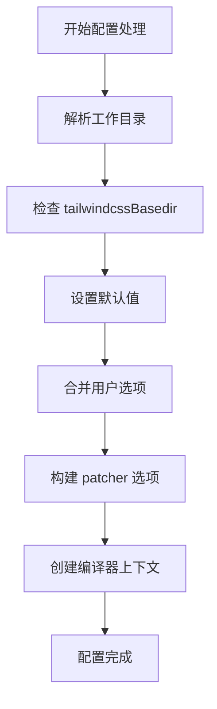

# 常见问题诊断

<cite>
**本文档中引用的文件**  
- [index.ts](file://packages/weapp-tailwindcss/src/index.ts)
- [context.ts](file://packages/weapp-tailwindcss/src/cli/context.ts)
- [types.ts](file://packages/weapp-tailwindcss/src/cli/types.ts)
- [utils/index.ts](file://packages/weapp-tailwindcss/src/utils/index.ts)
</cite>

## 目录
1. [简介](#简介)
2. [执行顺序错误诊断](#执行顺序错误诊断)
3. [配置未生效问题排查](#配置未生效问题排查)
4. [样式未注入问题分析](#样式未注入问题分析)
5. [插件冲突与优先级设置](#插件冲突与优先级设置)
6. [上下文丢失问题](#上下文丢失问题)
7. [单元测试与集成测试验证](#单元测试与集成测试验证)

## 简介
本文档系统性地介绍在 `weapp-tailwindcss` 插件开发过程中常见的典型问题及其解决方案。通过详细的故障排除流程，帮助开发者快速定位和解决执行顺序错误、配置未生效、样式未注入等问题。同时涵盖插件冲突、优先级设置和上下文丢失等复杂场景的诊断方法，并提供如何通过测试来预防和验证问题修复的指导。

## 执行顺序错误诊断

在构建工具（如 Vite、Webpack）中使用 `weapp-tailwindcss` 插件时，插件的执行顺序至关重要。如果插件执行过早或过晚，可能导致样式处理不完整或与其他插件产生冲突。

### 问题现象
- Tailwind CSS 类名未正确转换为小程序样式
- 构建输出中缺少预期的 CSS 规则
- 其他插件处理后的代码被错误地再次处理

### 可能原因
- 插件注册顺序不当
- 构建工具的插件生命周期钩子调用时机不正确
- 依赖的 `postcss` 或 `tailwindcss` 插件未按预期顺序执行

### 诊断步骤
1. 检查插件在构建配置中的注册顺序
2. 确认 `weapp-tailwindcss` 插件是否在 `postcss` 处理之前执行
3. 验证 `tailwindcss` 核心插件是否已正确加载

### 解决方案
确保 `weapp-tailwindcss` 插件在构建配置中正确排序。例如，在 Vite 配置中：

```ts
import { defineConfig } from 'vite'
import weappTailwindcss from '@weapp-tailwindcss/vite'

export default defineConfig({
  plugins: [
    // 其他插件...
    weappTailwindcss(), // 确保在此处正确注册
  ],
})
```

**Section sources**
- [index.ts](file://packages/weapp-tailwindcss/src/index.ts#L1-L5)
- [context.ts](file://packages/weapp-tailwindcss/src/cli/context.ts#L51-L72)

## 配置未生效问题排查

当用户定义的配置项未按预期生效时，可能是由于配置解析、合并或传递过程中出现问题。

### 问题现象
- 自定义的 `tailwindcssBasedir` 未生效
- `output.format` 配置被忽略
- `clearCache` 选项不起作用

### 可能原因
- 配置对象未正确传递到上下文
- 配置合并逻辑存在缺陷
- 命令行参数解析错误

### 诊断步骤
1. 检查 `createCliContext` 函数中配置的传递过程
2. 验证 `defuOverrideArray` 在配置合并中的行为
3. 确认命令行参数是否正确解析为 `UserDefinedOptions`

### 解决方案
确保配置对象在创建 CLI 上下文时被正确处理。关键逻辑位于 `buildTailwindcssPatcherOptions` 和 `createCliContext` 中，需确保：

- `cwd` 和 `output` 配置项被正确过滤和传递
- 用户覆盖选项与默认值正确合并
- 绝对路径和相对路径处理一致



**Diagram sources**
- [context.ts](file://packages/weapp-tailwindcss/src/cli/context.ts#L18-L85)

**Section sources**
- [context.ts](file://packages/weapp-tailwindcss/src/cli/context.ts#L8-L85)
- [types.ts](file://packages/weapp-tailwindcss/src/cli/types.ts#L1-L20)

## 样式未注入问题分析

样式未注入是 `weapp-tailwindcss` 使用中最常见的问题之一，通常与文件匹配规则或注入逻辑有关。

### 问题现象
- 页面中使用 Tailwind 类名但无对应样式生成
- 构建后 CSS 文件中缺少关键样式规则
- 动态类名未被正确处理

### 可能原因
- `cssMatcher`、`htmlMatcher` 等匹配函数未正确识别文件类型
- 样式提取逻辑未覆盖所有入口文件
- 分组处理时某些文件被错误分类

### 诊断步骤
1. 检查 `getGroupedEntries` 函数的分组逻辑
2. 验证 `classifyEntry` 对不同文件类型的判断
3. 确认 `InternalUserDefinedOptions` 中的匹配器配置

### 解决方案
确保文件匹配规则正确配置。核心逻辑在 `utils/index.ts` 中的 `getGroupedEntries` 函数：

```ts
export function getGroupedEntries<T>(entries: [string, T][], options: InternalUserDefinedOptions) {
  const groups = createEmptyGroups<T>()
  for (const entry of entries) {
    const [filename] = entry
    const group = classifyEntry(filename, options) // 确保正确分类
    groups[group].push(entry)
  }
  return groups
}
```

**Section sources**
- [utils/index.ts](file://packages/weapp-tailwindcss/src/utils/index.ts#L20-L51)

## 插件冲突与优先级设置

在复杂的构建环境中，多个插件可能同时操作相同的资源，导致冲突。

### 问题现象
- 与其他 CSS 处理插件（如 `unplugin-vue-router`）产生冲突
- 样式被多次处理或顺序错乱
- 构建性能下降

### 可能原因
- 插件执行优先级未明确设置
- 资源处理重叠
- 缓存机制不一致

### 诊断步骤
1. 分析构建工具的插件执行顺序
2. 检查是否有多个插件修改同一类资源
3. 验证缓存键的唯一性

### 解决方案
明确设置插件优先级，避免资源处理冲突。建议：
- 在插件配置中显式声明 `enforce: 'pre'` 或 `'post'`
- 使用唯一的缓存键前缀
- 避免对已处理的资源进行二次处理

## 上下文丢失问题

在异步操作或多阶段构建中，上下文信息可能丢失，导致配置或状态不一致。

### 问题现象
- 跨函数调用时配置信息丢失
- 异步回调中无法访问原始上下文
- 构建状态不一致

### 可能原因
- 上下文对象未正确传递
- 异步操作中闭包捕获错误
- 模块作用域问题

### 诊断步骤
1. 检查 `getCompilerContext` 的返回值传递
2. 验证异步函数中上下文的可用性
3. 确认模块导入导出的一致性

### 解决方案
确保上下文在整个构建流程中保持一致。使用 `createCliContext` 统一创建和管理上下文：

```ts
const context = createCliContext(userOptions, resolvedCwd)
// 在整个构建流程中传递此 context
```

**Section sources**
- [context.ts](file://packages/weapp-tailwindcss/src/cli/context.ts#L51-L72)

## 单元测试与集成测试验证

通过测试确保问题修复的正确性和回归预防。

### 测试策略
- 为 `getGroupedEntries` 编写单元测试，覆盖各种文件类型
- 为 `createCliContext` 编写集成测试，验证配置传递
- 使用快照测试验证输出 CSS 的一致性

### 测试示例
```ts
// test/utils.test.ts
test('should classify entry correctly', () => {
  const options = { 
    cssMatcher: (f) => f.endsWith('.wxss'),
    htmlMatcher: (f) => f.endsWith('.wxml'),
    jsMatcher: (f) => f.endsWith('.js'),
    wxsMatcher: (f) => f.endsWith('.wxs')
  }
  expect(classifyEntry('index.wxss', options)).toBe('css')
  expect(classifyEntry('index.wxml', options)).toBe('html')
})
```

**Section sources**
- [utils/index.ts](file://packages/weapp-tailwindcss/src/utils/index.ts#L20-L31)
- [context.ts](file://packages/weapp-tailwindcss/src/cli/context.ts#L51-L72)