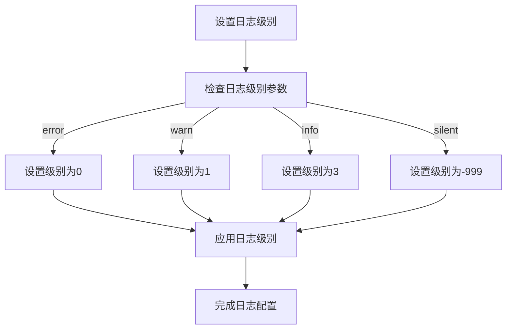
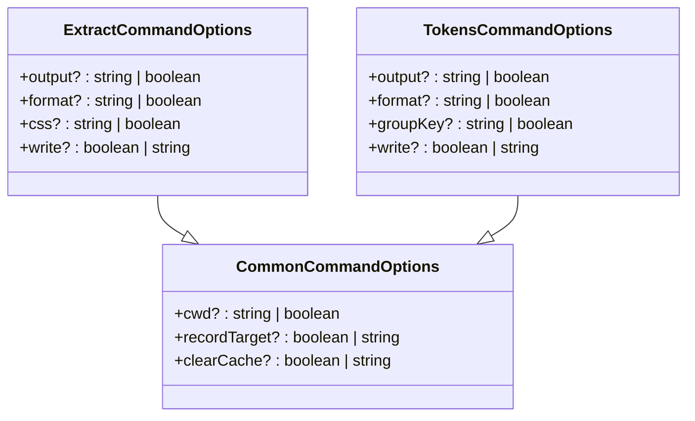
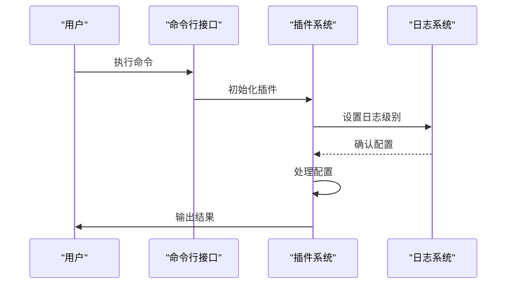
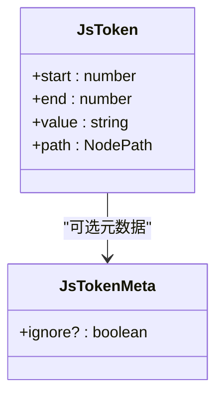
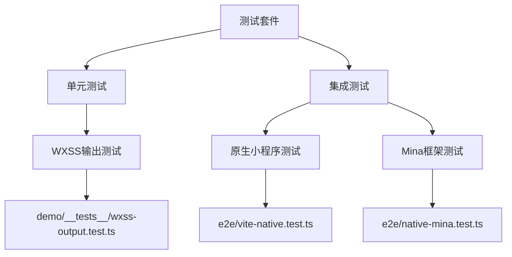

# 插件调试技巧

<cite>
**本文档中引用的文件**
- [logger.ts](file://packages/weapp-tailwindcss/src/context/logger.ts)
- [types.ts](file://packages/weapp-tailwindcss/src/cli/types.ts)
- [types.ts](file://packages/weapp-tailwindcss/src/js/types.ts)
- [index.ts](file://packages/weapp-tailwindcss/src/index.ts)
- [test.ts](file://e2e/vite-native.test.ts)
- [test.ts](file://e2e/native-mina.test.ts)
- [test.ts](file://demo/__tests__/wxss-output.test.ts)
</cite>

## 目录
1. [简介](#简介)
2. [调试环境搭建](#调试环境搭建)
3. [日志输出与级别控制](#日志输出与级别控制)
4. [断点调试方法](#断点调试方法)
5. [内置调试工具使用](#内置调试工具使用)
6. [常见问题诊断](#常见问题诊断)
7. [插件生命周期分析](#插件生命周期分析)
8. [上下文状态检查](#上下文状态检查)
9. [AST转换验证](#ast转换验证)
10. [单元测试与集成测试](#单元测试与集成测试)

## 简介
本文档详细介绍weapp-tailwindcss插件的调试方法论，涵盖从环境配置到问题诊断的完整流程。通过系统化的调试技巧，开发者可以有效解决插件开发过程中遇到的各种问题，确保插件稳定可靠地运行。

## 调试环境搭建
要开始调试weapp-tailwindcss插件，首先需要正确配置开发环境。建议使用TypeScript项目作为调试基础，确保已安装必要的依赖包，包括@weapp-tailwindcss/logger等核心模块。配置package.json中的脚本命令，以便快速启动调试会话。

**Section sources**
- [index.ts](file://packages/weapp-tailwindcss/src/index.ts#L1-L5)

## 日志输出与级别控制
插件提供了灵活的日志系统，通过logger模块实现不同级别的日志输出。开发者可以根据需要调整日志级别，从详细的信息到静默模式。

**Diagram sources**
- [logger.ts](file://packages/weapp-tailwindcss/src/context/logger.ts#L1-L16)

**Section sources**
- [logger.ts](file://packages/weapp-tailwindcss/src/context/logger.ts#L1-L16)

## 断点调试方法
使用现代IDE（如VS Code）可以轻松设置断点进行调试。在关键函数调用处设置断点，例如插件初始化、配置解析和样式注入等环节。通过观察变量值和调用栈，可以深入了解插件执行流程。

## 内置调试工具使用
插件提供了一系列内置调试工具，帮助开发者查看执行流程和状态。通过命令行参数可以启用不同的调试模式，如记录目标文件、清除缓存等。

**Diagram sources**
- [types.ts](file://packages/weapp-tailwindcss/src/cli/types.ts#L1-L20)

**Section sources**
- [types.ts](file://packages/weapp-tailwindcss/src/cli/types.ts#L1-L20)

## 常见问题诊断
### 执行顺序错误
当插件执行顺序出现问题时，应检查插件注册顺序和依赖关系。确保前置插件已完成处理后再执行后续插件。

### 配置未生效
配置未生效通常源于配置文件路径错误或格式不正确。验证tailwind.config.js文件位置和内容是否符合规范。

### 样式未注入
样式未注入问题可能与AST解析或转换过程有关。检查JS文件中的类名提取逻辑和CSS注入点。

## 插件生命周期分析
理解插件的生命周期钩子调用顺序对于调试至关重要。从初始化到销毁的每个阶段都有相应的事件触发，开发者可以通过监听这些事件来跟踪插件行为。

**Diagram sources**
- [index.ts](file://packages/weapp-tailwindcss/src/index.ts#L1-L5)
- [logger.ts](file://packages/weapp-tailwindcss/src/context/logger.ts#L1-L16)

## 上下文状态检查
在调试过程中，检查上下文对象的状态变化非常重要。JsToken接口定义了源代码中需要替换的内容及其AST路径，这对于跟踪变量替换过程非常有用。

**Diagram sources**
- [types.ts](file://packages/weapp-tailwindcss/src/js/types.ts#L1-L30)

**Section sources**
- [types.ts](file://packages/weapp-tailwindcss/src/js/types.ts#L1-L30)

## AST转换验证
验证AST转换结果是确保插件正确性的关键步骤。通过比较转换前后的AST结构，可以确认插件是否按预期修改了代码。

## 单元测试与集成测试
编写有效的测试用例是保证插件质量的重要手段。项目中包含多个测试文件，覆盖了不同场景下的插件行为。

**Diagram sources**
- [wxss-output.test.ts](file://demo/__tests__/wxss-output.test.ts)
- [vite-native.test.ts](file://e2e/vite-native.test.ts)
- [native-mina.test.ts](file://e2e/native-mina.test.ts)

**Section sources**
- [wxss-output.test.ts](file://demo/__tests__/wxss-output.test.ts)
- [vite-native.test.ts](file://e2e/vite-native.test.ts)
- [native-mina.test.ts](file://e2e/native-mina.test.ts)