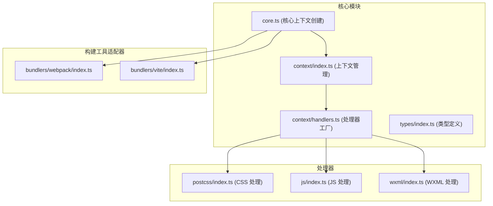
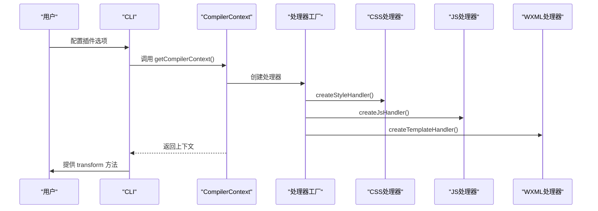
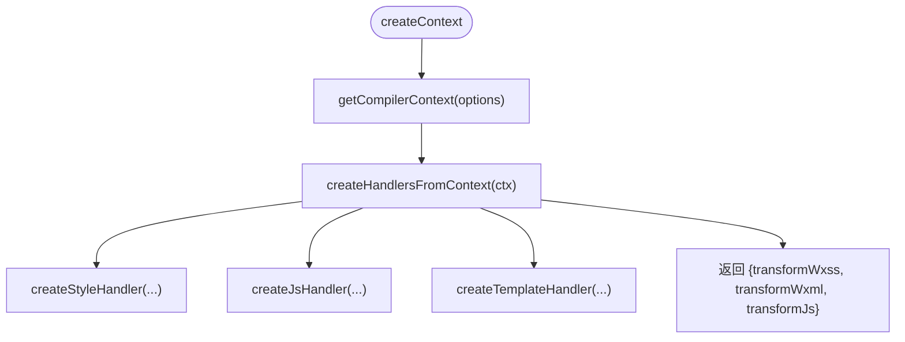
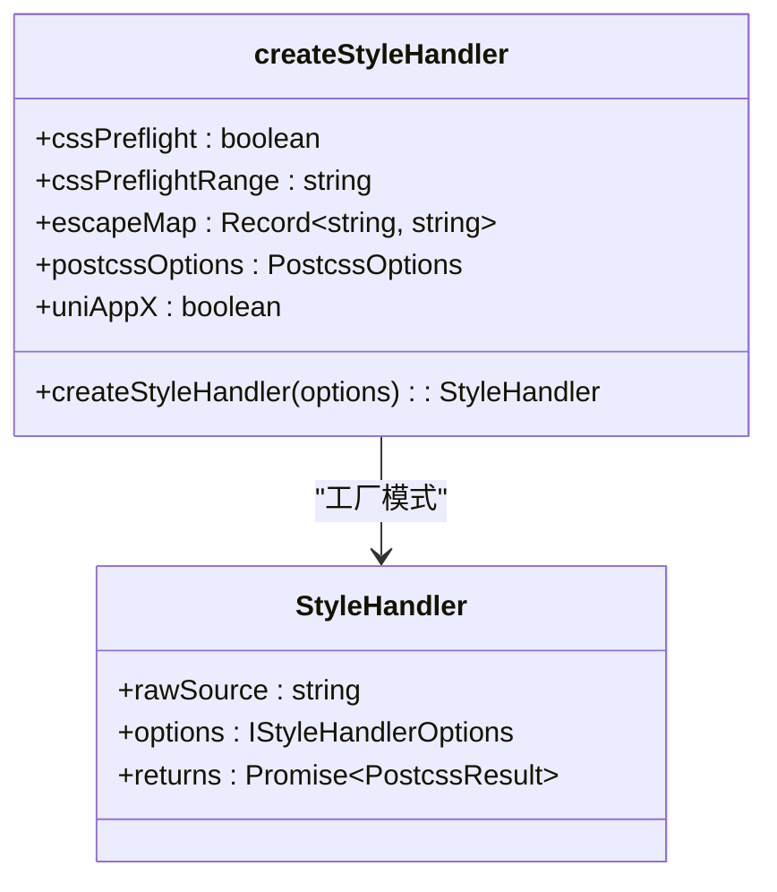
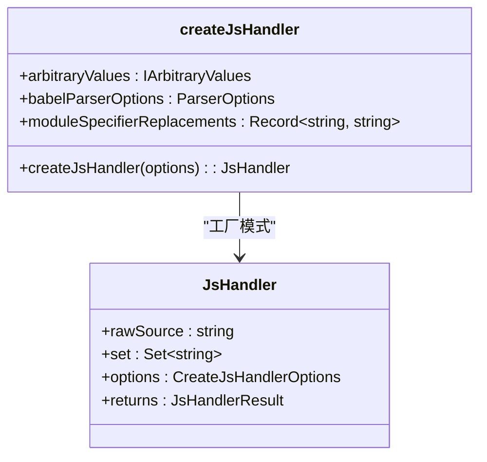
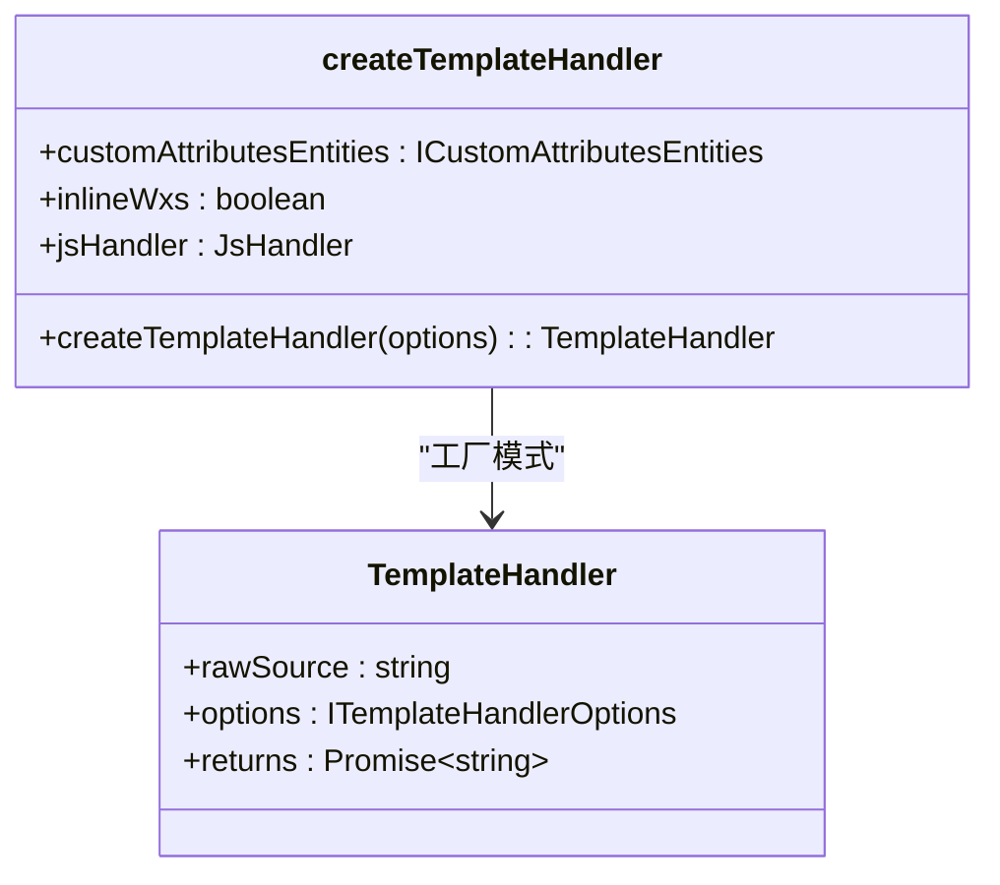

# 插件配置

<cite>
**本文档引用的文件**  
- [core.ts](file://packages/weapp-tailwindcss/src/core.ts)
- [context/index.ts](file://packages/weapp-tailwindcss/src/context/index.ts)
- [context/handlers.ts](file://packages/weapp-tailwindcss/src/context/handlers.ts)
- [types/index.ts](file://packages/weapp-tailwindcss/src/types/index.ts)
- [cli.ts](file://packages/weapp-tailwindcss/src/cli.ts)
- [bundlers/webpack/index.ts](file://packages/weapp-tailwindcss/src/bundlers/webpack/index.ts)
- [bundlers/vite/index.ts](file://packages/weapp-tailwindcss/src/bundlers/vite/index.ts)
- [postcss/index.ts](file://packages/weapp-tailwindcss/src/postcss/index.ts)
- [js/index.ts](file://packages/weapp-tailwindcss/src/js/index.ts)
- [wxml/index.ts](file://packages/weapp-tailwindcss/src/wxml/index.ts)
</cite>

## 目录
1. [简介](#简介)
2. [项目结构](#项目结构)
3. [核心组件](#核心组件)
4. [架构概述](#架构概述)
5. [详细组件分析](#详细组件分析)
6. [依赖分析](#依赖分析)
7. [性能考虑](#性能考虑)
8. [故障排除指南](#故障排除指南)
9. [结论](#结论)

## 简介
本文档详细说明了如何在 `weapp-tailwindcss` 项目中注册和使用自定义插件。文档涵盖了插件系统的架构设计、生命周期管理、加载与初始化顺序，以及从简单到复杂的插件开发示例。此外，还提供了插件 API 的完整参考，包括可用的钩子函数、上下文对象和返回值规范，并解释了插件之间的依赖关系、冲突解决策略以及调试和测试方法。

## 项目结构
`weapp-tailwindcss` 是一个用于小程序的 Tailwind CSS 集成工具，其核心功能通过插件系统实现。项目采用 Monorepo 结构，主要功能模块位于 `packages/weapp-tailwindcss/src` 目录下，包括核心处理逻辑、构建工具适配器（如 Webpack 和 Vite）、CSS 和 WXML 处理器等。



**Diagram sources**
- [core.ts](file://packages/weapp-tailwindcss/src/core.ts)
- [context/index.ts](file://packages/weapp-tailwindcss/src/context/index.ts)
- [context/handlers.ts](file://packages/weapp-tailwindcss/src/context/handlers.ts)

**Section sources**
- [core.ts](file://packages/weapp-tailwindcss/src/core.ts)
- [context/index.ts](file://packages/weapp-tailwindcss/src/context/index.ts)

## 核心组件
`weapp-tailwindcss` 的核心组件围绕 `createContext` 函数构建，该函数负责创建一个包含 `transformWxss`、`transformWxml` 和 `transformJs` 方法的上下文对象。这些方法分别用于处理小程序的样式、模板和脚本文件。

**Section sources**
- [core.ts](file://packages/weapp-tailwindcss/src/core.ts#L13-L75)

## 架构概述
`weapp-tailwindcss` 的插件系统基于一个可扩展的上下文和处理器模式。用户通过配置选项定义行为，系统根据这些选项初始化相应的处理器（Handler），并在构建过程中调用它们。



**Diagram sources**
- [context/index.ts](file://packages/weapp-tailwindcss/src/context/index.ts#L130-L132)
- [context/handlers.ts](file://packages/weapp-tailwindcss/src/context/handlers.ts#L29-L103)

## 详细组件分析

### 插件系统架构
`weapp-tailwindcss` 的插件系统并非传统意义上的“插件”，而是通过高度可配置的处理器（Handlers）来实现扩展性。核心是 `InternalUserDefinedOptions` 类型，它定义了所有可配置的选项。

#### 核心上下文创建
`createContext` 函数是插件系统的入口点。它接收用户选项，通过 `getCompilerContext` 创建内部上下文，并返回一组转换函数。



**Diagram sources**
- [core.ts](file://packages/weapp-tailwindcss/src/core.ts#L13-L75)
- [context/index.ts](file://packages/weapp-tailwindcss/src/context/index.ts#L130-L132)

**Section sources**
- [core.ts](file://packages/weapp-tailwindcss/src/core.ts#L13-L75)
- [context/index.ts](file://packages/weapp-tailwindcss/src/context/index.ts#L130-L132)

### 处理器分析
系统提供了三种主要的处理器：CSS、JS 和 WXML。

#### CSS 处理器
CSS 处理器基于 PostCSS，负责处理 Tailwind CSS 的生成和转换。



**Diagram sources**
- [context/handlers.ts](file://packages/weapp-tailwindcss/src/context/handlers.ts#L60-L75)
- [postcss/index.ts](file://packages/weapp-tailwindcss/src/postcss/index.ts)

**Section sources**
- [context/handlers.ts](file://packages/weapp-tailwindcss/src/context/handlers.ts#L60-L75)

#### JS 处理器
JS 处理器负责处理 JavaScript 文件中的类名，支持动态类名的提取和转换。



**Diagram sources**
- [context/handlers.ts](file://packages/weapp-tailwindcss/src/context/handlers.ts#L77-L87)
- [js/index.ts](file://packages/weapp-tailwindcss/src/js/index.ts)

**Section sources**
- [context/handlers.ts](file://packages/weapp-tailwindcss/src/context/handlers.ts#L77-L87)

#### WXML 处理器
WXML 处理器负责处理小程序模板文件，支持自定义属性和内联 WXS。



**Diagram sources**
- [context/handlers.ts](file://packages/weapp-tailwindcss/src/context/handlers.ts#L89-L95)
- [wxml/index.ts](file://packages/weapp-tailwindcss/src/wxml/index.ts)

**Section sources**
- [context/handlers.ts](file://packages/weapp-tailwindcss/src/context/handlers.ts#L89-L95)

## 依赖分析
`weapp-tailwindcss` 依赖于多个外部库来实现其功能，包括 `tailwindcss-patch` 用于 Tailwind CSS 补丁，`postcss` 用于 CSS 处理，`@babel/parser` 用于 JS 解析等。

```mermaid
graph LR
A[weapp-tailwindcss] --> B[tailwindcss-patch]
A --> C[postcss]
A --> D[@babel/parser]
A --> E[magic-string]
A --> F[defu]
B --> G[tailwindcss]
```

**Diagram sources**
- [package.json](file://packages/weapp-tailwindcss/package.json)

**Section sources**
- [package.json](file://packages/weapp-tailwindcss/package.json)

## 性能考虑
系统通过缓存机制（`initializeCache`）和异步处理来优化性能。`createContext` 返回的转换函数会等待 `patchPromise` 完成，确保在 Tailwind CSS 补丁应用完成后才进行转换，避免了重复工作。

## 故障排除指南
当插件行为不符合预期时，可以检查以下几点：
1. 确认 `tailwind.config.js` 配置正确。
2. 检查 `UserDefinedOptions` 中的选项是否正确传递。
3. 查看日志输出，`logger` 模块提供了 `debug`、`warn` 和 `success` 等日志级别。

**Section sources**
- [context/index.ts](file://packages/weapp-tailwindcss/src/context/logger.ts)
- [cli.ts](file://packages/weapp-tailwindcss/src/cli.ts)

## 结论
`weapp-tailwindcss` 通过一个灵活的处理器系统实现了强大的插件能力。虽然它没有传统的插件接口，但其基于配置和工厂模式的设计允许开发者通过配置选项来深度定制其行为。理解 `createContext`、`getCompilerContext` 和各种 `create*Handler` 函数的工作原理是掌握该系统的关键。