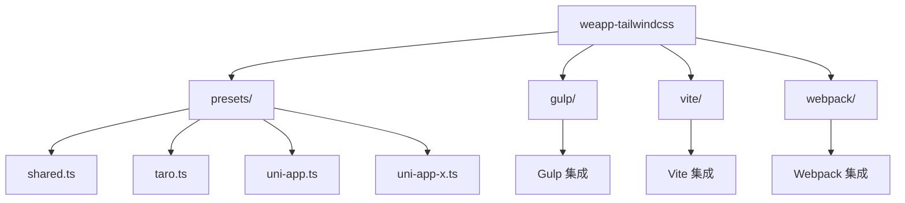
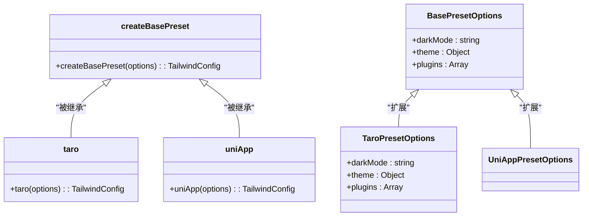
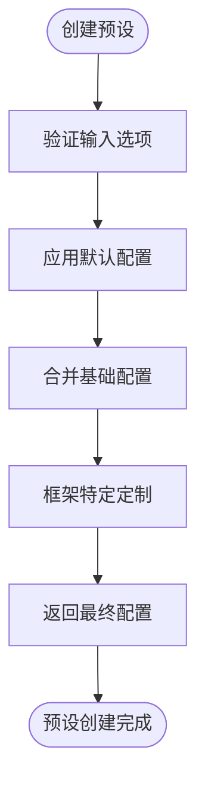
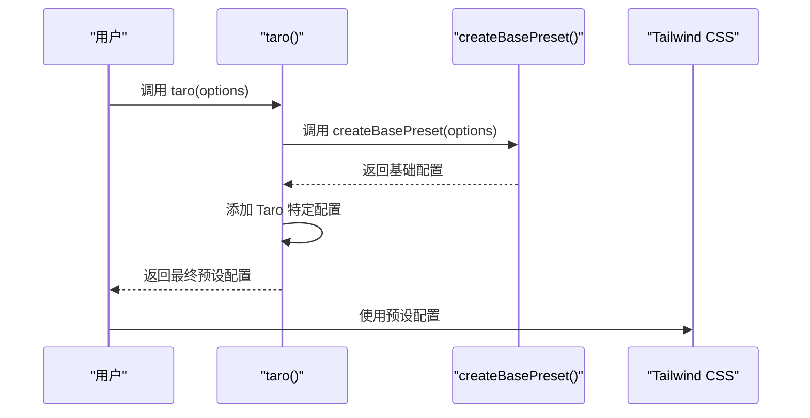
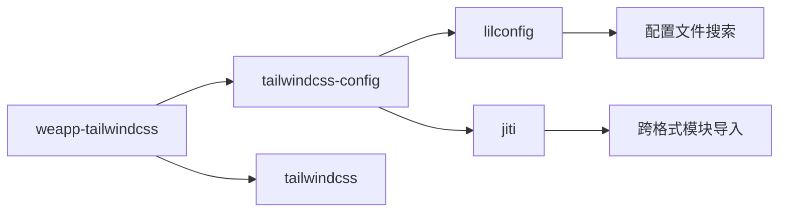

# 预设开发

<cite>
**本文档中引用的文件**  
- [presets.ts](file://packages/weapp-tailwindcss/src/presets.ts)
- [index.ts](file://packages/weapp-tailwindcss/src/presets/index.ts)
- [taro.ts](file://packages/weapp-tailwindcss/src/presets/taro.ts)
- [shared.ts](file://packages/weapp-tailwindcss/src/presets/shared.ts)
- [uni-app.ts](file://packages/weapp-tailwindcss/src/presets/uni-app.ts)
- [uni-app-x.ts](file://packages/weapp-tailwindcss/src/presets/uni-app-x.ts)
- [tailwindcss-config/src/index.ts](file://packages/tailwindcss-config/src/index.ts)
- [createBasePreset.ts](file://packages/weapp-tailwindcss/src/presets/shared.ts)
</cite>

## 目录
1. [简介](#简介)
2. [项目结构](#项目结构)
3. [核心组件](#核心组件)
4. [架构概述](#架构概述)
5. [详细组件分析](#详细组件分析)
6. [依赖分析](#依赖分析)
7. [性能考虑](#性能考虑)
8. [故障排除指南](#故障排除指南)
9. [结论](#结论)

## 简介
本文档详细介绍了如何在 `weapp-tailwindcss` 项目中创建和使用预设配置。预设是 Tailwind CSS 的核心功能之一，允许开发者为不同框架（如 Taro、uni-app）和平台（如微信小程序、抖音小程序）定义可复用的样式配置。文档将涵盖预设的基本结构、组成要素、创建步骤、继承机制以及冲突处理的最佳实践。

## 项目结构
`weapp-tailwindcss` 是一个 monorepo 项目，采用 pnpm 工作区管理多个包。预设相关的核心代码位于 `packages/weapp-tailwindcss/src/presets/` 目录下。该项目支持多种小程序框架和构建工具，通过预设机制实现配置的灵活性和可扩展性。

**Diagram sources**
- [presets.ts](file://packages/weapp-tailwindcss/src/presets.ts)
- [index.ts](file://packages/weapp-tailwindcss/src/presets/index.ts)

**Section sources**
- [presets.ts](file://packages/weapp-tailwindcss/src/presets.ts)
- [index.ts](file://packages/weapp-tailwindcss/src/presets/index.ts)

## 核心组件
预设系统的核心组件包括基础预设创建函数 `createBasePreset` 和针对不同框架的特定预设（如 `taro`、`uni-app`）。这些组件通过组合和扩展的方式，为不同技术栈提供定制化的 Tailwind CSS 配置。

**Section sources**
- [shared.ts](file://packages/weapp-tailwindcss/src/presets/shared.ts)
- [taro.ts](file://packages/weapp-tailwindcss/src/presets/taro.ts)
- [uni-app.ts](file://packages/weapp-tailwindcss/src/presets/uni-app.ts)

## 架构概述
`weapp-tailwindcss` 的预设架构采用分层设计模式。最底层是 `shared` 模块，提供通用的预设配置和工具函数。在此基础上，为每个特定框架（如 Taro、uni-app）创建专用预设，这些预设继承并扩展基础配置，以满足特定框架的需求。

**Diagram sources**
- [shared.ts](file://packages/weapp-tailwindcss/src/presets/shared.ts)
- [taro.ts](file://packages/weapp-tailwindcss/src/presets/taro.ts)
- [uni-app.ts](file://packages/weapp-tailwindcss/src/presets/uni-app.ts)

## 详细组件分析

### 基础预设分析
基础预设 `createBasePreset` 是所有特定框架预设的基石。它定义了通用的配置选项，如暗色模式、主题变量和插件集合。通过这种方式，确保了不同框架预设之间的一致性和可维护性。

**Diagram sources**
- [shared.ts](file://packages/weapp-tailwindcss/src/presets/shared.ts)

**Section sources**
- [shared.ts](file://packages/weapp-tailwindcss/src/presets/shared.ts)

### Taro 预设分析
Taro 预设通过导入 `createBasePreset` 并传递特定选项来创建。它继承了基础预设的所有功能，并可以根据 Taro 框架的特性进行额外配置。

**Diagram sources**
- [taro.ts](file://packages/weapp-tailwindcss/src/presets/taro.ts)
- [shared.ts](file://packages/weapp-tailwindcss/src/presets/shared.ts)

**Section sources**
- [taro.ts](file://packages/weapp-tailwindcss/src/presets/taro.ts)

### uni-app 预设分析
uni-app 预设的实现方式与 Taro 预设类似，通过继承基础预设并添加框架特定的配置来实现。这种设计模式确保了代码的可重用性和一致性。

**Section sources**
- [uni-app.ts](file://packages/weapp-tailwindcss/src/presets/uni-app.ts)
- [uni-app-x.ts](file://packages/weapp-tailwindcss/src/presets/uni-app-x.ts)

## 依赖分析
预设系统依赖于多个核心包，包括 `tailwindcss-config` 用于配置加载，`jiti` 用于模块导入，以及 `lilconfig` 用于配置搜索。这些依赖共同构成了预设系统的基础设施。

**Diagram sources**
- [tailwindcss-config/src/index.ts](file://packages/tailwindcss-config/src/index.ts)
- [presets.ts](file://packages/weapp-tailwindcss/src/presets.ts)

**Section sources**
- [tailwindcss-config/src/index.ts](file://packages/tailwindcss-config/src/index.ts)

## 性能考虑
预设系统的设计考虑了性能优化。通过模块化和按需加载的方式，减少了不必要的配置解析和处理。同时，利用缓存机制避免重复的配置搜索操作，提高了构建效率。

## 故障排除指南
当预设配置出现问题时，应首先检查配置文件的命名和位置是否符合约定。常见的配置文件包括 `tailwind.config.js`、`tailwind.config.ts` 等。确保预设函数正确导入并在配置文件中正确使用。

**Section sources**
- [tailwindcss-config/src/index.ts](file://packages/tailwindcss-config/src/index.ts)
- [presets.ts](file://packages/weapp-tailwindcss/src/presets.ts)

## 结论
`weapp-tailwindcss` 的预设系统通过模块化和继承机制，为不同小程序框架提供了灵活且可维护的样式配置方案。开发者可以基于基础预设快速创建针对特定框架的定制化配置，同时保持代码的一致性和可扩展性。