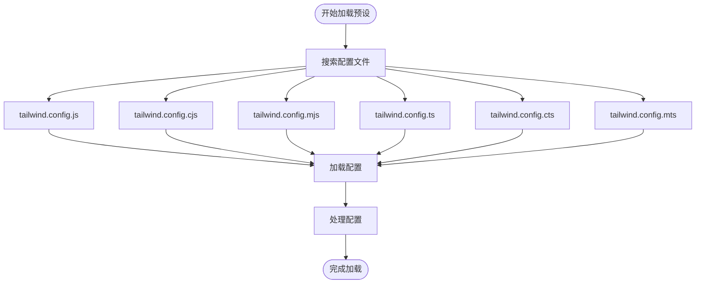
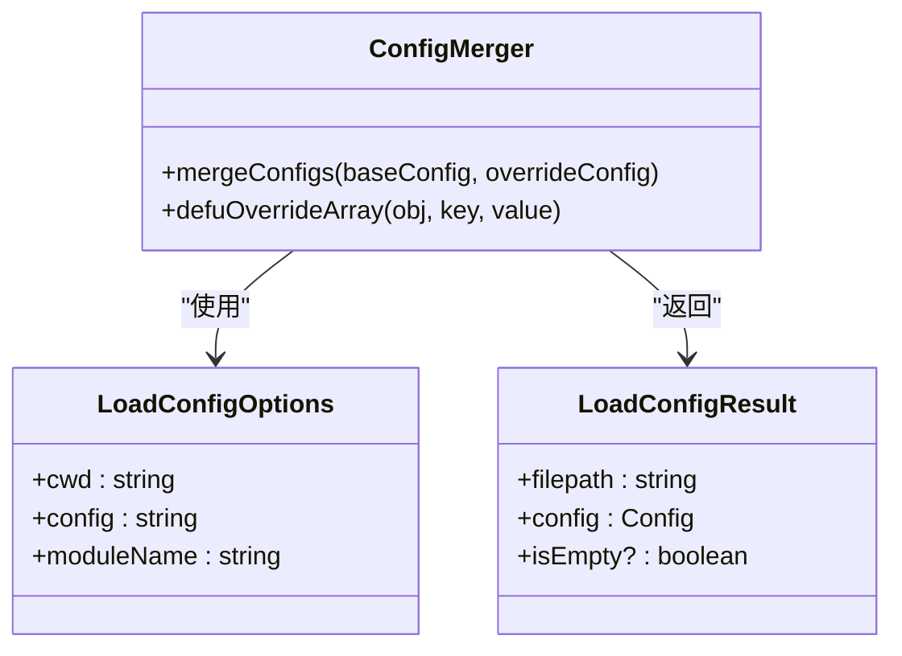
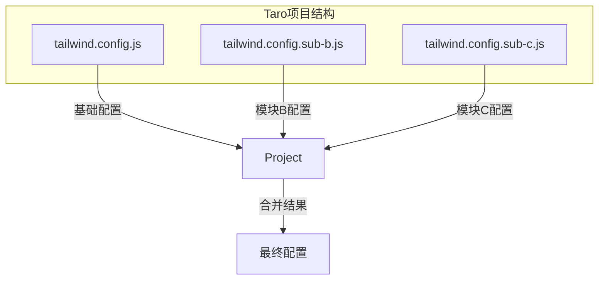
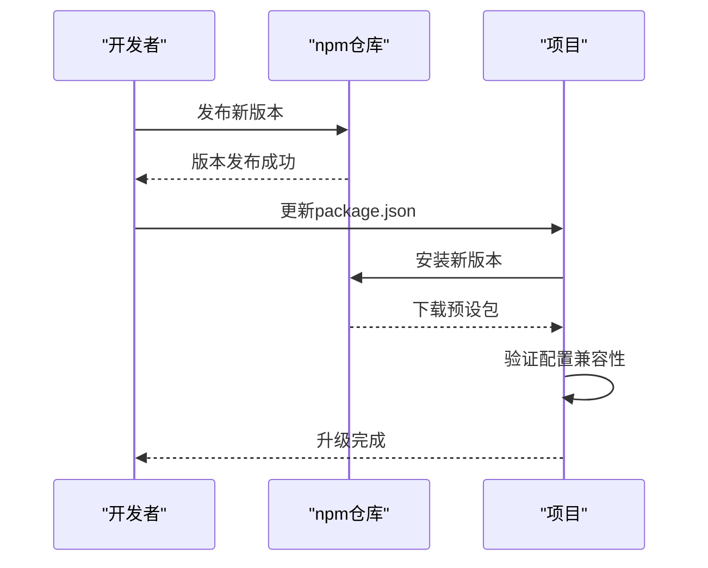
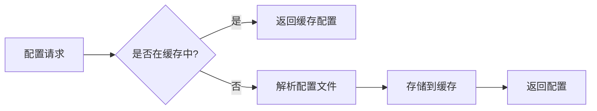

# 预设管理

<cite>
**本文档中引用的文件**  
- [tailwind.config.js](file://apps/rsmax-app-ts/tailwind.config.js)
- [tailwind.config.ts](file://apps/vite-native-ts/tailwind.config.ts)
- [presets.ts](file://packages/weapp-tailwindcss/src/presets.ts)
- [index.ts](file://packages/tailwindcss-config/src/index.ts)
- [utils.ts](file://packages/shared/src/index.ts)
- [loadConfig.ts](file://packages/tailwindcss-config/src/loadConfig.ts)
- [taro-app/tailwind.config.js](file://demo/taro-app/tailwind.config.js)
- [taro-app/tailwind.config.sub-b.js](file://demo/taro-app/tailwind.config.sub-b.js)
- [taro-app/tailwind.config.sub-c.js](file://demo/tailwind-app/tailwind.config.sub-c.js)
</cite>

## 目录
1. [简介](#简介)
2. [预设加载机制](#预设加载机制)
3. [配置合并策略](#配置合并策略)
4. [多环境预设管理](#多环境预设管理)
5. [版本控制与升级策略](#版本控制与升级策略)
6. [团队协作规范](#团队协作规范)
7. [性能优化建议](#性能优化建议)
8. [冲突解决机制](#冲突解决机制)
9. [最佳实践](#最佳实践)

## 简介
本文档全面介绍在 weapp-tailwindcss 项目中如何加载、组合和管理多个预设配置。系统阐述了预设的加载顺序、合并策略、覆盖规则以及在不同项目环境中的应用方法。

## 预设加载机制

预设配置的加载基于 `lilconfig` 库实现，支持多种配置文件格式和搜索路径。系统会按照预定义的顺序搜索配置文件，确保配置的灵活性和可扩展性。

**图示来源**
- [index.ts](file://packages/tailwindcss-config/src/index.ts#L31-L39)

**本节来源**
- [index.ts](file://packages/tailwindcss-config/src/index.ts#L22-L57)

## 配置合并策略

配置合并采用 `defuOverrideArray` 策略，确保数组类型的配置项能够被完全覆盖而非合并。这种策略避免了配置项重复的问题，保证了配置的确定性。

**图示来源**
- [utils.ts](file://packages/shared/src/index.ts#L85-L90)
- [index.ts](file://packages/tailwindcss-config/src/index.ts#L10-L20)

**本节来源**
- [utils.ts](file://packages/shared/src/index.ts#L1-L91)

## 多环境预设管理

在不同项目环境中，预设管理采用分层配置的方式。以 Taro 框架为例，支持主配置文件与子模块配置文件的组合使用。

**图示来源**
- [tailwind.config.js](file://demo/taro-app/tailwind.config.js)
- [tailwind.config.sub-b.js](file://demo/taro-app/tailwind.config.sub-b.js)
- [tailwind.config.sub-c.js](file://demo/taro-app/tailwind.config.sub-c.js)

**本节来源**
- [tailwind.config.js](file://demo/taro-app/tailwind.config.js#L1-L35)

## 版本控制与升级策略

预设配置的版本控制通过 npm 包管理实现。核心包 `weapp-tailwindcss` 提供预设功能，通过标准的 npm 版本控制机制进行升级和维护。

**图示来源**
- [presets.ts](file://packages/weapp-tailwindcss/src/presets.ts)
- [package.json](file://packages/weapp-tailwindcss/package.json)

## 团队协作规范

为确保团队协作中预设配置的一致性，建议采用以下规范：

1. **统一配置模板**：创建标准化的配置模板供团队成员使用
2. **配置审查机制**：对预设配置的变更进行代码审查
3. **文档化配置**：详细记录每个配置项的用途和影响范围
4. **环境隔离**：开发、测试、生产环境使用不同的配置策略

**本节来源**
- [index.ts](file://packages/tailwindcss-config/src/index.ts)
- [presets.ts](file://packages/weapp-tailwindcss/src/presets.ts)

## 性能优化建议

为提高预设管理的性能，建议采用以下优化策略：

1. **按需加载**：只加载当前环境所需的预设配置
2. **配置缓存**：缓存已解析的配置结果，避免重复解析
3. **精简配置**：移除不必要的配置项，减少处理开销
4. **异步加载**：在非关键路径上异步加载预设配置

**图示来源**
- [index.ts](file://packages/tailwindcss-config/src/index.ts)
- [utils.ts](file://packages/shared/src/index.ts)

## 冲突解决机制

当多个预设配置存在冲突时，系统采用以下解决机制：

1. **后覆盖先原则**：后加载的配置项覆盖先加载的同名配置
2. **数组完全替换**：数组类型的配置项采用完全替换而非合并
3. **明确优先级**：通过配置文件命名和加载顺序明确优先级

**本节来源**
- [utils.ts](file://packages/shared/src/index.ts#L85-L90)
- [index.ts](file://packages/tailwindcss-config/src/index.ts#L23-L29)

## 最佳实践

### 单体应用中的预设管理
在单体应用中，建议将所有配置集中在一个主配置文件中，保持配置的简洁性和可维护性。

### 微前端架构中的预设管理
在微前端架构中，建议采用分层配置策略：
- 主应用提供基础预设
- 子应用可以扩展或覆盖特定配置
- 使用命名空间避免样式冲突

### 预设版本管理
1. 使用语义化版本控制
2. 建立版本升级的测试流程
3. 提供版本迁移指南

**本节来源**
- [index.ts](file://packages/tailwindcss-config/src/index.ts)
- [presets.ts](file://packages/weapp-tailwindcss/src/presets.ts)
- [tailwind.config.js](file://demo/taro-app/tailwind.config.js)