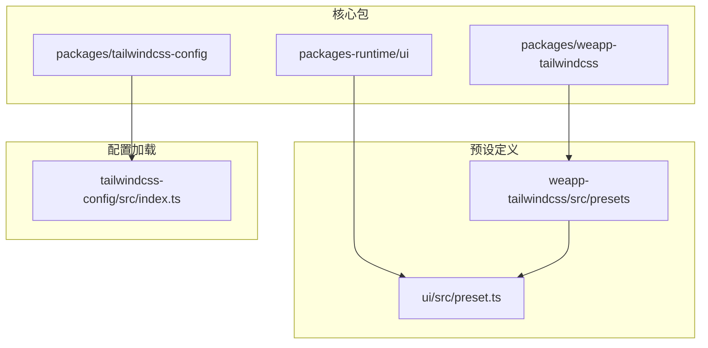
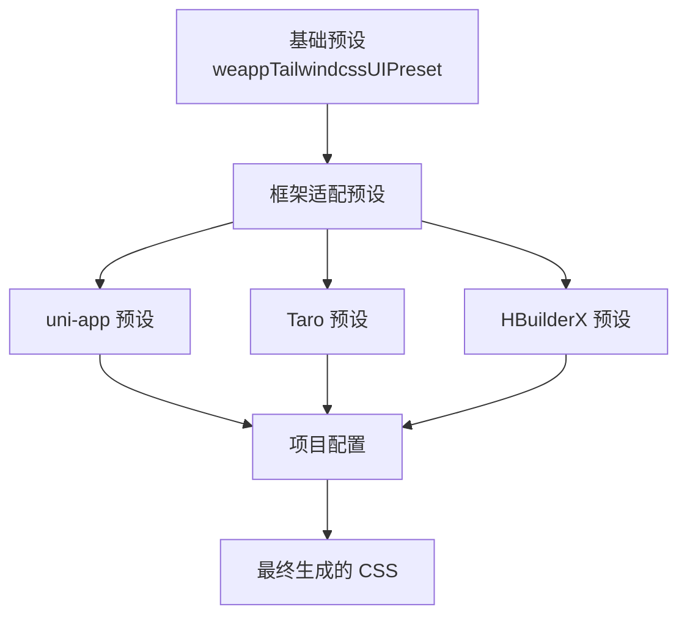
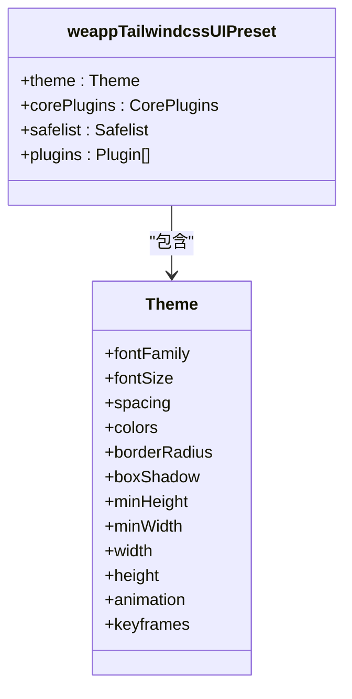
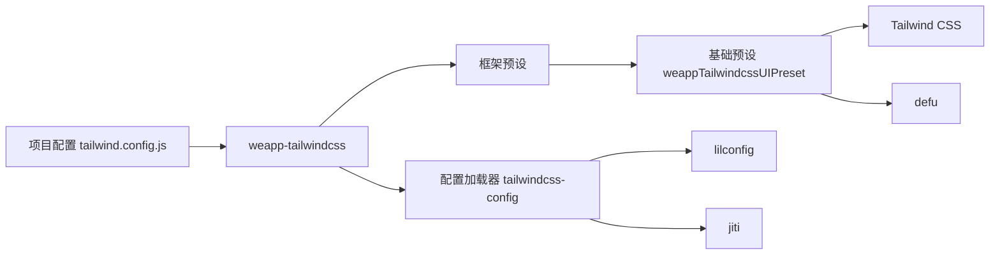

# 预设配置

<cite>
**本文档中引用的文件**  
- [preset.ts](file://packages-runtime/ui/src/preset.ts)
- [presets.ts](file://packages/weapp-tailwindcss/src/presets.ts)
- [index.ts](file://packages/weapp-tailwindcss/src/presets/index.ts)
- [shared.ts](file://packages/weapp-tailwindcss/src/presets/shared.ts)
- [uni-app.ts](file://packages/weapp-tailwindcss/src/presets/uni-app.ts)
- [uni-app-x.ts](file://packages/weapp-tailwindcss/src/presets/uni-app-x.ts)
- [taro.ts](file://packages/weapp-tailwindcss/src/presets/taro.ts)
- [hbuilderx.ts](file://packages/weapp-tailwindcss/src/presets/hbuilderx.ts)
- [tailwindcss-config/src/index.ts](file://packages/tailwindcss-config/src/index.ts)
- [tailwindcss-config/src/utils.ts](file://packages/tailwindcss-config/src/utils.ts)
- [shared/src/index.ts](file://packages/shared/src/index.ts)
</cite>

## 目录
1. [介绍](#介绍)
2. [项目结构](#项目结构)
3. [核心组件](#核心组件)
4. [架构概述](#架构概述)
5. [详细组件分析](#详细组件分析)
6. [依赖分析](#依赖分析)
7. [性能考虑](#性能考虑)
8. [故障排除指南](#故障排除指南)
9. [结论](#结论)

## 介绍
`weapp-tailwindcss` 是一个专为微信小程序及其他类小程序平台设计的 Tailwind CSS 集成解决方案。其预设系统是该工具的核心特性之一，旨在为不同框架（如 Taro、uni-app）和项目类型（如企业级应用、小型工具）提供标准化、可复用的样式配置。本文档全面介绍预设系统的概念、用途、工作原理，以及如何创建、加载、组合和共享预设配置。

## 项目结构
`weapp-tailwindcss` 的预设系统分布在多个包中，主要逻辑位于 `packages/weapp-tailwindcss` 和 `packages-runtime/ui` 目录下。预设配置通过模块化的方式组织，支持针对不同开发框架和工具链的定制化。



**图示来源**
- [packages/weapp-tailwindcss/src/presets](file://packages/weapp-tailwindcss/src/presets)
- [packages-runtime/ui/src/preset.ts](file://packages-runtime/ui/src/preset.ts)
- [packages/tailwindcss-config/src/index.ts](file://packages/tailwindcss-config/src/index.ts)

**本节来源**
- [packages/weapp-tailwindcss/src/presets](file://packages/weapp-tailwindcss/src/presets)
- [packages-runtime/ui/src/preset.ts](file://packages-runtime/ui/src/preset.ts)

## 核心组件
预设系统的核心组件包括：
1.  **预设定义**：在 `packages-runtime/ui/src/preset.ts` 中定义了 `weappTailwindcssUIPreset`，这是一个完整的 Tailwind CSS 配置对象，包含了主题、核心插件、安全列表和插件。
2.  **框架适配预设**：在 `packages/weapp-tailwindcss/src/presets` 目录下，为不同框架（如 uni-app、Taro）提供了特定的预设。
3.  **配置加载器**：`packages/tailwindcss-config` 包负责从项目中加载和解析 Tailwind CSS 配置文件。

**本节来源**
- [packages-runtime/ui/src/preset.ts](file://packages-runtime/ui/src/preset.ts#L721-L774)
- [packages/weapp-tailwindcss/src/presets](file://packages/weapp-tailwindcss/src/presets)
- [packages/tailwindcss-config/src/index.ts](file://packages/tailwindcss-config/src/index.ts)

## 架构概述
`weapp-tailwindcss` 的预设系统采用分层架构。基础预设（`weappTailwindcssUIPreset`）提供了一套完整的、适用于小程序的原子化 CSS 类和设计系统。框架特定的预设则在此基础上进行扩展或调整，以适应不同框架的构建流程和特性。



**图示来源**
- [packages-runtime/ui/src/preset.ts](file://packages-runtime/ui/src/preset.ts#L721-L774)
- [packages/weapp-tailwindcss/src/presets](file://packages/weapp-tailwindcss/src/presets)

## 详细组件分析

### 基础预设分析
`weappTailwindcssUIPreset` 是整个系统的基础，它定义了设计系统的核心变量和功能。

#### 主题配置
预设定义了完整的主题，包括：
- **间距比例** (`spacingScale`)：使用 `rpx` 单位，适配小程序的响应式布局。
- **字体大小** (`fontSizeScale`)：定义了从小到大的字体层级。
- **颜色** (`colors`)：包含主色、辅色、成功、警告、危险等状态色，以及表面、文本、边框等语义色。
- **圆角** (`radii`) 和 **阴影** (`shadows`)：提供了一致的视觉样式。



**图示来源**
- [packages-runtime/ui/src/preset.ts](file://packages-runtime/ui/src/preset.ts#L29-L774)

#### 插件与工具类
预设通过一个自定义的 Tailwind 插件 (`weappTailwindcssUIPlugin`) 来注入基础样式和工具类。
- **基础样式** (`addBase`)：重置小程序的默认样式，设置根元素的 CSS 变量，并定义暗色主题。
- **工具类** (`addUtilities`)：动态生成间距、字体大小等通用工具类。
- **组件类** (`addComponents`)：定义了如 `.wt-button`, `.wt-card`, `.wt-input` 等预设的 UI 组件。

**本节来源**
- [packages-runtime/ui/src/preset.ts](file://packages-runtime/ui/src/preset.ts#L103-L717)

### 框架适配预设分析
为了支持不同的开发框架，`weapp-tailwindcss` 提供了多个适配预设。

#### uni-app 预设
`uni-app` 预设位于 `packages/weapp-tailwindcss/src/presets/uni-app.ts`。它继承了基础预设，并根据 `uni-app` 的构建特性和平台差异进行调整。

```mermaid
classDiagram
class BasePreset {
<<abstract>>
+theme
+plugins
}
class UniAppPreset {
+theme
+plugins
}
BasePreset <|-- UniAppPreset : "继承"
UniAppPreset --> "Tailwind Plugin" : "使用"
```

**图示来源**
- [packages/weapp-tailwindcss/src/presets/uni-app.ts](file://packages/weapp-tailwindcss/src/presets/uni-app.ts)

#### Taro 预设
`Taro` 预设位于 `packages/weapp-tailwindcss/src/presets/taro.ts`。它同样基于基础预设，但会针对 Taro 框架的编译流程和 API 进行优化。

**本节来源**
- [packages/weapp-tailwindcss/src/presets/uni-app.ts](file://packages/weapp-tailwindcss/src/presets/uni-app.ts)
- [packages/weapp-tailwindcss/src/presets/taro.ts](file://packages/weapp-tailwindcss/src/presets/taro.ts)
- [packages/weapp-tailwindcss/src/presets/uni-app-x.ts](file://packages/weapp-tailwindcss/src/presets/uni-app-x.ts)
- [packages/weapp-tailwindcss/src/presets/hbuilderx.ts](file://packages/weapp-tailwindcss/src/presets/hbuilderx.ts)

## 依赖分析
预设系统的依赖关系清晰，各组件职责分明。



**图示来源**
- [packages/weapp-tailwindcss/src/index.ts](file://packages/weapp-tailwindcss/src/index.ts)
- [packages/tailwindcss-config/src/index.ts](file://packages/tailwindcss-config/src/index.ts)
- [packages/shared/src/index.ts](file://packages/shared/src/index.ts)

**本节来源**
- [packages/weapp-tailwindcss/src/index.ts](file://packages/weapp-tailwindcss/src/index.ts)
- [packages/tailwindcss-config/src/index.ts](file://packages/tailwindcss-config/src/index.ts)
- [packages/shared/src/index.ts](file://packages/shared/src/index.ts)

## 性能考虑
预设系统在设计时考虑了性能：
- **按需生成**：工具类是动态生成的，避免了不必要的 CSS 输出。
- **CSS 变量**：大量使用 CSS 变量，提高了主题切换的效率。
- **精简核心**：通过设置 `corePlugins.preflight = false`，禁用了 Tailwind 默认的 `preflight` 样式，由预设提供更符合小程序需求的重置样式。

## 故障排除指南
在使用预设时，可能会遇到以下问题：
- **预设未生效**：检查 `tailwind.config.js` 文件是否正确引入了预设，例如 `presets: [require('weapp-tailwindcss/presets/uni-app')]`。
- **样式冲突**：由于预设注入了基础样式，可能与项目中原有的样式冲突。建议在项目初期就集成预设，或仔细审查预设的 `addBase` 规则。
- **配置加载失败**：确保 `tailwind.config.js` 文件位于项目根目录，或在构建工具中正确指定了配置文件路径。

**本节来源**
- [packages/weapp-tailwindcss/src/presets/shared.ts](file://packages/weapp-tailwindcss/src/presets/shared.ts)
- [packages/tailwindcss-config/src/index.ts](file://packages/tailwindcss-config/src/index.ts#L22-L57)

## 结论
`weapp-tailwindcss` 的预设系统是一个强大而灵活的工具，它通过提供标准化的基础配置和框架适配层，极大地简化了在小程序项目中使用 Tailwind CSS 的流程。开发者可以基于这些预设快速搭建项目，也可以根据需要进行深度定制。理解预设的继承、覆盖机制和加载流程，是高效使用该工具的关键。