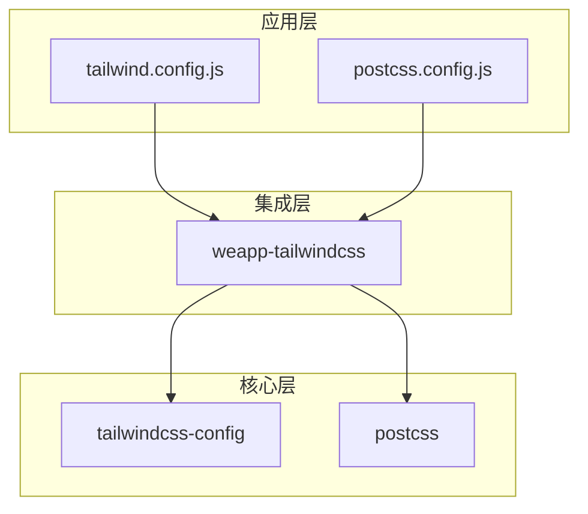
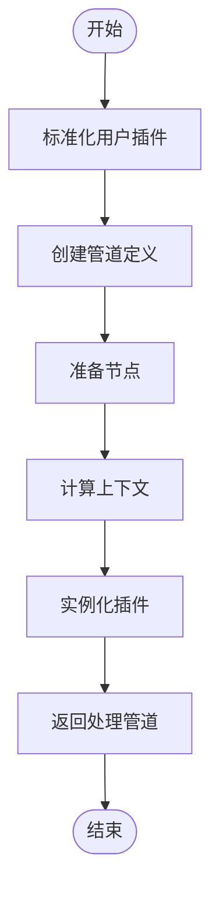
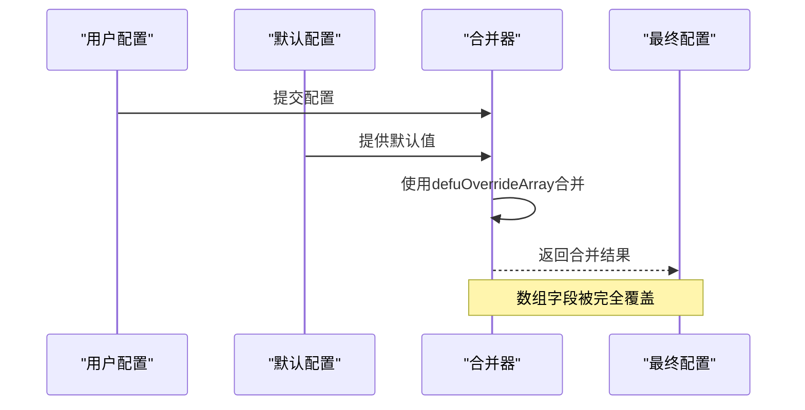
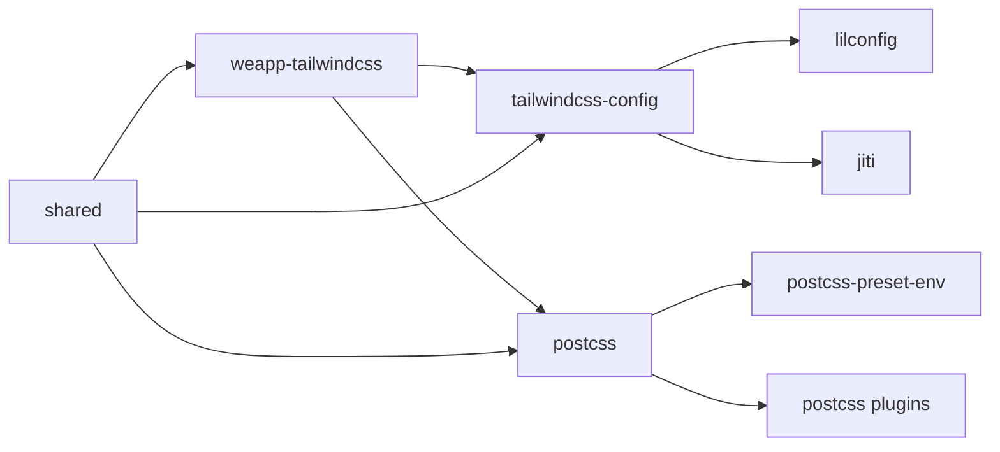

# 高级配置

<cite>
**本文档中引用的文件**  
- [tailwind.config.js](file://apps/rsmax-app-ts/tailwind.config.js)
- [postcss.config.js](file://apps/rsmax-app-ts/postcss.config.js)
- [index.ts](file://packages/weapp-tailwindcss/src/index.ts)
- [index.ts](file://packages/tailwindcss-config/src/index.ts)
- [pipeline.ts](file://packages/postcss/src/pipeline.ts)
- [handler.ts](file://packages/postcss/src/handler.ts)
- [utils.ts](file://packages/tailwindcss-config/src/utils.ts)
- [index.ts](file://packages/shared/src/index.ts)
</cite>

## 目录
1. [简介](#简介)
2. [项目结构](#项目结构)
3. [核心组件](#核心组件)
4. [架构概述](#架构概述)
5. [详细组件分析](#详细组件分析)
6. [依赖分析](#依赖分析)
7. [性能考虑](#性能考虑)
8. [故障排除指南](#故障排除指南)
9. [结论](#结论)

## 简介
本文档详细介绍了 `weapp-tailwindcss` 项目的高级配置功能，涵盖插件系统、预设（presets）、自定义处理器等高级功能的配置。重点解释如何注册自定义插件、创建和使用配置预设、扩展默认配置等。提供复杂场景下的配置示例，如多项目共享配置、动态配置生成、条件配置加载等。包含配置性能优化技巧和大型项目配置管理最佳实践。同时解释高级配置的加载顺序和合并策略。

## 项目结构
该项目是一个多包（monorepo）结构，包含多个应用示例、核心包和工具脚本。主要结构如下：

- `apps/`：包含多个应用示例，如 React、Vue、Taro、UniApp 等框架的集成示例。
- `demo/`：包含不同构建工具（如 Gulp、Mpx）的演示项目。
- `packages/`：包含核心功能包，如 `weapp-tailwindcss`（主包）、`tailwindcss-config`（配置加载）、`postcss`（PostCSS 处理管道）等。
- `templates/`：包含可复用的项目模板。
- `benchmark/` 和 `e2e/`：包含性能基准测试和端到端测试。

配置文件主要分布在各个应用示例中，如 `tailwind.config.js` 和 `postcss.config.js`，而核心配置逻辑则在 `packages/` 目录下的包中实现。

**Section sources**
- [tailwind.config.js](file://apps/rsmax-app-ts/tailwind.config.js)
- [postcss.config.js](file://apps/rsmax-app-ts/postcss.config.js)

## 核心组件
核心组件包括配置加载器（`tailwindcss-config`）、PostCSS 处理管道（`postcss`）和主集成包（`weapp-tailwindcss`）。这些组件共同实现了灵活的配置系统，支持插件、预设和自定义处理器。

**Section sources**
- [index.ts](file://packages/weapp-tailwindcss/src/index.ts)
- [index.ts](file://packages/tailwindcss-config/src/index.ts)
- [index.ts](file://packages/postcss/src/index.ts)

## 架构概述
系统架构分为三层：应用层、集成层和核心层。应用层使用 `tailwind.config.js` 和 `postcss.config.js` 进行配置；集成层由 `weapp-tailwindcss` 包提供，负责协调不同构建工具；核心层包含 `tailwindcss-config` 和 `postcss` 包，实现配置加载和样式处理管道。



**Diagram sources**
- [index.ts](file://packages/weapp-tailwindcss/src/index.ts)
- [index.ts](file://packages/tailwindcss-config/src/index.ts)
- [index.ts](file://packages/postcss/src/index.ts)

## 详细组件分析

### 配置加载组件分析
`tailwindcss-config` 包负责加载和合并 Tailwind CSS 配置。它使用 `lilconfig` 库搜索配置文件，并支持多种格式（`.js`, `.cjs`, `.mjs`, `.ts` 等）。配置合并使用 `defuOverrideArray` 策略，确保数组字段被覆盖而非合并。

```mermaid
classDiagram
class LoadConfigOptions {
+string cwd
+string config
+string moduleName
}
class LoadConfigResult {
+string filepath
+Config config
+boolean isEmpty
}
class Config {
+array content
+object theme
+array plugins
}
loadConfig(loadOptions) LoadConfigOptions --> LoadConfigResult : "returns"
LoadConfigResult --> Config : "contains"
```

**Diagram sources**
- [index.ts](file://packages/tailwindcss-config/src/index.ts)
- [utils.ts](file://packages/tailwindcss-config/src/utils.ts)

### PostCSS 处理管道分析
`postcss` 包实现了一个分阶段的 PostCSS 处理管道，分为 `pre`、`normal`、`post` 三个阶段。每个阶段可以注册自定义插件，系统内置了预处理和后处理插件。管道的创建和缓存由 `createStyleHandler` 管理，确保高效处理。



**Diagram sources**
- [pipeline.ts](file://packages/postcss/src/pipeline.ts)
- [handler.ts](file://packages/postcss/src/handler.ts)

### 配置合并策略
配置合并使用 `defuOverrideArray` 策略，该策略来自 `@weapp-tailwindcss/shared` 包。与默认的 `defu` 不同，`defuOverrideArray` 会用新数组覆盖旧数组，而不是合并它们。这对于插件列表等配置项非常重要，确保用户配置完全替换默认配置。



**Diagram sources**
- [utils.ts](file://packages/tailwindcss-config/src/utils.ts)
- [index.ts](file://packages/shared/src/index.ts)

**Section sources**
- [index.ts](file://packages/tailwindcss-config/src/index.ts)
- [index.ts](file://packages/shared/src/index.ts)

## 依赖分析
项目依赖关系清晰，`weapp-tailwindcss` 作为主包依赖 `tailwindcss-config` 和 `postcss`。`tailwindcss-config` 依赖 `lilconfig` 和 `jiti` 用于配置加载，`postcss` 依赖多个 PostCSS 插件。`shared` 包提供通用工具函数，被多个包引用。



**Diagram sources**
- [package.json](file://packages/weapp-tailwindcss/package.json)
- [package.json](file://packages/tailwindcss-config/package.json)
- [package.json](file://packages/postcss/package.json)

**Section sources**
- [package.json](file://packages/weapp-tailwindcss/package.json)
- [package.json](file://packages/tailwindcss-config/package.json)
- [package.json](file://packages/postcss/package.json)

## 性能考虑
配置系统通过缓存机制优化性能。`StyleProcessorCache` 类缓存已创建的处理器和处理选项，避免重复创建。管道创建是昂贵的操作，因此缓存显著提升了处理速度，特别是在热更新等频繁调用场景下。

## 故障排除指南
常见问题包括配置文件未被正确加载、插件未生效等。建议检查配置文件路径是否正确，确保文件名符合 `tailwind.config.[js|cjs|mjs|ts]` 格式。使用 `loadConfig` 函数的调试输出可以验证配置加载过程。

**Section sources**
- [index.ts](file://packages/tailwindcss-config/src/index.ts)
- [handler.ts](file://packages/postcss/src/handler.ts)

## 结论
`weapp-tailwindcss` 项目提供了一套强大而灵活的高级配置系统，支持插件、预设和自定义处理器。通过合理的架构设计和配置合并策略，使得该系统既易于使用又高度可扩展。性能优化和缓存机制确保了在大型项目中的高效运行。