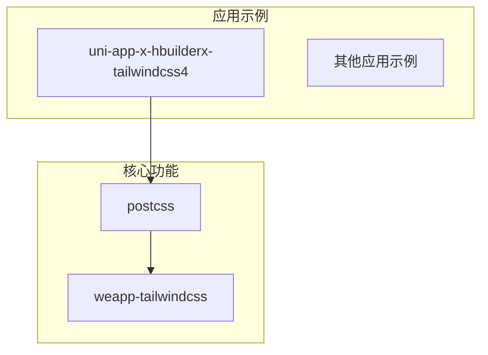
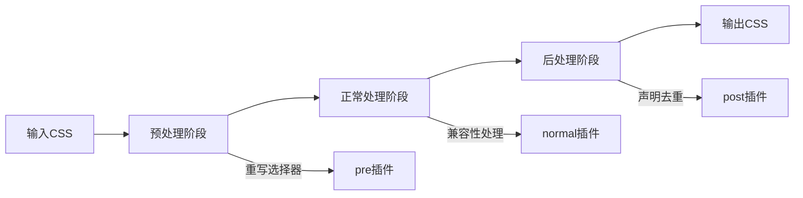
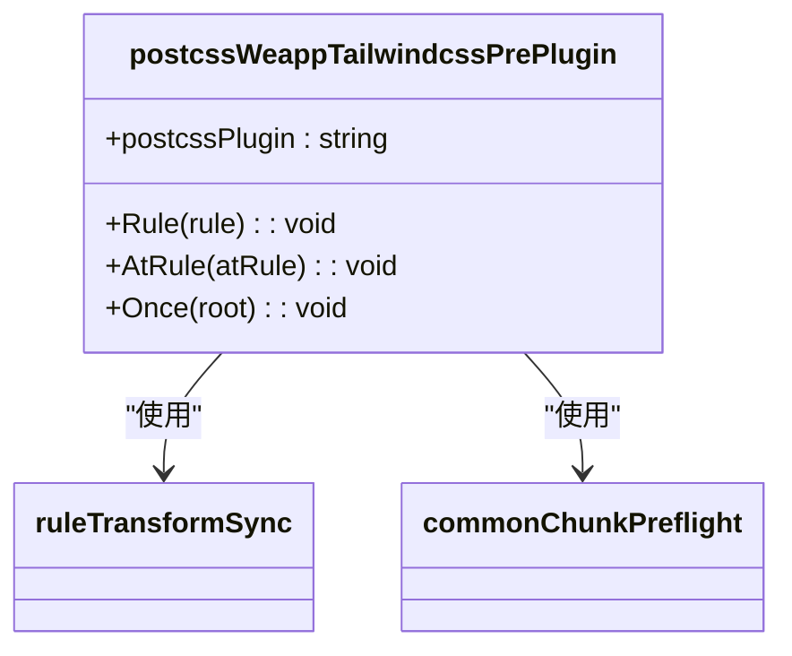
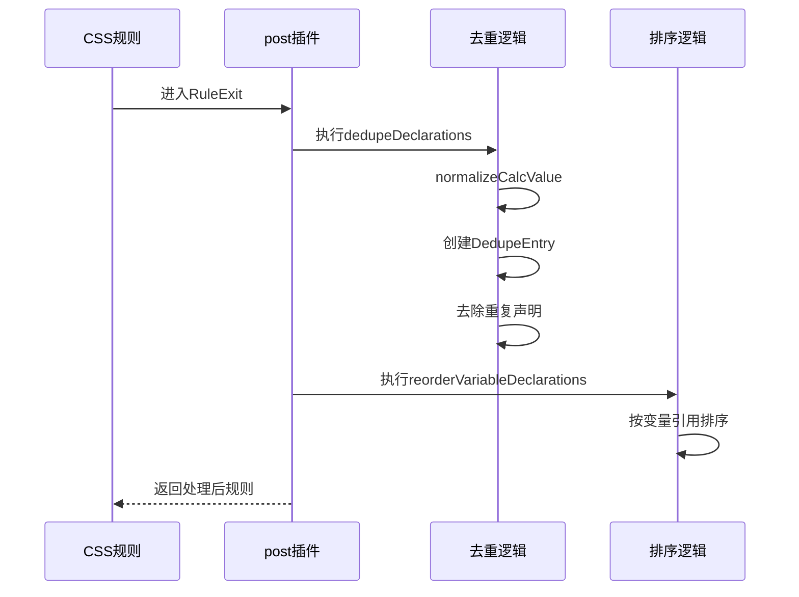

# CSS宏功能

<cite>
**本文档引用的文件**  
- [main.css](file://apps/uni-app-x-hbuilderx-tailwindcss4/main.css)
- [uni.scss](file://apps/uni-app-x-hbuilderx-tailwindcss4/uni.scss)
- [index.ts](file://packages/postcss/src/index.ts)
- [pipeline.ts](file://packages/postcss/src/pipeline.ts)
- [handler.ts](file://packages/postcss/src/handler.ts)
- [pre.ts](file://packages/postcss/src/plugins/pre.ts)
- [post.ts](file://packages/postcss/src/plugins/post.ts)
</cite>

## 目录
1. [简介](#简介)
2. [项目结构](#项目结构)
3. [核心组件](#核心组件)
4. [架构概述](#架构概述)
5. [详细组件分析](#详细组件分析)
6. [依赖分析](#依赖分析)
7. [性能考虑](#性能考虑)
8. [故障排除指南](#故障排除指南)
9. [结论](#结论)

## 简介
本文档详细介绍了在uni-app环境中使用`@apply`等高级CSS语法的实现机制。重点阐述了CSS宏的解析流程、配置方法、与其他Tailwind功能的交互方式以及常见问题的解决方案。

## 项目结构
本项目采用模块化结构，主要包含多个应用示例和核心功能包。CSS宏功能主要实现在`packages/postcss`模块中，并通过`apps/uni-app-x-hbuilderx-tailwindcss4`等应用进行验证。



**图示来源**
- [main.css](file://apps/uni-app-x-hbuilderx-tailwindcss4/main.css)
- [pipeline.ts](file://packages/postcss/src/pipeline.ts)

**本节来源**
- [main.css](file://apps/uni-app-x-hbuilderx-tailwindcss4/main.css)
- [pipeline.ts](file://packages/postcss/src/pipeline.ts)

## 核心组件
CSS宏功能的核心实现包括预处理和后处理两个阶段。预处理阶段负责重写选择器和清理不兼容规则，后处理阶段负责声明去重与变量排序。

**本节来源**
- [pre.ts](file://packages/postcss/src/plugins/pre.ts)
- [post.ts](file://packages/postcss/src/plugins/post.ts)

## 架构概述
CSS宏功能通过PostCSS插件流水线实现，分为pre、normal、post三个阶段。每个阶段都有特定的处理任务，确保CSS规则在小程序环境中正确应用。



**图示来源**
- [pipeline.ts](file://packages/postcss/src/pipeline.ts)
- [handler.ts](file://packages/postcss/src/handler.ts)

## 详细组件分析

### 预处理组件分析
预处理组件负责在CSS处理早期阶段进行选择器重写和规则清理。



**图示来源**
- [pre.ts](file://packages/postcss/src/plugins/pre.ts)
- [selectorParser.ts](file://packages/postcss/src/selectorParser.ts)

**本节来源**
- [pre.ts](file://packages/postcss/src/plugins/pre.ts)

### 后处理组件分析
后处理组件负责在CSS处理末期进行声明去重和变量排序。



**图示来源**
- [post.ts](file://packages/postcss/src/plugins/post.ts)
- [decl-order.ts](file://packages/postcss/src/utils/decl-order.ts)

**本节来源**
- [post.ts](file://packages/postcss/src/plugins/post.ts)

## 依赖分析
CSS宏功能依赖于多个核心模块和第三方库，形成了完整的处理链条。

```mermaid
graph TD
A[CSS宏功能] --> B[PostCSS]
A --> C[@weapp-tailwindcss/shared]
A --> D[postcss-preset-env]
B --> E[插件系统]
C --> F[defu合并工具]
D --> G[CSS特性支持]
```

**图示来源**
- [package.json](file://packages/postcss/package.json)
- [pipeline.ts](file://packages/postcss/src/pipeline.ts)

**本节来源**
- [pipeline.ts](file://packages/postcss/src/pipeline.ts)
- [handler.ts](file://packages/postcss/src/handler.ts)

## 性能考虑
CSS宏功能在设计时充分考虑了性能因素，通过缓存机制和流水线优化确保处理效率。

- 使用`StyleProcessorCache`缓存处理器实例
- 流水线节点预创建减少运行时开销
- 选择器转换同步执行避免异步开销
- 声明去重算法优化减少遍历次数

## 故障排除指南
### 常见问题及解决方案

**宏解析错误**
- 检查`@apply`语法是否正确
- 确认类名在Tailwind配置中存在
- 查看PostCSS插件是否正确加载

**样式冲突**
- 检查选择器特异性
- 验证变量优先级设置
- 确认后处理阶段去重功能正常

**兼容性问题**
- 检查目标平台CSS支持情况
- 验证预处理插件是否正确重写选择器
- 确认`@supports`规则处理正确

**本节来源**
- [pre.ts](file://packages/postcss/src/plugins/pre.ts)
- [post.ts](file://packages/postcss/src/plugins/post.ts)

## 结论
CSS宏功能通过精心设计的PostCSS插件流水线，在uni-app环境中实现了`@apply`等高级CSS语法的支持。该实现不仅保证了功能完整性，还通过缓存和优化确保了处理性能，为小程序开发提供了强大的CSS能力支持。