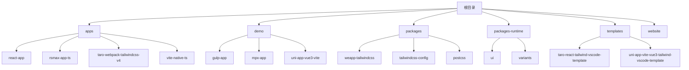
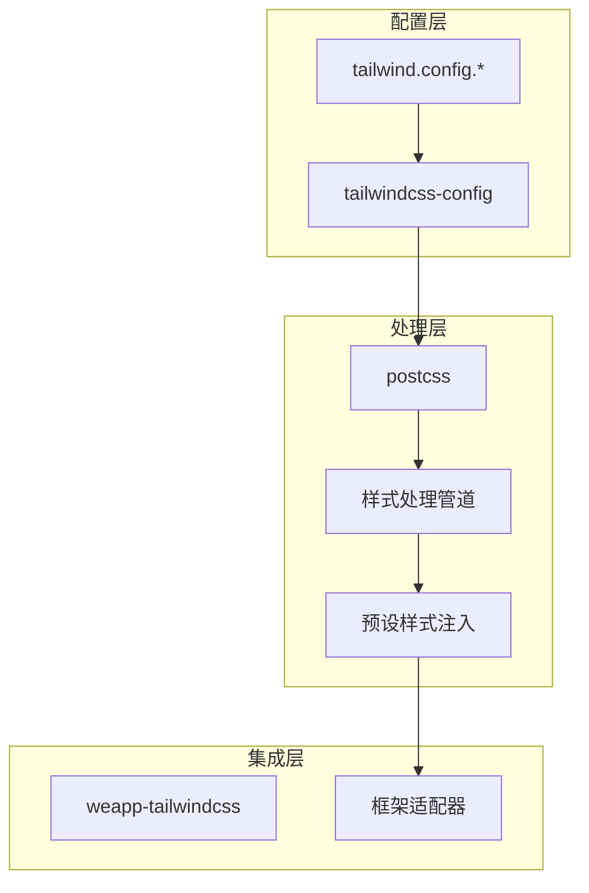
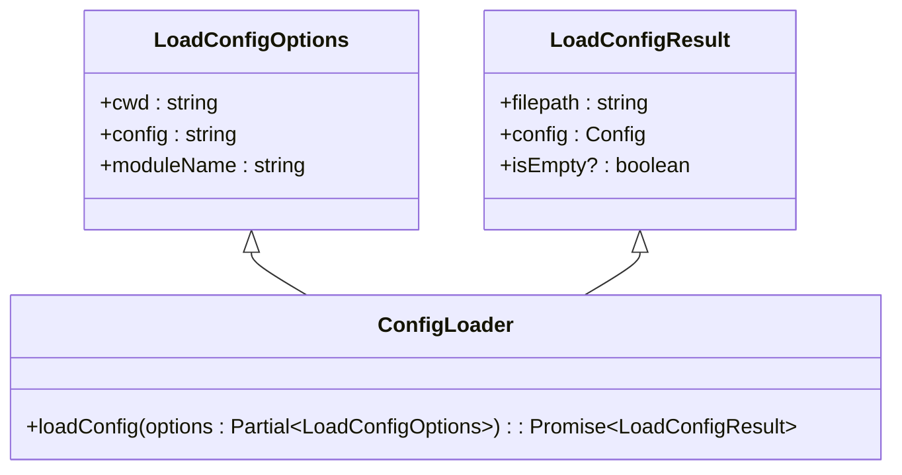
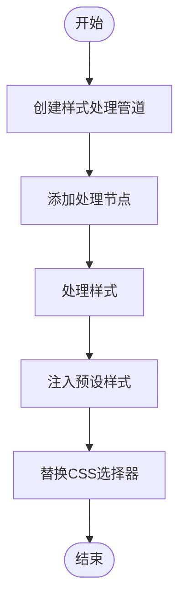
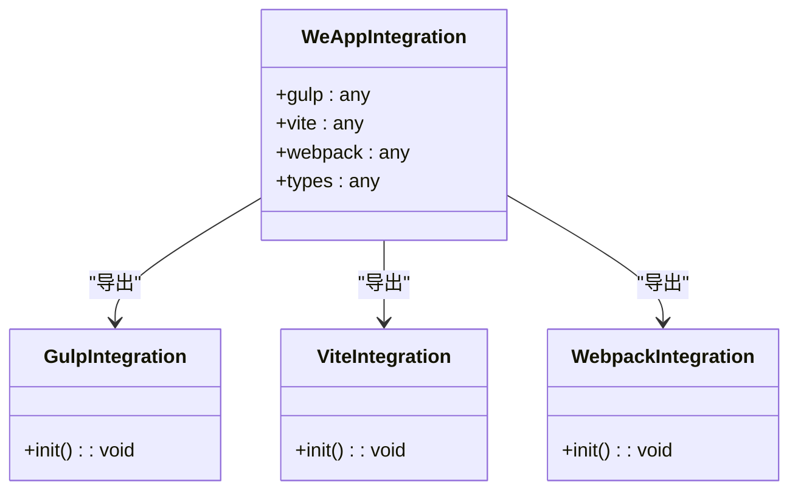
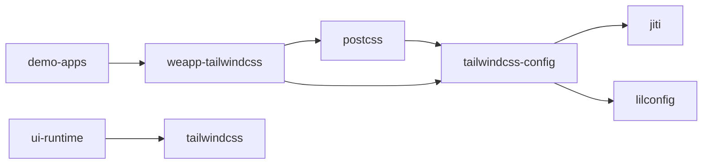

# 大型项目架构

<cite>
**本文档中引用的文件**  
- [tailwind.config.ts](file://apps/vite-native-ts/tailwind.config.ts)
- [tailwind.config.js](file://apps/rsmax-app-ts/tailwind.config.js)
- [tailwind.config.js](file://demo/uni-app-vue3-vite/tailwind.config.js)
- [tailwind.config.ts](file://packages-runtime/ui/tailwind.config.ts)
- [index.ts](file://packages/weapp-tailwindcss/src/index.ts)
- [index.ts](file://packages/tailwindcss-config/src/index.ts)
- [index.ts](file://packages/postcss/src/index.ts)
</cite>

## 目录
1. [简介](#简介)
2. [项目结构](#项目结构)
3. [核心组件](#核心组件)
4. [架构概述](#架构概述)
5. [详细组件分析](#详细组件分析)
6. [依赖分析](#依赖分析)
7. [性能考虑](#性能考虑)
8. [故障排除指南](#故障排除指南)
9. [结论](#结论)

## 简介
本文档旨在为大型项目中使用Tailwind CSS提供全面的架构策略。文档详细说明了如何设计可扩展的Tailwind配置，包括主题定制、插件管理和变体扩展。同时介绍了组件库的组织方法、多环境配置管理、模块化样式架构以及与设计系统的集成方式，并提供团队协作的最佳实践。

## 项目结构
该项目是一个复杂的单体仓库（monorepo），包含多个应用、演示项目、包和模板。其结构清晰地分离了不同类型的项目和共享组件。

**图示来源**  
- [apps](file://apps)
- [demo](file://demo)
- [packages](file://packages)
- [templates](file://templates)

**本节来源**  
- [project_structure](file://project_structure)

## 核心组件
本项目的核心组件包括Tailwind CSS配置管理、PostCSS处理管道和WeApp特定的集成工具。这些组件共同构成了一个可扩展的样式系统，支持多种前端框架和构建工具。

**本节来源**  
- [index.ts](file://packages/weapp-tailwindcss/src/index.ts)
- [index.ts](file://packages/tailwindcss-config/src/index.ts)
- [index.ts](file://packages/postcss/src/index.ts)

## 架构概述
该架构采用分层设计，将配置、处理和集成逻辑分离。核心架构包括配置加载器、样式处理管道和框架适配器。

**图示来源**  
- [index.ts](file://packages/tailwindcss-config/src/index.ts)
- [index.ts](file://packages/postcss/src/index.ts)
- [index.ts](file://packages/weapp-tailwindcss/src/index.ts)

## 详细组件分析

### Tailwind配置管理分析
该组件负责加载和解析Tailwind配置文件，支持多种格式（JS、TS、CJS、MJS等）。

**图示来源**  
- [index.ts](file://packages/tailwindcss-config/src/index.ts#L10-L20)

**本节来源**  
- [index.ts](file://packages/tailwindcss-config/src/index.ts)

### 样式处理管道分析
该组件实现了样式处理的核心逻辑，包括预设样式注入和CSS选择器替换。

**图示来源**  
- [index.ts](file://packages/postcss/src/index.ts#L4-L10)

**本节来源**  
- [index.ts](file://packages/postcss/src/index.ts)

### WeApp集成分析
该组件提供了对不同构建工具（Vite、Webpack、Gulp等）的集成支持。

**图示来源**  
- [index.ts](file://packages/weapp-tailwindcss/src/index.ts#L1-L4)

**本节来源**  
- [index.ts](file://packages/weapp-tailwindcss/src/index.ts)

## 依赖分析
项目采用模块化设计，各组件之间有清晰的依赖关系。

**图示来源**  
- [package.json](file://packages/tailwindcss-config/package.json)
- [package.json](file://packages/postcss/package.json)
- [package.json](file://packages/weapp-tailwindcss/package.json)

**本节来源**  
- [package.json](file://packages/tailwindcss-config/package.json)
- [package.json](file://packages/postcss/package.json)
- [package.json](file://packages/weapp-tailwindcss/package.json)

## 性能考虑
在大型项目中使用Tailwind CSS时，需要注意以下性能优化策略：
- 精确配置`content`选项，避免扫描不必要的文件
- 使用`preflight: false`禁用不必要的预设样式
- 合理使用插件，避免过度扩展
- 利用缓存机制提高构建速度
- 分离开发和生产环境的配置

## 故障排除指南
常见问题及解决方案：

**本节来源**  
- [README.md](file://README.md)
- [CONTRIBUTING.md](file://CONTRIBUTING.md)

## 结论
本文档详细介绍了在大型项目中使用Tailwind CSS的架构策略。通过合理的配置管理、模块化设计和团队协作实践，可以有效提升项目的可维护性和开发效率。建议在实际项目中根据具体需求调整配置，并持续优化样式系统。