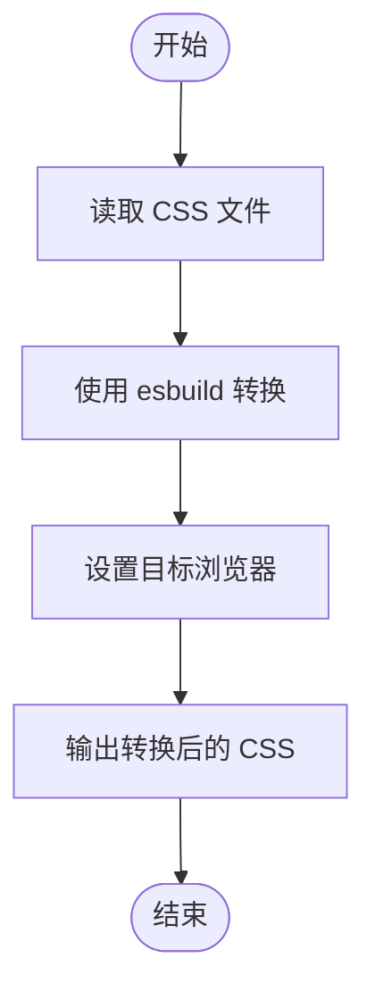
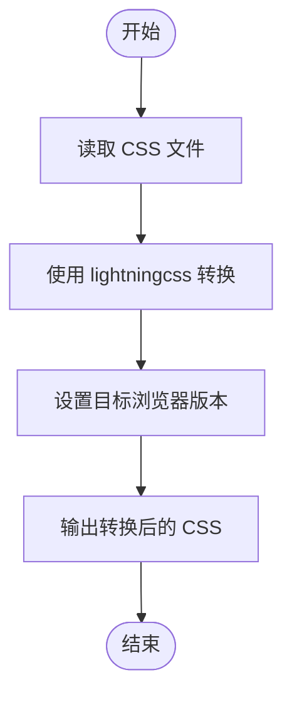
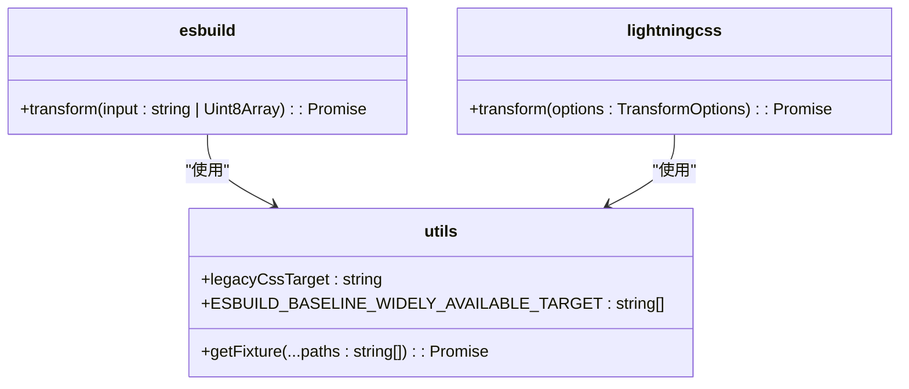

# 实验性功能

<cite>
**本文档中引用的文件**  
- [README.md](file://packages/experimental/README.md)
- [package.json](file://packages/experimental/package.json)
- [esbuild.test.ts](file://packages/experimental/test/esbuild.test.ts)
- [lightningcss.test.ts](file://packages/experimental/test/lightningcss.test.ts)
- [utils.ts](file://packages/experimental/test/utils.ts)
- [base.css](file://packages/experimental/test/fixtures/base.css)
- [components.css](file://packages/experimental/test/fixtures/components.css)
</cite>

## 目录
1. [简介](#简介)
2. [实验性功能概览](#实验性功能概览)
3. [新编译模式](#新编译模式)
4. [优化算法](#优化算法)
5. [架构改进](#架构改进)
6. [启用和测试步骤](#启用和测试步骤)
7. [使用示例和最佳实践](#使用示例和最佳实践)
8. [反馈和问题报告](#反馈和问题报告)
9. [未来发展方向](#未来发展方向)
10. [限制和风险](#限制和风险)

## 简介
`weapp-tailwindcss` 是一个为小程序环境提供 Tailwind CSS 支持的全面解决方案。该项目支持多种构建工具，包括 `webpack`、`vite`、`rspack`、`rollup`、`rolldown` 和 `gulp`，涵盖了市面上几乎所有主流的小程序开发框架。此外，它还支持直接从开发者工具中创建的原生小程序应用。

`@weapp-tailwindcss/experimental` 包是项目中的实验性功能模块，旨在探索和实现新的编译模式、优化算法和架构改进。这些功能目前处于实验阶段，建议仅在测试环境中使用。

**Section sources**
- [README.md](file://packages/experimental/README.md#L1-L101)

## 实验性功能概览
`@weapp-tailwindcss/experimental` 包的主要目标是通过引入新的编译模式和优化算法来提升小程序的构建性能和用户体验。当前的实验性功能主要包括：

- **esbuild 编译模式**：利用 esbuild 的高性能编译能力，加速 CSS 文件的处理。
- **lightningcss 编译模式**：采用 lightningcss 进行 CSS 转换，支持现代浏览器特性并进行兼容性转换。
- **目标浏览器配置**：通过配置目标浏览器版本，确保生成的 CSS 在指定的浏览器环境中正常工作。

这些功能的设计目标是提高构建速度、减少输出文件大小，并增强对现代 CSS 特性的支持。

**Section sources**
- [package.json](file://packages/experimental/package.json#L1-L43)
- [esbuild.test.ts](file://packages/experimental/test/esbuild.test.ts#L1-L29)
- [lightningcss.test.ts](file://packages/experimental/test/lightningcss.test.ts#L1-L32)

## 新编译模式
### esbuild 编译模式
esbuild 是一个用 Go 编写的高性能构建工具，以其极快的编译速度著称。在 `@weapp-tailwindcss/experimental` 中，esbuild 被用于处理 CSS 文件，通过 `transform` 函数将输入的 CSS 代码转换为目标格式。



**Diagram sources**
- [esbuild.test.ts](file://packages/experimental/test/esbuild.test.ts#L1-L29)

### lightningcss 编译模式
lightningcss 是一个由 Parcel 团队开发的 CSS 解析器和转换器，支持现代 CSS 特性并能将其转换为向后兼容的形式。在 `@weapp-tailwindcss/experimental` 中，lightningcss 用于处理 CSS 文件，确保生成的代码在不同浏览器中具有一致的行为。



**Diagram sources**
- [lightningcss.test.ts](file://packages/experimental/test/lightningcss.test.ts#L1-L32)

## 优化算法
### 目标浏览器配置
通过配置目标浏览器版本，可以确保生成的 CSS 代码在指定的浏览器环境中正常工作。例如，在 `esbuild.test.ts` 中，目标浏览器被设置为 `chrome58`，而在 `lightningcss.test.ts` 中，目标浏览器被设置为 `chrome61`。

```typescript
// esbuild.test.ts
const { code } = await transform(input, {
  loader: 'css',
  target: [
    'chrome58',
  ],
});

// lightningcss.test.ts
const { code } = await transform({
  code: Buffer.from(await getFixture('base.css')),
  filename: 'style.css',
  targets: {
    chrome: 61,
  },
});
```

这种配置方式允许开发者根据实际需求选择合适的浏览器版本，从而平衡性能和兼容性。

**Section sources**
- [esbuild.test.ts](file://packages/experimental/test/esbuild.test.ts#L1-L29)
- [lightningcss.test.ts](file://packages/experimental/test/lightningcss.test.ts#L1-L32)
- [utils.ts](file://packages/experimental/test/utils.ts#L1-L16)

## 架构改进
### 模块化设计
`@weapp-tailwindcss/experimental` 采用了模块化设计，将不同的编译模式和优化算法封装在独立的文件中。这种设计使得代码更加清晰和易于维护。



**Diagram sources**
- [esbuild.test.ts](file://packages/experimental/test/esbuild.test.ts#L1-L29)
- [lightningcss.test.ts](file://packages/experimental/test/lightningcss.test.ts#L1-L32)
- [utils.ts](file://packages/experimental/test/utils.ts#L1-L16)

## 启用和测试步骤
要启用和测试 `@weapp-tailwindcss/experimental` 中的实验性功能，请按照以下步骤操作：

1. **安装依赖**：
   ```bash
   pnpm add @weapp-tailwindcss/experimental
   ```

2. **配置构建工具**：
   根据使用的构建工具（如 `vite` 或 `webpack`），在配置文件中引入 `@weapp-tailwindcss/experimental` 并配置相应的编译模式。

3. **运行测试**：
   使用 `vitest` 运行测试，验证实验性功能是否按预期工作。
   ```bash
   pnpm test
   ```

4. **检查输出**：
   检查生成的 CSS 文件，确保其符合预期的格式和内容。

**Section sources**
- [package.json](file://packages/experimental/package.json#L32-L36)
- [esbuild.test.ts](file://packages/experimental/test/esbuild.test.ts#L1-L29)
- [lightningcss.test.ts](file://packages/experimental/test/lightningcss.test.ts#L1-L32)

## 使用示例和最佳实践
### 使用示例
以下是一个使用 `esbuild` 编译模式的示例：

```typescript
import { transform } from 'esbuild';
import { getFixture } from './utils';

async function processCSS() {
  const input = await getFixture('base.css');
  const result = await transform(input, {
    loader: 'css',
    target: ['chrome58'],
  });
  console.log(result.code);
}

processCSS();
```

### 最佳实践
- **选择合适的目标浏览器**：根据项目的需求选择合适的目标浏览器版本，以平衡性能和兼容性。
- **定期更新依赖**：保持 `esbuild` 和 `lightningcss` 等依赖的最新版本，以获得最新的性能优化和功能支持。
- **监控构建性能**：使用工具监控构建过程中的性能指标，及时发现和解决瓶颈问题。

**Section sources**
- [esbuild.test.ts](file://packages/experimental/test/esbuild.test.ts#L1-L29)
- [lightningcss.test.ts](file://packages/experimental/test/lightningcss.test.ts#L1-L32)
- [utils.ts](file://packages/experimental/test/utils.ts#L1-L16)

## 反馈和问题报告
我们欢迎社区成员提供反馈和报告问题。如果您遇到任何错误或有改进建议，请通过以下方式联系我们：

- **提交 Issue**：在 GitHub 仓库中提交 issue，详细描述问题和复现步骤。
- **提出建议**：如果有增强 `weapp-tailwindcss` 的想法，请提交 issue 分享您的建议。
- **贡献文档**：如果您对文档有更好的见解或更棒的修辞方式，欢迎提交 PR。
- **贡献代码**：任何人的代码都不是完美的，我们欢迎您通过 PR 提供更好的代码质量和活力。

**Section sources**
- [README.md](file://packages/experimental/README.md#L77-L87)

## 未来发展方向
`@weapp-tailwindcss/experimental` 的未来发展方向包括：

- **支持更多构建工具**：扩展对其他构建工具的支持，如 `rollup` 和 `gulp`。
- **增强优化算法**：进一步优化编译过程，减少输出文件大小，提高加载速度。
- **改进用户体验**：简化配置流程，提供更直观的用户界面和工具。

我们将持续关注社区反馈和技术发展，不断迭代和完善实验性功能。

**Section sources**
- [README.md](file://packages/experimental/README.md#L77-L87)

## 限制和风险
尽管 `@weapp-tailwindcss/experimental` 提供了强大的实验性功能，但仍存在一些限制和风险：

- **不稳定性**：实验性功能尚未经过充分测试，可能存在未知的 bug 和性能问题。
- **兼容性问题**：某些功能可能在特定环境下无法正常工作，需要进一步验证。
- **API 变更**：实验性功能的 API 可能在未来版本中发生变化，导致现有代码需要调整。

因此，建议仅在测试环境中使用这些功能，并在生产环境中谨慎评估其稳定性和可靠性。

**Section sources**
- [README.md](file://packages/experimental/README.md#L23-L27)