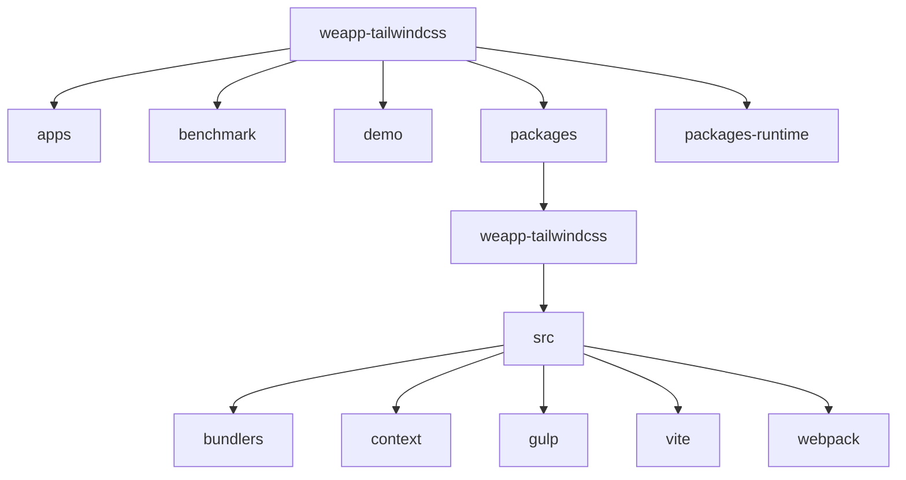
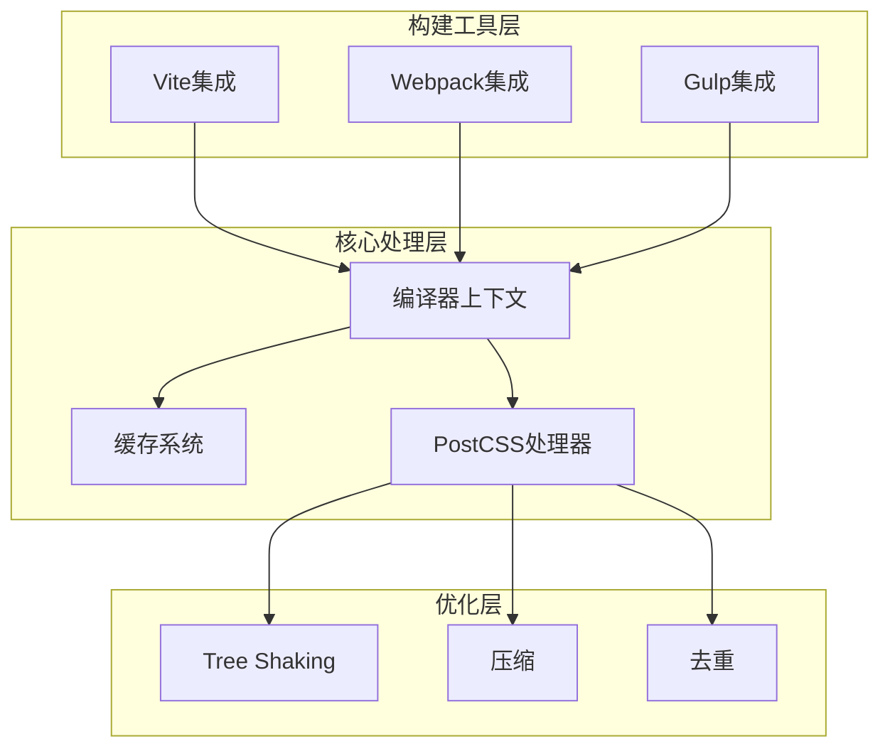
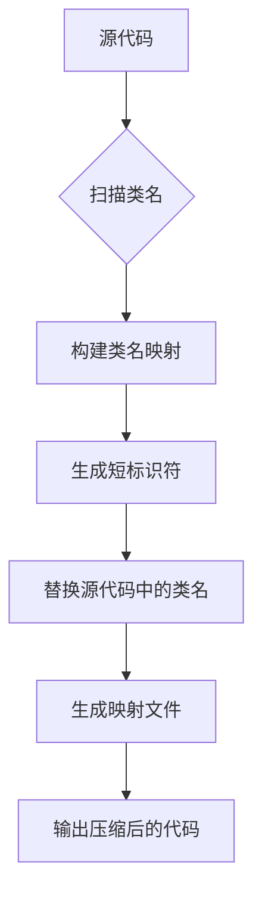
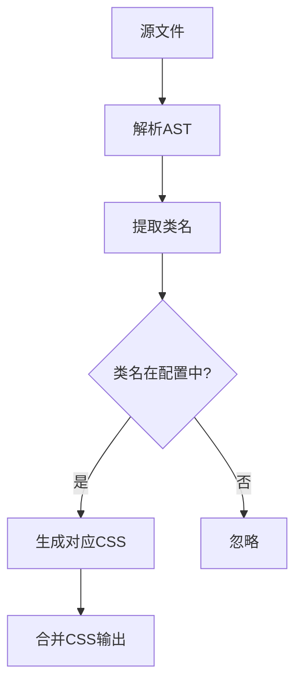
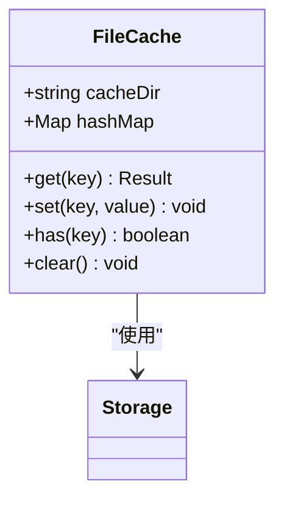
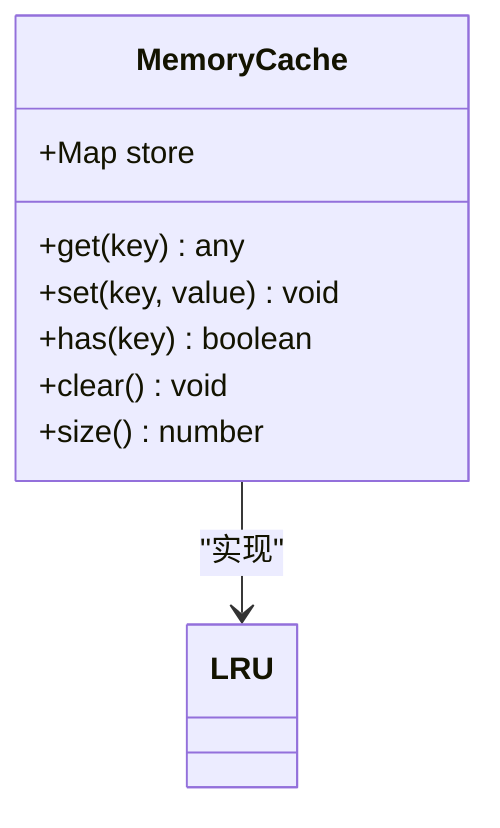
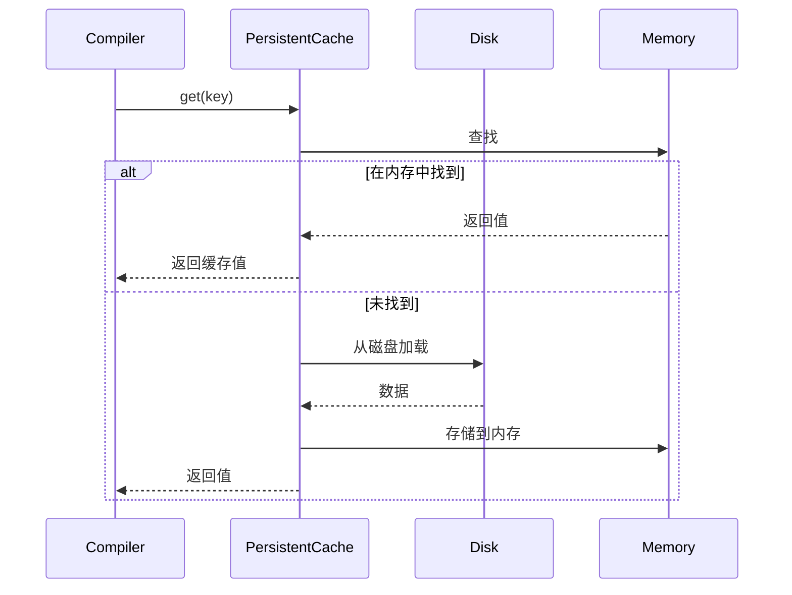
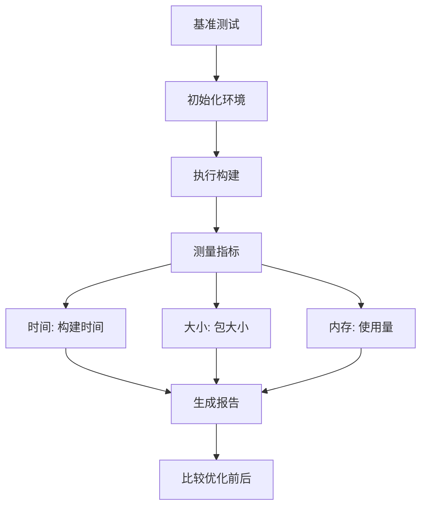
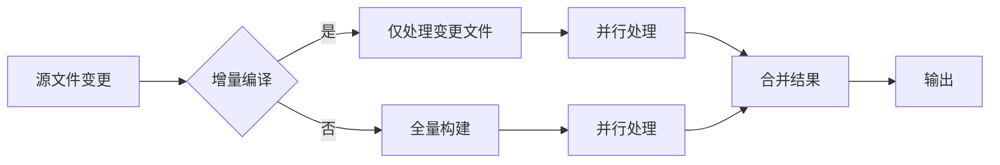
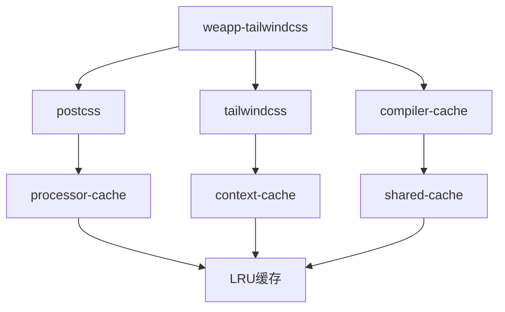

# 性能优化策略

<cite>
**本文档引用的文件**
- [cache.ts](file://packages/weapp-tailwindcss/src/bundlers/shared/cache.ts)
- [compiler-context-cache.ts](file://packages/weapp-tailwindcss/src/context/compiler-context-cache.ts)
- [processor-cache.ts](file://packages/postcss/src/processor-cache.ts)
- [index.ts](file://packages/weapp-tailwindcss/src/index.ts)
- [vite.ts](file://packages/weapp-tailwindcss/src/vite.ts)
- [webpack.ts](file://packages/weapp-tailwindcss/src/webpack.ts)
- [gulp.ts](file://packages/weapp-tailwindcss/src/gulp.ts)
- [tailwind.config.js](file://apps/vite-native/tailwind.config.js)
- [postcss.config.js](file://apps/vite-native/postcss.config.js)
- [bench.bench.ts](file://benchmark/tailwindcss4/bench.bench.ts)
- [cache.test.ts](file://packages/weapp-tailwindcss/test/cache.test.ts)
- [context-cache.test.ts](file://packages/weapp-tailwindcss/test/context-cache.test.ts)
</cite>

## 目录
1. [引言](#引言)
2. [项目结构](#项目结构)
3. [核心组件](#核心组件)
4. [架构概述](#架构概述)
5. [详细组件分析](#详细组件分析)
6. [依赖分析](#依赖分析)
7. [性能考虑](#性能考虑)
8. [故障排除指南](#故障排除指南)
9. [结论](#结论)

## 引言
本文档系统性地介绍了weapp-tailwindcss的性能优化技术，涵盖类名压缩、按需加载、缓存系统、基准测试和构建时间优化等关键方面。通过深入分析代码库中的实现细节，为开发者提供全面的性能优化指导。

## 项目结构
weapp-tailwindcss项目采用monorepo结构，包含多个应用示例、性能基准测试、演示项目和核心包。核心性能优化功能主要位于`packages/weapp-tailwindcss`目录中，而基准测试位于`benchmark`目录。

**Diagram sources**
- [packages/weapp-tailwindcss/src/index.ts](file://packages/weapp-tailwindcss/src/index.ts)

**Section sources**
- [packages/weapp-tailwindcss/src/index.ts](file://packages/weapp-tailwindcss/src/index.ts)

## 核心组件
weapp-tailwindcss的核心组件包括构建工具集成（Vite、Webpack、Gulp）、缓存系统、编译器上下文管理和PostCSS处理管道。这些组件协同工作，实现高效的Tailwind CSS处理和优化。

**Section sources**
- [packages/weapp-tailwindcss/src/index.ts](file://packages/weapp-tailwindcss/src/index.ts)
- [packages/weapp-tailwindcss/src/vite.ts](file://packages/weapp-tailwindcss/src/vite.ts)
- [packages/weapp-tailwindcss/src/webpack.ts](file://packages/weapp-tailwindcss/src/webpack.ts)
- [packages/weapp-tailwindcss/src/gulp.ts](file://packages/weapp-tailwindcss/src/gulp.ts)

## 架构概述
weapp-tailwindcss的架构设计围绕性能优化展开，采用分层缓存策略、按需处理和并行构建机制。系统通过编译器上下文缓存、处理器缓存和构建工具特定缓存来最大化构建性能。

**Diagram sources**
- [packages/weapp-tailwindcss/src/vite.ts](file://packages/weapp-tailwindcss/src/vite.ts)
- [packages/weapp-tailwindcss/src/webpack.ts](file://packages/weapp-tailwindcss/src/webpack.ts)
- [packages/weapp-tailwindcss/src/gulp.ts](file://packages/weapp-tailwindcss/src/gulp.ts)

## 详细组件分析

### 类名压缩算法
weapp-tailwindcss通过类名压缩算法显著减少最终包大小。该算法在编译时将长类名映射到短标识符，同时保持CSS功能完整性。配置通过`tailwind.config.js`文件中的`prefix`和`content`选项进行。

**Diagram sources**
- [packages/weapp-tailwindcss/src/processor-cache.ts](file://packages/postcss/src/processor-cache.ts)
- [apps/vite-native/tailwind.config.js](file://apps/vite-native/tailwind.config.js)

**Section sources**
- [packages/weapp-tailwindcss/src/processor-cache.ts](file://packages/postcss/src/processor-cache.ts)
- [apps/vite-native/tailwind.config.js](file://apps/vite-native/tailwind.config.js)

### 按需加载机制
按需加载机制确保只生成实际使用的CSS规则。系统通过静态分析源代码中的类名使用情况，仅生成必要的CSS，避免生成未使用的样式规则。

**Diagram sources**
- [packages/weapp-tailwindcss/src/context/compiler-context-cache.ts](file://packages/weapp-tailwindcss/src/context/compiler-context-cache.ts)
- [apps/vite-native/postcss.config.js](file://apps/vite-native/postcss.config.js)

**Section sources**
- [packages/weapp-tailwindcss/src/context/compiler-context-cache.ts](file://packages/weapp-tailwindcss/src/context/compiler-context-cache.ts)
- [apps/vite-native/postcss.config.js](file://apps/vite-native/postcss.config.js)

### 缓存系统设计
缓存系统采用多层架构，包括文件缓存、内存缓存和持久化缓存，针对不同场景优化性能。

#### 文件缓存
文件缓存将处理结果存储在磁盘上，适用于CI/CD环境和团队开发，通过文件哈希实现缓存命中。

**Diagram sources**
- [packages/weapp-tailwindcss/src/bundlers/shared/cache.ts](file://packages/weapp-tailwindcss/src/bundlers/shared/cache.ts)

#### 内存缓存
内存缓存用于开发服务器场景，提供最快的访问速度，但在进程重启后丢失。

**Diagram sources**
- [packages/weapp-tailwindcss/src/context/compiler-context-cache.ts](file://packages/weapp-tailwindcss/src/context/compiler-context-cache.ts)

#### 持久化缓存
持久化缓存结合了文件和内存缓存的优点，提供跨会话的高性能访问。

**Diagram sources**
- [packages/weapp-tailwindcss/src/bundlers/shared/cache.ts](file://packages/weapp-tailwindcss/src/bundlers/shared/cache.ts)
- [packages/weapp-tailwindcss/src/context/compiler-context-cache.ts](file://packages/weapp-tailwindcss/src/context/compiler-context-cache.ts)

**Section sources**
- [packages/weapp-tailwindcss/src/bundlers/shared/cache.ts](file://packages/weapp-tailwindcss/src/bundlers/shared/cache.ts)
- [packages/weapp-tailwindcss/src/context/compiler-context-cache.ts](file://packages/weapp-tailwindcss/src/context/compiler-context-cache.ts)

### 性能基准测试
性能基准测试通过内置的benchmark工具评估优化效果，提供量化指标来指导优化决策。

**Diagram sources**
- [benchmark/tailwindcss4/bench.bench.ts](file://benchmark/tailwindcss4/bench.bench.ts)

**Section sources**
- [benchmark/tailwindcss4/bench.bench.ts](file://benchmark/tailwindcss4/bench.bench.ts)

### 构建时间优化
构建时间优化通过并行处理和增量编译实现，显著减少开发和生产构建时间。

**Diagram sources**
- [packages/weapp-tailwindcss/src/vite.ts](file://packages/weapp-tailwindcss/src/vite.ts)
- [packages/weapp-tailwindcss/src/webpack.ts](file://packages/weapp-tailwindcss/src/webpack.ts)

**Section sources**
- [packages/weapp-tailwindcss/src/vite.ts](file://packages/weapp-tailwindcss/src/vite.ts)
- [packages/weapp-tailwindcss/src/webpack.ts](file://packages/weapp-tailwindcss/src/webpack.ts)

## 依赖分析
weapp-tailwindcss的依赖关系清晰，核心包依赖PostCSS处理和缓存工具，构建工具集成依赖相应的构建系统API。

**Diagram sources**
- [packages/weapp-tailwindcss/src/index.ts](file://packages/weapp-tailwindcss/src/index.ts)
- [packages/postcss/src/processor-cache.ts](file://packages/postcss/src/processor-cache.ts)

**Section sources**
- [packages/weapp-tailwindcss/src/index.ts](file://packages/weapp-tailwindcss/src/index.ts)
- [packages/postcss/src/processor-cache.ts](file://packages/postcss/src/processor-cache.ts)

## 性能考虑
weapp-tailwindcss的性能优化策略在不同场景下有不同的最佳实践。开发环境应优先考虑内存缓存和热重载，而生产环境应使用持久化缓存和最大压缩。

## 故障排除指南
当遇到性能问题时，可以检查缓存配置、构建工具集成和类名处理流程。使用基准测试工具比较优化前后的性能指标。

**Section sources**
- [packages/weapp-tailwindcss/test/cache.test.ts](file://packages/weapp-tailwindcss/test/cache.test.ts)
- [packages/weapp-tailwindcss/test/context-cache.test.ts](file://packages/weapp-tailwindcss/test/context-cache.test.ts)

## 结论
weapp-tailwindcss通过综合的性能优化策略，包括类名压缩、按需加载、多层缓存和基准测试，为小程序开发提供了高效的Tailwind CSS解决方案。这些优化技术共同作用，显著减少了包大小和构建时间，提升了开发体验和应用性能。