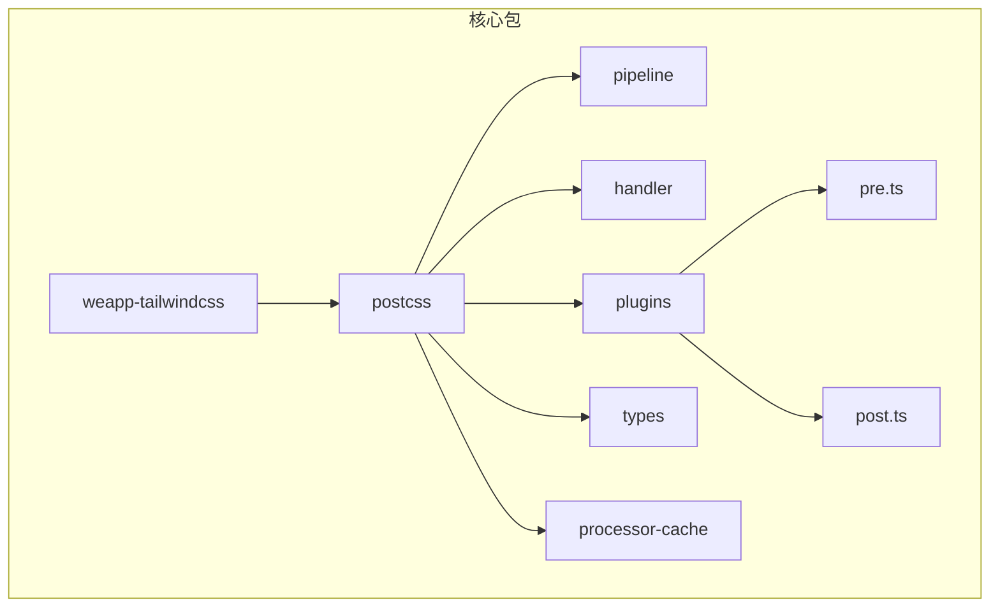
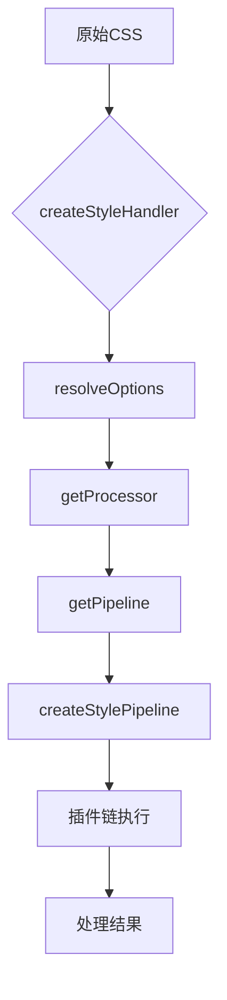
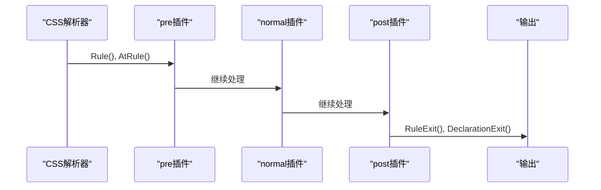
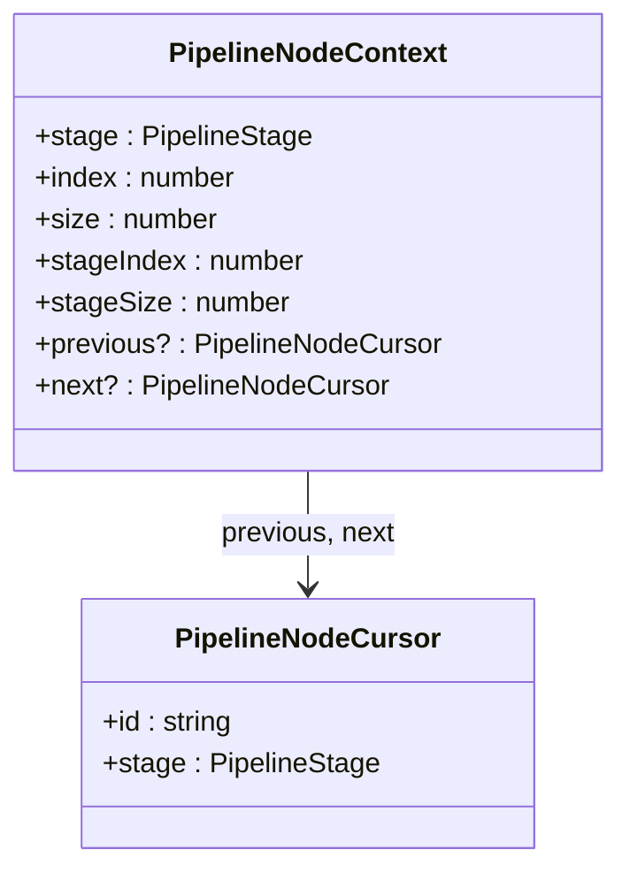
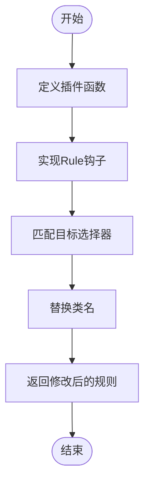
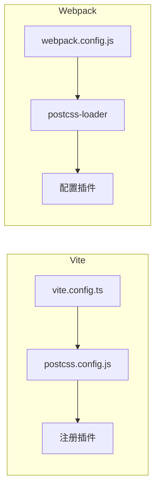
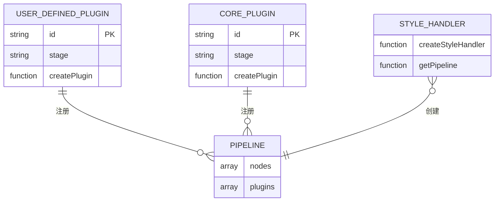
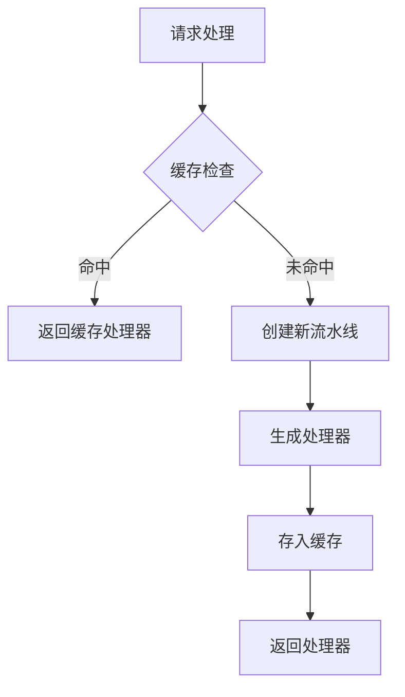

# 自定义插件开发

<cite>
**本文档引用的文件**  
- [index.ts](file://packages/weapp-tailwindcss/src/index.ts)
- [pipeline.ts](file://packages/postcss/src/pipeline.ts)
- [handler.ts](file://packages/postcss/src/handler.ts)
- [pre.ts](file://packages/postcss/src/plugins/pre.ts)
- [post.ts](file://packages/postcss/src/plugins/post.ts)
- [types.ts](file://packages/postcss/src/types.ts)
- [processor-cache.ts](file://packages/postcss/src/processor-cache.ts)
</cite>

## 目录
1. [简介](#简介)
2. [项目结构](#项目结构)
3. [核心组件](#核心组件)
4. [架构概述](#架构概述)
5. [详细组件分析](#详细组件分析)
6. [依赖分析](#依赖分析)
7. [性能考虑](#性能考虑)
8. [故障排除指南](#故障排除指南)
9. [结论](#结论)

## 简介
本文档详细说明如何为 `weapp-tailwindcss` 创建和注册自定义 PostCSS 插件。涵盖插件生命周期、钩子函数、上下文对象、CSS 转换、类名解析、样式注入等内容，并提供在 Vite 和 Webpack 构建环境中集成插件的方法。同时介绍调试技巧与性能优化建议，确保插件兼容性和稳定性。

## 项目结构
`weapp-tailwindcss` 采用 Monorepo 结构，核心插件逻辑位于 `packages/postcss` 目录下，通过模块化设计实现可扩展的 PostCSS 处理流水线。

**图示来源**  
- [index.ts](file://packages/weapp-tailwindcss/src/index.ts#L1-L5)
- [pipeline.ts](file://packages/postcss/src/pipeline.ts#L1-L278)

**本节来源**  
- [index.ts](file://packages/weapp-tailwindcss/src/index.ts#L1-L5)
- [pipeline.ts](file://packages/postcss/src/pipeline.ts#L1-L278)

## 核心组件
系统围绕 PostCSS 流水线构建，包含预处理（pre）、常规（normal）和后处理（post）三个阶段。每个阶段可注册多个插件，通过上下文共享状态，实现对 CSS 的渐进式转换。

**本节来源**  
- [pipeline.ts](file://packages/postcss/src/pipeline.ts#L1-L278)
- [types.ts](file://packages/postcss/src/types.ts#L1-L99)

## 架构概述
系统采用流水线式架构，通过 `createStylePipeline` 构建插件链，利用缓存机制提升处理效率。插件通过 `StyleHandler` 接口统一调用，支持异步处理与调试访问。

**图示来源**  
- [handler.ts](file://packages/postcss/src/handler.ts#L9-L44)
- [pipeline.ts](file://packages/postcss/src/pipeline.ts#L215-L277)

## 详细组件分析

### 插件生命周期与钩子函数
插件在不同阶段通过 PostCSS 提供的钩子函数介入处理流程。主要钩子包括：
- `Rule`：处理 CSS 规则
- `AtRule`：处理 @ 规则
- `RuleExit`：规则处理完成后执行
- `DeclarationExit`：声明处理完成后执行

**图示来源**  
- [pre.ts](file://packages/postcss/src/plugins/pre.ts#L68-L139)
- [post.ts](file://packages/postcss/src/plugins/post.ts#L279-L333)

### 上下文对象设计
`PipelineNodeContext` 提供插件运行时的上下文信息，包括当前阶段、索引、前后节点等，便于插件感知自身在流水线中的位置。

**图示来源**  
- [pipeline.ts](file://packages/postcss/src/pipeline.ts#L21-L47)

### 自定义插件创建示例
从零开始创建一个插件，用于替换特定类名：

**图示来源**  
- [pre.ts](file://packages/postcss/src/plugins/pre.ts#L68-L139)
- [types.ts](file://packages/postcss/src/types.ts#L10-L11)

### 构建环境集成
在 Vite 和 Webpack 中集成自定义插件的方法：

**图示来源**  
- [handler.ts](file://packages/postcss/src/handler.ts#L10-L44)
- [pipeline.ts](file://packages/postcss/src/pipeline.ts#L107-L110)

## 依赖分析
系统依赖 PostCSS 生态，通过 `postcss-preset-env`、`postcss-calc` 等插件实现现代 CSS 特性兼容。核心包之间通过 `@weapp-tailwindcss/shared` 共享工具函数。

**图示来源**  
- [pipeline.ts](file://packages/postcss/src/pipeline.ts#L99-L213)
- [handler.ts](file://packages/postcss/src/handler.ts#L10-L44)

## 性能考虑
系统通过 `StyleProcessorCache` 实现多层缓存：
- 流水线缓存（WeakMap）
- 处理器缓存（WeakMap）
- 配置指纹缓存（fingerprint）

**图示来源**  
- [processor-cache.ts](file://packages/postcss/src/processor-cache.ts#L15-L53)
- [pipeline.ts](file://packages/postcss/src/pipeline.ts#L215-L277)

## 故障排除指南
调试插件行为的常用方法：
- 使用 `getPipeline()` 获取当前流水线结构
- 检查 `ctx` 上下文状态
- 启用日志输出
- 验证插件执行顺序

**本节来源**  
- [handler.ts](file://packages/postcss/src/handler.ts#L37-L40)
- [pipeline.ts](file://packages/postcss/src/pipeline.ts#L218)

## 结论
`weapp-tailwindcss` 提供了完善的自定义插件开发体系，通过标准化的流水线架构、丰富的钩子函数和上下文支持，开发者可以轻松扩展 CSS 处理能力。结合缓存机制与构建工具集成，确保了高性能与高兼容性。