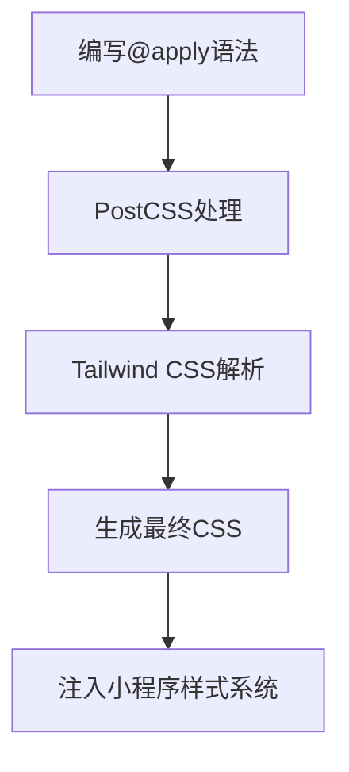
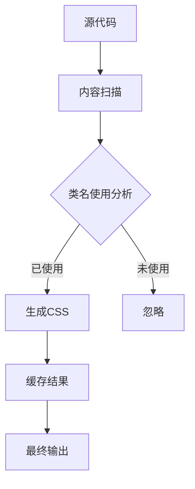
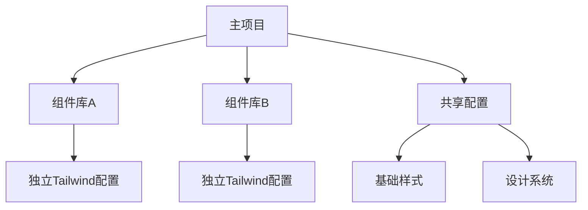
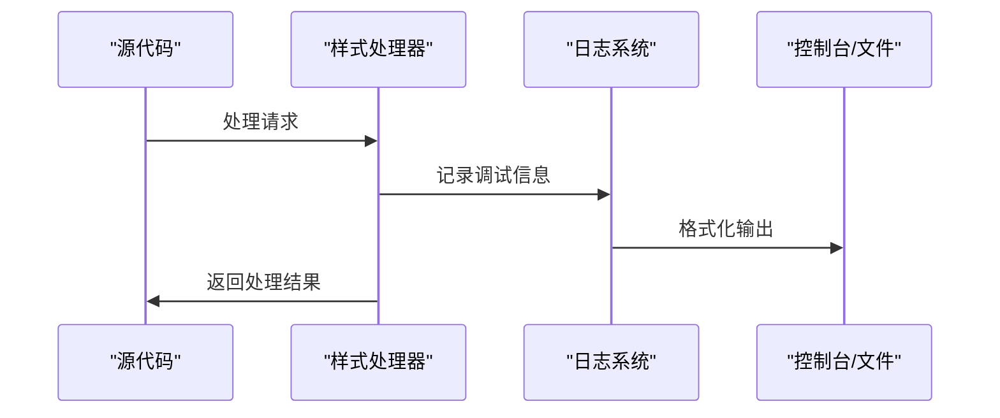

# 高级用法

<cite>
**本文档中引用的文件**  
- [index.ts](file://packages/weapp-tailwindcss/src/index.ts)
- [postcss/src/index.ts](file://packages/postcss/src/index.ts)
- [tailwind.config.js](file://apps/vite-native/tailwind.config.js)
- [postcss.config.js](file://apps/vite-native/postcss.config.js)
- [tailwind.config.js](file://apps/uni-app-x-hbuilderx-tailwindcss3/tailwind.config.js)
- [tailwind.config.js](file://apps/vite-native-skyline/tailwind.config.js)
- [tailwind.config.js](file://apps/vite-native-ts-skyline/tailwind.config.js)
- [tailwind.config.js](file://demo/gulp-app/tailwind.config.js)
- [tailwind.config.js](file://demo/mpx-app/tailwind.config.js)
- [tailwind.config.js](file://demo/native-mina/tailwind.config.js)
- [tailwind.config.js](file://demo/native-ts/tailwind.config.js)
- [postcss.config.js](file://apps/vite-native-skyline/postcss.config.js)
- [postcss.config.js](file://apps/vite-native-ts/postcss.config.js)
- [postcss.config.js](file://demo/gulp-app/postcss.config.js)
- [postcss.config.js](file://demo/mpx-tailwindcss-v4/postcss.config.js)
- [postcss.config.js](file://demo/native-mina/postcss.config.js)
- [postcss.config.js](file://demo/native-ts/postcss.config.js)
- [rsmax.config.js](file://apps/rsmax-app-ts/rsmax.config.js)
- [logger/src/index.ts](file://packages/logger/src/index.ts)
- [experimental/src/index.ts](file://packages/experimental/src/index.ts)
</cite>

## 目录
1. [简介](#简介)
2. [自定义插件开发](#自定义插件开发)
3. [CSS宏功能](#css宏功能)
4. [性能优化策略](#性能优化策略)
5. [实验性功能](#实验性功能)
6. [大型项目架构建议](#大型项目架构建议)
7. [调试技巧](#调试技巧)
8. [第三方库集成](#第三方库集成)

## 简介
本高级用法文档面向有经验的开发者，深入介绍weapp-tailwindcss项目的高级特性和技巧。文档涵盖自定义PostCSS插件开发、CSS宏功能、性能优化策略、实验性功能、大型项目架构建议、调试技巧以及与第三方库的集成实践。

## 自定义插件开发

weapp-tailwindcss项目提供了灵活的插件系统，允许开发者创建和注册自定义PostCSS插件以扩展功能。通过分析项目结构，开发者可以在`packages`目录下创建新的插件包，并使用标准的TypeScript和PostCSS API进行开发。

插件开发的关键在于理解PostCSS的处理管道机制。项目中的`packages/postcss/src/pipeline.ts`定义了`StyleProcessingPipeline`接口，允许开发者在样式处理的不同阶段插入自定义逻辑。通过`createStylePipeline`函数，可以构建包含多个处理节点的管道，每个节点都可以对CSS进行转换。

**Section sources**
- [index.ts](file://packages/postcss/src/index.ts#L1-L14)

## CSS宏功能

weapp-tailwindcss支持在uni-app中使用`@apply`等高级CSS语法。通过在`tailwind.config.js`配置文件中正确设置，开发者可以利用Tailwind CSS的强大功能来组织和重用样式。

在uni-app项目中，`tailwind.config.js`文件需要正确配置`content`字段，以确保编译器能够扫描到所有包含类名的文件。例如，在`apps/uni-app-x-hbuilderx-tailwindcss3/tailwind.config.js`中，配置了对`.uvue`和`.uts`文件的支持。

**Diagram sources**
- [tailwind.config.js](file://apps/uni-app-x-hbuilderx-tailwindcss3/tailwind.config.js#L1-L20)

**Section sources**
- [tailwind.config.js](file://apps/uni-app-x-hbuilderx-tailwindcss3/tailwind.config.js#L1-L20)

## 性能优化策略

### 类名压缩
weapp-tailwindcss通过类名压缩机制显著减少生成的CSS文件大小。在生产环境中，长类名被映射为短标识符，同时保持样式功能不变。这种压缩在`packages/minify-preserve`包中实现，确保即使在压缩后也能正确应用样式。

### 按需加载
通过精确配置`content`字段，系统只生成实际使用的类名，避免了未使用样式的冗余。这种按需加载策略在`tailwind.config.js`中通过glob模式实现，如`./pages/**/*.{wxml,html,js,ts,jsx,tsx,vue}`。

### 缓存机制
项目利用Vite和Webpack的缓存机制，结合PostCSS的处理管道，实现了高效的构建缓存。在`apps/vite-native/postcss.config.js`中，配置了`@tailwindcss/postcss`插件，该插件与构建工具的缓存系统深度集成。

**Diagram sources**
- [postcss.config.js](file://apps/vite-native/postcss.config.js#L1-L12)
- [tailwind.config.js](file://apps/vite-native/tailwind.config.js#L1-L21)

**Section sources**
- [postcss.config.js](file://apps/vite-native/postcss.config.js#L1-L12)
- [tailwind.config.js](file://apps/vite-native/tailwind.config.js#L1-L21)

## 实验性功能

`packages/experimental`目录包含了项目的实验性功能，这些功能可能在未来的版本中成为正式特性。当前的实验性功能包括新的编译模式和优化技术，旨在提升小程序样式的处理效率和灵活性。

实验性功能的设计遵循渐进式采用原则，允许开发者在项目中选择性启用。通过环境变量或配置文件中的标志位，可以控制这些功能的开关状态，便于在生产环境中进行风险评估。

**Section sources**
- [index.ts](file://packages/experimental/src/index.ts#L1)

## 大型项目架构建议

### Tailwind配置组织
对于大型项目，建议将Tailwind配置模块化。可以创建多个配置文件，如主配置文件和子模块配置文件，通过`@import`或JavaScript的`require`机制进行组合。在`demo/taro-app`项目中，可以看到`tailwind.config.sub-b.js`和`tailwind.config.sub-c.js`的使用示例。

### 组件库管理
建议将常用的UI组件与Tailwind配置分离，创建独立的组件库。通过`packages/ui`这样的结构，可以实现组件的复用和版本管理。组件库应该包含自己的`tailwind.config.ts`，确保样式配置的独立性。

**Diagram sources**
- [tailwind.config.js](file://demo/taro-app/tailwind.config.js#L1-L30)
- [tailwind.config.sub-b.js](file://demo/taro-app/tailwind.config.sub-b.js#L1-L20)

**Section sources**
- [tailwind.config.js](file://demo/taro-app/tailwind.config.js#L1-L30)
- [tailwind.config.sub-b.js](file://demo/taro-app/tailwind.config.sub-b.js#L1-L20)

## 调试技巧

### 内置调试工具
项目提供了强大的内置调试工具，位于`packages/logger`包中。通过`createConsola`和`picocolors`的组合，实现了彩色日志输出和结构化日志记录。开发者可以通过导入`logger`实例来添加详细的调试信息。

### 日志系统
日志系统支持不同级别的消息输出，包括`info`、`warn`、`error`和`debug`。在开发过程中，建议启用`debug`级别日志以获取详细的处理信息。日志配置可以在`rsmax.config.js`等构建配置文件中进行调整。

**Diagram sources**
- [index.ts](file://packages/logger/src/index.ts#L1-L10)
- [rsmax.config.js](file://apps/rsmax-app-ts/rsmax.config.js#L1-L50)

**Section sources**
- [index.ts](file://packages/logger/src/index.ts#L1-L10)
- [rsmax.config.js](file://apps/rsmax-app-ts/rsmax.config.js#L1-L50)

## 第三方库集成

### NutUI集成
与NutUI的集成主要通过样式覆盖和主题定制实现。在`postcss.config.js`中配置适当的插件顺序，确保Tailwind的样式优先级正确。同时，可以通过CSS变量来统一设计系统。

### Taroify集成
Taroify的集成需要特别注意样式作用域问题。建议使用`scoped`样式或CSS模块来避免样式冲突。在`vite.config.ts`中配置`css.modules`选项，可以实现自动的类名哈希化。

**Section sources**
- [postcss.config.js](file://demo/gulp-app/postcss.config.js#L1-L15)
- [postcss.config.js](file://demo/mpx-tailwindcss-v4/postcss.config.js#L1-L15)
- [postcss.config.js](file://demo/native-mina/postcss.config.js#L1-L15)
- [postcss.config.js](file://demo/native-ts/postcss.config.js#L1-L15)