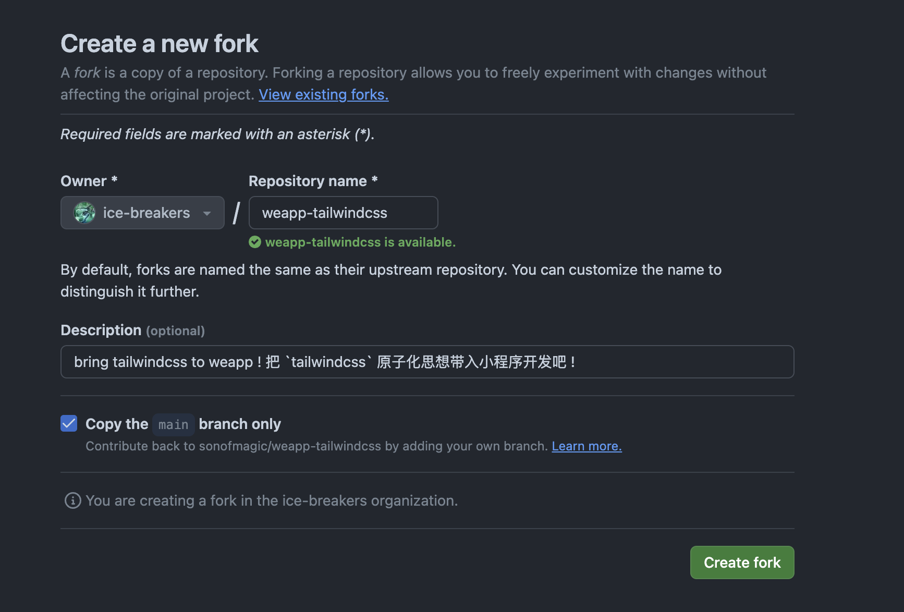
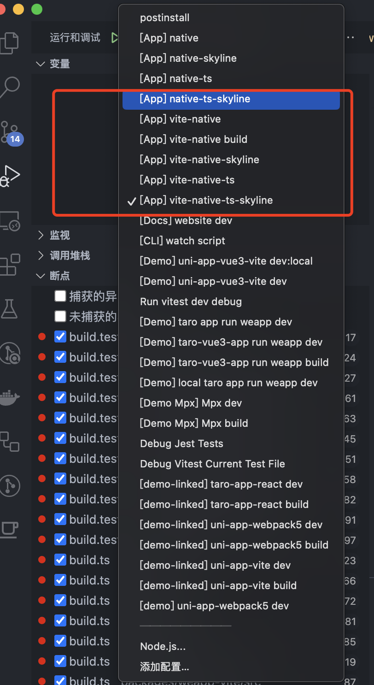

# 调试与贡献

## Fork 这个项目

目前 `weapp-vite` 是作为 `weapp-tailwindcss` 的一个子项目存在的，所以第一步就是先 `fork` [`weapp-tailwindcss`](https://github.com/sonofmagic/weapp-tailwindcss), 当然前提你必须有一个 `Github` 账号。

然后到 `weapp-tailwindcss` 的 `Github` 的项目主页，点击右上角的 `Fork` 按钮即可进行 `fork` 操作，当然你也可以点这个 [快捷按钮](https://github.com/sonofmagic/weapp-tailwindcss/fork)

然后选择 `Owner` 和设置 `Repository name` 之后，就可以点击那个绿色的 `Create fork` 按钮了！



这时候就会在你选择的账号下，创建一份 `weapp-tailwindcss` 的复制。

接着把你的 `weapp-tailwindcss` 使用 `git clone`，克隆到你的本地。


然后你就可以进行进行开发和调试了！

## 如何调试 Weapp-vite?

首先你安装项目根目录中 `package.json` 中 `packageManager` 字段的包管理器，比如:

```json
{
  "packageManager": "pnpm@9.7.1"
}
```

或者你也能开启（推荐）`corepack enable` 来使用项目包管理器及其版本，以免和你的全局包管理器版本冲突。

项目node版本维护在`.nvmrc`，你可以使用 [fnm](https://github.com/Schniz/fnm/tree/master) 来自动切换项目node版本和管理你的其他node版本。

fnm配置shell参考如下：

```bash
// 配置 .zshrc 一定要提前设置env version-file-strategy=recursive 兼容 monorepo 的.nvmrc
eval "$(fnm env --use-on-cd --version-file-strategy=recursive)"
```

然后执行 `pnpm i`，这时候就会把所有的依赖安装，这时候你就可以直接启动小程序项目，同时命中 `weapp-vite` 里的断点了！

具体我在 `apps` 里面准备了多个项目:

- `vite-native`
- `vite-native-skyline`
- `vite-native-ts`
- `vite-native-ts-skyline`

同时也在 `.vscode/launch.json` 中内置了它们的调试启动方式，你可以通过 `JavaScript` 终端调试，或者 `vscode` 的调试功能，直接进行调试，并命中到 `weapp-vite` 里 `ts` 源代码的断点里。



相信聪明的你很快就能学会！

## 进行贡献

进行贡献也很简单，在你修改完文档或者代码之后，可以点击项目上的 `Pull requests`，然后在右上角，点击 `New pull requests`，把你修改过的分支，指向我的 `main` 分支, 然后创建 `pull request(pr)` 即可。

然后我会收到邮件，来 `review` 你的代码，并进行测试，也会给你很多建议。这一切都通过之后，你的代码就进入主干了，你就成为了 `weapp-vite` 的贡献者！

了不起！从贡献开始，你就是 `weapp-vite` 的一份子，你的代码会跟着这个项目，活在万千开发者的电脑中！

未来我也会把这个项目，变成一个组织，从而不再是我的个人项目。

现在为什么没有变成组织的原因，是因为我部署的 `vercel` 平台，对个人有免费额度，对组织收费！
