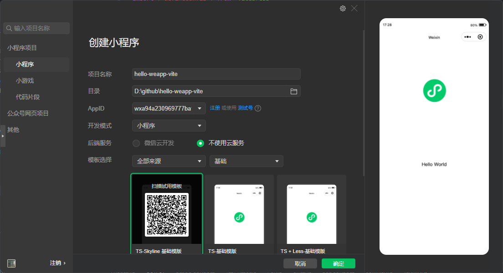

# 快速开始 {#getting-started}

> [!IMPORTANT]
> 在使用前，请确保你安装了 `Nodejs` 且版本 `>=20.5.0 || >=18.18.0`
>
> 推荐使用 [Nodejs 官网](https://nodejs.org/) 上的 `LTS` 版本

## 使用方式

打开微信开发者工具, 创建一个 `js`/`ts` 项目



> 假如你这个项目没有 `package.json`，在你的小程序目录下，使用 `npm init -y` 创建一个 `package.json`
> 假如你创建的是一个 `ts` 项目，你需要在 `vite.config.ts` 里的 `weapp.srcRoot` 配置项，指明使用的是 `'./miniprogram'` 目录，详见本页下方

然后执行：

```sh
npm i -D weapp-vite
# 执行初始化命令
npx weapp-vite init
```

于是就初始化成功了！然后再执行一下安装包的命令

```sh
npm i
```

这样微信开发小程序的智能提示(`types`)，就也被安装进来

## typescript / sass / less 等的默认支持

你可以直接使用 `typescript`，把 `js` 改成 `ts` 后缀即可，也可以通过安装 `sass` / `less`，并把 `index.wxss` 的后缀名改成相应的后缀来支持样式预处理器，比如 `scss` / `less` 。

### 开发命令

```sh
npm run dev
```

此时会启动 **1到多个** `fs.watcher` 对项目进行监听，发生更改就重新打包编译，并输出到 `dist` 目录

### 构建命令

```sh
npm run build
```

此时会启用 `vite` 自带的 `build` 模式，删除整个 `dist` 目录重新生成，并进行代码压缩

### 构建 npm 命令

```sh
npm run build-npm
```

使用这个指令，可以触发微信开发者工具的 构建 npm 命令，构建结果在 `dist/miniprogram_npm` 下

### 打开微信开发者工具命令

```sh
npm run open
```

使用这个命令直接打开微信开发者工具

## 别名

项目内部启用了自动别名的功能:

你只需在你的 `tsconfig.json` / `jsconfig.json` 中配置 `baseUrl` 和 `paths`，`js/ts` 引入的别名即可生效

比如:

```json
{
  "compilerOptions": {
    "baseUrl": ".",
    "paths": {
      "@/*": [
        "./*"
      ]
    }
  }
}
```

你就可以在你的代码里面写:

```ts
import utils from '@/utils'
```

在经过 `weapp-vite dev` / `weapp-vite build` 只会会自动帮你做路径的 `resolve`

## 配置项

配置项可以与 `vite` 通用，同时加入了 `weapp-vite` 的扩展:

`vite.config.ts`:

```ts
import { defineConfig } from 'weapp-vite/config'

export default defineConfig({
  // 其他的配置同
  weapp: {
    // 用来配置监听 app.json 所在的目录
    // 比如默认情况下 ts 创建的项目，app.json 所在为 './miniprogram'
    srcRoot: './miniprogram',
    // weapp-vite options
  },
})
```

你可以在 `defineConfig` 使用其他的 `vite` 插件，比如 `weapp-tailwindcss`
