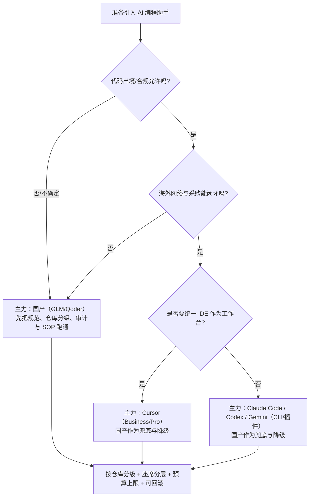

# AI 编程助手落地实施方案

> 你会得到：一套“能拍板、能试点、能复制”的落地方法（可治理、可控成本、可降级、可回滚）。\
> 更新时间：2025-12-29。计价说明：人民币换算按 1 USD = ¥7.2；价格与配额可能随时调整；以供应商官网与实际账单为准。

:::tip 这篇文档怎么读（别从头硬啃）

- 只想快速决策：先看「0 一页结论」→「5 座席设计」→「11 执行清单」。
- 要做试点落地：先看「6 路线图」→「7 仓库接入」→「8 日常 SOP」→「9 网络/账号/合规」。
- 研发负责人：0 / 5 / 6 / 11
- 平台与工具团队：6 / 7 / 8 / 9
- 安全合规：2 / 7 / 9
- 采购与财务：4 / 5 / 11
  :::

:::note 先记住三句话（后面所有细节都在解释这三句话）

1. 合规不清楚时，默认用国产把流程跑通。
2. 海外体验好不好，80% 取决于网络与代理是否“IDE + CLI + 登录”一致。
3. 成本能不能控住，靠“座席分层 + 预算上限 + 触顶降级”，不靠自觉。
   :::

---

## 0. 一页结论（先做决策，再做对比）

### 0.1 决策最短路径（建议按这个顺序拍板）

1. **合规边界**：哪些仓库/文件允许出境？是否必须审计留痕？（决定能不能用海外、能用到什么程度）
2. **网络能力**：是否能提供“IDE + CLI + 登录”同策略代理，并有备用出口与健康检查？（决定海外体验与成本是否可控）
3. **治理能力**：是否需要 SSO/团队配额/账单中心/审计？预算上限与告警责任人是谁？（决定能不能规模化）
4. **交付策略**：默认走低价/国产，高阶/海外按任务升级（而不是全员默认高阶）（决定 ROI 与成本波动）
5. **复制方式**：仓库接入模板与 SOP 能不能“一键复制”（决定试点能不能扩散）

### 0.2 快速分流（用一句话选出“主力方案”）



### 0.3 默认推荐（适用于大多数公司）

- **默认主力**：国产（GLM 或 Qoder）覆盖 70-85% 日常工作（补全、小改动、单测草稿、文档草稿）。
- **能力增强**：少量海外高阶座席（Cursor/Claude/Codex/Gemini）只用于“跨文件重构/疑难排查/核心模块审查/迁移方案”等高价值任务，并要求留痕与验收。
- **落地关键**：把“仓库分级 + 接入模板 + 预算上限 + 试点评估指标 + 回滚预案”当作一套工程系统，而不是发账号。

---

## 1. 我们要解决什么问题（落地目标与边界）

### 1.1 业务目标（建议写进 OKR）

- **效率**：提升日常编码速度（补全、重构、脚手架、查错、写测试、写文档）。
- **质量**：减少低级错误、提升可读性、一致性、单测覆盖率、PR 审查质量。
- **稳定**：在网络抖动/供应商限流/额度耗尽时，不影响核心交付（可降级/可回滚）。
- **合规**：明确哪些仓库/文件可用于 AI，上线前把出境、日志、留存、审计走通。
- **成本可控**：把“按量爆炸”风险降到最低（预算、告警、上限、分层座席）。

### 1.2 范围边界（避免项目失控）

- 本文仅讨论 **订阅型** AI 编程产品落地（IDE/CLI/Code Assist 套餐），**不单独设计“直接调用 API”的落地方案**。
- CI/CD 自动化如果要用 AI，优先使用供应商提供的 **官方能力**（如 PR Review、官方 CLI/插件），不建议自研“无限制 API 调用”。
- “AI 生成的代码”一律视为 **外部输入**：必须通过测试、代码审查、静态检查；不得直接上生产。

### 1.3 术语（让跨团队对齐）

- **补全**：Tab/Inline completion，一般成本最低、收益最高。
- **Chat / Agent**：对话式改代码、跨文件重构、读写文件、跑命令；成本更高、也更容易触碰合规边界。
- **座席分层**：并不是每个开发都用同样档位；核心成员/架构师/平台组用更高档位，其它人用基础档位。
- **仓库敏感度**：涉密/受限/合规严格的仓库与开源/公共仓库，允许的模型与策略不同。

---

## 2. 选型原则（先解决网络与合规）

### 2.1 两道门槛（Gate）：先能用、再用好

- **Gate A：合规与数据边界**（能不能用、能用到什么程度）
  - 代码出境是否允许？允许到什么仓库等级/目录/分支？
  - 是否必须可审计（谁在什么仓库用过什么能力）？日志如何留存、谁能访问？
- **Gate B：网络与采购闭环**（能不能稳定用、成本能不能控住）
  - 是否能提供“IDE + CLI + 登录”同策略代理，并有备用出口与健康检查？
  - 账号归属、统一账单、成本分摊、预算上限与告警责任人是否明确？

结论：**两道门槛都过了，海外能力才适合作为日常增强；任一没过关，优先按国产方案落地，把 SOP 与治理跑通，再引入海外。**

### 2.2 前提清单（要求“可验证”，避免口头承诺）

- 海外网络稳定：有健康检查数据（延迟/失败率）与备用出口；IDE 与 CLI 同策略；故障有降级预案。
- 合规已确认：书面结论明确出境范围；敏感目录黑名单可配置；审计与留存要求能落地。
- 采购支付可闭环：统一账单与成本中心；预算上限、告警阈值、责任人明确；离职回收流程明确。
- 用量能治理：团队配额/个人上限/触顶降级策略可执行（而不是“靠自觉”）。

### 2.3 怎么对比（前提满足后再对比）

| 维度       | 权重建议 | 评分要点（示例）                                 | 怎么验证（建议）                                |
| ---------- | -------- | ------------------------------------------------ | ----------------------------------------------- |
| 合规/数据  | 30%      | 出境边界、敏感路径屏蔽、审计日志、企业条款       | 合规书面结论 + 管理后台能力验证 + 试点抽样审计  |
| 可治理性   | 20%      | 团队配额、SSO、成员管理、账单中心、管理员策略    | 管理后台演示/截图 + 账号回收演练 + 账单样例     |
| 体验与产能 | 20%      | 补全质量、跨文件编辑、上下文、延迟、稳定性       | 用统一任务集试点对比（见 6.1/8.2 的场景）       |
| 成本与可控 | 15%      | 订阅单价、超额机制、是否易“按量爆炸”、是否可降级 | 账单实测 + 触顶降级演练 + 故障重试成本估算      |
| 集成能力   | 10%      | VS Code/JetBrains/CLI/PR Review 支持、可配置性   | 在 1-2 个真实仓库接入验证（模板/忽略规则/命令） |
| 供应商风险 | 5%       | 区域可用性、风控、服务 SLA、支付风险             | 历史可用性记录 + 支付与风控预案 + 可替代性评估  |

打分建议：每个方案 1-5 分，乘以权重；**先预设权重与通过条件**，试点后再复盘调整（避免“移动门槛”）。

### 2.4 选型评审要交付什么（避免只留一句“选 A”）

- 推荐结论：**主力方案 + 备份/降级方案**（故障/额度/风控时怎么切换）。
- 约束条件：仓库分级策略、允许能力（补全/对话/Agent）、审计与留存要求。
- 座席设计：分层（L1-L4）、升级流程、个人上限与团队配额、触顶降级策略。
- 落地计划：12 周里程碑（试点范围、复制范围、验收指标与 Go/No-Go）。
- 风险与缓解：合规、网络、供应商、成本波动、误改与质量风险，以及对应回滚方案。

---

## 3. 方案概览（我们讨论的 4 种可落地方案）

> 提示：如果网络/合规未就绪，先看 GLM/Qoder 两行，其它方案先当作备选。

| 方案                         | 定位                 | 典型个人月成本       | 典型团队 5 人月成本 | 关键依赖        | 适用结论                       |
| ---------------------------- | -------------------- | -------------------- | ------------------- | --------------- | ------------------------------ |
| Cursor                       | AI IDE（统一工作台） | ¥144（Pro）          | ~¥1,440（Business） | 海外网络/信用卡 | 体验优先、愿意统一 IDE 的团队  |
| Claude Code / Codex / Gemini | 海外订阅（插件/CLI） | ¥136-216             | ¥900-1,900          | 海外网络/信用卡 | 已有海外账单、偏 CLI/PR Review |
| GLM                          | 国产高刷新额度       | ¥100（Pro）          | ~¥500（Pro\*5）     | 无需代理        | 国内合规/报销友好、主力方案    |
| Qoder                        | 国产/混合路由        | ¥144-432（Pro/Pro+） | ~¥1,080（Teams\*5） | 国产为主        | 需要审计与团队管理、混合路由   |

---

## 4. 价格与额度（只保留对企业/大多数人有用的档位）

> 说明：下表用于预算与座席设计，不用于“攀比模型能力”。落地时真正影响成本的是：谁用高档位、是否有上限、网络稳定性（减少重复调用）、是否有明确的“默认低价模型策略”。

:::note 额度口径（先搞清楚你买的是什么）

不论是 Cursor、Kiro、GitHub Copilot 这类产品，本质上都是“使用 AI 的工作台/入口 + 各自最佳实践的工程化封装”，它们并不等同于某一个模型本身。

购买订阅时，你通常同时买到了两件事：

1. **工具能力**：IDE/插件/Agent 工作流、上下文管理、代码索引、团队治理等。
2. **供应商二次封装的模型调用额度**：对外表现为“对话次数/请求次数/快速请求/每周配额”等（而不是你能直接对账的 token 用量）。

优劣势也来自这里：

- **优势**：可以在不同模型之间切换/路由，按任务选“更强/更便宜/更稳”的模型；同时工具会给出默认提示词、工作流与防呆策略。
- **劣势**：你往往看不到真实 token 消耗与单次请求的边际成本；而按“对话/请求”计数时，**简单任务与复杂任务可能消耗同样 1 次额度**，导致成本预测与审计颗粒度变粗。

落地建议：预算口径按“座席 + 额度”做上限控制，同时用“默认低价模型 + 触顶降级 + 高阶任务审批/白名单”把波动压住。

:::

### 4.1 Cursor（官网可访问：已核实）

| 套餐     | 月付     | 年付折算 | 适用人群（企业落地建议）      | 人民币估算   |
| -------- | -------- | -------- | ----------------------------- | ------------ |
| Pro      | $20      | $200     | 普通开发（愿意用 Cursor IDE） | ¥144/月      |
| Pro+     | $60      | -        | 核心开发/架构师（重度 Agent） | ¥432/月      |
| Business | $40/用户 | -        | 需要 SSO/审计/团队配额的团队  | ¥288/用户/月 |
| Ultra    | $200     | -        | 极重度座席（专项、平台组）    | ¥1,440/月    |

来源：<https://cursor.com/pricing>（抓取到 Pro/Pro+/Ultra/Business）。

### 4.2 海外订阅（Claude Code / Codex / Gemini）

> 说明：海外产品的定价页可能因地区风控（如 Cloudflare）、登录态或动态渲染而不易自动抓取；以下仅保留“企业普遍会用的档位”与常见区间用于预算讨论。正式采购前请以供应商官网与合同条款再次核对。

| 方案               | 企业常用档位          | 常见价格（USD）                       | 适用人群                | 关键注意点                         |
| ------------------ | --------------------- | ------------------------------------- | ----------------------- | ---------------------------------- |
| Claude Code        | Pro / Teams           | $20 / $40/用户                        | CLI/Agent 重度团队      | 区域可用性、周配额、超额策略       |
| Codex / ChatGPT    | Team                  | ~$25/用户（年付）或 ~$30/用户（月付） | 跨团队通用              | 网页难抓取，采购前核对；设账单上限 |
| Gemini Coding Plan | Standard / Enterprise | $19 / $45                             | 有 PR Review 诉求的团队 | GCP 账单体系、日配额、账号治理     |

### 4.3 GLM Coding Plan（国产，主力）

| 套餐 | 月费 | 刷新周期  | 日可用（4-5 次刷新） | 企业落地建议      |
| ---- | ---- | --------- | -------------------- | ----------------- |
| Pro  | ¥100 | 每 5 小时 | 2400-3000 次         | 默认给大多数研发  |
| Max  | ¥400 | 每 5 小时 | 9600-12000 次        | 核心座席/批量任务 |

### 4.4 Qoder（国产/混合）

| 套餐            | 月付标价（USD） | 人民币估算   | 企业落地建议            |
| --------------- | --------------- | ------------ | ----------------------- |
| Pro             | $20             | ¥144/月      | 普通席位                |
| Pro+            | $60             | ¥432/月      | 核心席位/偶尔重任务     |
| Ultra           | $200            | ¥1,440/月    | 极重度席位（专项/平台） |
| Teams（按席位） | $30/用户        | ¥216/用户/月 | 需要审计/团队治理       |

说明：Qoder 定价接口会返回折扣字段（如 `discountedPrice` / `firstMonthPrice`），活动可能变化；预算建议按标价估算更稳。\
页面：<https://qoder.com/pricing>。\
接口（用于抓取标价/折扣字段）：<https://qoder.com/api/v1/products/pricing?productType=personal_subscription>、<https://qoder.com/api/v1/products/pricing?productType=enterprise_subscription&planTier=Teams>。

---

## 5. 企业级座席设计（怎么买才不浪费）

### 5.1 分层座席（推荐）

| 层级          | 占比建议 | 目标                       | 推荐档位（示例）                              |
| ------------- | -------- | -------------------------- | --------------------------------------------- |
| L1 普通开发   | 70-85%   | 日常补全+小改动            | GLM Pro / Qoder Pro / Cursor Pro              |
| L2 核心开发   | 10-20%   | 跨文件改造、重构、疑难排查 | Cursor Pro+ / GLM Max / Qoder Pro+            |
| L3 审查/架构  | 3-8%     | 评审、设计、复杂迁移       | Claude Code Teams / Cursor Business / GLM Max |
| L4 平台与专项 | 1-3%     | 规范化、模板化、内建流程   | Cursor Ultra（少量）/ GLM Max                 |

### 5.2 典型公司规模预算模板

> 这里的关键是“组合”，而不是单点选择。你可以把海外座席当作“稀缺资源”，像数据库/CI 一样管理。

#### 10 人团队（初期）

- 8 人：GLM Pro（8 \* ¥100 = ¥800/月）
- 2 人：Cursor Pro（2 \* ¥144 = ¥288/月）或 Qoder Pro（2 \* ¥144 = ¥288/月）
- 合计：约 ¥1,000/月（视组合而定）

#### 30 人团队（业务线）

- 24 人：GLM Pro（¥2,400/月）
- 4 人：GLM Max（¥1,600/月）
- 2 人：海外高阶（Cursor Pro+/Claude Code Teams 按需）
- 合计：约 ¥4,000-6,000/月

#### 100 人公司（多业务线）

- 80 人：GLM Pro
- 15 人：Qoder Teams 或 GLM Max（根据是否需要审计/团队治理）
- 5 人：海外增强座席（Cursor Business/Claude Teams）
- 合计：根据审计诉求与海外座席数量决定，建议先做试点测算再采购。

---

## 6. 落地路线图（公司多团队循序渐进）

> 落地不是“一天开通全员账号”，而是建立 **规范 + 试点 + 复制 + 治理** 的闭环。

### 6.1 建议里程碑（12 周模板，可按公司节奏调整）

| 周期        | 目标       | 关键交付                                           | 通过标准（能不能进下一阶段）       |
| ----------- | ---------- | -------------------------------------------------- | ---------------------------------- |
| 第 1-2 周   | 准备与对齐 | 使用规范、代理方案、仓库分级、预算与告警、试点名单 | 代理可用 + 合规确认 + 预算可控     |
| 第 3-6 周   | 试点落地   | 试点团队跑通补全/对话/审查 SOP；建立指标看板       | 指标不比基线差，且成本可解释       |
| 第 7-10 周  | 复制扩展   | 同业务线 3-5 个团队复制模板、固化仓库接入规范      | 运营体系可规模化（账号/配额/培训） |
| 第 11-12 周 | 公司级治理 | 座席分层、审计流程、离职回收、季度复盘机制         | 有回滚预案 + 能输出管理报告        |

### 6.2 角色与 RACI（建议落地前先定责）

| 事项           | 研发负责人 | 平台/中台 | 安全合规 | 采购财务 | 业务团队 TL |
| -------------- | ---------- | --------- | -------- | -------- | ----------- |
| 方案选型与原则 | A          | C         | C        | C        | C           |
| 代理/网络方案  | C          | A/R       | C        | -        | C           |
| 仓库分级与红线 | C          | R         | A/R      | -        | C           |
| 账号/SSO/回收  | C          | A/R       | C        | -        | C           |
| 预算/账单/告警 | A          | R         | C        | A/R      | C           |
| 培训与推广     | C          | R         | C        | -        | A/R         |
| 试点验收       | A          | R         | C        | C        | A/R         |

说明：A=最终负责，R=执行负责，C=协作/咨询。看不懂 RACI 也没关系：关键是每一项都有明确“拍板的人”和“干活的人”。

### 6.3 试点怎么做，结果才“说得清”

很多试点翻车不是“工具不行”，而是两件事没做好：**口径不统一**、**过程不可复用**。下面这套做法的目标很简单：试点结束后，你能用数据和案例回答清楚——“值不值、为什么值、下一步怎么扩”。

**(1) 先写清楚：通过/不通过的条件（避免试点结束才开始争论）**

- 选 4 类指标（见阶段 1）：产能、质量、体验、成本；每类至少 1 个“硬指标”。
- 写清楚“最低可接受标准”，例如：
  - 质量不下降：CI 失败率、线上缺陷率不高于基线（或有明确可解释原因）。
  - 成本可控：人均月成本不超过预算上限；触顶/故障重试可被降级策略吸收。
  - 体验可用：95 分位延迟与失败率在可接受区间（由平台/IT 提供数据）。

**(2) 用一套“真实任务样本”对比（避免“挑题做”）**

建议准备 10-20 个“真实任务样本”，覆盖 8.2 的高 ROI 场景，并记录最少信息：

| 字段        | 说明                                           |
| ----------- | ---------------------------------------------- |
| 任务类型    | 补全/小 bug/跨文件重构/补单测/PR Review/文档   |
| 仓库等级    | S0/S1/S2（决定允许能力与工具）                 |
| 复杂度      | 低/中/高（或 Story Points）                    |
| 基线耗时    | 试点前同类任务平均耗时（2-4 周窗口）           |
| AI 辅助耗时 | 试点期间耗时（含验证时间）                     |
| 验证方式    | 跑了哪些命令/截图/日志                         |
| 成本与失败  | 是否发生重试/超额/代理故障（以及怎么降级处理） |

**(3) 先把常见“试点错觉”写进复盘（避免“看起来提升”）**

- **人选偏差**：只让最强/最爱尝鲜的人用 → 尽量选“正常团队”，或分批灰度做对照。
- **新鲜感效应**：前 1-2 周提升很大、后面回落 → 试点至少 2-4 周，并单独看第 3-4 周的表现。
- **指标选错**：只看提交数会鼓励碎片化 → 同时看交付周期、返工率、缺陷率等质量指标。
- **外部干扰**：大版本/大促/人手变动会影响指标 → 记录关键事件，必要时只对同类任务做对比。

**(4) 试点结束必须产出的 3 件东西（否则很难复制）**

- “一页结论”：是否通过、通过条件是否满足、主要收益与代价、是否建议扩展。
- “可复制资产”：仓库接入模板（7.2）、日常 SOP（8）、培训材料、故障降级预案（9.1.5）。
- “治理数据”：账单样例、触顶次数、降级次数、代理故障次数、抽样审计结果。

### 阶段 0：基础准备（1-2 周）

**输出物（交付件）**

- 《AI 编程使用规范》（Do/Don’t、允许的仓库/文件类型、敏感信息处理）。
- 《网络与代理配置手册》（IDE/CLI 统一代理、故障排查）。
- 《座席分层与预算》（谁能用什么、如何申请升级、超额如何处理）。
- 《审计与留痕要求》（日志保存、审批流、回滚机制）。

**关键动作**

- 网络：确定海外代理出口、白名单域名、稳定性指标（例如 95 分位延迟 < 300ms）。
- 合规：建立“仓库分级”（涉密/一般/开源），明确每级允许的模型与功能（仅补全/允许 Agent/禁止上传）。
- 采购：海外信用卡/虚拟卡管控；国产发票与成本中心；设置预算上限与告警责任人。
- 工程：统一 PR 模板与仓库接入模板（`AI_RULES.md`/`.aiignore`/`.cursorignore`/`CLAUDE.md`），并要求所有新仓库默认带上。
- 指标：在试点前先采集 2-4 周基线（交付周期、PR 数、缺陷率、CI 失败率），否则试点“效果”无法客观评估。

### 阶段 1：试点（2-4 周，1-2 个低风险团队/仓库）

**选试点的原则**

- 优先选择：非涉密、迭代快、指标容易量化（例如 Web/工具链/中台项目）。
- 避免选择：强合规、强审计、外包多、依赖复杂且无法量化的项目作为第一个试点。

**试点最小可行配置（MVP）**

- 主力：GLM Pro 或 Qoder Pro（覆盖绝大多数人日常）
- 增强：1-2 个海外座席（Cursor Pro 或 Claude Code Pro），用于复杂任务对比
- 策略：默认国产/低价模型；高阶模型必须手动切换并记录原因（模板见后文）

**验收指标（建议至少选 4 个）**

- 产能：人均提交数/PR 数、交付周期、返工率（对比试点前 2-4 周基线）。
- 质量：PR 审查发现问题数、线上缺陷率、单测增量。
- 体验：补全采纳率、平均响应时间、失败率/重试率。
- 成本：人均月成本、超额次数、代理故障导致的重复调用次数。
- 对比口径：尽量按“同类任务 + 同时间窗口”对比，并记录版本发布/需求波峰等关键事件，避免把波动误判为收益或损失（见 6.3）。

**回滚预案**

- 一键禁用：插件/IDE 可快速关闭；路由切换到国产。
- 代理故障：提供备用节点/备用出口；明确故障期间“只允许补全，不允许 Agent”。

### 阶段 2：业务线扩展（4-8 周，同业务线复制）

**复制的关键不是“发账号”，而是“复制模板”**

- 复制：代理配置、索引黑名单、仓库接入模板、培训材料、指标看板。
- 分层路由：
  - 基线：国产（GLM/Qoder）+ 本地索引。
  - 提升：评审/复杂改造才切海外高质量模型（需要审批或留痕）。
  - 限额：按团队等级设月/周上限，触顶自动降级到国产/低价。

**推广培训**

- 10-15 分钟“快速上手”培训：快捷键、常用 Prompt、如何让 AI 写测试、如何审查 AI 输出。
- 30-45 分钟“进阶训练营”（核心成员）：跨文件重构、定位性能问题、生成迁移方案、拆分任务。

### 阶段 3：全公司规模化（持续）

**公司级治理要点**

- 账号与权限：SSO/成员管理；离职/转岗自动回收；关键岗位开更高档位。
- 指标与报表：月度用量、超额、延迟、故障次数、单位 PR 成本；对管理层输出 1 页报告。
- 规范固化：将“AI 生成代码必须跑测试/必须评审”的规则写进工程模板与 PR 模板。

### 阶段 4：优化与复盘（季度节奏）

- 成本优化：把高阶模型使用集中到“收益最大”的场景（评审、迁移、疑难）；日常用低价/国产。
- 体验优化：根据延迟与失败率，优化代理与路由策略；必要时切换主力供应商。
- 合规复核：更新敏感目录黑名单、出境白名单；抽样审计调用日志与 PR 记录。

---

## 7. “落地到每个项目”怎么做（仓库接入规范）

### 7.1 仓库分级（强烈建议公司统一）

| 等级         | 示例               | 允许的能力                                           | 建议工具                       |
| ------------ | ------------------ | ---------------------------------------------------- | ------------------------------ |
| S0（涉密）   | 核心算法、密钥仓库 | 禁止出境；允许本地索引；仅允许国产且禁止上传敏感文件 | GLM/Qoder（国产，本地索引）    |
| S1（内部）   | 大多数业务仓库     | 国产为主；海外白名单座席可用；必须审计               | GLM/Qoder + 少量 Cursor/Claude |
| S2（低风险） | 开源/公共/示例     | 可用海外；可更激进试验 Agent                         | Cursor/Claude/Codex/Gemini     |

### 7.2 每个仓库必须配置的“AI 约束文件”

> 目标：让 AI 有项目上下文，同时明确“哪些不能碰”。这些文件的最大价值在于“减少误用与泄漏”，并让新团队快速复制。

**建议统一放在仓库根目录：**

- `AI_RULES.md`：团队规则（允许/禁止上传目录、如何提问、审查要求）。
- `.aiignore`：敏感目录黑名单（`.env`、`secrets/`、`*.pem`、`id_rsa`、`*.p12`、`*.key` 等）。
- `docs/ai/`：放团队 Prompt 模板、示例、常见问题。

**如使用 Claude Code：**

- `CLAUDE.md`：声明项目结构、命令、测试入口、禁止触碰目录、代码风格。

**如使用 Cursor：**

- `.cursorignore`：同 `.aiignore`，并补充构建产物目录（`dist/`、`node_modules/`）。

#### 模板：`.aiignore`（建议公司统一并长期维护）

```gitignore
# Secrets / credentials
.env
.env.*
secrets/
**/secrets/
*.pem
*.key
*.p12
id_rsa
id_ed25519

# Customer / production data
data/
**/data/
*.sql
*.dump
*.bak
*.log

# Build outputs / noise
node_modules/
dist/
build/
coverage/
.turbo/
.next/
```

#### 模板：`AI_RULES.md`（每个仓库都应有）

```md
# AI 使用规则（本仓库）

## 允许
- 允许：补全、代码解释、小范围改动（限定目录）
- 允许：生成测试草稿（仅新增测试文件）
- 允许：生成文档草稿（需人工校对）

## 禁止
- 禁止上传/粘贴：任何密钥、证书、客户数据、未脱敏日志、数据库导出
- 禁止让 AI 修改：鉴权/支付/风控/数据出境相关代码（必须人工主导）
- 禁止在 S0 仓库使用海外模型

## 目录约束
- 允许改动目录：src/
- 禁止改动目录：secrets/、scripts/release/、infra/

## 验证要求
- 所有 AI 改动必须跑：pnpm test
- 有 UI 的必须提供：截图或录屏
```

#### 模板：`.cursorignore`（Cursor 仓库）

```gitignore
# Prefer reusing .aiignore content
.env
.env.*
secrets/
node_modules/
dist/
build/
coverage/
.turbo/
.next/
```

#### 模板：`CLAUDE.md`（Claude Code 仓库）

```md
# Project guidance for Claude Code

## Repo overview
- Tech stack: TypeScript (ESM), pnpm workspace
- Style: 2-space indent, keep changes minimal and focused

## Commands
- Install: pnpm install
- Test: pnpm test
- Lint: pnpm lint
- Format: pnpm format

## Do / Don't
- DO keep edits scoped; prefer small PRs
- DON'T touch secrets/, .env*, certificates, or customer data
- DON'T change release scripts unless explicitly asked

## Where to make changes
- Prefer editing: packages/**/src
- Tests live in: **/__tests__ or **/test
```

### 7.3 PR 模板必须加的两条（防止 AI 直上生产）

- “本 PR 是否使用 AI 生成/改写代码？若是，说明使用范围与已做的验证（测试/手工验证）。”
- “涉及安全/权限/支付/数据出境变更时，必须标记并请求安全复核。”

### 7.4 为每个项目沉淀 Skill（把 SOP 变成可复制资产）

> 这里的 Skill 指“可复用的提示词/工作流模板”（Codex CLI/内部 Agent 的本地 Skill），不是 Claude Code 的 npm Skill（见 [Skill（技能系统）](./basics/skill)）。

#### 7.4.1 为什么要做

- **把“怎么问 AI”产品化**：把高 ROI 的提问方式固化下来，新人照做就能用。
- **降低合规与误改风险**：把禁止目录、验收清单、默认命令写进 Skill，减少口头传达。
- **减少重复沟通成本**：同类项目的 SOP 复用，跨团队复制更快。

#### 7.4.2 每个项目的“最小 Skill 套件”（建议至少 5 个）

| Skill（示例命名）        | 解决什么                | 必填输入（写进 Skill）       | 输出/验收标准（写进 Skill）        |
| ------------------------ | ----------------------- | ---------------------------- | ---------------------------------- |
| `project-onboarding`     | 新人/新模型快速理解项目 | 项目结构、关键目录、风格规范 | 先复述约束；给出常用命令与入口     |
| `project-safe-change`    | 小改动不跑偏            | 允许/禁止目录、不可改行为    | 输出变更清单 + 风险点 + 验证命令   |
| `project-bug-triage`     | 定位 bug 与最小复现     | 如何跑本地、日志位置、开关   | 先给“复现步骤/假设列表/验证计划”   |
| `project-test-writer`    | 补测试草稿              | 测试框架、目录约定、运行命令 | 只新增测试文件；覆盖边界；能跑通   |
| `project-release-helper` | 发版/变更日志/版本策略  | 发版命令、分支策略、制品产出 | 产出 checklist；禁止直接改发布脚本 |

> 补充可选：前端项目加 `project-ui-regression`（截图/对照）、后端项目加 `project-api-contract`（接口变更与兼容）、工具链项目加 `project-ci-debug`（CI 失败定位）。

**Monorepo（pnpm workspace/Turbo 等）建议额外加 3 个**

- `monorepo-build-matrix`：把“每个 workspace 怎么 build/test/lint”的矩阵固化，避免只跑了错误的命令。
- `monorepo-deps-guard`：依赖升级/新增依赖的规则（workspace 协议、版本范围、锁文件策略、回滚方式）。
- `monorepo-release-flow`：发版与包发布的分步流程（变更集/版本号/制品校验/回滚点）。

**按项目类型，常见“加餐 Skill”**

| 项目类型                        | 建议新增 Skill             | 关注点（写进 Skill 的约束/验收）                         |
| ------------------------------- | -------------------------- | -------------------------------------------------------- |
| UI/小程序/前端应用              | `project-ui-regression`    | 必须给截图/录屏；必须跑构建；避免一次性大改 UI           |
| 核心库/工具包（packages）       | `project-api-compat-guard` | 不破坏公共 API；必须补单测；必要时更新变更日志/Changeset |
| 性能敏感模块                    | `project-perf-check`       | 需要基准对比；避免引入 O(n²)；给出性能验证方式           |
| e2e/快照密集项目                | `project-snapshot-guard`   | 明确何时允许更新快照；更新必须附原因与验证命令           |
| 文档站/示例工程（website/demo） | `project-docs-sync`        | 代码片段要可运行；链接不失效；示例与包版本同步           |
| CI/脚本/发布链路                | `project-ci-debug`         | 只做最小改动；先复现再修；必须提供回滚点与验证日志       |

**企业级 Skill 库建议分 3 层（避免“每个项目各写一份”）**

- **公司基线（Company Baseline）**：合规红线、验收清单、默认输出格式、PR 声明模板。
- **技术栈预设（Stack Presets）**：Node/Java/Go/小程序等常用命令与目录约定（测试/构建/格式化）。
- **项目覆盖（Project Overrides）**：只写这个项目独有的入口、特殊目录、特殊回滚策略。

#### 7.4.3 Skill 规格模板（统一输入/输出，便于复制与审计）

为避免 Skill 退化成“散落的提示词”，建议所有项目 Skill 统一用同一份规格模板（内容可精简，但字段要齐）：

```md
# Skill: <skill-name>

## Purpose（目的/适用场景）
- 解决什么问题？适用哪些任务？不适用哪些任务？

## Guardrails（红线与边界）
- 禁止目录/文件类型：
- 禁止行为（例如：改鉴权/支付/数据出境；改发布脚本）：
- 允许改动目录：
- 是否允许新增依赖？（默认不允许）

## Commands（项目命令）
- Install:
- Build:
- Test:
- Lint/Format:

## Output Format（输出格式要求）
- 变更点列表（文件级）
- 风险点与兼容性说明
- 验证命令与预期结果
- 回退策略（如何撤销/如何拆小 PR）

## Acceptance Criteria（验收标准）
- 必须通过哪些检查/测试？
- 是否需要截图/日志/性能对比？
- 是否需要更新文档/变更日志/Changeset？
```

#### 7.4.4 治理建议（避免 Skill 变成“散落的提示词”）

- **归属**：公司级通用 Skill 由平台/中台维护；项目 Skill 由项目 TL 维护（但必须走 code review）。
- **存放**：建议用独立仓库集中管理（便于版本化与审计），并按“项目/技术栈”分组。
- **变更管理**：Skill 的更新要附带“验证任务/验证命令”；重大变更先在试点团队灰度。

---

## 8. 日常使用 SOP（把 AI 变成标准流程）

### 8.1 默认路由策略（最重要的一条）

- **默认**：国产/低价模型（用于补全、小改动、查错、写注释、生成测试草稿）。
- **升级条件**：跨文件重构、架构迁移、复杂 bug、性能问题、核心模块 PR 审查 → 申请或切换到高阶模型。
- **禁止条件**：涉密仓库、密钥/证书/个人信息文件、未脱敏的生产日志、客户数据。

#### 8.1.1 任务分级与“用什么档位”（减少争论、降低成本）

| 任务类型                 | 推荐默认                | 何时升级到高阶/海外         | 验收要点               |
| ------------------------ | ----------------------- | --------------------------- | ---------------------- |
| Tab 补全/重命名          | 国产/低价               | 一般不需要                  | lint/类型检查通过      |
| 小范围修 bug（1-2 文件） | 国产/低价               | 需要跨模块定位/复杂并发问题 | 有最小复现 + 单测覆盖  |
| 重构（跨 3+ 文件）       | 国产（核心席位可高阶）  | 影响公共 API/核心模块       | 拆小 PR + 每步测试     |
| 单测补齐                 | 国产/低价               | 复杂边界/并发/时序          | 断言合理 + 覆盖边界    |
| PR Review                | 国产/低价（或工具自带） | 核心模块/安全模块           | 只做建议，人工裁决     |
| 文档/变更日志            | 国产/低价               | 对外发布、合规文本          | 人工校对、避免事实错误 |

#### 8.1.2 AI 输出的“最小验收清单”（团队统一口径）

- 改动范围是否符合约束（目录/文件/接口）？
- 是否引入新依赖或新权限？如果有，是否经过评审？
- 是否提供了可复现的验证方式（命令/截图/日志）？
- 是否通过：类型检查、lint、单测（至少跑到与改动相关的部分）？
- 是否新增/更新了测试覆盖关键分支？
- 是否存在“看似合理但业务语义错误”的风险点（尤其是边界条件）？

### 8.2 六类高 ROI 场景（建议先打穿）

1. **补全与重命名**：提高编码速度，成本低。
2. **代码解释与定位 bug**：让 AI 先给可能原因 + 最小复现路径，再人工确认。
3. **重构与抽象**：先让 AI 提方案（分步、小 PR），再逐步执行。
4. **单测生成**：只生成草稿；必须人工校对断言与边界；必须跑测试。
5. **PR 审查**：AI 先扫出明显问题（命名、空指针、边界、性能），人工做最终裁决。
6. **文档与变更日志**：自动生成草稿，发布前人工校对。

### 8.3 三个必须养成的习惯（否则越用越乱）

- **先约束再生成**：在提问里写清楚“不得修改哪些文件/目录、必须保留哪些行为”。
- **先小步再合并**：要求 AI “拆成 3-5 个小 PR”，每一步都可回滚、可测试。
- **先验证再相信**：AI 输出必须通过单测/类型检查/静态检查；不通过就当作建议而不是结果。

一个最简单的写法是：**目标 + 约束 + 验收**，三段写完再让 AI 开始干活。

示例（小改动）：

- 不推荐：帮我修一下这个 bug。
- 推荐：

```text
目标：修复 xxx 问题（不改变现有行为）。
约束：不改公共 API；不新增依赖；只允许改 src/xxx；不要修改 security/ 与 scripts/。
验收：给出改动点列表 + 风险点；并提供我应该运行的验证命令（pnpm test / pnpm lint）。
```

### 8.4 标准 Prompt 模板（可复制给团队）

下面 3 个模板可以直接复制，按需替换里面的占位符即可。

**模板 A：小改动（低价/国产）**

```text
目标：在不改变行为的前提下，完成【重命名/整理/修复 lint/修复小 bug】。
上下文：仓库是 <repo-name>，相关代码主要在 <path>。

约束：
- 不改公共接口（除非我明确允许）
- 不新增依赖
- 只允许改动：<allowed-paths>
- 禁止改动：<blocked-paths>

输出要求：
1) 改动点列表（按文件）
2) 风险点（可能影响的行为/边界）
3) 我应该运行的验证命令（例如 pnpm test / pnpm lint），以及预期看到什么
```

**模板 B：跨文件重构（高阶/核心座席）**

```text
目标：做一次跨文件重构/抽象（影响范围较大），但要可审查、可回滚。

约束：
- 把改动拆成 3-5 步（每步都能独立合并）
- 不要修改快照/锁文件（除非我明确允许）
- 禁止触碰 security/、scripts/release/ 等高风险目录
- 必须保持向后兼容（或明确写出破坏点并给迁移方案）

输出要求：
1) 先给分步计划：每步改哪些文件、为什么这么拆
2) 每步的验收：要跑哪些测试/命令、预期结果
3) 风险点：哪一步最容易出错、怎么回滚
```

**模板 C：单测生成**

```text
目标：为 <function/module> 补齐关键路径的单元测试/集成测试。

约束：
- 只允许新增测试文件（不要改业务逻辑）
- 覆盖边界：null/undefined、空数组/空字符串、异常分支、权限/鉴权（如有）
- 如果你需要 mock，请说明 mock 的理由与范围（避免过度 mock）

输出要求：
1) 测试用例清单（用一句话说明每个 case 覆盖什么）
2) 关键断言的理由（为什么这样断言）
3) 我应该运行的测试命令，以及预期看到什么
```

---

## 9. 网络、账号、合规（公司落地必须过的三关）

### 9.1 海外模型的网络打通（必做）

**核心原则：同一套代理策略覆盖 IDE + CLI + 浏览器登录。**
常见失败模式是：浏览器能登录、IDE 插件不能用、CLI 走直连被阻断，导致开发者反复重试、延迟暴涨、成本放大。

#### 9.1.1 代理部署建议（企业做法）

- 小规模（<20 人）：可先用单一出口，但必须有备用节点与切换文档。
- 中大规模（20+ 人）：建议由平台/IT 提供“统一代理服务”，至少具备：
  - 节点健康检查与自动切换
  - 按用户/团队限速（防止单人把带宽打满）
  - 访问日志（用于排障与合规审计，注意脱敏）

#### 9.1.2 CLI 代理环境变量（必须统一）

macOS/Linux（`~/.zshrc` / `~/.bashrc`）示例：

```bash
export HTTP_PROXY="http://127.0.0.1:7890"
export HTTPS_PROXY="http://127.0.0.1:7890"
export ALL_PROXY="socks5://127.0.0.1:7890"

# 内网域名与本机地址不要走代理（按公司实际补充）
export NO_PROXY="localhost,127.0.0.1,.corp.internal,10.0.0.0/8,192.168.0.0/16"
```

Windows PowerShell 示例：

```powershell
$env:HTTP_PROXY="http://127.0.0.1:7890"
$env:HTTPS_PROXY="http://127.0.0.1:7890"
$env:NO_PROXY="localhost,127.0.0.1,.corp.internal"
```

#### 9.1.3 需要放行/可达的常见域名（按所选产品取舍）

- Cursor：`cursor.com`、`*.cursor.com`
- Claude/Anthropic：`claude.ai`、`claude.com`、`*.anthropic.com`
- OpenAI/ChatGPT：`openai.com`、`chatgpt.com`（部分地区可能 Cloudflare 风控更严）
- Google：`cloud.google.com`、`*.googleapis.com`、`*.gstatic.com`

建议做法：平台侧维护“域名白名单”，并在网络策略变更时同步更新。

#### 9.1.4 健康检查与排障（让开发者可自助）

- DNS：确认域名能解析（公司内网 DNS 不要劫持这些域名）。
- TLS：代理如果做了证书替换，需要明确安装企业根证书的流程（否则 IDE/CLI 会报证书错误）。
- 连通性：用 `curl -I https://cursor.com/pricing` 这类轻量请求做探测。
- 体验指标：至少记录“平均延迟/95 分位延迟/失败率”，并能定位到是“网络问题”还是“供应商限流”。

快速自检（给开发者的 1 分钟版本）：

```bash
# 1) DNS 能解析吗？
nslookup cursor.com

# 2) 走代理能连上吗？（看 HTTP 状态码即可）
curl -I https://cursor.com/pricing

# 3) 如果 CLI 总失败，先检查环境变量有没有被覆盖
env | grep -E 'HTTP_PROXY|HTTPS_PROXY|ALL_PROXY|NO_PROXY'
```

#### 9.1.5 故障时降级策略（必须写清楚）

- 代理异常：切换备用出口；在切换完成前仅允许补全，不允许 Agent 执行命令。
- 海外额度耗尽：降级到国产或低价模型，并冻结高阶座席的使用（避免“越急越烧钱”）。
- 供应商不可用：切换到另一家可用的方案（例如从 Cursor 临时切回 GLM/Qoder）。

### 9.2 账号与权限治理（避免“离职不回收”）

#### 9.2.1 基本要求（能做就不要“人工管理账号”）

- **优先团队/企业版**：至少要有成员管理与统一账单；最好有 SSO/审计日志。
- **禁止共享账号**：共享账号无法审计，也无法在离职时回收风险。
- **MFA**：要求开发者开启 MFA（尤其是拥有高阶座席/管理权限的人）。

#### 9.2.2 权限分层与申请流程（把“谁能用高阶”制度化）

- L1 普通开发：默认基础档位（国产 Pro / Cursor Pro）。
- L2 核心开发：按项目负责人提名或按指标（比如核心模块 ownership）授权。
- L3 审查/架构：拥有跨仓库权限，但必须接受更严格的审计与使用规范。
- 申请升级必须包含：仓库名称、使用场景、预计周期、验证方式、预算来源。

#### 9.2.3 离职/转岗回收（必须自动化）

- 与 IT/HR Offboarding 流程绑定：账号停用、座席回收、API/插件 token 失效（如存在）。
- 每月一次抽查：随机抽取 5-10 个账号核对在职状态与权限是否过大。

### 9.3 合规红线（建议写进制度）

#### 9.3.1 明确“什么算敏感”（给可执行的定义）

- 凭据类：密钥、证书、token、私钥、公钥、CI 密钥、签名文件。
- 数据类：客户数据、订单/支付信息、个人信息、生产数据库导出、未脱敏日志。
- 安全类：漏洞细节、攻防脚本、内部安全策略、未公开的架构与域名资产。

#### 9.3.2 红线策略（建议写成强制规则）

- **禁止上传**：以上敏感内容一律禁止粘贴/上传到任何外部模型。
- **涉密仓库禁出境**：S0 仓库默认禁止海外模型；如确需使用，必须先脱敏并走审批。
- **高风险模块双人复核**：鉴权/支付/风控/数据出境相关改动，AI 只能“建议”，最终必须双人 code review。
- **日志留痕**：至少保留“谁在什么仓库使用了什么能力”的记录；日志本身要脱敏且控制访问权限。

---

## 10. 方案落地要点（按产品拆解：怎么用到项目里）

> 这里强调“落地动作”，而不是产品宣传。每个方案都按：管理员准备 → 成员使用 → 仓库接入 → 治理与常见坑 来写。

### 10.1 Cursor（海外，体验优先，适合统一 IDE）

**适用**

- 希望统一 IDE/工作台，并把“补全 + Agent”作为主工作流。
- 海外网络、账号与采购链路已闭环，且能提供稳定代理与故障降级。

**不适用**

- 无法提供稳定海外网络（延迟高/失败率高）或无法在组织层面治理账号与账单。
- 团队强烈不愿切换 IDE（迁移成本高于收益）。

#### 管理员准备（公司/团队层）

1. 确认代理与白名单域名已就绪（见 9.1）。
2. 选择座席策略：
   - 普通开发：`Pro`
   - 核心开发/架构：`Pro+`（少量）
   - 需要 SSO/审计：`Business`
   - 极重度专项：`Ultra`（极少量）
3. 如果上 `Business`：优先完成 SSO 与成员回收流程，避免“账号散落”。
4. 设定团队规范：哪些仓库允许开 Agent、哪些仓库只允许补全。

#### 成员上手（个人层）

1. 安装 Cursor。
2. 在系统层配置代理，确保 Cursor、浏览器登录、终端一致走代理。
3. 先把日常习惯固化：
   - 80% 用 Tab 补全 + 小改动
   - 20% 才用 Agent 做跨文件重构/排障
4. 遇到“答非所问”，优先补充约束：不改行为、不改公共接口、必须通过测试。

#### 仓库接入（项目层）

- 必备：`AI_RULES.md` + `.cursorignore`（参考 7.2 模板）。
- 推荐：在 `AI_RULES.md` 写清楚“本仓库验证命令”（例如 `pnpm test`、`pnpm lint`）。
- 大仓库建议：先在子目录（模块）试点索引，不要一次性喂全仓库。

#### 治理与常见坑

- 坑 1：代理抖动导致 Agent 反复失败重试 → 成本增加。解决：故障时降级为“只补全”。
- 坑 2：没有忽略规则，索引了产物目录 → 回答质量下降、耗时变长。解决：维护 `.cursorignore`。
- 坑 3：重构一次性改太多 → PR 无法审查。解决：强制要求拆小 PR。

### 10.2 Claude Code（海外，CLI/Agent 强，适合重构与排障）

**适用**

- 团队更偏 CLI 工作流，或需要更强的 Agent 执行能力（读写多文件、跑命令、分步迁移）。
- 已经有相对标准的工程命令与仓库规范（安装/构建/测试/格式化），适合写进 `CLAUDE.md` 固化。

**不适用**

- 项目命令与工程规范不稳定（今天能跑、明天跑不了），或无法在仓库层面明确“允许/禁止目录”。
- 对执行命令与写文件权限无法做组织级边界约束与审计。

#### 管理员准备（公司/团队层）

1. 统一 Node 版本（建议 Node >= 18）与 npm 代理策略（避免装不上 CLI）。
2. 以团队为单位开通座席（`Pro`/`Teams`），并明确哪些成员有权限在 S1/S2 仓库使用。
3. 建立 `CLAUDE.md` 模板库：不同技术栈（Node/Java/Go）各一份，复制到仓库即可用。

#### 成员上手（个人层）

1. 安装 CLI（示例）：`npm i -g @anthropic-ai/claude-code`。
2. 登录：按官方流程授权；注意不要用个人账号绑定公司付费座席。
3. 使用方式建议：
   - 先让 Claude “写计划”，再让它“按步骤执行”
   - 对每一步要求输出：改动点 + 风险点 + 验证命令

#### 仓库接入（项目层）

- 必备：`CLAUDE.md` + `AI_RULES.md` + `.aiignore`。
- `CLAUDE.md` 要明确：
  - 如何跑测试/构建/格式化
  - 允许改动目录与禁止目录
  - 代码风格与约束（例如 2 空格、ESM、禁新增依赖）

#### 治理与常见坑

- 坑 1：Agent 默认“能写文件能跑命令”，权限边界不清。解决：`CLAUDE.md` 写清楚允许范围。
- 坑 2：把“执行命令”当作最终答案。解决：命令输出必须进入 PR 说明与人工复核。
- 坑 3：复杂迁移不拆分。解决：要求先输出 3-5 步迁移计划，并逐步合并。

### 10.3 Codex / ChatGPT Team（海外，团队通用，偏“知识+草稿”）

**适用**

- 跨团队通用场景：代码解释、技术调研、设计草稿、评审检查点、测试用例清单等“产出草稿/清单”的任务。
- 希望用 Team/企业版统一成员与账单，并把“深度改代码”留在 IDE/CLI 工具里完成。

**不适用**

- 把它当作“自动落地改代码”的主工具（缺少仓库上下文与工程约束时，风险高且质量不可控）。

#### 管理员准备（公司/团队层）

1. 优先 Team：统一成员、权限、账单，避免个人报销与账号散落。
2. 输出团队 Prompt 规范：
   - 必须写约束（目录/接口/依赖/测试）
   - 必须写验收方式（测试命令/截图/日志）
3. 为“核心模块”建立更严格的规则：AI 只能提供建议，不直接落地改动。

#### 成员上手（个人层）

- 典型用法：
  - 解释陌生代码、做技术调研、写设计草稿
  - 生成 PR Review 检查点列表
  - 生成测试用例清单（不是直接改业务代码）

#### 仓库接入（项目层）

- 依然需要仓库侧规则：`AI_RULES.md` + `.aiignore`。
- 核心模块 PR 要求：AI 输出必须包含“验证命令”，并在 PR 描述中说明已执行。

#### 治理与常见坑

- 坑 1：缺少仓库上下文导致“看起来对、实际错”。解决：让模型先复述项目约束与现有实现。
- 坑 2：生成大量代码但无测试。解决：把“必须补测试草稿”写进 SOP。

### 10.4 Gemini Coding Plan（海外，偏 PR Review 与 GCP 生态）

**适用**

- PR Review 辅助与质量扫描是核心诉求，且团队本身在 GCP 生态中工作较多。
- 账号与账单体系可以纳入公司治理（而不是个人零散账号）。

**不适用**

- 团队没有稳定的 Google 账号与账单体系，或无法满足组织级成员管理与审计要求。

#### 管理员准备（公司/团队层）

1. 确认 Google 账号与 GCP 账单体系可用（否则推进会卡住）。
2. 明确 PR Review 权责：AI 是辅助审查，最终由代码所有者裁决并承担责任。
3. 选择座席：Standard 覆盖多数人；Enterprise 给审查角色或核心项目。

#### 成员上手（个人层）

- 建议把 Gemini 用在两类任务：
  - PR Review：提示潜在 bug、边界条件、性能问题
  - 与 GCP 相关的代码/配置：更容易给出生态内建议

#### 仓库接入（项目层）

- PR 模板明确：AI Review 只是建议，必须人工确认与验证。
- 对大型 PR：限制 diff 大小、先拆 PR 再用 AI 审查。

### 10.5 GLM（国产主力，适合全员普及）

**适用**

- 合规与报销友好，希望快速全员覆盖，把补全/小改动/补测先规模化落地。
- 希望把“默认路由”稳定在国产/低价侧，通过座席分层控制成本波动。

**不适用**

- 强依赖海外生态（账号/插件/模型）且无法接受国产作为默认兜底的组织（这类通常要先解决 Gate 条件）。

#### 管理员准备（公司/团队层）

1. 以 GLM Pro 作为默认座席（覆盖 70-85% 人群），Max 作为核心席位。
2. 把“5 小时刷新”写进团队排班：批量重构/补测任务集中在刷新后执行。
3. 建立用量看板：每日/每周触顶风险提示（尤其是 Max 席位）。

#### 成员上手（个人层）

- 优先打穿三件事：
  1. Tab 补全
  2. 小范围修 bug（要求先给复现与验证命令）
  3. 单测草稿（要求覆盖边界与异常）

#### 仓库接入（项目层）

- 必备：`AI_RULES.md` + `.aiignore`。
- S0 仓库：只允许国产，并强制启用敏感目录黑名单。

#### 治理与常见坑

- 坑 1：刷新周期误解导致“额度突然用完”。解决：把批量任务集中到刷新后窗口。
- 坑 2：把 AI 当成“自动提交器”。解决：统一验收清单（8.1.2）与 PR 模板。

### 10.6 Qoder（国产/混合，治理友好）

**适用**

- 既要国产可用性/合规友好，又希望在少数仓库/少数人上引入海外增强，并要求审计与团队治理。
- 希望把“混合路由”做成可控的白名单能力（默认关、按需开、可追溯）。

**不适用**

- 混合路由无法在组织层面做审批与审计（否则风险会集中爆发在“默认开”上）。

#### 管理员准备（公司/团队层）

1. 普通席位 `Pro`，重度/混合需求 `Pro+`，需要审计与成员管理用 `Teams`。
2. 建立混合路由白名单：哪些仓库/分支允许海外模型，谁可以开。
3. 配额策略：团队配额 + 个人上限，触顶自动降级到国产模型。

#### 成员上手（个人层）

- 建议默认国产路由，只有在“确实需要高质量推理/迁移方案”时才申请混合。
- 大改动先输出分步计划，再开始改代码。

#### 仓库接入（项目层）

- 必备：`AI_RULES.md` + `.aiignore`；团队版建议开启审计与操作留痕。
- 对涉密仓库：强制关闭海外路由。

#### 治理与常见坑

- 坑 1：混合路由“默认开”会直接引入合规风险。解决：默认关、审批开。
- 坑 2：缺少审计导致问题难追溯。解决：团队版启用审计并定期抽查。

---

## 11. 执行清单（公司落地逐项勾）

### 11.1 决策与采购

- [ ] 完成 Gate A/B：合规出境范围书面结论 + 海外网络与采购闭环确认。
- [ ] 明确默认主力（国产/海外）与增强座席策略。
- [ ] 选定座席分层与数量（L1/L2/L3/L4）。
- [ ] 账单中心与预算上限、告警责任人。
- [ ] 供应商可用性评估（区域、风控、支付）。
- [ ] 输出选型评审交付物（见 2.4）：主力+降级、约束条件、落地计划、风险与回滚。

### 11.2 网络与合规

- [ ] 海外代理可用（IDE/CLI 同策略），有备用出口。
- [ ] 代理健康检查与故障降级策略可执行（见 9.1.4/9.1.5）。
- [ ] 仓库分级（S0/S1/S2）完成，并绑定策略。
- [ ] 敏感目录黑名单（`.env`/`secrets/`/证书/客户数据）固化到模板。
- [ ] 审计与留痕（谁用、用在哪个仓库、做了什么）可追溯。

### 11.3 项目接入

- [ ] 每个仓库落地 `AI_RULES.md` / `.aiignore` /（可选）`CLAUDE.md` / `.cursorignore`。
- [ ] 关键工作流沉淀为项目 Skill（见 7.4），并用 1-2 个真实任务验证可用。
- [ ] PR 模板增加 AI 使用声明与验证说明。
- [ ] 将“必须跑测试/必须 code review”固化到工程规范。

### 11.4 运营与复盘

- [ ] 试点指标看板（效率/质量/体验/成本）建立。
- [ ] 试点“一页结论”与可复制资产沉淀（见 6.3）：模板、SOP、培训、降级预案、账单样例。
- [ ] 月度复盘机制：座席调整、路由调整、代理优化、合规抽查。
- [ ] 回滚预案演练（代理故障/额度耗尽/供应商不可用）。
