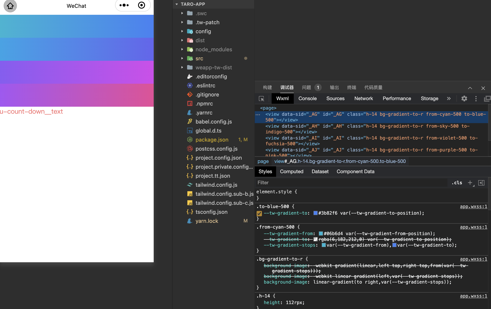

# CSS 变量失效问题

在使用 `taro` 或者 `uni-app` 中，可能你会遇到 CSS 变量失效问题

具体表现就是你在使用下列类名的时候，不会出来颜色:

```jsx
<View className='h-14 bg-gradient-to-r from-cyan-500 to-blue-500'></View>
<View className='h-14 bg-gradient-to-r from-sky-500 to-indigo-500'></View>
<View className='h-14 bg-gradient-to-r from-violet-500 to-fuchsia-500'></View>
<View className='h-14 bg-gradient-to-r from-purple-500 to-pink-500'></View>
```

这就是由于全局的 `tailwindcss` 变量没有注入进 App 导致的

比如在 `taro` 中和 `@tarojs/plugin-html` 一起使用，就会出现这个问题，这是因为 `@tarojs/plugin-html` 把 `tailwindcss` 变量区域给干掉了。

遇到这样的问题，解决方案也很简单，只需要给插件传入一个 `injectAdditionalCssVarScope: true` 参数即可

代码片段和配置详情详见 [和 NutUI 一起使用](./use-with-nutui)

设置成功之后的效果如下所示，可以观察一下左侧的效果，和右下角的 `inspect` 面板作为参考


